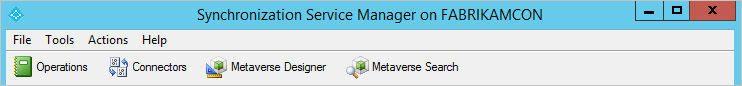

# Introduction to the Azure AD Connect Synchronization Service Manager UI

The **Synchronization Service Manager** UI is used to configure more advanced aspects of the sync engine and to see the operational aspects of the service.

You start the **Synchronization Service Manager** UI from the start menu. It is named **Synchronization Service** and can be found in the **Azure AD Connect** group.  

Click the links at the top of this topic to learn more about the different tabs in the UI.

## Next steps
Learn more about the [Azure AD Connect sync](how-to-connect-sync-whatis.md) configuration.

Learn more about [Integrating your on-premises identities with Azure Active Directory](whatis-hybrid-identity.md).
