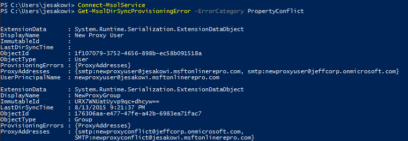

# Identity synchronization and duplicate attribute resiliency
Duplicate Attribute Resiliency is a feature in Azure Active Directory that will eliminate friction caused by **UserPrincipalName** and SMTP **ProxyAddress** conflicts when running one of Microsoft’s synchronization tools.

These two attributes are required to be unique across all **User**, **Group**, or **Contact** objects in a given Azure Active Directory tenant.

> [!NOTE]
> Only Users can have UPNs.
> When assigning certain licenses like Exchange Online, the UPN will also be added as a mail and proxy address.
> 

The new behavior that this feature enables is in the cloud portion of the sync pipeline, therefore it is client agnostic and relevant for any Microsoft synchronization product including Azure AD Connect, DirSync and MIM + Connector. The generic term “sync client” is used in this document to represent any one of these products.

## Old behavior
Previsously, if there was an attempt to provision a new object with a UPN or ProxyAddress value that violated this uniqueness constraint, Azure Active Directory blocked that object from being created. Similarly, if an object was updated with a non-unique UPN or ProxyAddress, the update would fail. The provisioning attempt or update was retried by the sync client upon each export cycle, and continued to fail until the conflict was resolved. An error report email was generated upon each attempt and an error was logged by the sync client.

## Behavior with Duplicate Attribute Resiliency
Instead of completely failing to provision or update an object with a duplicate attribute, Azure Active Directory “quarantines” the duplicate attribute which would violate the uniqueness constraint. The attribute resiliency process handles only UPN and SMTP **ProxyAddresses** values.

If this attribute is required for provisioning, like UserPrincipalName, the service assigns a placeholder value. The format of these temporary values is  
_**\<OriginalPrefix>+\<4DigitNumber>\@\<InitialTenantDomain>.onmicrosoft.com**_.

If the attribute is not required, like **ProxyAddresses**, Azure Active Directory simply quarantines the conflict attribute and proceeds with the object creation or update.

Upon quarantining the attribute, since the export for this object has succeeded, the sync client only reports an error on the first attempt and does not retry the create / update operation upon subsequent sync cycles. A generic error report email is sent every Monday with the subject "Sync errors detected on your Azure AD Connect service" whihch contains a link to the Sync Error report in Azure AD Connect Health portal.

To support this behavior a new attribute has been introduced to the User, Group, and Contact object classes:
**DirSyncProvisioningErrors**

This is a multi-valued attribute that is used to store the conflicting attributes that would violate the uniqueness constraint should they be added normally. A background timer task has been enabled in Azure Active Directory that runs every hour to look for duplicate attribute conflicts that have been resolved, and automatically removes the attributes in question from quarantine.

Duplicate Attribute Resiliency begun its rollout in September 2016 to all Azure AD tenants and it cannot be disabled.

To check if the feature is enabled for your tenant, you can do so by downloading the latest version of the Azure Active Directory PowerShell module and running:

`Get-MsolDirSyncFeatures -Feature DuplicateUPNResiliency`

`Get-MsolDirSyncFeatures -Feature DuplicateProxyAddressResiliency`

## Identifying Objects with DirSyncProvisioningErrors
There are currently two methods to identify objects that have these errors due to duplicate property conflicts, Azure Active Directory PowerShell and the [Microsoft 365 admin center](https://admin.microsoft.com) and [Azure Active Directory Connect Health](https://portal.azure.com/#view/Microsoft_Azure_ADHybridHealth/AadHealthMenuBlade/~/QuickStart).

### Azure Active Directory PowerShell
For the PowerShell cmdlets in this topic, the following is true:

* All of the following cmdlets are case sensitive.
* The **–ErrorCategory PropertyConflict** must always be included. There are currently no other types of
  **ErrorCategory**, but this may be extended in the future.

First, get started by running **Connect-MsolService** and entering credentials for a tenant administrator.

Then, use the following cmdlets and operators to view errors in different ways:

1. [See All](#see-all)
2. [By Property Type](#by-property-type)
3. [By Conflicting Value](#by-conflicting-value)
4. [Using a String Search](#using-a-string-search)
5. Sorted
6. [In a Limited Quantity or All](#in-a-limited-quantity-or-all)

#### See all
Once connected, to see a general list of attribute provisioning errors in the tenant run:

`Get-MsolDirSyncProvisioningError -ErrorCategory PropertyConflict`

This produces a result like the following:  
   

#### By property type
To see errors by property type, add the **-PropertyName** flag with the **UserPrincipalName** or **ProxyAddresses** argument:

`Get-MsolDirSyncProvisioningError -ErrorCategory PropertyConflict -PropertyName UserPrincipalName`

Or

`Get-MsolDirSyncProvisioningError -ErrorCategory PropertyConflict -PropertyName ProxyAddresses`

#### By conflicting value
To see errors relating to a specific property add the **-PropertyValue** flag (**-PropertyName** must be used as well when adding this flag):

`Get-MsolDirSyncProvisioningError -ErrorCategory PropertyConflict -PropertyValue User@domain.com -PropertyName UserPrincipalName`

#### Using a string search
To do a broad string search use the **-SearchString** flag. This can be used independently from all of the above flags, with the exception of **-ErrorCategory PropertyConflict**, which is always required:

`Get-MsolDirSyncProvisioningError -ErrorCategory PropertyConflict -SearchString User`

#### In a limited quantity or all
1. **MaxResults \<Int>** can be used to limit the query to a specific number of values.
2. **All** can be used to ensure all results are retrieved in the case that a large number of errors exists.

`Get-MsolDirSyncProvisioningError -ErrorCategory PropertyConflict -MaxResults 5`

## Microsoft 365 admin center
You can view directory synchronization errors in the Microsoft 365 admin center. The report in the Microsoft 365 admin center only displays **User** objects that have these errors. It does not show info about conflicts between **Groups** and **Contacts**.

For instructions on how to view directory synchronization errors in the Microsoft 365 admin center, see [Identify directory synchronization errors in Microsoft 365](https://support.office.com/article/Identify-directory-synchronization-errors-in-Office-365-b4fc07a5-97ea-4ca6-9692-108acab74067).

## Azure Active Directory Connect Health

For instructions on how to view directory synchronization errors in Azure Active Directory Connect Health, see [Monitor Azure AD Connect sync with Azure AD Connect Health](./how-to-connect-health-sync).

## Resolving conflicts
Troubleshooting strategy and resolution tactics for these errors should not differ from the way duplicate attribute errors were handled in the past. The only difference is that the timer task sweeps through the tenant on the service-side to automatically add the attribute in question to the proper object once a conflict is detected, making it easier for an Administrator to identify and further resolve such address conflicts.

The following article outlines various troubleshooting and resolution strategies: [Duplicate or invalid attributes prevent directory synchronization in Office 365](/office365/troubleshoot/active-directory/duplicate-attributes-prevent-dirsync).

Additionally, the Azure Active Directory Connect Health portal is not just limited to attribute resiliency feature as it can also identify other types of synchronization errors, see [Understanding errors during Azure AD synchronization](./tshoot-connect-sync-errors) for more information.

## Known issues
None of these known issues causes data loss or service degradation. Several of them are aesthetic, others cause standard “*pre-resiliency*” duplicate attribute errors to be thrown instead of quarantining the conflict attribute, and another causes certain errors to require extra manual fix-up.

**Core behavior:**

1. Objects with specific attribute configurations continue to receive export errors as opposed to the duplicate attribute(s) being quarantined.  
   For example:
   
    a. New user is created in AD with a UPN of **Joe\@contoso.com** and ProxyAddress **smtp:Joe\@contoso.com**
   
    b. The properties of this object conflict with an existing Group, where ProxyAddress is **SMTP:Joe\@contoso.com**.
   
    c. Upon export, a **ProxyAddress conflict** error is thrown instead of having the conflict attributes quarantined. The operation is retried upon each subsequent sync cycle, as it would have been before the resiliency feature was enabled.
2. If two Groups are created on-premises with the same SMTP address, one fails to provision on the first attempt with a standard duplicate **ProxyAddress** error. However, the provisioning of the Group with duplicate value is properly quarantined upon the next sync cycle.

**Office Portal Report**:

1. The detailed error message for two objects in a UPN conflict set is the same. This indicates that they have both had their UPN changed / quarantined, when in fact only a one of them had any data changed.
2. The detailed error message for a UPN conflict shows the wrong displayName for a user who has had their UPN changed/quarantined. For example:
   
    a. **User A** syncs up first with **UPN = User\@contoso.com**.
   
    b. **User B** is attempted to be synced up next with **UPN = User\@contoso.com**.
   
    c. **User B’s** UPN is changed to **User1234\@contoso.onmicrosoft.com** and **User\@contoso.com** is added to **DirSyncProvisioningErrors**.
   
    d. The error message for **User B** should indicate that **User A** already has **User\@contoso.com** as a UPN, but it shows **User B’s** own displayName.

## See also
* [Azure AD Connect sync](how-to-connect-sync-whatis.md)
* [Integrating your on-premises identities with Azure Active Directory](whatis-hybrid-identity.md)
* [Monitor Azure AD Connect sync with Azure AD Connect Health](./how-to-connect-health-sync)
* [Identify directory synchronization errors in Microsoft 365](https://support.office.com/article/Identify-directory-synchronization-errors-in-Office-365-b4fc07a5-97ea-4ca6-9692-108acab74067)
