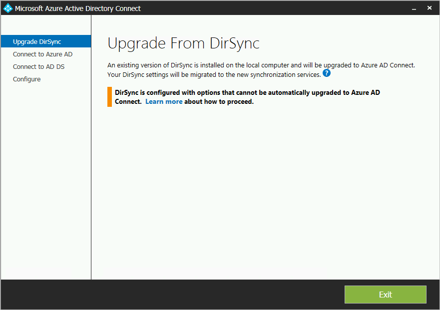
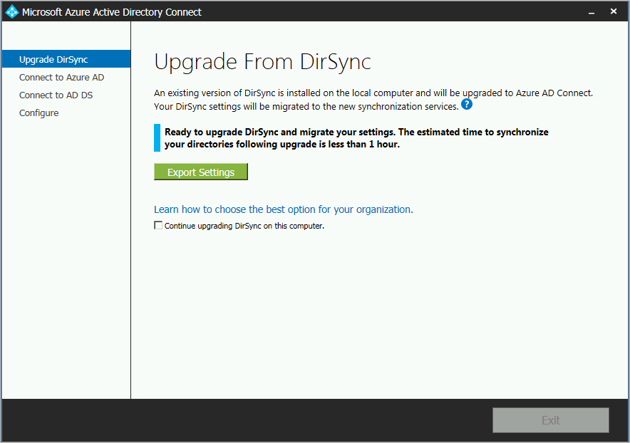
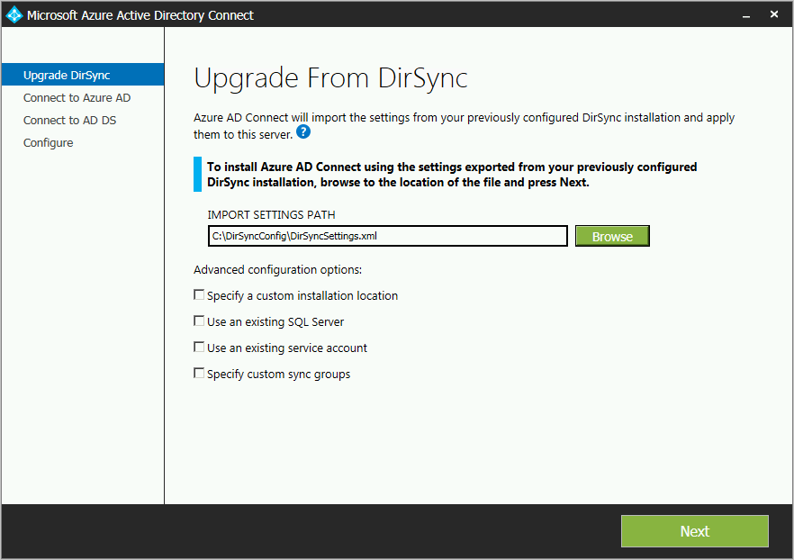

# Azure AD Connect: Upgrade from DirSync
Azure AD Connect is the successor to DirSync. You find the ways you can upgrade from DirSync in this topic. These steps do not work for upgrading from another release of Azure AD Connect or from Azure AD Sync.

Before you start installing Azure AD Connect, make sure to [download Azure AD Connect](https://go.microsoft.com/fwlink/?LinkId=615771) and complete the pre-requisite steps in [Azure AD Connect: Hardware and prerequisites](how-to-connect-install-prerequisites.md). In particular, you want to read about the following, since these areas are different from DirSync:

* The required version of .NET and PowerShell. Newer versions are required to be on the server than what DirSync needed.
* The proxy server configuration. If you use a proxy server to reach the internet, this setting must be configured before you upgrade. DirSync always used the proxy server configured for the user installing it, but Azure AD Connect uses machine settings instead.
* The URLs required to be open in the proxy server. For basic scenarios, those scenarios also supported by DirSync, the requirements are the same. If you want to use any of the new features included with Azure AD Connect, some new URLs must be opened.

> [!NOTE]
> Once you have enabled your new Azure AD Connect server to start synchronizing changes to Azure AD, you must not roll back to using DirSync or Azure AD Sync. Downgrading from Azure AD Connect to legacy clients including DirSync and Azure AD Sync is not supported and can lead to issues such as data loss in Azure AD.

If you are not upgrading from DirSync, see related documentation for other scenarios.

## Upgrade from DirSync
Depending on your current DirSync deployment, there are different options for the upgrade. If the expected upgrade time is less than three hours, then the recommendation is to do an in-place upgrade. If the expected upgrade time is more than three hours, then the recommendation is to do a parallel deployment on another server. It is estimated that if you have more than 50,000 objects it takes more than three hours to do the upgrade.

| Scenario |
| --- |
| [In-place upgrade](#in-place-upgrade) |
| [Parallel deployment](#parallel-deployment) |

> [!NOTE]
> When you plan to upgrade from DirSync to Azure AD Connect, do not uninstall DirSync yourself before the upgrade. Azure AD Connect will read and migrate the configuration from DirSync and uninstall after inspecting the server.

**In-place upgrade**  
The expected time to complete the upgrade is displayed by the wizard. This estimate is based on the assumption that it takes three hours to complete an upgrade for a database with 50,000 objects (users, contacts, and groups). If the number of objects in your database is less than 50,000, then Azure AD Connect recommends an in-place upgrade. If you decide to continue, your current settings are automatically applied during upgrade and your server automatically resumes active synchronization.

If you want to do a configuration migration and do a parallel deployment, then you can override the in-place upgrade recommendation. You might for example take the opportunity to refresh the hardware and operating system. For more information, see the [parallel deployment](#parallel-deployment) section.

**Parallel deployment**  
If you have more than 50,000 objects, then a parallel deployment is recommended. This deployment avoids any operational delays experienced by your users. The Azure AD Connect installation attempts to estimate the downtime for the upgrade, but if you've upgraded DirSync in the past, your own experience is likely to be the best guide.

### Supported DirSync configurations to be upgraded
The following configuration changes are supported with upgraded DirSync:

* Domain and OU filtering
* Alternate ID (UPN)
* Password sync and Exchange hybrid settings
* Your forest/domain and Azure AD settings
* Filtering based on user attributes

The following change cannot be upgraded. If you have this configuration, the upgrade is blocked:

* Unsupported DirSync changes, for example removed attributes and using a custom extension DLL

In those cases, the recommendation is to install a new Azure AD Connect server in [staging mode](how-to-connect-sync-staging-server.md) and verify the old DirSync and new Azure AD Connect configuration. Reapply any changes using custom configuration, as described in [Azure AD Connect Sync custom configuration](how-to-connect-sync-whatis.md).

The passwords used by DirSync for the service accounts cannot be retrieved and are not migrated. These passwords are reset during the upgrade.

### High-level steps for upgrading from DirSync to Azure AD Connect
1. Welcome to Azure AD Connect
2. Analysis of current DirSync configuration
3. Collect Azure AD global admin password
4. Collect credentials for an enterprise admin account (only used during the installation of Azure AD Connect)
5. Installation of Azure AD Connect
   * Uninstall DirSync (or temporarily disable it)
   * Install Azure AD Connect
   * Optionally begin synchronization

Additional steps are required when:

* You're currently using Full SQL Server - local or remote
* You have more than 50,000 objects in scope for synchronization

## In-place upgrade
1. Launch the Azure AD Connect installer (MSI).
2. Review and agree to license terms and privacy notice.  
   
3. Click next to begin analysis of your existing DirSync installation.  
   
4. When the analysis completes, you see the recommendations on how to proceed.  
   * If you use SQL Server Express and have less than 50,000 objects, the following screen is shown:  
     
   * If you use a full SQL Server for DirSync, you see this page instead:  
       
     The information regarding the existing SQL Server database server being used by DirSync is displayed. Make appropriate adjustments if needed. Click **Next** to continue the installation.
   * If you have more than 50,000 objects, you see this screen instead:  
       
     To proceed with an in-place upgrade, click the checkbox next to this message: **Continue upgrading DirSync on this computer.**
     To do a [parallel deployment](#parallel-deployment) instead, you export the DirSync configuration settings and move the configuration to the new server.
5. Provide the password for the account you currently use to connect to Azure AD. This must be the account currently used by DirSync.  
     
   If you receive an error and have problems with connectivity, see [Troubleshoot connectivity problems](tshoot-connect-connectivity.md).
6. Provide an enterprise admin account for Active Directory.  
   
7. You're now ready to configure. When you click **Upgrade**, DirSync is uninstalled and Azure AD Connect is configured and begins synchronizing.  
   
8. After the installation has completed, sign out and sign in again to Windows before you use Synchronization Service Manager, Synchronization Rule Editor, or try to make any other configuration changes.

## Parallel deployment
### Export the DirSync configuration
**Parallel deployment with more than 50,000 objects**

If you have more than 50,000 objects, then the Azure AD Connect installation recommends a parallel deployment.

A screen similar to the following is displayed:  

If you want to proceed with parallel deployment, you need to perform the following steps:

* Click the **Export settings** button. When you install Azure AD Connect on a separate server, these settings are migrated from your current DirSync to your new Azure AD Connect installation.

Once your settings have been successfully exported, you can exit the Azure AD Connect wizard on the DirSync server. Continue with the next step to install Azure AD Connect on a separate server

**Parallel deployment with less than 50,000 objects**

If you have less than 50,000 objects but still want to do a parallel deployment, then do the following:

1. Run the Azure AD Connect installer (MSI).
2. When you see the **Welcome to Azure AD Connect** screen, exit the installation wizard by clicking the "X" in the top right corner of the window.
3. Open a command prompt.
4. From the install location of Azure AD Connect (Default: C:\Program Files\Microsoft Azure Active Directory Connect) execute the following command:
    `AzureADConnect.exe /ForceExport`.
5. Click the **Export settings** button. When you install Azure AD Connect on a separate server, these settings are migrated from your current DirSync to your new Azure AD Connect installation.

Once your settings have been successfully exported, you can exit the Azure AD Connect wizard on the DirSync server. Continue with the next step to install Azure AD Connect on a separate server.

### Install Azure AD Connect on separate server
When you install Azure AD Connect on a new server, the assumption is that you want to perform a clean install of Azure AD Connect. Since you want to use the DirSync configuration, there are some extra steps to take:

1. Run the Azure AD Connect installer (MSI).
2. When you see the **Welcome to Azure AD Connect** screen, exit the installation wizard by clicking the "X" in the top right corner of the window.
3. Open a command prompt.
4. From the install location of Azure AD Connect (Default: C:\Program Files\Microsoft Azure Active Directory Connect) execute the following command:
    `AzureADConnect.exe /migrate`.
    The Azure AD Connect installation wizard starts and presents you with the following screen:  
   
5. Select the settings file that exported from your DirSync installation.
6. Configure any advanced options including:
   * A custom installation location for Azure AD Connect.
   * An existing instance of SQL Server (Default: Azure AD Connect installs SQL Server 2012 Express). Do not use the same database instance as your DirSync server.
   * A service account used to connect to SQL Server (If your SQL Server database is remote then this account must be a domain service account).
     These options can be seen on this screen:  
     
7. Click **Next**.
8. On the **Ready to configure** page, leave the **Start the synchronization process as soon as the configuration completes** checked. The server is now in [staging mode](how-to-connect-sync-staging-server.md) so changes are not exported to Azure AD.
9. Click **Install**.
10. After the installation has completed, sign out and sign in again to Windows before you use Synchronization Service Manager, Synchronization Rule Editor, or try to make any other configuration changes.

> [!NOTE]
> Synchronization between Windows Server Active Directory and Azure Active Directory begins, but no changes are exported to Azure AD. Only one synchronization tool can be actively exporting changes at a time. This state is called [staging mode](how-to-connect-sync-staging-server.md).

### Verify that Azure AD Connect is ready to begin synchronization
To verify that Azure AD Connect is ready to take over from DirSync, you need to open **Synchronization Service Manager** in the group **Azure AD Connect** from the start menu.

In the application, go to the **Operations** tab. On this tab, confirm that the following operations have completed:

* Import on the AD Connector
* Import on the Azure AD Connector
* Full Sync on the AD Connector
* Full Sync on the Azure AD Connector

Review the result from these operations and ensure there are no errors.

If you want to see and inspect the changes that are about to be exported to Azure AD, then read how to verify the configuration under [staging mode](how-to-connect-sync-staging-server.md). Make required configuration changes until you do not see anything unexpected.

You are ready to switch from DirSync to Azure AD when you have completed these steps and are happy with the result.

### Uninstall DirSync (old server)
* In **Programs and features** find **Windows Azure Active Directory sync tool**
* Uninstall **Windows Azure Active Directory sync tool**
* The uninstallation might take up to 15 minutes to complete.

If you prefer to uninstall DirSync later, you can also temporarily shut down the server or disable the service. If something goes wrong, this method allows you to re-enable it. However, it is not expected that the next step will fail so this should not be needed.

With DirSync uninstalled or disabled, there is no active server exporting to Azure AD. The next step to enable Azure AD Connect must be completed before any changes in your on-premises Active Directory will continue to be synchronized to Azure AD.

### Enable Azure AD Connect (new server)
After installation, reopening Azure AD connect will allow you to make additional configuration changes. Start **Azure AD Connect** from the start menu or from the shortcut on the desktop. Make sure you do not try to run the installation MSI again.

You should see the following:  

* Select **Configure staging mode**.
* Turn off staging by unchecking the **Enabled staging mode** checkbox.

* Click the **Next** button
* On the confirmation page, click the **install** button.

Azure AD Connect is now your active server and you must not switch back to using your existing DirSync server.

## Next steps
Now that you have Azure AD Connect installed you can [verify the installation and assign licenses](how-to-connect-post-installation.md).

Learn more about these new features, which were enabled with the installation: [Automatic upgrade](how-to-connect-install-automatic-upgrade.md), [Prevent accidental deletes](how-to-connect-sync-feature-prevent-accidental-deletes.md), and [Azure AD Connect Health](how-to-connect-health-sync.md).

Learn more about these common topics: [scheduler and how to trigger sync](how-to-connect-sync-feature-scheduler.md).

Learn more about [Integrating your on-premises identities with Azure Active Directory](whatis-hybrid-identity.md).
