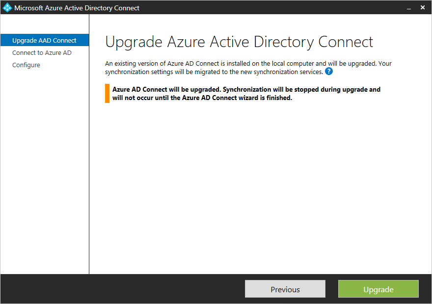
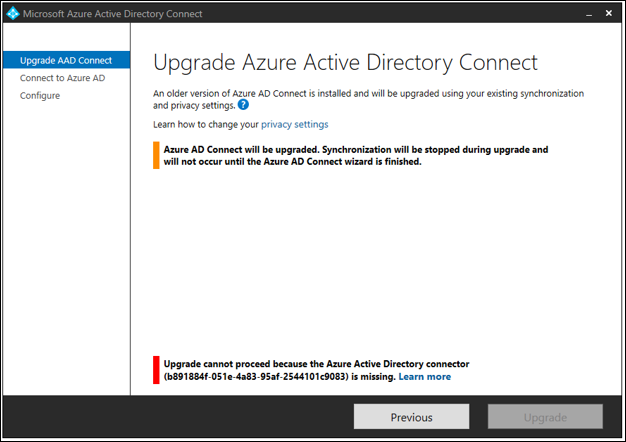

# Azure AD Connect: Upgrade from a previous version to the latest
This topic describes the different methods that you can use to upgrade your Azure Active Directory (Azure AD) Connect installation to the latest release. We recommend that you keep yourself current with the releases of Azure AD Connect. You also use the steps in the [Swing migration](#swing-migration) section when you make a substantial configuration change.

If you want to upgrade from DirSync, see [Upgrade from Azure AD sync tool (DirSync)](how-to-dirsync-upgrade-get-started.md) instead.

There are a few different strategies that you can use to upgrade Azure AD Connect.

| Method | Description |
| --- | --- |
| [Automatic upgrade](how-to-connect-install-automatic-upgrade.md) |This is the easiest method for customers with an express installation. |
| [In-place upgrade](#in-place-upgrade) |If you have a single server, you can upgrade the installation in-place on the same server. |
| [Swing migration](#swing-migration) |With two servers, you can prepare one of the servers with the new release or configuration, and change the active server when you're ready. |

For permissions information, see the [permissions required for an upgrade](reference-connect-accounts-permissions.md#upgrade).

> [!NOTE]
> After you've enabled your new Azure AD Connect server to start synchronizing changes to Azure AD, you must not roll back to using DirSync or Azure AD Sync. Downgrading from Azure AD Connect to legacy clients, including DirSync and Azure AD Sync, isn't supported and can lead to issues such as data loss in Azure AD.

## In-place upgrade
An in-place upgrade works for moving from Azure AD Sync or Azure AD Connect. It doesn't work for moving from DirSync or for a solution with Forefront Identity Manager (FIM) + Azure AD Connector.

This method is preferred when you have a single server and less than about 100,000 objects. If there are any changes to the out-of-box sync rules, a full import and full synchronization occur after the upgrade. This method ensures that the new configuration is applied to all existing objects in the system. This run might take a few hours, depending on the number of objects that are in scope of the sync engine. The normal delta synchronization scheduler (which synchronizes every 30 minutes by default) is suspended, but password synchronization continues. You might consider doing the in-place upgrade during a weekend. If there are no changes to the out-of-box configuration with the new Azure AD Connect release, then a normal delta import/sync starts instead.  


If you've made changes to the out-of-box synchronization rules, then these rules are set back to the default configuration on upgrade. To make sure that your configuration is kept between upgrades, make sure that you make changes as they're described in [Best practices for changing the default configuration](how-to-connect-sync-best-practices-changing-default-configuration.md).

During in-place upgrade, there may be changes introduced that require specific synchronization activities (including Full Import step and Full Synchronization step) to be executed after upgrade completes. To defer such activities, refer to section [How to defer full synchronization after upgrade](#how-to-defer-full-synchronization-after-upgrade).

If you are using Azure AD Connect with non-standard connector (for example, Generic LDAP Connector and Generic SQL Connector), you must refresh the corresponding connector configuration in the [Synchronization Service Manager](https://docs.microsoft.com/azure/active-directory/connect/active-directory-aadconnectsync-service-manager-ui-connectors) after in-place upgrade. For details on how to refresh the connector configuration, refer to article section [Connector Version Release History - Troubleshooting](https://docs.microsoft.com/azure/active-directory/connect/active-directory-aadconnectsync-connector-version-history#troubleshooting). If you do not refresh the configuration, import and export run steps will not work correctly for the connector. You will receive the following error in the application event log with message *"Assembly version in AAD Connector configuration ("X.X.XXX.X") is earlier than the actual version ("X.X.XXX.X") of "C:\Program Files\Microsoft Azure AD Sync\Extensions\Microsoft.IAM.Connector.GenericLdap.dll".*

## Swing migration
If you have a complex deployment or many objects, it might be impractical to do an in-place upgrade on the live system. For some customers, this process might take multiple days--and during this time, no delta changes are processed. You can also use this method when you plan to make substantial changes to your configuration and you want to try them out before they're pushed to the cloud.

The recommended method for these scenarios is to use a swing migration. You need (at least) two servers--one active server and one staging server. The active server (shown with solid blue lines in the following picture) is responsible for the active production load. The staging server (shown with dashed purple lines) is prepared with the new release or configuration. When it's fully ready, this server is made active. The previous active server, which now has the old version or configuration installed, is made into the staging server and is upgraded.

The two servers can use different versions. For example, the active server that you plan to decommission can use Azure AD Sync, and the new staging server can use Azure AD Connect. If you use swing migration to develop a new configuration, it's a good idea to have the same versions on the two servers.  


> [!NOTE]
> Some customers prefer to have three or four servers for this scenario. When the staging server is upgraded, you don't have a backup server for [disaster recovery](how-to-connect-sync-operations.md#disaster-recovery). With three or four servers, you can prepare one set of primary/standby servers with the new version, which ensures that there is always a staging server that's ready to take over.

These steps also work to move from Azure AD Sync or a solution with FIM + Azure AD Connector. These steps don't work for DirSync, but the same swing migration method (also called parallel deployment) with steps for DirSync is in [Upgrade Azure Active Directory sync (DirSync)](how-to-dirsync-upgrade-get-started.md).

### Use a swing migration to upgrade
1. If you use Azure AD Connect on both servers and plan to only make a configuration change, make sure that your active server and staging server are both using the same version. That makes it easier to compare differences later. If you're upgrading from Azure AD Sync, then these servers have different versions. If you're upgrading from an older version of Azure AD Connect, it's a good idea to start with the two servers that are using the same version, but it's not required.
2. If you've made a custom configuration and your staging server doesn't have it, follow the steps under [Move a custom configuration from the active server to the staging server](#move-a-custom-configuration-from-the-active-server-to-the-staging-server).
3. If you're upgrading from an earlier release of Azure AD Connect, upgrade the staging server to the latest version. If you're moving from Azure AD Sync, then install Azure AD Connect on your staging server.
4. Let the sync engine run full import and full synchronization on your staging server.
5. Verify that the new configuration didn't cause any unexpected changes by using the steps under "Verify" in [Verify the configuration of a server](how-to-connect-sync-operations.md#verify-the-configuration-of-a-server). If something isn't as expected, correct it, run the import and sync, and verify the data until it looks good, by following the steps.
6. Switch the staging server to be the active server. This is the final step "Switch active server" in [Verify the configuration of a server](how-to-connect-sync-operations.md#verify-the-configuration-of-a-server).
7. If you're upgrading Azure AD Connect, upgrade the server that's now in staging mode to the latest release. Follow the same steps as before to get the data and configuration upgraded. If you upgraded from Azure AD Sync, you can now turn off and decommission your old server.

### Move a custom configuration from the active server to the staging server
If you've made configuration changes to the active server, you need to make sure that the same changes are applied to the staging server. To help with this move, you can use the [Azure AD Connect configuration documenter](https://github.com/Microsoft/AADConnectConfigDocumenter).

You can move the custom sync rules that you've created by using PowerShell. You must apply other changes the same way on both systems, and you can't migrate the changes. The [configuration documenter](https://github.com/Microsoft/AADConnectConfigDocumenter) can help you comparing the two systems to make sure they are identical. The tool can also help in automating the steps found in this section.

You need to configure the following things the same way on both servers:

* Connection to the same forests
* Any domain and OU filtering
* The same optional features, such as password sync and password writeback

**Move custom synchronization rules**  
To move custom synchronization rules, do the following:

1. Open **Synchronization Rules Editor** on your active server.
2. Select a custom rule. Click **Export**. This brings up a Notepad window. Save the temporary file with a PS1 extension. This makes it a PowerShell script. Copy the PS1 file to the staging server.  
   
3. The Connector GUID is different on the staging server, and you must change it. To get the GUID, start **Synchronization Rules Editor**, select one of the out-of-box rules that represent the same connected system, and click **Export**. Replace the GUID in your PS1 file with the GUID from the staging server.
4. In a PowerShell prompt, run the PS1 file. This creates the custom synchronization rule on the staging server.
5. Repeat this for all your custom rules.

## How to defer full synchronization after upgrade
During in-place upgrade, there may be changes introduced that require specific synchronization activities (including Full Import step and Full Synchronization step) to be executed. For example, connector schema changes require **full import** step and out-of-box synchronization rule changes require **full synchronization** step to be executed on affected connectors. During upgrade, Azure AD Connect determines what synchronization activities are required and records them as *overrides*. In the following synchronization cycle, the synchronization scheduler picks up these overrides and executes them. Once an override is successfully executed, it is removed.

There may be situations where you do not want these overrides to take place immediately after upgrade. For example, you have numerous synchronized objects and you would like these synchronization steps to occur after business hours. To remove these overrides:

1. During upgrade, **uncheck** the option **Start the synchronization process when configuration completes**. This disables the synchronization scheduler and prevents synchronization cycle from taking place automatically before the overrides are removed.

   

2. After upgrade completes, run the following cmdlet to find out what overrides have been added: `Get-ADSyncSchedulerConnectorOverride | fl`

   >[!NOTE]
   > The overrides are connector-specific. In the following example, Full Import step and Full Synchronization step have been added to both the on-premises AD Connector and Azure AD Connector.

   

3. Note down the existing overrides that have been added.
   
4. To remove the overrides for both full import and full synchronization on an arbitrary connector, run the following cmdlet: `Set-ADSyncSchedulerConnectorOverride -ConnectorIdentifier <Guid-of-ConnectorIdentifier> -FullImportRequired $false -FullSyncRequired $false`

   To remove the overrides on all connectors, execute the following PowerShell script:

   ```
   foreach ($connectorOverride in Get-ADSyncSchedulerConnectorOverride)
   {
       Set-ADSyncSchedulerConnectorOverride -ConnectorIdentifier $connectorOverride.ConnectorIdentifier.Guid -FullSyncRequired $false -FullImportRequired $false
   }
   ```

5. To resume the scheduler, run the following cmdlet: `Set-ADSyncScheduler -SyncCycleEnabled $true`

   >[!IMPORTANT]
   > Remember to execute the required synchronization steps at your earliest convenience. You can either manually execute these steps using the Synchronization Service Manager or add the overrides back using the Set-ADSyncSchedulerConnectorOverride cmdlet.

To add the overrides for both full import and full synchronization on an arbitrary connector, run the following cmdlet:  `Set-ADSyncSchedulerConnectorOverride -ConnectorIdentifier <Guid> -FullImportRequired $true -FullSyncRequired $true`

## Troubleshooting
The following section contains troubleshooting and information that you can use if you encounter an issue upgrading Azure AD Connect.

### Azure Active Directory connector missing error during Azure AD Connect upgrade

When you upgrade Azure AD Connect from a previous version, you might hit following error at the beginning of the upgrade 



This error happens because the Azure Active Directory connector with identifier, b891884f-051e-4a83-95af-2544101c9083, does not exist in the current Azure AD Connect configuration. To verify this is the case, open a PowerShell window, run Cmdlet `Get-ADSyncConnector -Identifier b891884f-051e-4a83-95af-2544101c9083`

```
PS C:\> Get-ADSyncConnector -Identifier b891884f-051e-4a83-95af-2544101c9083
Get-ADSyncConnector : Operation failed because the specified MA could not be found.
At line:1 char:1
+ Get-ADSyncConnector -Identifier b891884f-051e-4a83-95af-2544101c9083
+ ~~~~~~~~~~~~~~~~~~~~~~~~~~~~~~~~~~~~~~~~~~~~~~~~~~~~~~~~~~~~~~~~~~~~
    + CategoryInfo          : ReadError: (Microsoft.Ident...ConnectorCmdlet:GetADSyncConnectorCmdlet) [Get-ADSyncConne
   ctor], ConnectorNotFoundException
    + FullyQualifiedErrorId : Operation failed because the specified MA could not be found.,Microsoft.IdentityManageme
   nt.PowerShell.Cmdlet.GetADSyncConnectorCmdlet

```

The PowerShell Cmdlet reports the error **the specified MA could not be found**.

The reason that this occurs is because the current Azure AD Connect configuration is not supported for upgrade. 

If you want to install a newer version of Azure AD Connect: close the Azure AD Connect wizard, uninstall the existing Azure AD Connect, and perform a clean install of the newer Azure AD Connect.


## Next steps
Learn more about [integrating your on-premises identities with Azure Active Directory](whatis-hybrid-identity.md).
