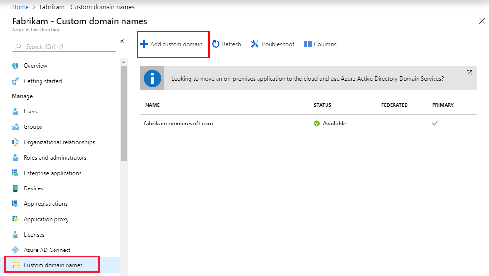

# Plan and troubleshoot User Principal Name changes in Azure Active Directory

A User Principal Name (UPN) is an attribute that is an internet communication standard for user accounts. A UPN consists of a UPN prefix (the user account name) and a UPN suffix (a DNS domain name). The prefix joins the suffix using the "@" symbol. For example, someone@example.com. A UPN must be unique among all security principal objects within a directory forest. 

> [!NOTE]
> For developers, we recommend that you use the user objectID as the immutable identifier, rather than UPN. If your applications are currently using UPN, we recommend setting the UPN to match the user's primary email address to improve their experience.  **In a hybrid environment, it is important that the UPN for a user is identical in the on-premises directory and in Azure Active Directory**.

**This article assumes you're using UPN as the user identifier. It addresses planning for UPN changes, and recovering from issues that may result from UPN changes.**

## Learn about UPNs and UPN changes
Sign-in pages often prompt users to enter their email address when the required value is actually their UPN. Therefore, you should be sure to change users' UPN anytime their primary email address changes.

Users' primary email addresses might change for many reasons:

* company rebranding

* employees moving to different company divisions 

* mergers and acquisitions

* employee name changes

### Types of UPN changes

You can change a UPN by changing the prefix, suffix, or both.

* **Changing the prefix**.

   *  For example, if a person's name changed, you might change their account name:  
‎BSimon@contoso.com to BJohnson@contoso.com

   * You might also change the corporate standard for prefixes:  
‎Bsimon@contoso.com to Britta.Simon@contoso.com

* **Changing the suffix**.  

    For example, if a person changed divisions, you might change their domain: 

   * Britta.Simon@contoso.com to Britta.Simon@contosolabs.com  
     Or 
    * Britta.Simon@corp.contoso.com to Britta.Simon@labs.contoso.com 

Change the user's UPN every time the primary email address for a user is updated. No matter the reason for the email change, the UPN must always be updated to match.

During the initial synchronization from Active Directory to Azure AD, ensure the users' emails  are identical to their UPNs.

### UPNs in Active Directory

In Active Directory, the default UPN suffix is the DNS name of the domain where you created the user account. In most cases, this is the domain name that you register as the enterprise domain on the internet. If you create the user account in the contoso.com domain, the default UPN is

username@contoso.com

 However, you can [add more UPN suffixes](https://docs.microsoft.com/azure/active-directory/fundamentals/add-custom-domain) by using Active Directory domains and trusts. 

For example, you may want to add labs.contoso.com and have the users' UPNs and email reflect that. They would then become

username@labs.contoso.com.

>[!IMPORTANT]
> If UPNs in Active directory and Azure Active Directory do not match, issues will arise. If you are [changing the suffix in Active Directory](https://docs.microsoft.com/azure/active-directory/fundamentals/add-custom-domain), you must ensure that a matching custom domain name has been [added and verified on Azure AD](https://docs.microsoft.com/azure/active-directory/fundamentals/add-custom-domain). 

### UPNs in Azure Active Directory

Users sign in to Azure AD with the value in their userPrincipalName attribute. 

When you use Azure AD in conjunction with your on-premises Active Directory, user accounts are synchronized by using the Azure AD Connect service. By default the Azure AD Connect wizard uses the userPrincipalName attribute from the on-premises Active Directory as the UPN in Azure AD. You can change it to a different attribute in a custom installation.

It's important that you have a defined process when you update a User Principal Name (UPN) of a single user, or for your entire organization. 

See the Known issues and workarounds in this document.

When you're synchronizing user accounts from Active Directory to Azure AD, ensure that the UPNs in Active Directory map to verified domains in Azure AD.

If the value of the userPrincipalName attribute doesn't correspond to a verified domain in Azure AD, the synchronization process replaces the suffix with a default .onmicrosoft.com value.

### Roll-out bulk UPN changes

Follow the [best practices for a pilot](https://docs.microsoft.com/azure/active-directory/fundamentals/active-directory-deployment-plans) for bulk UPN changes. Also have a tested rollback plan for reverting UPNs if you find issues that can't be quickly resolved. Once your pilot is running, you can start targeting small sets of users with various organizational roles and their specific sets of apps or devices.

Going through this first subset of users will give you a good idea of what users should expect as part of the change. Include this information on your user communications.

Create a defined procedure for changing UPNs on individual users as part of normal operations. We recommend having a tested procedure that includes documentation about known issues and workarounds.

The following sections detail potential known issues and workarounds when UPNs are changed.

## Apps known issues and workarounds

[Software as a service (SaaS)](https://azure.microsoft.com/overview/what-is-saas/) and Line of Business (LoB) applications often rely on UPNs to find users and store user profile information, including roles. Applications that use [Just in Time provisioning](https://docs.microsoft.com/azure/active-directory/app-provisioning/user-provisioning) to create a user profile when users sign in to the app for the first time can be affected by UPN changes.

**Known issue** 
Changing a user's UPN could break the relationship between the Azure AD user and the user profile created on the application. If the application uses  [Just in Time provisioning](https://docs.microsoft.com/azure/active-directory/app-provisioning/user-provisioning), it might create a brand-new user profile. This will require the application administrator to make manual changes to fix this relationship.

**Workaround** 
[Azure AD Automated User Provisioning](https://docs.microsoft.com/azure/active-directory/manage-apps/user-provisioning) lets you automatically create, maintain, and remove your user identities in supported cloud applications. Configuring automated user provisioning on your applications automatically updates UPNs on the applications. Test the applications as part of the progressive rollout to validate that they are not impacted by UPN changes.
If you are a developer, consider [adding SCIM support to your application](https://docs.microsoft.com/azure/active-directory/app-provisioning/use-scim-to-provision-users-and-groups) to enable automatic user provisioning from Azure Active Directory. 

## Managed devices known issues and workarounds

By [bringing your devices to Azure AD](https://docs.microsoft.com/azure/active-directory/devices/overview), you maximize your users' productivity through single sign-on (SSO) across your cloud and on-premises resources.

### Azure AD joined devices

[Azure AD joined](https://docs.microsoft.com/azure/active-directory/devices/concept-azure-ad-join) devices are joined directly to Azure AD and allow users to sign in to the device using their organization's identity.

**Known issues**  
Users may experience single sign-on issues with applications that depend on Azure AD for authentication.

**Workaround**  
Allow enough time for the UPN change to sync to Azure AD. Once you verify that the new UPN is reflected on the Azure AD Portal, ask the user to select the "Other user" tile to sign in with their new UPN. You can also verify through [PowerShell](https://docs.microsoft.com/powershell/module/azuread/get-azureaduser?view=azureadps-2.0). After signing in with their new UPN, references to the old UPN might still appear on the "Access work or school" Windows setting.

### Hybrid Azure AD joined devices

[Hybrid Azure AD joined](https://docs.microsoft.com/azure/active-directory/devices/concept-azure-ad-join-hybrid) devices are joined to Active Directory and Azure AD. You can implement Hybrid Azure AD join if your environment has an on-premises Active Directory footprint and you also want to benefit from the capabilities provided by Azure AD.

**Known issues** 

Windows 10 Hybrid Azure AD joined devices are likely to experience unexpected restarts and access issues.

If users sign in to Windows before the new UPN has been synchronized to Azure AD, or continue to use an existing Windows session, they may experience single sign-on issues with applications that use Azure AD for authentication if Conditional Access has been configured to enforce the use of Hybrid Joined devices to access resources. 

Additionally, the following message will appear, forcing a restart after one minute. 

"Your PC will automatically restart in one minute. Windows ran into a problem and needs to restart. You should close this message now and save your work".

**Workaround** 

The device must be unjoined from Azure AD and restarted. After restart, the device will automatically join Azure AD again and the user must sign in using the new UPN by selecting the "Other user" tile. 
To unjoin a device from Azure AD, run the following command at a command prompt:

**dsregcmd /leave**

The user will need to [re-enroll](https://docs.microsoft.com/windows/security/identity-protection/hello-for-business/hello-hybrid-cert-whfb-provision) for Windows Hello for Business if it's being used. 
Windows 7 and 8.1 devices are not affected by this issue after UPN changes.

## Microsoft Authenticator known issues and workarounds

Your organization might require the use of the [Microsoft Authenticator app](https://docs.microsoft.com/azure/active-directory/user-help/user-help-auth-app-overview) to sign in and access organizational applications and data. Although a username might appear in the app, the account isn't set up to function as a verification method until the user completes the registration process.

The [Microsoft Authenticator app](https://docs.microsoft.com/azure/active-directory/user-help/user-help-auth-app-overview) has four main functions:

* Multi-factor authentication via a push notification or verification code

* Act as an Authentication Broker on iOS and Android devices to provide single sign-on for applications that use [Brokered authentication](https://docs.microsoft.com/azure/active-directory/develop/brokered-auth)

* Device registration (also known as Workplace Join) to Azure AD, which is a requirement for other features like Intune App Protection and Device Enrolment/Management,

* Phone sign in, which requires MFA and device registration.

### Multi-Factor Authentication with Android devices

The Microsoft Authenticator app offers an out-of-band verification option. Instead of placing an automated phone call or SMS to the user during sign-in, [Multi-Factor Authentication (MFA)](https://docs.microsoft.com/azure/active-directory/authentication/concept-mfa-howitworks) pushes a notification to the Microsoft Authenticator app on the user's smartphone or tablet. The user simply taps Approve (or enters a PIN or biometric and taps "Authenticate") in the app to complete their sign-in.

**Known issues** 

When you change a user's UPN, the old UPN still displays on the user account and a notification might not be received. [Verification codes](https://docs.microsoft.com/azure/active-directory/user-help/user-help-auth-app-faq) continue to work.

**Workaround**

If a notification is received, instruct the user to dismiss the notification, open the Authenticator app, tap the "Check for notifications" option and approve the MFA prompt. After this, the UPN displayed on the account will be updated. Note the updated UPN might be displayed as a new account, this is due to other Authenticator functionality being used. For more information refer to the additional known issues in this article.

### Brokered authentication

On Android and iOS brokers like Microsoft Authenticator enable:

* Single sign-on (SSO) - Your users won't need to sign in to each application.

* Device identification - The broker accesses the device certificate created on the device when it was workplace joined.

* Application identification verification - When an application calls the broker, it passes its redirect URL, and the broker verifies it.

Additionally, it allows applications to participate in more advanced features such as [Conditional Access](https://docs.microsoft.com/azure/active-directory/conditional-access/), and supports [Microsoft Intune scenarios](https://docs.microsoft.com/azure/active-directory/develop/msal-net-use-brokers-with-xamarin-apps).

**Known issues** 
User is presented with more interactive authentication prompts on new applications that use broker-assisted sign-in due to a mismatch between the login_hint passed by the application and the UPN stored on the broker.

**Workaround**   The user needs to manually remove the account from Microsoft Authenticator and start a new sign-in from a broker-assisted application. The account will be automatically added after the initial authentication.

### Device registration

The Microsoft Authenticator app is responsible for registering the device to Azure AD. Device registration allows the device to authenticate to Azure AD and is a requirement for the following scenarios:

* Intune App Protection

* Intune Device Enrollment

* Phone Sign In

**Known issues** 
When you change the UPN, a new account with the new UPN appears listed on the Microsoft Authenticator app, while the account with the old UPN is still listed. Additionally, the old UPN displays on the Device Registration section on the app settings. There is no change in the normal functionality of Device Registration or the dependant scenarios.

**Workaround**   
To remove all references to the old UPN on the Microsoft Authenticator app, instruct the user to manually remove both the old and new accounts from Microsoft Authenticator, re-register for MFA and rejoin the device.

### Phone sign-in

Phone sign-in allows users to sign in to Azure AD without a password. To enable phone sign-in, the user needs to register for MFA using the Authenticator app and then enable phone sign-in directly on Authenticator. As part of the configuration, the device registers with Azure AD.

**Known issues**  
Users are not able to use Phone sign-in because they do not receive any notification. If the user taps on Check for Notifications, they get an error.

**Workaround** 
The user needs to select the drop-down menu on the account enabled for Phone sign-in and select Disable phone sign-in. If desired, Phone sign-in can be enabled again.

## Security Key (FIDO2) known issues and workarounds

**Known issues**  
When multiple users are registered on the same key, the sign in screen shows an account selection page where the old UPN is displayed. Sign ins using Security Keys are not affected by UPN changes.  

**Workaround** 
To remove references to old UPNs, users must [reset the security key and re-register](https://docs.microsoft.com/azure/active-directory/authentication/howto-authentication-passwordless-security-key#known-issues).

## OneDrive known issues and workarounds

OneDrive users are known to experience issues after UPN changes. 
For more information, see
[How UPN changes affect the OneDrive URL and OneDrive features](https://docs.microsoft.com/onedrive/upn-changes).

## Next steps

See these resources:
* [Azure AD Connect: Design concepts](https://docs.microsoft.com/azure/active-directory/hybrid/plan-connect-design-concepts)

* [Azure AD UserPrincipalName population](https://docs.microsoft.com/azure/active-directory/hybrid/plan-connect-userprincipalname)

* [Microsoft identity platform ID tokens](https://docs.microsoft.com/azure/active-directory/develop/id-tokens)
