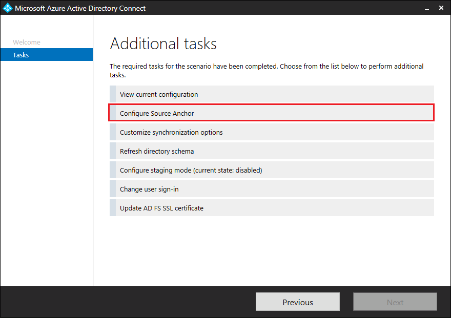
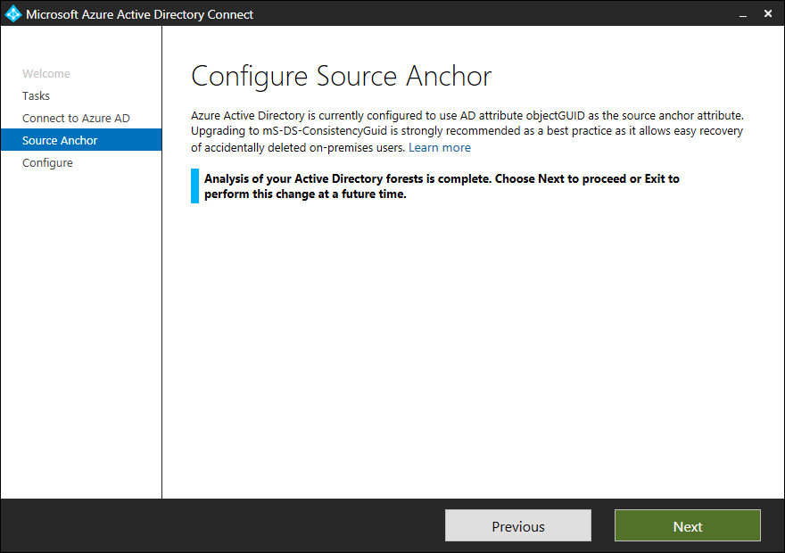

# Azure AD Connect: Design concepts
The purpose of this document is to describe areas that must be thought through during the implementation design of Azure AD Connect. This document is a deep dive on certain areas and these concepts are briefly described in other documents as well.

## sourceAnchor
The sourceAnchor attribute is defined as *an attribute immutable during the lifetime of an object*. It uniquely identifies an object as being the same object on-premises and in Azure AD. The attribute is also called **immutableId** and the two names are used interchangeable.

The word immutable, that is "cannot be changed", is important to this document. Since this attribute’s value cannot be changed after it has been set, it is important to pick a design that supports your scenario.

The attribute is used for the following scenarios:

* When a new sync engine server is built, or rebuilt after a disaster recovery scenario, this attribute links existing objects in Azure AD with objects on-premises.
* If you move from a cloud-only identity to a synchronized identity model, then this attribute allows objects to "hard match" existing objects in Azure AD with on-premises objects.
* If you use federation, then this attribute together with the **userPrincipalName** is used in the claim to uniquely identify a user.

This topic only talks about sourceAnchor as it relates to users. The same rules apply to all object types, but it is only for users this problem usually is a concern.

### Selecting a good sourceAnchor attribute
The attribute value must follow the following rules:

* Fewer than 60 characters in length
  * Characters not being a-z, A-Z, or 0-9 are encoded and counted as 3 characters
* Not contain a special character: &#92; ! # $ % & * + / = ? ^ &#96; { } | ~ < > ( ) ' ; : , [ ] " \@ _
* Must be globally unique
* Must be either a string, integer, or binary
* Should not be based on user's name because these can change
* Should not be case-sensitive and avoid values that may vary by case
* Should be assigned when the object is created

If the selected sourceAnchor is not of type string, then Azure AD Connect Base64Encode the attribute value to ensure no special characters appear. If you use another federation server than ADFS, make sure your server can also Base64Encode the attribute.

The sourceAnchor attribute is case-sensitive. A value of “JohnDoe” is not the same as “johndoe”. But you should not have two different objects with only a difference in case.

If you have a single forest on-premises, then the attribute you should use is **objectGUID**. This is also the attribute used when you use express settings in Azure AD Connect and also the attribute used by DirSync.

If you have multiple forests and do not move users between forests and domains, then **objectGUID** is a good attribute to use even in this case.

If you move users between forests and domains, then you must find an attribute that does not change or can be moved with the users during the move. A recommended approach is to introduce a synthetic attribute. An attribute that could hold something that looks like a GUID would be suitable. During object creation, a new GUID is created and stamped on the user. A custom sync rule can be created in the sync engine server to create this value based on the **objectGUID** and update the selected attribute in ADDS. When you move the object, make sure to also copy the content of this value.

Another solution is to pick an existing attribute you know does not change. Commonly used attributes include **employeeID**. If you consider an attribute that contains letters, make sure there is no chance the case (upper case vs. lower case) can change for the attribute's value. Bad attributes that should not be used include those attributes with the name of the user. In a marriage or divorce, the name is expected to change, which is not allowed for this attribute. This is also one reason why attributes such as **userPrincipalName**, **mail**, and **targetAddress** are not even possible to select in the Azure AD Connect installation wizard. Those attributes also contain the "\@" character, which is not allowed in the sourceAnchor.

### Changing the sourceAnchor attribute
The sourceAnchor attribute value cannot be changed after the object has been created in Azure AD and the identity is synchronized.

For this reason, the following restrictions apply to Azure AD Connect:

* The sourceAnchor attribute can only be set during initial installation. If you rerun the installation wizard, this option is read-only. If you need to change this setting, then you must uninstall and reinstall.
* If you install another Azure AD Connect server, then you must select the same sourceAnchor attribute as previously used. If you have earlier been using DirSync and move to Azure AD Connect, then you must use **objectGUID** since that is the attribute used by DirSync.
* If the value for sourceAnchor is changed after the object has been exported to Azure AD, then Azure AD Connect sync throws an error and does not allow any more changes on that object before the issue has been fixed and the sourceAnchor is changed back in the source directory.

## Using ms-DS-ConsistencyGuid as sourceAnchor
By default, Azure AD Connect (version 1.1.486.0 and older) uses objectGUID as the sourceAnchor attribute. ObjectGUID is system-generated. You cannot specify its value when creating on-premises AD objects. As explained in section [sourceAnchor](#sourceanchor), there are scenarios where you need to specify the sourceAnchor value. If the scenarios are applicable to you, you must use a configurable AD attribute (for example, ms-DS-ConsistencyGuid) as the sourceAnchor attribute.

Azure AD Connect (version 1.1.524.0 and after) now facilitates the use of ms-DS-ConsistencyGuid as sourceAnchor attribute. When using this feature, Azure AD Connect automatically configures the synchronization rules to:

1. Use ms-DS-ConsistencyGuid as the sourceAnchor attribute for User objects. ObjectGUID is used for other object types.

2. For any given on-premises AD User object whose ms-DS-ConsistencyGuid attribute isn't populated, Azure AD Connect writes its objectGUID value back to the ms-DS-ConsistencyGuid attribute in on-premises Active Directory. After the ms-DS-ConsistencyGuid attribute is populated, Azure AD Connect then exports the object to Azure AD.

>[!NOTE]
> Once an on-premises AD object is imported into Azure AD Connect (that is, imported into the AD Connector Space and projected into the Metaverse), you cannot change its sourceAnchor value anymore. To specify the sourceAnchor value for a given on-premises AD object, configure its ms-DS-ConsistencyGuid attribute before it is imported into Azure AD Connect.

### Permission required
For this feature to work, the AD DS account used to synchronize with on-premises Active Directory must be granted write permission to the ms-DS-ConsistencyGuid attribute in on-premises Active Directory.

### How to enable the ConsistencyGuid feature - New installation
You can enable the use of ConsistencyGuid as sourceAnchor during new installation. This section covers both Express and Custom installation in details.

  >[!NOTE]
  > Only newer versions of Azure AD Connect (1.1.524.0 and after) support the use of ConsistencyGuid as sourceAnchor during new installation.

### How to enable the ConsistencyGuid feature
Currently, the feature can only be enabled during new Azure AD Connect installation only.

#### Express Installation
When installing Azure AD Connect with Express mode, the Azure AD Connect wizard automatically determines the most appropriate AD attribute to use as the sourceAnchor attribute using the following logic:

* First, the Azure AD Connect wizard queries your Azure AD tenant to retrieve the AD attribute used as the sourceAnchor attribute in the previous Azure AD Connect installation (if any). If this information is available, Azure AD Connect uses the same AD attribute.

  >[!NOTE]
  > Only newer versions of Azure AD Connect (1.1.524.0 and after) store information in your Azure AD tenant about the sourceAnchor attribute used during installation. Older versions of Azure AD Connect do not.

* If information about the sourceAnchor attribute used isn't available, the wizard checks the state of the ms-DS-ConsistencyGuid attribute in your on-premises Active Directory. If the attribute isn't configured on any object in the directory, the wizard uses the ms-DS-ConsistencyGuid as the sourceAnchor attribute. If the attribute is configured on one or more objects in the directory, the wizard concludes the attribute is being used by other applications and is not suitable as sourceAnchor attribute...

* In which case, the wizard falls back to using objectGUID as the sourceAnchor attribute.

* Once the sourceAnchor attribute is decided, the wizard stores the information in your Azure AD tenant. The information will be used by future installation of Azure AD Connect.

Once Express installation completes, the wizard informs you which attribute has been picked as the Source Anchor attribute.


#### Custom installation
When installing Azure AD Connect with Custom mode, the Azure AD Connect wizard provides two options when configuring sourceAnchor attribute:


| Setting | Description |
| --- | --- |
| Let Azure manage the source anchor for me | Select this option if you want Azure AD to pick the attribute for you. If you select this option, Azure AD Connect wizard applies the same [sourceAnchor attribute selection logic used during Express installation](#express-installation). Similar to Express installation, the wizard informs you which attribute has been picked as the Source Anchor attribute after Custom installation completes. |
| A specific attribute | Select this option if you wish to specify an existing AD attribute as the sourceAnchor attribute. |

### How to enable the ConsistencyGuid feature - Existing deployment
If you have an existing Azure AD Connect deployment which is using objectGUID as the Source Anchor attribute, you can switch it to using ConsistencyGuid instead.

>[!NOTE]
> Only newer versions of Azure AD Connect (1.1.552.0 and after) support switching from ObjectGuid to ConsistencyGuid as the Source Anchor attribute.

To switch from objectGUID to ConsistencyGuid as the Source Anchor attribute:

1. Start the Azure AD Connect wizard and click **Configure** to go to the Tasks screen.

2. Select the **Configure Source Anchor** task option and click **Next**.

   

3. Enter your Azure AD Administrator credentials and click **Next**.

4. Azure AD Connect wizard analyzes the state of the ms-DS-ConsistencyGuid attribute in your on-premises Active Directory. If the attribute isn't configured on any object in the directory, Azure AD Connect concludes that no other application is currently using the attribute and is safe to use it as the Source Anchor attribute. Click **Next** to continue.

   

5. In the **Ready to Configure** screen, click **Configure** to make the configuration change.

   

6. Once the configuration completes, the wizard indicates that ms-DS-ConsistencyGuid is now being used as the Source Anchor attribute.

   

During the analysis (step 4), if the attribute is configured on one or more objects in the directory, the wizard concludes the attribute is being used by another application and returns an error as illustrated in the diagram below. This error can also occur if you have previously enabled the ConsistencyGuid feature on your primary Azure AD Connect server and you are trying to do the same on your staging server.


 If you are certain that the attribute isn't used by other existing applications, you can suppress the error by restarting the Azure AD Connect wizard with the **/SkipLdapSearch** switch specified. To do so, run the following command in command prompt:

```
"c:\Program Files\Microsoft Azure Active Directory Connect\AzureADConnect.exe" /SkipLdapSearch
```

### Impact on AD FS or third-party federation configuration
If you are using Azure AD Connect to manage on-premises AD FS deployment, the Azure AD Connect automatically updates the claim rules to use the same AD attribute as sourceAnchor. This ensures that the ImmutableID claim generated by ADFS is consistent with the sourceAnchor values exported to Azure AD.

If you are managing AD FS outside of Azure AD Connect or you are using third-party federation servers for authentication, you must manually update the claim rules for ImmutableID claim to be consistent with the sourceAnchor values exported to Azure AD as described in article section [Modify AD FS claim rules](https://docs.microsoft.com/azure/active-directory/connect/active-directory-aadconnect-federation-management#modclaims). The wizard returns the following warning after installation completes:


### Adding new directories to existing deployment
Suppose you have deployed Azure AD Connect with the ConsistencyGuid feature enabled, and now you would like to add another directory to the deployment. When you try to add the directory, Azure AD Connect wizard checks the state of the ms-DS-ConsistencyGuid attribute in the directory. If the attribute is configured on one or more objects in the directory, the wizard concludes the attribute is being used by other applications and returns an error as illustrated in the diagram below. If you are certain that the attribute isn't used by existing applications, you can suppress the error by restarting the Azure AD Connect wizard with the **/SkipLdapSearch** switch specified as described above or you need to contact Support for more information.


## Azure AD sign-in
While integrating your on-premises directory with Azure AD, it is important to understand how the synchronization settings can affect the way user authenticates. Azure AD uses userPrincipalName (UPN) to authenticate the user. However, when you synchronize your users, you must choose the attribute to be used for value of userPrincipalName carefully.

### Choosing the attribute for userPrincipalName
When you are selecting the attribute for providing the value of UPN to be used in Azure one should ensure

* The attribute values conform to the UPN syntax (RFC 822), that is it should be of the format username\@domain
* The suffix in the values matches to one of the verified custom domains in Azure AD

In express settings, the assumed choice for the attribute is userPrincipalName. If the userPrincipalName attribute does not contain the value you want your users to sign in to Azure, then you must choose **Custom Installation**.

### Custom domain state and UPN
It is important to ensure that there is a verified domain for the UPN suffix.

John is a user in contoso.com. You want John to use the on-premises UPN john\@contoso.com to sign in to Azure after you have synced users to your Azure AD directory contoso.onmicrosoft.com. To do so, you need to add and verify contoso.com as a custom domain in Azure AD before you can start syncing the users. If the UPN suffix of John, for example contoso.com, does not match a verified domain in Azure AD, then Azure AD replaces the UPN suffix with contoso.onmicrosoft.com.

### Non-routable on-premises domains and UPN for Azure AD
Some organizations have non-routable domains, like contoso.local, or simple single label domains like contoso. You are not able to verify a non-routable domain in Azure AD. Azure AD Connect can sync to only a verified domain in Azure AD. When you create an Azure AD directory, it creates a routable domain that becomes default domain for your Azure AD for example, contoso.onmicrosoft.com. Therefore, it becomes necessary to verify any other routable domain in such a scenario in case you don't want to sync to the default onmicrosoft.com domain.

Read [Add your custom domain name to Azure Active Directory](../active-directory-domains-add-azure-portal.md) for more info on adding and verifying domains.

Azure AD Connect detects if you are running in a non-routable domain environment and would appropriately warn you from going ahead with express settings. If you are operating in a non-routable domain, then it is likely that the UPN, of the users, have non-routable suffixes too. For example, if you are running under contoso.local, Azure AD Connect suggests you to use custom settings rather than using express settings. Using custom settings, you are able to specify the attribute that should be used as UPN to sign in to Azure after the users are synced to Azure AD.

## Next steps
Learn more about [Integrating your on-premises identities with Azure Active Directory](whatis-hybrid-identity.md).
