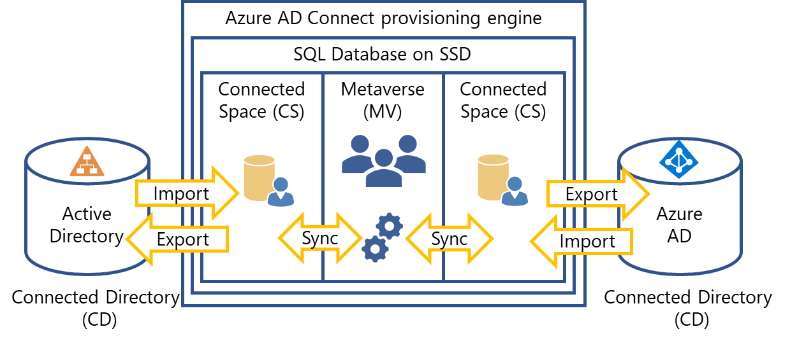

# Factors influencing the performance of Azure AD Connect

Azure AD Connect syncs your Active Directory to Azure AD. This server is a critical component of moving your user identities to the cloud. The primary factors that affect the performance of an Azure AD Connect are:

| **Design factor**| **Definition** |
|:-|-|
| Topology| The distribution of the endpoints and components Azure AD Connect must manage on the network. |
| Scale| The number of objects like the users, groups, and OUs, to be managed by Azure AD Connect. |
| Hardware| The hardware (physical or virtual) for the Azure AD Connect and dependent performance capacity of each hardware component including CPU, memory, network, and hard drive configuration. |
| Configuration| How Azure AD Connect processes the directories and information. |
| Load| Frequency of object changes. The loads may vary during an hour, day, or week. Depending on the component, you may have to design for peak load or average load. |

The purpose of this document is to describe the factors influencing the performance of the Azure AD Connect provisioning engine. Large or complex organizations (organizations provisioning more than 100,000 objects) can use the recommendations to optimize their Azure AD Connect implementation, if they experience any performance issues outlined here. The other components of Azure AD Connect, such as [Azure AD Connect health](how-to-connect-health-agent-install.md) and agents aren't covered here.

> [!IMPORTANT]
> Microsoft doesn't support modifying or operating Azure AD Connect outside of the actions that are formally documented. Any of these actions might result in an inconsistent or unsupported state of Azure AD Connect sync. As a result, Microsoft can't provide technical support for such deployments.

## Azure AD Connect component factors

The following diagram shows a high-level architecture of provisioning engine connecting to a single forest, although multiple forests are supported. This architecture shows how the various components interact with each other.

The provisioning engine connects to each Active Directory forest and to Azure AD. The process of reading information from each directory is called Import. Export refers to updating the directories from the provisioning engine. Sync evaluates the rules of how the objects will flow inside the provisioning engine. For a deeper dive you can refer to [Azure AD Connect sync: Understanding the architecture](https://docs.microsoft.com/azure/active-directory/hybrid/concept-azure-ad-connect-sync-architecture).

Azure AD Connect uses the following staging areas, rules, and processes to allow the sync from Active Directory to Azure AD:

* **Connector Space (CS)** - Objects from each connected directory (CD), the actual directories, are staged here first before they can be processed by the provisioning engine. Azure AD has its own CS and each forest you connect to has its own CS.
* **Metaverse (MV)** - Objects that need to be synced are create here based on the sync rules. Objects must exist in the MV before they can populate objects and attributes to the other connected directories. There's only one MV.
* **Sync rules** - They decide which objects will be created (projected) or connected (joined) to objects in the MV. The sync rules also decide which attribute values will be copied or transformed to and from the directories.
* **Run profiles** - Bundles the process steps of copying objects and their attribute values according to the sync rules between the staging areas and connected directories.

Different run profiles exist to optimize the performance of the provisioning engine. Most organizations will use the default schedules and run profiles for normal operations, but some organizations may have to [change the schedule](https://docs.microsoft.com/azure/active-directory/hybrid/how-to-connect-sync-feature-scheduler) or trigger other run profiles to cater for uncommon situations. The following run profiles are available:

### Initial sync profile

The Initial sync profile is the process of reading the connected directories, like an Active Directory forest, for the first time. It then does an analysis on all entries in the sync engine database. The initial cycle will create new objects in Azure AD and will take extra time to complete if your Active Directory forests are large. The initial sync includes the following steps:

1. Full import on all connectors
2. Full sync on all connectors
3. Export on all connectors

### Delta sync profile

To optimize the sync process this run profile only process the changes (creates, deletes and updates) of objects in your connected directories, since the last sync process. By default, the delta sync profile runs every 30 minutes. Organizations should strive to keep the time it takes to below 30 minutes, to make sure the Azure AD is up-to-date. To monitor the health of Azure AD Connect, use the [health monitoring agent](how-to-connect-health-sync.md) to see any issues with the process. The delta sync profile includes the following steps:

1. Delta import on all connectors
2. Delta sync on all connectors
3. Export on all connectors

A typical enterprise organization delta sync scenario is:

- ~1% of objects are deleted
- ~1% of objects are created
- ~5% of objects are modified

Your rate of change may vary depending on how often your organization updates users in your Active Directory. For example, higher rates of change can occur with the seasonality of hiring and reducing work force.

### Full sync profile

A full sync cycle is required if you have made any of the following configuration changes:

- Increased the scope of the objects or attributes to be imported from the connected directories. For example, when you add a domain or OU to your import scope.
- Made changes to the sync rules. For example, when you create a new rule to populate a user’s title in Azure AD from extension_attribute3 in Active Directory. This update requires that the provisioning engine re-examine all existing users to update their titles to apply the change going forward.

The following operations are included in a full sync cycle:

1. Full import on all connectors
2. Full/Delta sync on all connectors
3. Export on all connectors

> [!NOTE]
> Careful planning is required when doing bulk updates to many objects in your Active Directory or Azure AD. Bulk updates will cause the delta sync process to take longer when importing, since a lot of objects have changed. Long imports can happen even if the bulk update doesn't influence the sync process. For example, assigning licenses to many users in Azure AD will cause a long import cycle from Azure AD, but will not result in any attribute changes in Active Directory.

### Synchronization

The sync process runtime has the following performance characteristics:

* Sync is single threaded, meaning the provisioning engine doesn't do any parallel processing of run profiles of connected directories, objects, or attributes.
* Import time grows linearly with the number of objects being synced. For example, if 10,000 objects take 10 minutes to import, then 20,000 objects will take approximately 20 minutes on the same server.
* Export is also linear.
* The sync will grow exponentially based on the number of objects with references to other objects. Group memberships and nested groups have the main performance impact, because their members refer to user objects or other groups. These references must be found and referenced to actual objects in the MV to complete the sync cycle.

### Filtering

The size of the Active Directory topology you want to import is the number one factor influencing the performance and overall time the internal components of the provisioning engine will take.

[Filtering](https://docs.microsoft.com/azure/active-directory/hybrid/how-to-connect-sync-configure-filtering) should be used to reduce the objects to the synced. It will prevent unnecessary objects from being processed and exported to Azure AD. In order of preference, the following techniques of filtering are available:

- **Domain-based filtering** – use this option to select specific domains to sync to Azure AD. You must add and remove domains from the sync engine configuration when you make changes to your on-premises infrastructure after you install Azure AD Connect sync.
- **Organization Unit (OU) filtering** - uses OUs to target specific objects in Active Directory domains for provisioning to Azure AD. OU filtering is the second recommended filtering mechanism, because it uses simple LDAP scope queries to import a smaller subset of objects from Active Directory.
- **Attribute filtering per object** - uses the attribute values on objects to decide whether specific object in Active Directory is provisioned in Azure AD. Attribute filtering is great for fine-tuning your filters, when domain and OU filtering doesn't meet the specific filtering requirements. Attribute filtering doesn't reduce the import time but can reduce sync and export times.
- **Group-based filtering** - uses group membership to decide whether objects should be provisioned in Azure AD. Group-based filtering is only suited for testing situations and not recommended for production, because of the extra overhead required to check group membership during the sync cycle.

Many persistent [disconnector objects](concept-azure-ad-connect-sync-architecture.md#relationships-between-staging-objects-and-metaverse-objects) in your Active Directory CS can cause longer sync times, because the provisioning engine must reevaluate each disconnector object for possible connection in the sync cycle. To overcome this issue, consider one of the following recommendations:

- Place the disconnector objects out of scope for import using domain or OU filtering.
- Project/join the objects to the MV and set the [cloudFiltered](how-to-connect-sync-configure-filtering.md#negative-filtering-do-not-sync-these) attribute equal to True, to prevent provisioning of these objects in the Azure AD CS.

> [!NOTE]
> Users can get confused or application permissions issues can occur, when too many objects are filtered. For example, in a hybrid Exchange online implementation, users with on-premises mailboxes will see more users in their global address list than users with mailboxes in Exchange online. In other cases, a user may want to grant access in a cloud app to another user which is not part of the scope of the filtered set of objects.

### Attribute flows

Attribute flows is the process for copying or transforming the attribute values of objects from one connected directory to another connected directory. They're defined as part of the sync rules. For example, when the telephone number of a user is changed in your Active Directory, the telephone number in Azure AD will be updated. Organizations can [modify the attribute flows](https://docs.microsoft.com/azure/active-directory/hybrid/how-to-connect-sync-change-the-configuration) to suite various requirements. It's recommended you copy the existing attribute flows before changing them.

Simple redirects, like flowing an attribute value to a different attribute doesn't have material performance impact. An example of a redirect is flowing a mobile number in Active Directory to the office phone number in Azure AD.

Transforming attribute values can have a performance impact on the sync process. Transforming attribute values includes modifying, reformatting, concatenating, or subtracting values of attributes.

Organizations can prevent certain attributes to flow to Azure AD, but it won't influence the performance of the provisioning engine.

> [!NOTE]
> Don’t delete unwanted attribute flows in your sync rules. It is recommended you rather disable them, because deleted rules are recreated during Azure AD Connect upgrades.

## Azure AD Connect dependency factors

The performance of Azure AD Connect is dependent on the performance of the connected directories it imports and exports to. For example, the size of the Active Directory it needs to import or the network latency to the Azure AD service. The SQL database the provisioning engine uses also impacts the overall performance of the sync cycle.

### Active Directory factors

As mentioned previously, the number of objects to be imported influences the performance significantly. The [hardware and prerequisites for Azure AD Connect](how-to-connect-install-prerequisites.md) outline specific hardware tiers based on the size of your deployment. Azure AD Connect only support specific topologies as outlined in [Topologies for Azure AD Connect](plan-connect-topologies.md). There are no performance optimizations and recommendations for unsupported topologies.

Make sure your Azure AD Connect server meets the hardware requirements based on your Active Directory size you want to import. Bad or slow network connectivity between the Azure AD Connect server and your Active Directory domain controllers can slow down your import.

### Azure AD factors

Azure AD uses throttling to protect the cloud service from denial-of-service (DoS) attacks. Currently Azure AD has a throttling limit of 7,000 writes per 5 minutes (84,000 per hour). For example, the following operations can be throttled:

- Azure AD Connect export to Azure AD.
- PowerShell scripts or applications updating the Azure AD directly even in the background, such as Dynamic group memberships.
- Users updating their own identity records such as registering for MFA or SSPR (self-service password reset).
- Operations within the graphical user interface.

Plan for deployment and maintenance tasks, to make sure your Azure AD Connect sync cycle is not impacted by throttling limits. For example, if you have a large hiring wave where you create thousands of user identities, it can cause updates to dynamic group memberships, licensing assignments, and self-service password reset registrations. It's better to spread these writes over several hours or a few days.

### SQL database factors

The size of your source Active Directory topology will influence your SQL database performance. Follow the [hardware requirements](how-to-connect-install-prerequisites.md) for the SQL server database and consider the following recommendations:

- Organizations with more than 100,000 users can reduce network latencies by colocating SQL database and the provisioning engine on the same server.
- Due to the high disk input and output (I/O) requirements of the sync process, use Solid State Drives (SSD) for the SQL database of the provisioning engine for optimal results, if not possible, consider RAID 0 or RAID 1 configurations.
- Don’t do a full sync pre-emptively; it causes unnecessary churn and slower response times.

## Conclusion

To optimize the performance of your Azure AD Connect implementation, consider the following recommendations:

- Use the [recommended hardware configuration](how-to-connect-install-prerequisites.md) based on your implementation size for the Azure AD Connect server.
- When upgrading Azure AD Connect in large-scale deployments, consider using [swing migration method](https://docs.microsoft.com/azure/active-directory/hybrid/how-to-upgrade-previous-version#swing-migration), to make sure you have the least downtime and best reliability. 
- Use SSD for the SQL database for best writing performance.
- Filter the Active Directory scope to only include objects that need to be provisioned in Azure AD, using domain, OU, or attribute filtering.
- If you require to change the default attribute flow rules, first copy the rule, then change the copy and disable the original rule. Remember to rerun a full sync.
- Plan adequate time for the initial full sync run profile.
- Strive to complete the delta sync cycle in 30 minutes. If the delta sync profile doesn’t complete in 30 minutes, modify the default sync frequency to include a complete delta sync cycle.
- Monitor your [Azure AD Connect sync health](how-to-connect-health-agent-install.md) in Azure AD.

## Next steps
Learn more about [Integrating your on-premises identities with Azure Active Directory](whatis-hybrid-identity.md).
