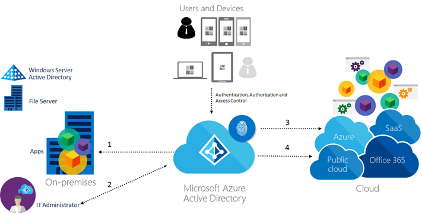

# Define data protection strategy for your hybrid identity solution
In this task, you’ll define the data protection strategy for your hybrid identity solution to meet the business requirements that you defined in:

* [Determine data protection requirements](plan-hybrid-identity-design-considerations-dataprotection-requirements.md)
* [Determine content management requirements](plan-hybrid-identity-design-considerations-contentmgt-requirements.md)
* [Determine access control requirements](plan-hybrid-identity-design-considerations-accesscontrol-requirements.md)
* [Determine incident response requirements](plan-hybrid-identity-design-considerations-incident-response-requirements.md)

## Define data protection options
As explained in [Determine directory synchronization requirements](plan-hybrid-identity-design-considerations-directory-sync-requirements.md), Microsoft Azure AD can synchronize with your on-premises Active Directory Domain Services (AD DS). This integration lets organizations use Azure AD to verify users' credentials when they are trying to access corporate resources. You can do this for both scenarios: data at rest on-premises and in the cloud. Access to data in Azure AD requires user authentication via a security token service (STS).

Once authenticated, the user principal name (UPN) is read from the authentication token. Then, the authorization system determines the replicated partition and container corresponding to the user’s domain. Information on the user’s existence, enabled state, and role then helps the authorization system determine whether access to the target tenant is authorized for the user in that session. Certain authorized actions (specifically, create user and password reset) create an audit trail that a tenant administrator then uses to manage compliance efforts or investigations.

Moving data from your on-premises datacenter into Azure Storage over an Internet connection may not always be feasible due to data volume, bandwidth availability, or other considerations. The [Azure Storage Import/Export Service](../../storage/common/storage-import-export-service.md) provides a hardware-based option for placing/retrieving large volumes of data in blob storage. It allows you to send [BitLocker-encrypted](https://technet.microsoft.com/library/dn306081#BKMK_BL2012R2) hard disk drives directly to an Azure datacenter where cloud operators upload the contents to your storage account, or they can download your Azure data to your drives to return to you. Only encrypted disks are accepted for this process (using a BitLocker key generated by the service itself during the job setup). The BitLocker key is provided to Azure separately, thus providing out of band key sharing.

Since data in transit can take place in different scenarios, is also relevant to know that Microsoft Azure uses [virtual networking](https://azure.microsoft.com/documentation/services/virtual-network/) to isolate tenants’ traffic from one another, employing measures such as host- and guest-level firewalls, IP packet filtering, port blocking, and HTTPS endpoints. However, most of Azure’s internal communications, including infrastructure-to-infrastructure and infrastructure-to-customer (on-premises), are also encrypted. Another important scenario is the communications within Azure datacenters; Microsoft manages networks to assure that no VM can impersonate or eavesdrop on the IP address of another. TLS/SSL is used when accessing Azure Storage or SQL Databases, or when connecting to Cloud Services. In this case, the customer administrator is responsible for obtaining a TLS/SSL certificate and deploying it to their tenant infrastructure. Data traffic moving between Virtual Machines in the same deployment or between tenants in a single deployment via Microsoft Azure Virtual Network can be protected through encrypted communication protocols such as HTTPS, SSL/TLS, or others.

Depending on how you answered the questions in [Determine data protection requirements](plan-hybrid-identity-design-considerations-dataprotection-requirements.md), you should be able to determine how you want to protect your data and how the hybrid identity solution can assist you with that process. The following table shows the options supported by Azure that are available for each data protection scenario.

| Data protection options | At rest in the cloud | At rest on-premises | In transit |
| --- | --- | --- | --- |
| BitLocker Drive Encryption |X |X | |
| SQL Server to encrypt databases |X |X | |
| VM-to-VM Encryption | | |X |
| SSL/TLS | | |X |
| VPN | | |X |

> [!NOTE]
> Read [Compliance by Feature](https://azure.microsoft.com/support/trust-center/services/) at [Microsoft Azure Trust Center](https://azure.microsoft.com/support/trust-center/) to know more about the certifications that each Azure service is compliant with.
> Since the options for data protection use a multilayer approach, comparison between those options are not applicable for this task. Ensure that you are leveraging all options available for each state of the data.
>
>

## Define content management options

One advantage of using Azure AD to manage a hybrid identity infrastructure is that the process is fully transparent from the end user’s perspective. The user tries to access a shared resource, the resource requires authentication, the user has to send an authentication request to Azure AD in order to obtain the token and access the resource. This entire process happens in the background, without user interaction. 

Organizations that are concern about data privacy usually require data classification for their solution. If their current on-premises infrastructure is already using data classification, it is possible to use Azure AD as the main repository for the user’s identity. A common tool that it is used on-premises for data classification is called [Data Classification Toolkit](https://msdn.microsoft.com/library/Hh204743.aspx) for Windows Server 2012 R2. This tool can help to identify, classify, and protect data on file servers in your private cloud. It is also possible to use the [Automatic File Classification](https://technet.microsoft.com/library/hh831672.aspx) in Windows Server 2012 to accomplish this task.

If your organization doesn’t have data classification in place but needs to protect sensitive files without adding new Servers on-premises, they can use Microsoft [Azure Rights Management Service](https://technet.microsoft.com/library/JJ585026.aspx).  Azure RMS uses encryption, identity, and authorization policies to help secure your files and email, and it works across multiple devices—phones, tablets, and PCs. Because Azure RMS is a cloud service, there’s no need to explicitly configure trusts with other organizations before you can share protected content with them. If they already have an Office 365 or an Azure AD directory, collaboration across organizations is automatically supported. You can also synchronize just the directory attributes that Azure RMS needs to support a common identity for your on-premises Active Directory accounts, by using Azure Active Directory Synchronization Services (AAD Sync) or Azure AD Connect.

A vital part of content management is to understand who is accessing which resource, therefore a rich logging capability is important for the identity management solution. Azure AD provides log over 30 days including:

* Changes in role membership (ex: user added to Global Admin role)
* Credential updates (ex: password changes)
* Domain management (ex: verifying a custom domain, removing a domain)
* Adding or removing applications
* User management (ex: adding, removing, updating a user)
* Adding or removing licenses

> [!NOTE]
> Read [Microsoft Azure Security and Audit Log Management](https://download.microsoft.com/download/B/6/C/B6C0A98B-D34A-417C-826E-3EA28CDFC9DD/AzureSecurityandAuditLogManagement_11132014.pdf) to know more about logging capabilities in Azure.
> Depending on how you answered the questions in [Determine content management requirements](plan-hybrid-identity-design-considerations-contentmgt-requirements.md), you should be able to determine how you want the content to be managed in your hybrid identity solution. While all options exposed in Table 6 are capable of integrating with Azure AD, it is important to define which is more appropriate for your business needs.
>
>

| Content management options | Advantages | Disadvantages |
| --- | --- | --- |
| Centralized on-premises (Active Directory Rights Management Server) |Full control over the server infrastructure responsible for classifying the data   Built-in capability in Windows Server, no need for extra license or subscription   Can be integrated with Azure AD in a hybrid scenario   Supports information rights management (IRM) capabilities in Microsoft Online services such as Exchange Online and SharePoint Online, as well as Office 365   Supports on-premises Microsoft server products, such as Exchange Server, SharePoint Server, and file servers that run Windows Server and File Classification Infrastructure (FCI). |Higher maintenance (keep up with updates, configuration and potential upgrades), since IT owns the Server   Require a server infrastructure on-premises  Doesn’t leverage Azure capabilities natively |
| Centralized in the cloud (Azure RMS) |Easier to manage compared to the on-premises solution   Can be integrated with AD DS in a hybrid scenario    Fully integrated with Azure AD   Doesn’t require a server on-premises in order to deploy the service   Supports on-premises Microsoft server products such as Exchange Server, SharePoint, Server, and file servers that run Windows Server and File Classification, Infrastructure (FCI)   IT, can have complete control over their tenant’s key with BYOK capability. |Your organization must have a cloud subscription that supports RMS   Your organization must have an Azure AD directory to support user authentication for RMS |
| Hybrid (Azure RMS integrated with, On-Premises Active Directory Rights Management Server) |This scenario accumulates the advantages of both, centralized on-premises and in the cloud. |Your organization must have a cloud subscription that supports RMS   Your organization must have an Azure AD directory to support user authentication for RMS,   Requires a connection between Azure cloud service and on-premises infrastructure |

## Define access control options
By leveraging the authentication, authorization and access control capabilities available in Azure AD you can enable your company to use a central identity repository while allowing users and partners to use single sign-on (SSO) as shown in the following figure:

Centralized management and fully integration with other directories

Azure Active Directory provides single sign-on to thousands of SaaS applications and on-premises web applications. See the [Azure Active Directory federation compatibility list: third-party identity providers that can be used to implement single sign-on](how-to-connect-fed-compatibility.md) article for more details about the SSO third-party that were tested by Microsoft. This capability enables organization to implement a variety of B2B scenarios while keeping control of the identity and access management. However, during the B2B designing process, is important to understand the authentication method that is used by the partner and validate if this method is supported by Azure. Currently, the following methods are supported by Azure AD:

* Security Assertion Markup Language (SAML)
* OAuth
* Kerberos
* Tokens
* Certificates

> [!NOTE]
> read [Azure Active Directory Authentication Protocols](https://msdn.microsoft.com/library/azure/dn151124.aspx) to know more details about each protocol and its capabilities in Azure.
>
>

Using the Azure AD support, mobile business applications can use the same easy Mobile Services authentication experience to allow employees to sign into their mobile applications with their corporate Active Directory credentials. With this feature, Azure AD is supported as an identity provider in Mobile Services alongside the other identity providers already supported (which include Microsoft Accounts, Facebook ID, Google ID, and Twitter ID). If the on-premises apps use the user’s credential located at the company’s AD DS, the access from partners and users coming from the cloud should be transparent. You can manage user’s Conditional Access control to (cloud-based) web applications, web API, Microsoft cloud services, third-party SaaS applications, and native (mobile) client applications, and have the benefits of security, auditing, reporting all in one place. However, it is recommended to validate the implementation in a non-production environment or with a limited number of users.

> [!TIP]
> it is important to mention that Azure AD does not have Group Policy as AD DS has. In order to enforce policy for devices, you need a mobile device management solution such as [Microsoft Intune](https://technet.microsoft.com/library/jj676587.aspx).
>
>

Once the user is authenticated using Azure AD, it is important to evaluate the level of access that the user has. The level of access that the user has over a resource can vary. While Azure AD can add an additional security layer by controlling access to some resources, keep in mind that the resource itself can also have its own access control list separately, such as the access control for files located in a File Server. The following figure summarizes the levels of access control that you can have in a hybrid scenario:

Each interaction in the diagram showed in Figure X represents one access control scenario that can be covered by Azure AD. Below you have a description of each scenario:

1. Conditional Access to applications that are hosted on-premises: You can use registered devices with access policies for applications that are configured to use AD FS with Windows Server 2012 R2.

2. Access Control to the Azure portal:  Azure also lets you control access to the portal by using role-based access control (RBAC)). This method enables the company to restrict the number of operations that an individual can do in the Azure portal. By using RBAC to control access to the portal, IT Admins can delegate access by using the following access management approaches:

   - Group-based role assignment: You can assign access to Azure AD groups that can be synced from your local Active Directory. This lets you leverage the existing investments that your organization has made in tooling and processes for managing groups. You can also use the delegated group management feature of Azure AD Premium.
   - Use built-in roles in Azure: You can use three roles — Owner, Contributor, and Reader, to ensure that users and groups have permission to do only the tasks they need to do their jobs.
   -  Granular access to resources: You can assign roles to users and groups for a particular subscription, resource  group, or an individual Azure resource such as a website or database. In this way, you can ensure that users have access to all the resources they need and no access to resources that they do not need to manage.

   > [!NOTE]
   > If you are building applications and want to customize the access control for them, it is also possible to use Azure AD Application Roles for authorization. Review this [WebApp-RoleClaims-DotNet example](https://github.com/AzureADSamples/WebApp-RoleClaims-DotNet) on how to build your app to use this capability.

3. Conditional Access for Office 365 applications with Microsoft Intune:  IT admins can provision Conditional Access device policies to secure corporate resources, while at the same time allowing information workers on compliant devices to access the services. 
  
4. Conditional Access for Saas apps: [This feature](https://cloudblogs.microsoft.com/enterprisemobility/2015/06/25/azure-ad-conditional-access-preview-update-more-apps-and-blocking-access-for-users-not-at-work/) allows you to configure per-application multi-factor authentication access rules and the ability to block access for users not on a trusted network. You can apply the multi-factor authentication rules to all users that are assigned to the application, or only for users within specified security groups. Users may be excluded from the multi-factor authentication requirement if they are accessing the application from an IP address that in inside the organization’s network.

Since the options for access control use a multilayer approach, comparison between those options are not applicable for this task. Ensure that you are leveraging all options available for each scenario that requires you to control access to your resources.

## Define incident response options
Azure AD can assist IT to identity potential security risks in the environment by monitoring user’s activity. IT can use Azure AD Access and Usage reports to gain visibility into the integrity and security of your organization’s directory. With this information, an IT admin can better determine where possible security risks may lie so that they can adequately plan to mitigate those risks.  [Azure AD Premium subscription](../fundamentals/active-directory-get-started-premium.md) has a set of security reports that can enable IT to obtain this information. [Azure AD reports](../reports-monitoring/overview-reports.md) are categorized as follows:

* **Anomaly reports**: Contain sign-in events that were found to be anomalous. The goal is to make you aware of such activity and enable you to make a determination about whether an event is suspicious.
* **Integrated Application report**: Provides insights into how cloud applications are being used in your organization. Azure Active Directory offers integration with thousands of cloud applications.
* **Error reports**: Indicate errors that may occur when provisioning accounts to external applications.
* **User-specific reports**: Display device/sign in activity data for a specific user.
* **Activity logs**: Contain a record of all audited events within the last 24 hours, last 7 days, or last 30 days, as well as group activity changes, and password reset and registration activity.

> [!TIP]
> Another report that can also help the Incident Response team working on a case is the [user with leaked credentials](https://cloudblogs.microsoft.com/enterprisemobility/2015/06/15/azure-active-directory-premium-reporting-now-detects-leaked-credentials/) report. This report surfaces any matches between the leaked credentials list and your tenant.
>

Other important built-in reports in Azure AD that can be used during an incident response investigation and are:

* **Password reset activity**: provide the admin with insights into how actively password reset is being used in the organization.
* **Password reset registration activity**: provides insights into which users have registered their methods for password reset, and which methods they have selected.
* **Group activity**: provides a history of changes to the group (ex: users added or removed) that were initiated in the Access Panel.

In addition to the core reporting capability of Azure AD Premium that you can use during an Incident Response investigation process, IT can also take advantage of the Audit Report to obtain information such as:

* Changes in role membership (for example, user added to Global Admin role)
* Credential updates (for example, password changes)
* Domain management (for example, verifying a custom domain, removing a domain)
* Adding or removing applications
* User management (for example, adding, removing, updating a user)
* Adding or removing licenses

Since the options for incident response use a multilayer approach, comparison between those options is not applicable for this task. Ensure that you are leveraging all options available for each scenario that requires you to use Azure AD reporting capability as part of your company’s incident response process.

## Next steps
[Determine hybrid identity management tasks](plan-hybrid-identity-design-considerations-hybrid-id-management-tasks.md)

## See Also
[Design considerations overview](plan-hybrid-identity-design-considerations-overview.md)
