# Migrate from federation to password hash synchronization for Azure Active Directory

This article describes how to move your organization domains from Active Directory Federation Services (AD FS) to password hash synchronization.

> [!NOTE]
> Changing your authentication method requires planning, testing, and potentially downtime. [Staged rollout](how-to-connect-staged-rollout.md) provides an alternative way to test and gradually migrate from federation to cloud authentication using password hash synchronization.

## Prerequisites for migrating to password hash synchronization

The following prerequisites are required to migrate from using AD FS to using password hash synchronization.

### Update Azure AD Connect

As a minimum to successfully perform the steps to migrate to password hash synchronization, you should have [Azure AD connect](https://www.microsoft.com/download/details.aspx?id=47594) 1.1.819.0. This version contains significant changes to the way sign-in conversion is performed and reduces the overall time to migrate from Federation to Cloud Authentication from potentially hours to minutes.


> [!IMPORTANT]
> You might read in outdated documentation, tools, and blogs that user conversion is required when you convert domains from federated identity to managed identity. *Converting users* is no longer required. Microsoft is working to update documentation and tools to reflect this change.

To update Azure AD Connect, complete the steps in [Azure AD Connect: Upgrade to the latest version](https://docs.microsoft.com/azure/active-directory/connect/active-directory-aadconnect-upgrade-previous-version).

### Password hash synchronization required permissions

You can configure Azure AD Connect by using express settings or a custom installation. If you used the custom installation option, the [required permissions](https://docs.microsoft.com/azure/active-directory/connect/active-directory-aadconnect-accounts-permissions) for password hash synchronization might not be in place.

The Azure AD Connect Active Directory Domain Services (AD DS) service account requires the following permissions to synchronize password hashes:

* Replicate Directory Changes
* Replicate Directory Changes All

Now is a good time to verify that these permissions are in place for all domains in the forest.

### Plan the migration method

You can choose from two methods to migrate from federated identity management to password hash synchronization and seamless single sign-on (SSO). The method you use depends on how your AD FS instance was originally configured.

* **Azure AD Connect**. If you originally configured AD FS by using Azure AD Connect, you *must* change to password hash synchronization by using the Azure AD Connect wizard.

   ‎Azure AD Connect automatically runs the **Set-MsolDomainAuthentication** cmdlet when you change the user sign-in method. Azure AD Connect automatically unfederates all the verified federated domains in your Azure AD tenant.

   > [!NOTE]
   > Currently, if you originally used Azure AD Connect to configure AD FS, you can't avoid unfederating all domains in your tenant when you change the user sign-in to password hash synchronization. 
‎
* **Azure AD Connect with PowerShell**. You can use this method only if you didn't originally configure AD FS by using Azure AD Connect. For this option, you still must change the user sign-in method via the Azure AD Connect wizard. The core difference with this option is that the wizard doesn't automatically run the **Set-MsolDomainAuthentication** cmdlet. With this option, you have full control over which domains are converted and in which order.

To understand which method you should use, complete the steps in the following sections.

#### Verify current user sign-in settings

To verify your current user sign-in settings:

1. Sign in to the [Azure AD portal](https://aad.portal.azure.com/) by using a Global Administrator account.
2. In the **User sign-in** section, verify the following settings:
   * **Federation** is set to **Enabled**.
   * **Seamless single sign-on** is set to **Disabled**.
   * **Pass-through authentication** is set to **Disabled**.

   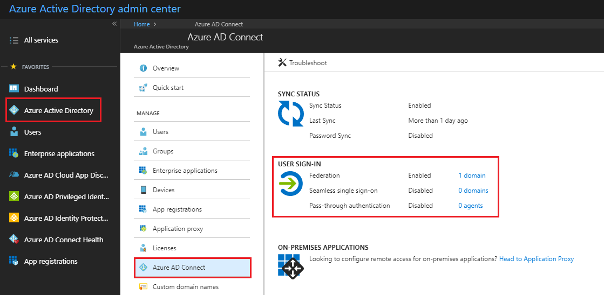

#### Verify the Azure AD Connect configuration

1. On your Azure AD Connect server, open Azure AD Connect. Select **Configure**.
2. On the **Additional tasks** page, select **View current configuration**, and then select **Next**.<br />

   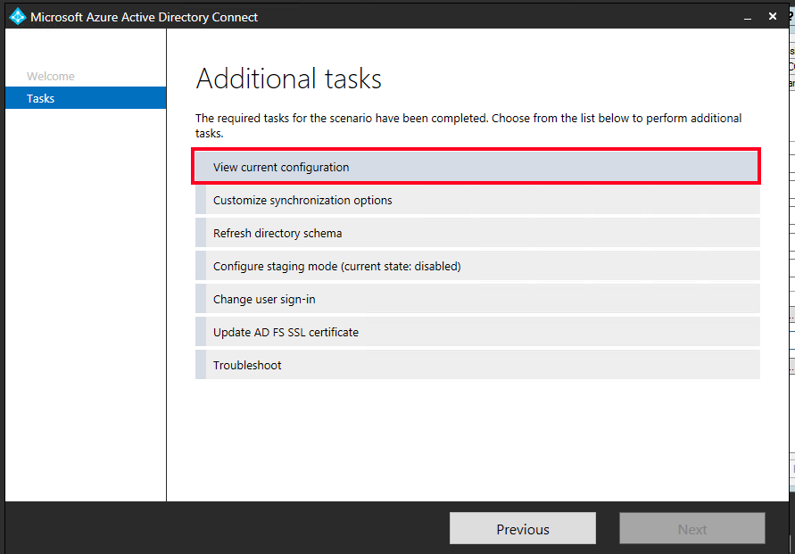<br />
3. On the **Review Your Solution** page, note the **Password hash synchronization** status.<br /> 

   * If **Password hash synchronization** is set to **Disabled**, complete the steps in this article to enable it.
   * If **Password hash synchronization** is set to **Enabled**, you can skip the section **Step 1: Enable password hash synchronization** in this article.
4. On the **Review your solution** page, scroll to **Active Directory Federation Services (AD FS)**.<br />

   * ‎If the AD FS configuration appears in this section, you can safely assume that AD FS was originally configured by using Azure AD Connect. You can convert your domains from federated identity to managed identity by using the Azure AD Connect **Change user sign-in** option. The process is detailed in the section **Option A: Switch from federation to password hash synchronization by using Azure AD Connect**.
   * If AD FS isn't listed in the current settings, you must manually convert your domains from federated identity to managed identity by using PowerShell. For more information about this process, see the section **Option B: Switch from federation to password hash synchronization by using Azure AD Connect and PowerShell**.

### Document current federation settings

To find your current federation settings, run the **Get-MsolDomainFederationSettings** cmdlet:

``` PowerShell
Get-MsolDomainFederationSettings -DomainName YourDomain.extention | fl *
```

Example:

``` PowerShell
Get-MsolDomainFederationSettings -DomainName Contoso.com | fl *
```

Verify any settings that might have been customized for your federation design and deployment documentation. Specifically, look for customizations in **PreferredAuthenticationProtocol**, **SupportsMfa**, and **PromptLoginBehavior**.

For more information, see these articles:

* [AD FS prompt=login parameter support](https://docs.microsoft.com/windows-server/identity/ad-fs/operations/ad-fs-prompt-login)
* [Set-MsolDomainAuthentication](https://docs.microsoft.com/powershell/module/msonline/set-msoldomainauthentication?view=azureadps-1.0)

> [!NOTE]
> If **SupportsMfa** is set to **True**, you're using an on-premises multi-factor authentication solution to inject a second-factor challenge into the user authentication flow. This setup no longer works for Azure AD authentication scenarios after converting this domain from federated to managed authentication. After you disable federation, you sever the relationship to your on-premises federation and this includes on-premises MFA adapters. 
>
> Instead, use the Azure Multi-Factor Authentication cloud-based service to perform the same function. Carefully evaluate your multi-factor authentication requirements before you continue. Before you convert your domains, make sure that you understand how to use Azure Multi-Factor Authentication, the licensing implications, and the user registration process.

#### Back up federation settings

Although no changes are made to other relying parties in your AD FS farm during the processes described in this article, we recommend that you have a current valid backup of your AD FS farm that you can restore from. You can create a current valid backup by using the free Microsoft [AD FS Rapid Restore Tool](https://docs.microsoft.com/windows-server/identity/ad-fs/operations/ad-fs-rapid-restore-tool). You can use the tool to back up AD FS, and to restore an existing farm or create a new farm.

If you choose not to use the AD FS Rapid Restore Tool, at a minimum, you should export the Microsoft Office 365 Identity Platform relying party trust and any associated custom claim rules you added. You can export the relying party trust and associated claim rules by using the following PowerShell example:

``` PowerShell
(Get-AdfsRelyingPartyTrust -Name "Microsoft Office 365 Identity Platform") | Export-CliXML "C:\temp\O365-RelyingPartyTrust.xml"
```

## Deployment considerations and using AD FS

This section describes deployment considerations and details about using AD FS.

### Current AD FS use

Before you convert from federated identity to managed identity, look closely at how you currently use AD FS for Azure AD, Office 365, and other applications (relying party trusts). Specifically, consider the scenarios that are described in the following table:

| If | Then |
|-|-|
| You plan to keep using AD FS with other applications (other than Azure AD and Office 365). | After you convert your domains, you'll use both AD FS and Azure AD. Consider the user experience. In some scenarios, users might be required to authenticate twice: once to Azure AD (where a user gets SSO access to other applications, like Office 365), and again for any applications that are still bound to AD FS as a relying party trust. |
| Your AD FS instance is heavily customized and relies on specific customization settings in the onload.js file (for example, if you changed the sign-in experience so that users use only a **SamAccountName** format for their username instead of a User Principal Name (UPN), or your organization has heavily branded the sign-in experience). The onload.js file can't be duplicated in Azure AD. | Before you continue, you must verify that Azure AD can meet your current customization requirements. For more information and for guidance, see the sections on AD FS branding and AD FS customization.|
| You use AD FS to block earlier versions of authentication clients.| Consider replacing AD FS controls that block earlier versions of authentication clients by using a combination of [Conditional Access controls](https://docs.microsoft.com/azure/active-directory/conditional-access/conditions) and [Exchange Online Client Access Rules](https://aka.ms/EXOCAR). |
| You require users to perform multi-factor authentication against an on-premises multi-factor authentication server solution when users authenticate to AD FS.| In a managed identity domain, you can't inject a multi-factor authentication challenge via the on-premises multi-factor authentication solution into the authentication flow. However, you can use the Azure Multi-Factor Authentication service for multi-factor authentication after the domain is converted.<br /><br /> If your users don't currently use Azure Multi-Factor Authentication, a onetime user registration step is required. You must prepare for and communicate the planned registration to your users. |
| You currently use access control policies (AuthZ rules) in AD FS to control access to Office 365.| Consider replacing the policies with the equivalent Azure AD [Conditional Access policies](https://docs.microsoft.com/azure/active-directory/active-directory-conditional-access-azure-portal) and [Exchange Online Client Access Rules](https://aka.ms/EXOCAR).|

### Common AD FS customizations

This section describes common AD FS customizations.

#### InsideCorporateNetwork claim

AD FS issues the **InsideCorporateNetwork** claim if the user who is authenticating is inside the corporate network. This claim can then be passed on to Azure AD. The claim is used to bypass multi-factor authentication based on the user's network location. To learn how to determine whether this functionality currently is enabled in AD FS, see [Trusted IPs for federated users](https://docs.microsoft.com/azure/multi-factor-authentication/multi-factor-authentication-get-started-adfs-cloud).

The **InsideCorporateNetwork** claim isn't available after your domains are converted to password hash synchronization. You can use [named locations in Azure AD](https://docs.microsoft.com/azure/active-directory/active-directory-named-locations) to replace this functionality.

After you configure named locations, you must update all Conditional Access policies that were configured to either include or exclude the network **All trusted locations** or **MFA Trusted IPs** values to reflect the new named locations.

For more information about the **Location** condition in Conditional Access, see [Active Directory Conditional Access locations](https://docs.microsoft.com/azure/active-directory/active-directory-conditional-access-locations).

#### Hybrid Azure AD-joined devices

When you join a device to Azure AD, you can create Conditional Access rules that enforce that devices meet your access standards for security and compliance. Also, users can sign in to a device by using an organizational work or school account instead of a personal account. When you use hybrid Azure AD-joined devices, you can join your Active Directory domain-joined devices to Azure AD. Your federated environment might have been set up to use this feature.

To ensure that hybrid join continues to work for any devices that are joined to the domain after your domains are converted to password hash synchronization, for Windows 10 clients, you must use Azure AD Connect device options to sync Active Directory computer accounts to Azure AD. 

For Windows 8 and Windows 7 computer accounts, hybrid join uses seamless SSO to register the computer in Azure AD. You don't have to sync Windows 8 and Windows 7 computer accounts like you do for Windows 10 devices. However, you must deploy an updated workplacejoin.exe file (via an .msi file) to Windows 8 and Windows 7 clients so they can register themselves by using seamless SSO. [Download the .msi file](https://www.microsoft.com/download/details.aspx?id=53554).

For more information, see [Configure hybrid Azure AD-joined devices](https://docs.microsoft.com/azure/active-directory/device-management-hybrid-azuread-joined-devices-setup).

#### Branding

If your organization [customized your AD FS sign-in pages](https://docs.microsoft.com/windows-server/identity/ad-fs/operations/ad-fs-user-sign-in-customization) to display information that's more pertinent to the organization, consider making similar [customizations to the Azure AD sign-in page](https://docs.microsoft.com/azure/active-directory/customize-branding).

Although similar customizations are available, some visual changes on sign-in pages should be expected after the conversion. You might want to provide information about expected changes in your communications to users.

> [!NOTE]
> Organization branding is available only if you purchase the Premium or Basic license for Azure Active Directory or if you have an Office 365 license.

## Plan deployment and support

Complete the tasks that are described in this section to help you plan for deployment and support.

### Plan the maintenance window

Although the domain conversion process is relatively quick, Azure AD might continue to send some authentication requests to your AD FS servers for up to four hours after the domain conversion is finished. During this four-hour window, and depending on various service side caches, Azure AD might not accept these authentications. Users might receive an error. The user can still successfully authenticate against AD FS, but Azure AD no longer accepts the user’s issued token because that federation trust is now removed.

Only users who access the services via a web browser during this post-conversion window before the service side cache is cleared are affected. Legacy clients (Exchange ActiveSync, Outlook 2010/2013) aren't expected to be affected because Exchange Online keeps a cache of their credentials for a set period of time. The cache is used to silently reauthenticate the user. The user doesn't have to return to AD FS. Credentials stored on the device for these clients are used to silently reauthenticate themselves after this cached is cleared. Users aren't expected to receive any password prompts as a result of the domain conversion process. 

Modern authentication clients (Office 2016 and Office 2013, iOS, and Android apps) use a valid refresh token to obtain new access tokens for continued access to resources instead of returning to AD FS. These clients are immune to any password prompts resulting from the domain conversion process. The clients will continue to function without additional configuration.

> [!IMPORTANT]
> Don’t shut down your AD FS environment or remove the Office 365 relying party trust until you have verified that all users can successfully authenticate by using cloud authentication.

### Plan for rollback

If you encounter a major issue that you can't resolve quickly, you might decide to roll back the solution to federation. It’s important to plan what to do if your deployment doesn’t roll out as intended. If conversion of the domain or users fails during deployment, or if you need to roll back to federation, you must understand how to mitigate any outage and reduce the effect on your users.

#### To roll back

To plan for rollback, check the federation design and deployment documentation for your specific deployment details. The process should include these tasks:

* Converting managed domains to federated domains by using the **Convert-MSOLDomainToFederated** cmdlet.
* If necessary, configuring additional claims rules.

### Plan communications

An important part of planning deployment and support is ensuring that your users are proactively informed about upcoming changes. Users should know in advance what they might experience and what is required of them. 

After both password hash synchronization and seamless SSO are deployed, the user sign-in experience for accessing Office 365 and other resources that are authenticated through Azure AD changes. Users who are outside the network see only the Azure AD sign-in page. These users aren't redirected to the forms-based page that's presented by external-facing web application proxy servers.

Include the following elements in your communication strategy:

* Notify users about upcoming and released functionality by using:
   * Email and other internal communication channels.
   * Visuals, such as posters.
   * Executive, live, or other communications.
* Determine who will customize the communications and who will send the communications, and when.

## Implement your solution

You planned your solution. Now, you can now implement it. Implementation involves the following components:

* Enabling password hash synchronization.
* Preparing for seamless SSO.
* Changing the sign-in method to password hash synchronization and enabling seamless SSO.

### Step 1: Enable password hash synchronization

The first step to implement this solution is to enable password hash synchronization by using the Azure AD Connect wizard. Password hash synchronization is an optional feature that you can enable in environments that use federation. There's no effect on the authentication flow. In this case, Azure AD Connect will start syncing password hashes without affecting users who sign in by using federation.

For this reason, we recommend that you complete this step as a preparation task well before you change your domain's sign-in method. Then, you'll have ample time to verify that password hash synchronization works correctly.

To enable password hash synchronization:

1. On the Azure AD Connect server, open the Azure AD Connect wizard, and then select **Configure**.
2. Select **Customize synchronization options**, and then select **Next**.
3. On the **Connect to Azure AD** page, enter the username and password of a Global Administrator account.
4. On the **Connect your directories** page, select **Next**.
5. On the **Domain and OU filtering** page, select **Next**.
6. On the **Optional features** page, select **Password synchronization**, and then select **Next**.
 
   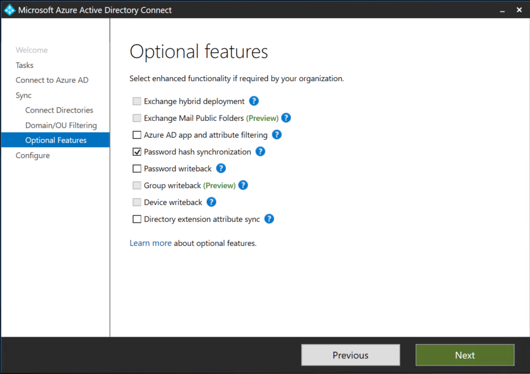<br />
7. Select **Next** on the remaining pages. On the last page, select **Configure**.
8. Azure AD Connect starts to sync password hashes on the next synchronization.

After password hash synchronization is enabled, the password hashes for all users in the Azure AD Connect synchronization scope are rehashed and written to Azure AD. Depending on the number of users, this operation might take minutes or several hours.

For planning purposes, you should estimate that approximately 20,000 users are processed in 1 hour.

To verify that password hash synchronization works correctly, complete the **Troubleshooting** task in the Azure AD Connect wizard:

1. Open a new Windows PowerShell session on your Azure AD Connect server by using the Run as Administrator option.
2. Run `Set-ExecutionPolicy RemoteSigned` or `Set-ExecutionPolicy Unrestricted`.
3. Start the Azure AD Connect wizard.
4. Go to the **Additional tasks** page, select **Troubleshoot**, and then select **Next**.
5. On the **Troubleshooting** page, select **Launch** to start the troubleshooting menu in PowerShell.
6. On the main menu, select **Troubleshoot password hash synchronization**.
7. On the submenu, select **Password hash synchronization does not work at all**.

For troubleshooting issues, see [Troubleshoot password hash synchronization with Azure AD Connect sync](https://docs.microsoft.com/azure/active-directory/connect/active-directory-aadconnectsync-troubleshoot-password-hash-synchronization).

### Step 2: Prepare for seamless SSO

For your devices to use seamless SSO, you must add an Azure AD URL to users' intranet zone settings by using a group policy in Active Directory.

By default, web browsers automatically calculate the correct zone, either internet or intranet, from a URL. For example, **http:\/\/contoso/** maps to the intranet zone and **http:\/\/intranet.contoso.com** maps to the internet zone (because the URL contains a period). Browsers send Kerberos tickets to a cloud endpoint, like the Azure AD URL, only if you explicitly add the URL to the browser's intranet zone.

Complete the steps to [roll out](https://docs.microsoft.com/azure/active-directory/connect/active-directory-aadconnect-sso-quick-start) the required changes to your devices.

> [!IMPORTANT]
> Making this change doesn't modify the way your users sign in to Azure AD. However, it’s important that you apply this configuration to all your devices before you proceed. Users who sign in on devices that haven't received this configuration simply are required to enter a username and password to sign in to Azure AD.

### Step 3: Change the sign-in method to password hash synchronization and enable seamless SSO

You have two options for changing the sign-in method to password hash synchronization and enabling seamless SSO.

#### Option A: Switch from federation to password hash synchronization by using Azure AD Connect

Use this method if you initially configured your AD FS environment by using Azure AD Connect. You can't use this method if you *didn't* originally configure your AD FS environment by using Azure AD Connect.

First, change the sign-in method:

1. On the Azure AD Connect server, open the Azure AD Connect wizard.
2. Select **Change user sign-in**, and then select **Next**. 

   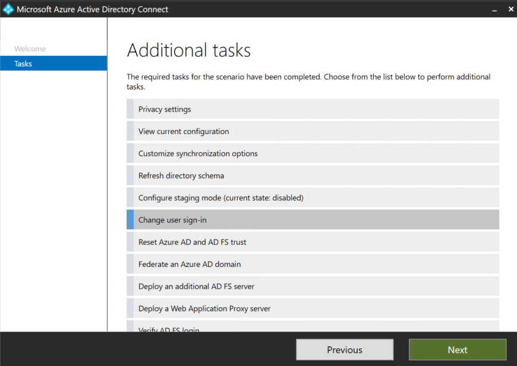<br />
3. On the **Connect to Azure AD** page, enter the username and password of a Global Administrator account.
4. On the **User sign-in** page, select the **Password hash synchronization button**. Make sure to select the **Do not convert user accounts** check box. The option is deprecated. Select **Enable single sign-on**, and then select **Next**.

   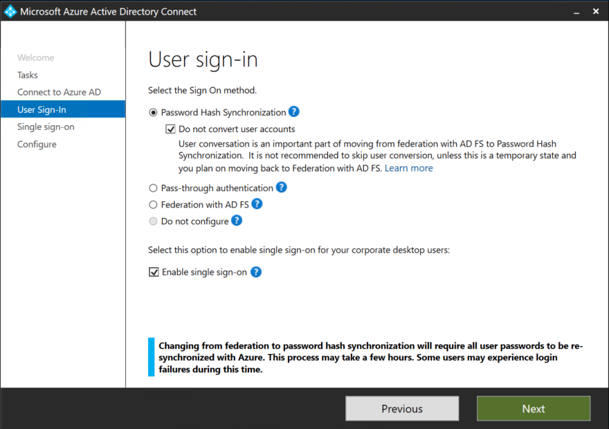<br />

   > [!NOTE]
   > Starting with Azure AD Connect version 1.1.880.0, the **Seamless single sign-on** check box is selected by default.

   > [!IMPORTANT]
   > You can safely ignore the warnings that indicate that user conversion and full password hash synchronization are required steps for converting from federation to cloud authentication. Note that these steps aren't required anymore. If you still see these warnings, make sure that you're running the latest version of Azure AD Connect and that you're using the latest version of this guide. For more information, see the section [Update Azure AD Connect](#update-azure-ad-connect).

5. On the **Enable single sign-on** page, enter the credentials of Domain Administrator account, and then select **Next**.

   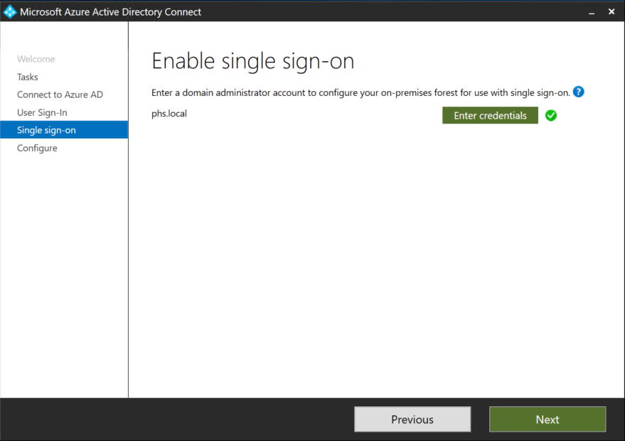<br />

   > [!NOTE]
   > Domain Administrator account credentials are required to enable seamless SSO. The process completes the following actions, which require these elevated permissions. The Domain Administrator account credentials aren't stored in Azure AD Connect or in Azure AD. The Domain Administrator account credentials are used only to turn on the feature. The credentials are discarded when the process successfully finishes.
   >
   > 1. A computer account named AZUREADSSOACC (which represents Azure AD) is created in your on-premises Active Directory instance.
   > 2. The computer account's Kerberos decryption key is securely shared with Azure AD.
   > 3. Two Kerberos service principal names (SPNs) are created to represent two URLs that are used during Azure AD sign-in.

6. On the **Ready to configure** page, make sure that the **Start the synchronization process when configuration completes** check box is selected. Then, select **Configure**.

      <br />

   > [!IMPORTANT]
   > At this point, all your federated domains will change to managed authentication. Password hash synchronization is the new method of authentication.

7. In the Azure AD portal, select **Azure Active Directory** > **Azure AD Connect**.
8. Verify these settings:
   * **Federation** is set to **Disabled**.
   * **Seamless single sign-on** is set to **Enabled**.
   * **Password Sync** is set to **Enabled**.<br /> 

   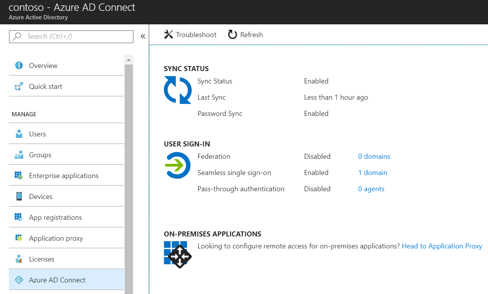<br />

Skip to [Testing and next steps](#testing-and-next-steps).

   > [!IMPORTANT]
   > Skip the section **Option B: Switch from federation to password hash synchronization by using Azure AD Connect and PowerShell**. The steps in that section don't apply if you chose Option A to change the sign-in method to password hash synchronization and enable seamless SSO.

#### Option B: Switch from federation to password hash synchronization using Azure AD Connect and PowerShell

Use this option if you didn't initially configure your federated domains by using Azure AD Connect. During this process, you enable seamless SSO and switch your domains from federated to managed.

1. On the Azure AD Connect server, open the Azure AD Connect wizard.
2. Select **Change user sign-in**, and then select **Next**.
3. On the **Connect to Azure AD** page, enter the username and password for a Global Administrator account.
4. On the **User sign-in** page, select the **Password hash synchronization** button. Select **Enable single sign-on**, and then select **Next**.

   Before you enable password hash synchronization:
   <br />

   After you enable password hash synchronization:
   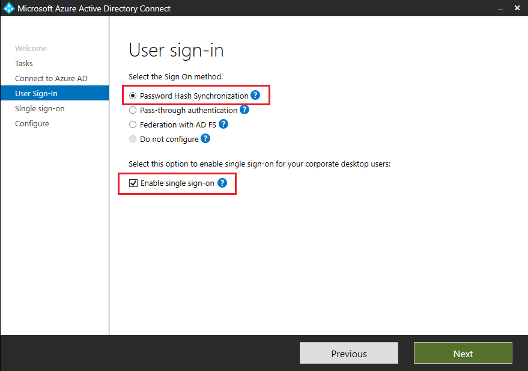<br />
   
   > [!NOTE]
   > Starting with Azure AD Connect version 1.1.880.0, the **Seamless single sign-on** check box is selected by default.

5. On the **Enable single sign-on** page, enter the credentials for a Domain Administrator account, and then select **Next**.

   > [!NOTE]
   > Domain Administrator account credentials are required to enable seamless SSO. The process completes the following actions, which require these elevated permissions. The Domain Administrator account credentials aren't stored in Azure AD Connect or in Azure AD. The Domain Administrator account credentials are used only to turn on the feature. The credentials are discarded when the process successfully finishes.
   >
   > 1. A computer account named AZUREADSSOACC (which represents Azure AD) is created in your on-premises Active Directory instance.
   > 2. The computer account's Kerberos decryption key is securely shared with Azure AD.
   > 3. Two Kerberos service principal names (SPNs) are created to represent two URLs that are used during Azure AD sign-in.

6. On the **Ready to configure** page, make sure that the **Start the synchronization process when configuration completes** check box is selected. Then, select **Configure**.

   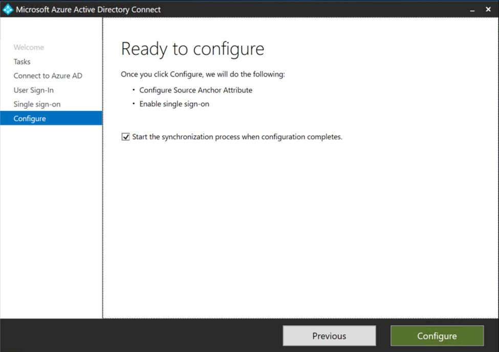<br />
   When you select the **Configure** button, seamless SSO is configured as indicated in the preceding step. Password hash synchronization configuration isn't modified because it was enabled earlier.

   > [!IMPORTANT]
   > No changes are made to the way users sign in at this time.

7. In the Azure AD portal, verify these settings:
   * **Federation** is set to **Enabled**.
   * **Seamless single sign-on** is set to **Enabled**.
   * **Password Sync** is set to **Enabled**.

   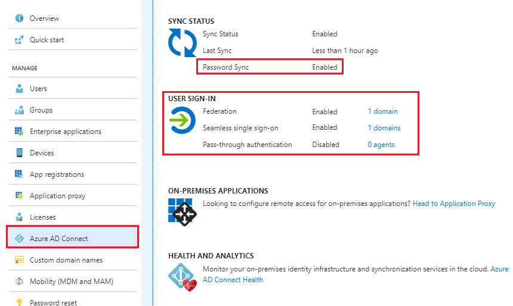

#### Convert domains from federated to managed

At this point, federation is still enabled and operational for your domains. To continue with the deployment, each domain needs to be converted from federated to managed to force user authentication via password hash synchronization.

> [!IMPORTANT]
> You don't have to convert all domains at the same time. You might choose to start with a test domain on your production tenant or start with your domain that has the lowest number of users.

Complete the conversion by using the Azure AD PowerShell module:

1. In PowerShell, sign in to Azure AD by using a Global Administrator account.
2. To convert the first domain, run the following command:

   ``` PowerShell
   Set-MsolDomainAuthentication -Authentication Managed -DomainName <domain name>
   ```

3. In the Azure AD portal, select **Azure Active Directory** > **Azure AD Connect**.
4. Verify that the domain has been converted to managed by running the following command:

   ``` PowerShell
   Get-MsolDomain -DomainName <domain name>
   ```

## Testing and next steps

Complete the following tasks to verify password hash synchronization and to finish the conversion process.

### Test authentication by using password hash synchronization 

When your tenant used federated identity, users were redirected from the Azure AD sign-in page to your AD FS environment. Now that the tenant is configured to use password hash synchronization instead of federated authentication, users aren't redirected to AD FS. Instead, users sign in directly on the Azure AD sign-in page.

To test password hash synchronization:

1. Open Internet Explorer in InPrivate mode so that seamless SSO doesn't sign you in automatically.
2. Go to the Office 365 sign-in page ([https://portal.office.com](https://portal.office.com/)).
3. Enter a user UPN, and then select **Next**. Make sure that you enter the UPN of a hybrid user who was synced from your on-premises Active Directory instance, and who previously used federated authentication. A page on which you enter the username and password appears:

   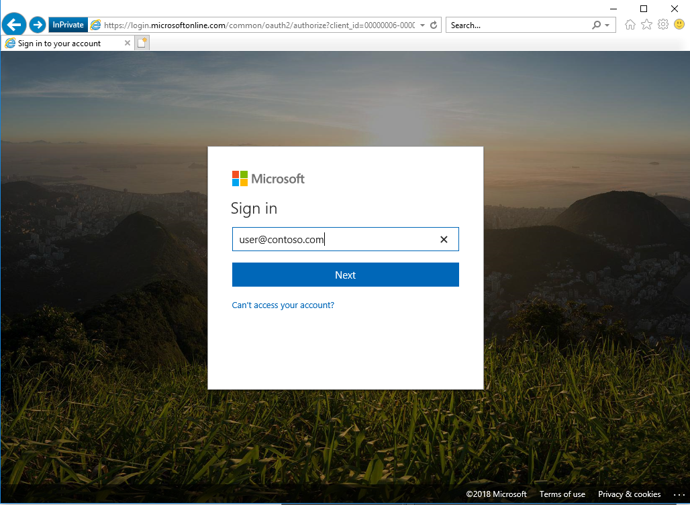

   

4. After you enter the password and select **Sign in**, you're redirected to the Office 365 portal.

   


### Test seamless SSO

1. Sign in to a domain-joined machine that is connected to the corporate network.
2. In Internet Explorer or Chrome, go to one of the following URLs (replace "contoso" with your domain):

   * https:\/\/myapps.microsoft.com/contoso.com
   * https:\/\/myapps.microsoft.com/contoso.onmicrosoft.com

   The user is briefly redirected to the Azure AD sign-in page, which shows the message "Trying to sign you in." The user isn't prompted for a username or password.<br />

   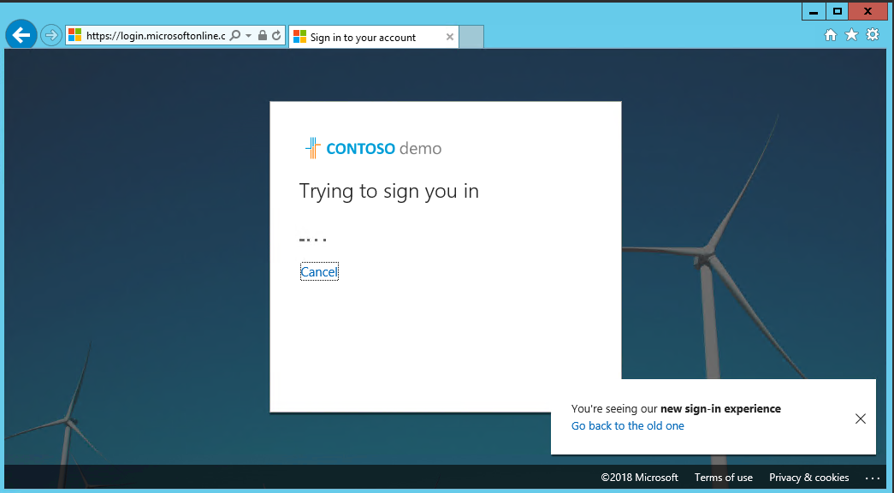<br />
3. The user is redirected and is successfully signed in to the access panel:

   > [!NOTE]
   > Seamless SSO works on Office 365 services that support domain hint (for example, myapps.microsoft.com/contoso.com). Currently, the Office 365 portal (portal.office.com) doesn’t support domain hints. Users are required to enter a UPN. After a UPN is entered, seamless SSO retrieves the Kerberos ticket on behalf of the user. The user is signed in without entering a password.

   > [!TIP]
   > Consider deploying [Azure AD hybrid join on Windows 10](https://docs.microsoft.com/azure/active-directory/device-management-introduction) for an improved SSO experience.

### Remove the relying party trust

After you validate that all users and clients are successfully authenticating via Azure AD, it's safe to remove the Office 365 relying party trust.

If you don't use AD FS for other purposes (that is, for other relying party trusts), it's safe to decommission AD FS at this point.

### Rollback

If you discover a major issue and can't resolve it quickly, you might choose to roll back the solution to federation.

Consult the federation design and deployment documentation for your specific deployment details. The process should involve these tasks:

* Convert managed domains to federated authentication by using the **Convert-MSOLDomainToFederated** cmdlet.
* If necessary, configure additional claims rules.

### Sync userPrincipalName updates

Historically, updates to the **UserPrincipalName** attribute, which uses the sync service from the on-premises environment, are blocked unless both of these conditions are true:

* The user is in a managed (non-federated) identity domain.
* The user hasn't been assigned a license.

To learn how to verify or turn on this feature, see [Sync userPrincipalName updates](https://docs.microsoft.com/azure/active-directory/connect/active-directory-aadconnectsyncservice-features).

### Troubleshooting

Your support team should understand how to troubleshoot any authentication issues that arise either during, or after the change from federation to managed. Use the following troubleshooting documentation to help your support team familiarize themselves with the common troubleshooting steps and appropriate actions that can help to isolate and resolve the issue.

[Troubleshoot Azure Active Directory password hash synchronization](https://docs.microsoft.com/azure/active-directory/connect/active-directory-aadconnectsync-troubleshoot-password-hash-synchronization)

[Troubleshoot Azure Active Directory Seamless Single Sign-On](https://docs.microsoft.com/azure/active-directory/connect/active-directory-aadconnect-troubleshoot-sso)

## Roll over the seamless SSO Kerberos decryption key

It's important to frequently roll over the Kerberos decryption key of the AZUREADSSOACC computer account (which represents Azure AD). The AZUREADSSOACC computer account is created in your on-premises Active Directory forest. We highly recommend that you roll over the Kerberos decryption key at least every 30 days to align with the way that Active Directory domain members submit password changes. There's no associated device attached to the AZUREADSSOACC computer account object, so you must perform the rollover manually.

Initiate the rollover of the seamless SSO Kerberos decryption key on the on-premises server that's running Azure AD Connect.

For more information, see [How do I roll over the Kerberos decryption key of the AZUREADSSOACC computer account?](https://docs.microsoft.com/azure/active-directory/connect/active-directory-aadconnect-sso-faq).

## Next steps

* Learn about [Azure AD Connect design concepts](plan-connect-design-concepts.md).
* Choose the [right authentication](https://docs.microsoft.com/azure/security/fundamentals/choose-ad-authn).
* Learn about [supported topologies](plan-connect-design-concepts.md).
