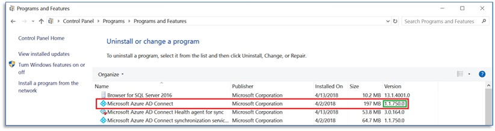

# Azure Active Directory Connect FAQ

## General installation

**Q: How can I harden my Azure AD Connect server to decrease the security attack surface?**

Microsoft recommends hardening your Azure AD Connect server to decrease the security attack surface for this critical component of your IT environment.  Following the recommendations below will decrease the security risks to your organization.

* Deploy Azure AD Connect on a domain joined server and restrict administrative access to domain administrators or other tightly controlled security groups

To learn more, see: 

* [Securing administrators groups](https://docs.microsoft.com/windows-server/identity/ad-ds/plan/security-best-practices/appendix-g--securing-administrators-groups-in-active-directory)

* [Securing built-in administrator accounts](https://docs.microsoft.com/windows-server/identity/ad-ds/plan/security-best-practices/appendix-d--securing-built-in-administrator-accounts-in-active-directory)

* [Security improvement and sustainment by reducing attack surfaces](https://docs.microsoft.com/windows-server/identity/securing-privileged-access/securing-privileged-access#2-reduce-attack-surfaces )

* [Reducing the Active Directory attack surface](https://docs.microsoft.com/windows-server/identity/ad-ds/plan/security-best-practices/reducing-the-active-directory-attack-surface)

**Q: Will installation work if the Azure Active Directory (Azure AD) Global Admin has two-factor authentication (2FA) enabled?**  
As of the February 2016 builds, this scenario is supported.

**Q: Is there a way to install Azure AD Connect unattended?**  
Azure AD Connect installation is supported only when you use the installation wizard. An unattended, silent installation is not supported.

**Q: I have a forest where one domain cannot be contacted. How do I install Azure AD Connect?**  
As of the February 2016 builds, this scenario is supported.

**Q: Does the Azure Active Directory Domain Services (Azure AD DS) health agent work on server core?**  
Yes. After you install the agent, you can complete the registration process by using the following PowerShell cmdlet: 

`Register-AzureADConnectHealthADDSAgent -Credentials $cred`

**Q: Does Azure AD Connect support syncing from two domains to an Azure AD?**  
Yes, this scenario is supported. Refer to [Multiple Domains](how-to-connect-install-multiple-domains.md).
 
**Q: Can you have multiple connectors for the same Active Directory domain in Azure AD Connect?**  
No, multiple connectors for the same AD domain are not supported. 

**Q: Can I move the Azure AD Connect database from the local database to a remote SQL Server instance?**   
Yes, the following steps provide general guidance on how to do this. We are currently working on a more detailed document.
1. Back up the LocalDB ADSync database.
The simplest way to do this is to use SQL Server Management Studio installed on the same machine as Azure AD Connect. Connect to *(LocalDb).\ADSync*, and then back up the ADSync database.

2. Restore the ADSync database to your remote SQL Server instance.

3. Install Azure AD Connect against the existing [remote SQL database](how-to-connect-install-existing-database.md).
   The article demonstrates how to migrate to using a local SQL database. If you are migrating to using a remote SQL database, in step 5 of the process you must also enter an existing service account that the Windows Sync service will run as. This sync engine service account is described here:
   
      **Use an existing service account**: By default, Azure AD Connect uses a virtual service account for the synchronization services to use. If you use a remote SQL Server instance or use a proxy that requires authentication, use a managed service account or a service account in the domain, and know the password. In those cases, enter the account to use. Make sure that users who are running the installation are system administrators in SQL so that login credentials for the service account can be created. For more information, see [Azure AD Connect accounts and permissions](reference-connect-accounts-permissions.md#adsync-service-account). 
   
      With the latest build, provisioning the database can now be performed out of band by the SQL administrator and then installed by the Azure AD Connect administrator with database owner rights. For more information, see [Install Azure AD Connect by using SQL delegated administrator permissions](how-to-connect-install-sql-delegation.md).

To keep things simple, we recommend that users who install Azure AD Connect be system administrators in SQL. However, with recent builds you can now use delegated SQL administrators, as described in [Install Azure AD Connect using SQL delegated administrator permissions](how-to-connect-install-sql-delegation.md).

**Q: What are some of the best practices from the field?**  

The following is an informational document that presents some of the best practices that engineering, support and our consultants have developed over the years.  This is presented in a bullet list that can be quickly referenced.  Although this list attempts to be comprehensive, there may be additional best practices that might not have made it on the list yet.

- If using Full SQL then it should remain local vs. remote
    - Fewer hops
    - Easier to troubleshoot
    - Less complexity
    - Need to designate resources to SQL and allow overhead for Azure AD Connect and OS
- Bypass Proxy if at all possible, if you are unable to bypass the proxy then you need to ensure that the timeout value is greater than 5 minutes.
- If proxy is required then you must add the proxy to the machine.config file
- Be aware of local SQL jobs and maintenance and how they will impact Azure AD Connect - particularly re-indexing
- Ensure than DNS can resolve externally
- Ensure that [server specifications](how-to-connect-install-prerequisites.md#hardware-requirements-for-azure-ad-connect) are per recommendation whether you are using physical or virtual servers
- Ensure that if you are using a virtual server that resources required are dedicated
- Ensure that you have the disk and disk configuration meet Best Practices for SQL Server
- Install and configure Azure AD Connect Health for monitoring
- Use the Delete Threshold that is built into Azure AD Connect.
- Carefully review release updates to be prepared for all changes and new attributes that may be added
- Backup everything
    - Backup Keys
    - Backup Synchronization Rules
    - Backup Server Configuration
    - Backup SQL Database
- Ensure that there are no 3rd party backup agents that are backing up SQL without the SQL VSS Writer (common in virtual servers with 3rd party snapshots)
- Limit the amount of custom synchronization rules that are used as they add complexity
- Treat Azure AD Connect Servers as Tier 0 Servers
- Be leery of modifying  cloud synchronization rules without great understanding of the impact and the right business drivers
- Make sure that the correct URL's and Firewall ports are open for support of Azure AD Connect and Azure AD Connect Health
- Leverage the cloud filtered attribute to troubleshoot and prevent phantom objects
- With the Staging Server ensure that you are using the Azure AD Connect Configuration Documenter for consistency between servers
- Staging Servers should be in separate datacenters (Physical Locations
- Staging servers are not meant to be a High Availability solution, but you can have multiple staging servers
- Introducing a "Lag" Staging Servers could mitigate some potential downtime in case of error
- Test and Validate all upgrades on the Staging Server first
- Always validate exports before switching over to the staging server.  Leverage the staging server for Full Imports and Full Synchronizations to reduce business impact
- Keep version consistency between Azure AD Connect Servers as much as possible 

**Q: Can I allow Azure AD Connect to create the Azure AD Connector account on Workgroup machine?**
No.  In order to allow Azure AD Connect to auto-create the Azure AD Connector account, the machine must be domain-joined.  

## Network
**Q: I have a firewall, network device, or something else that limits the time that connections can stay open on my network. What should my client-side timeout threshold be when I use Azure AD Connect?**  
All networking software, physical devices, or anything else that limits the maximum time that connections can remain open should use a threshold of at least five minutes (300 seconds) for connectivity between the server where the Azure AD Connect client is installed and Azure Active Directory. This recommendation also applies to all previously released Microsoft Identity synchronization tools.

**Q: Are single label domains (SLDs) supported?**  
While we strongly recommend against this network configuration ([see article](https://support.microsoft.com/help/2269810/microsoft-support-for-single-label-domains)), using Azure AD Connect sync with a single label domain is supported, as long as the network configuration for the single level domain is functioning correctly.

**Q: Are Forests with disjoint AD domains supported?**  
No, Azure AD Connect does not support on-premises forests that contain disjoint namespaces.

**Q: Are "dotted" NetBIOS names supported?**  
No, Azure AD Connect does not support on-premises forests or domains where the NetBIOS name contains a dot (.).

**Q: Is pure IPv6 environment supported?**  
No, Azure AD Connect does not support a pure IPv6 environment.

**Q:I have a multi-forest environment and the network between the two forests is using NAT (Network Address Translation). Is using Azure AD Connect between these two forests supported?** 
No, using Azure AD Connect over NAT is not supported. 

## Federation
**Q: What do I do if I receive an email that asks me to renew my Office 365 certificate?**  
For guidance about renewing the certificate, see [renew certificates](how-to-connect-fed-o365-certs.md).

**Q: I have "Automatically update relying party" set for the Office 365 relying party. Do I have to take any action when my token signing certificate automatically rolls over?**  
Use the guidance that's outlined in the article [renew certificates](how-to-connect-fed-o365-certs.md).

## Environment
**Q: Is it supported to rename the server after Azure AD Connect has been installed?**  
No. Changing the server name renders the sync engine unable to connect to the SQL database instance, and the service cannot start.

**Q: Are Next Generation Cryptographic (NGC) sync rules supported on a FIPS-enabled machine?**  
No.  They are not supported.

**Q. If I disabled a synced device (for example: HAADJ) in the Azure portal, why it is re-enabled?** 
Synced devices might be authored or mastered on premises. If a synced device is enabled on premises, it might be re-enabled in the Azure portal even if was previously disabled by an administrator. To disable a synced device, use the on-premises Active Directory to disable the computer account.

**Q. If I block user sign-in at the Office 365 or Azure AD portal for synced users, why it is unblocked upon signing in again?** 
Synced users might be authored or mastered on premises. If the account is enabled on premises, it can unblock the sign-in block placed by administrator.

## Identity data
**Q: Why doesn't the userPrincipalName (UPN) attribute in Azure AD match the on-premises UPN?**  
For information, see these articles:

* [Usernames in Office 365, Azure, or Intune don't match the on-premises UPN or alternate login ID](https://support.microsoft.com/kb/2523192)
* [Changes aren't synced by the Azure Active Directory sync tool after you change the UPN of a user account to use a different federated domain](https://support.microsoft.com/kb/2669550)

You can also configure Azure AD to allow the sync engine to update the UPN, as described in [Azure AD Connect sync service features](how-to-connect-syncservice-features.md).

**Q: Is it supported to soft-match an on-premises Azure AD group or contact object with an existing Azure AD group or contact object?**  
Yes, this soft match is based on the proxyAddress. Soft matching is not supported for groups that are not mail-enabled.

**Q: Is it supported to manually set the ImmutableId attribute on an existing Azure AD group or contact object to hard-match it to an on-premises Azure AD group or contact object?**  
No, manually setting the ImmutableId attribute on an existing Azure AD group or contact object to hard-match it is currently not supported.

## Custom configuration
**Q: Where are the PowerShell cmdlets for Azure AD Connect documented?**  
With the exception of the cmdlets that are documented on this site, other PowerShell cmdlets found in Azure AD Connect are not supported for customer use.

**Q: Can I use the "Server export/server import" option that's found in Synchronization Service Manager to move the configuration between servers?**  
No. This option does not retrieve all configuration settings, and it should not be used. Instead, use the wizard to create the base configuration on the second server, and use the sync rule editor to generate PowerShell scripts to move any custom rule between servers. For more information, see [Swing migration](how-to-upgrade-previous-version.md#swing-migration).

**Q: Can passwords be cached for the Azure sign-in page, and can this caching be prevented because it contains a password input element with the *autocomplete = "false"* attribute?**  
Currently, modifying the HTML attributes of the **Password** field, including the autocomplete tag, is not supported. We are currently working on a feature that allows for custom JavaScript, which lets you add any attribute to the **Password** field.

**Q: The Azure sign-in page displays the usernames of users who have previously signed in successfully. Can this behavior be turned off?**  
Currently, modifying the HTML attributes of the **Password** input field, including the autocomplete tag, is not supported. We are currently working on a feature that allows for custom JavaScript, which lets you add any attribute to the **Password** field.

**Q: Is there a way to prevent concurrent sessions?**  
No.

## Auto upgrade

**Q: What are the advantages and consequences of using auto upgrade?**  
We are advising all customers to enable auto upgrade for their Azure AD Connect installation. The benefit is that you always receive the latest patches, including security updates for vulnerabilities that have been found in Azure AD Connect. The upgrade process is painless and happens automatically as soon as a new version is available. Many thousands of Azure AD Connect customers use auto upgrade with every new release.

The auto-upgrade process always first establishes whether an installation is eligible for auto upgrade. If it is eligible, the upgrade is performed and tested. The process also includes looking for custom changes to rules and specific environmental factors. If the tests show that an upgrade is unsuccessful, the previous version is automatically restored.

Depending on the size of the environment, the process can take a couple of hours. While the upgrade is in progress, no sync between Windows Server Active Directory and Azure AD happens.

**Q: I received an email telling me that my auto upgrade no longer works and I need to install a new version. Why do I need to do this?**  
Last year, we released a version of Azure AD Connect that, under certain circumstances, might have disabled the auto-upgrade feature on your server. We have fixed the issue in Azure AD Connect version 1.1.750.0. If you have been affected by the issue, you can mitigate it by running a PowerShell script to repair it or by manually upgrading to the latest version of Azure AD Connect. 

To run the PowerShell script, [download the script](https://aka.ms/repairaadconnect) and run it on your Azure AD Connect server in an administrative PowerShell window. To learn how to run the script, [view this short video](https://aka.ms/repairaadcau).

To manually upgrade, you must download and run the latest version of the AADConnect.msi file.
 
-  If your current version is older than 1.1.750.0, [download and upgrade to the latest version](https://www.microsoft.com/download/details.aspx?id=47594).
- If your Azure AD Connect version is 1.1.750.0 or later, no further action is required. You’re already using the version that contains the auto-upgrade fix. 

**Q: I received an email telling me to upgrade to the latest version to re-enable auto upgrade. I am using version 1.1.654.0. Do I need to upgrade?**  
Yes, you need to upgrade to version 1.1.750.0 or later to re-enable auto upgrade. [Download and upgrade to the latest version](https://www.microsoft.com/download/details.aspx?id=47594).

**Q: I received an email telling me to upgrade to the latest version to re-enable auto upgrade. If I have used PowerShell to enable auto upgrade, do I still need to install the latest version?**  
Yes, you still need to upgrade to version 1.1.750.0 or later. Enabling the auto-upgrade service with PowerShell does not mitigate the auto-upgrade issue found in versions before 1.1.750.0.

**Q: I want to upgrade to a newer version but I’m not sure who installed Azure AD Connect, and we do not have the username and password. Do we need this?**
You don’t need to know the username and password that was initially used to upgrade Azure AD Connect. Use any Azure AD account that has the Global Administrator role.

**Q: How can I find which version of Azure AD Connect I am using?**  
To verify which version of Azure AD Connect is installed on your server, go to Control Panel and look up the installed version of Microsoft Azure AD Connect by selecting **Programs** > **Programs and Features**, as shown here:

**Q: How do I upgrade to the latest version of Azure AD Connect?**  
To learn how to upgrade to the latest version, see [Azure AD Connect: Upgrade from a previous version to the latest](how-to-upgrade-previous-version.md). 

**Q: We already upgraded to the latest version of Azure AD Connect last year. Do we need to upgrade again?**  
The Azure AD Connect team makes frequent updates to the service. To benefit from bug fixes and security updates as well as new features, it is important to keep your server up to date with the latest version. If you enable auto upgrade, your software version is updated automatically. To find the version release history of Azure AD Connect, see [Azure AD Connect: Version release history](reference-connect-version-history.md).

**Q: How long does it take to perform the upgrade, and what is the impact on my users?**  
The time needed to upgrade depends on your tenant size. For larger organizations, it might be best to perform the upgrade in the evening or weekend. During the upgrade, no synchronization activity takes place.

**Q: I believe I upgraded to Azure AD Connect, but the Office portal still mentions DirSync. Why is this?**  
The Office team is working to get the Office portal updates to reflect the current product name. It does not reflect which sync tool you are using.

**Q: My auto-upgrade status says, “Suspended." Why is it suspended? Should I enable it?**  
A bug was introduced in a previous version that, under certain circumstances, leaves the auto-upgrade status set to “Suspended.” Manually enabling it is technically possible but would require several complex steps. The best thing you can do is install the latest version of Azure AD Connect.

**Q: My company has strict change-management requirements, and I want to control when it’s pushed out. Can I control when auto upgrade is launched?**  
No, there is no such feature today. The feature is being evaluated for a future release.

**Q: Will I get an email if the auto upgrade failed? How will I know that it was successful?**  
You will not be notified of the result of the upgrade. The feature is being evaluated for a future release.

**Q: Do you publish a timeline for when you plan to push out auto upgrades?**  
Auto upgrade is the first step in the release process of a newer version. Whenever there is a new release, upgrades are pushed automatically. Newer versions of Azure AD Connect are pre-announced in the [Azure AD Roadmap](../fundamentals/whats-new.md).

**Q: Does auto upgrade also upgrade Azure AD Connect Health?**  
Yes, auto upgrade also upgrades Azure AD Connect Health.

**Q: Do you also auto-upgrade Azure AD Connect servers in staging mode?**  
Yes, you can auto-upgrade an Azure AD Connect server that is in staging mode.

**Q: If auto upgrade fails and my Azure AD Connect server does not start, what should I do?**  
In rare cases, the Azure AD Connect service does not start after you perform the upgrade. In these cases, rebooting the server usually fixes the issue. If the Azure AD Connect service still does not start, open a support ticket. For more information, see [Create a service request to contact Office 365 support](https://blogs.technet.microsoft.com/praveenkumar/2013/07/17/how-to-create-service-requests-to-contact-office-365-support/). 

**Q: I’m not sure what the risks are when I upgrade to a newer version of Azure AD Connect. Can you call me to help me with the upgrade?**  
If you need help upgrading to a newer version of Azure AD Connect, open a support ticket at [Create a service request to contact Office 365 support](https://blogs.technet.microsoft.com/praveenkumar/2013/07/17/how-to-create-service-requests-to-contact-office-365-support/).

## Troubleshooting
**Q: How can I get help with Azure AD Connect?**

[Search the Microsoft Knowledge Base (KB)](https://www.microsoft.com/en-us/search/result.aspx?q=azure+active+directory+connect)

* Search the KB for technical solutions to common break-fix issues about support for Azure AD Connect.

[Microsoft Q&A question page for Azure Active Directory](https://docs.microsoft.com/answers/topics/azure-active-directory.html)

* Search for technical questions and answers or ask your own questions by going to [the Azure AD community](https://docs.microsoft.com/answers/topics/azure-active-directory.html).

[Get support for Azure AD](https://docs.microsoft.com/azure/active-directory/active-directory-troubleshooting-support-howto)

**Q: Why am I seeing Events 6311 and 6401 occur after Sync Step Errors?**

The events 6311 - **The server encountered an unexpected error while performing a callback** and 6401 - **The management agent controller encountered an unexpected error** - are always logged after a synchronization step error. To resolve these errors, you need to clean up the synchronization step errors.  For more information, see [Troubleshooting errors during synchronization](tshoot-connect-sync-errors.md) and [Troubleshoot object synchronization with Azure AD Connect sync](tshoot-connect-objectsync.md)
