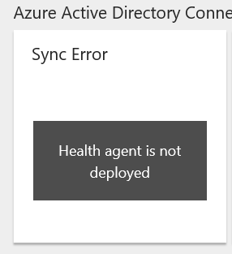
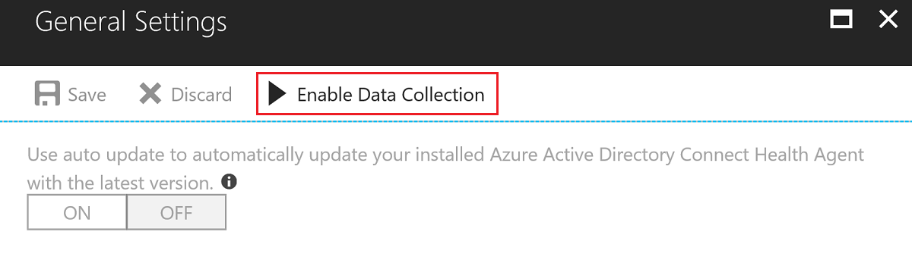

# User privacy and Azure AD Connect Health 

[!INCLUDE [Privacy](../../../includes/gdpr-intro-sentence.md)]

>[!NOTE] 
>This article deals with Azure AD Connect Health and user privacy.  For information on Azure AD Connect and user privacy see the article [here](reference-connect-user-privacy.md).

## User privacy classification
Azure AD Connect Health falls into the **data processor** category of GDPR classification. As a data processor pipeline, the service provides data processing services to key partners and end consumers. Azure AD Connect Health does not generate user data and has no independent control over what personal data is collected and how it is used. Data retrieval, aggregation, analysis, and reporting in Azure AD Connect Health are based on existing on-premises data. 

## Data retention policy
Azure AD Connect Health does not generate reports, perform analytics, or provide insights beyond 30 days. Therefore, Azure AD Connect Health does not store, process, or retain any data beyond 30 days. This design is compliant with the GDPR regulations, Microsoft privacy compliance regulations, and Azure AD data retention policies. 

Servers with active **Health service data is not up to date** **error** alerts for over 30 consecutive days suggest that no data has reached Connect Health during that time span. These servers will be disabled and not shown in Connect Health portal. To re-enable the servers, you must uninstall and [reinstall the health agent](how-to-connect-health-agent-install.md). 
Please note that this does not apply to **warnings** with the same alert type. Warnings indicate that partial data is missing from the server you are alerted for. 
 
## Disable data collection and monitoring in Azure AD Connect Health
Azure AD Connect Health enables you to stop data collection for each individual monitored server or for an instance of a monitored service. For example, you can stop data collection for individual ADFS (Active Directory Federation Services) servers that are monitored using Azure AD Connect Health. You can also stop data collection for the entire ADFS instance that is being monitored using Azure AD Connect Health. When you choose to do so, the corresponding servers are deleted from the Azure AD Connect Health portal, after stopping data collection. 

>[!IMPORTANT]
> You need either Azure AD Global Administrator privileges or the Contributor role in RBAC to delete monitored servers from Azure AD Connect Health.
>
> Removing a server or service instance from Azure AD Connect Health is not a reversible action. 

### What to expect?
If you stop data collection and monitoring for an individual monitored server or an instance of a monitored service, note the following:

- When you delete an instance of a monitored service, the instance is removed from the Azure AD Connect Health monitoring service list in the portal. 
- When you delete a monitored server or an instance of a monitored service, the Health Agent is NOT uninstalled or removed from your servers. The Health Agent is configured not to send data to Azure AD Connect Health. You need to manually uninstall the Health Agent on previously monitored servers.
- If you have not uninstalled the Health Agent before performing this step, you may see error events on the server(s) related to the Health Agent.
- All data belonging to the instance of the monitored service is deleted as per the Microsoft Azure Data Retention Policy.

### Disable data collection and monitoring for an instance of a monitored service
See [how to remove a service instance from Azure AD Connect Health](how-to-connect-health-operations.md#delete-a-service-instance-from-azure-ad-connect-health-service).

### Disable data collection and monitoring for a monitored server
See [how to remove a server from Azure AD Connect Health](how-to-connect-health-operations.md#delete-a-server-from-the-azure-ad-connect-health-service).

### Disable data collection and monitoring for all monitored services in Azure AD Connect Health
Azure AD Connect Health also provides the option to stop data collection of **all** registered services in the tenant. We recommend careful consideration and full acknowledgement of all global admins before taking the action. Once the process begins, Connect Health service will stop receiving, processing, and reporting any data of all your services. Existing data in Connect Health service will be retained for no more than 30 days.
If you want to stop data collection of specific server, please follow steps at deletion of specific servers. To stop tenant-wise data collection, follow the following steps to stop data collection and delete all services of the tenant.

1. Click on **General Settings** under configuration in the main blade. 
2. Click on **Stop Data Collection** button on the top of the blade. The other options of tenant configuration settings will be disabled once the process starts.  
 
   
  
3. Ensure the list of onboarded services which are affected by stopping data collections. 
4. Enter the exact tenant name to enable the **Delete** action button
5. Click on **Delete** to trigger the deletion of all services. Connect Health will stop receiving, processing, reporting any data sent from your onboarded services. The entire process of can take up to 24 hours. Notice that this step is not reversible. 
6. After the process is completed, you will not see any registered services in Connect Health any more. 

   

## Re-enable data collection and monitoring in Azure AD Connect Health
To re-enable monitoring in Azure AD Connect Health for a previously deleted monitored service, you must uninstall and [reinstall the health agent](how-to-connect-health-agent-install.md) on all the servers.

### Re-enable data collection and monitoring for all monitored services

Tenant-wise data collection can be resumed in Azure AD Connect Health. We recommend careful consideration and full acknowledgement of all global admins before taking the action.

>[!IMPORTANT]
> The following steps will be available after 24 hours of disable action.
> After enabling of data collection, the presented insight and monitoring data in Connect Health will not show any legacy data collected before. 

1. Click on **General Settings** under configuration in the main blade. 
2. Click on **Enable Data Collection** button on the top of the blade. 
 
   
 
3. Enter the exact tenant name to activate the **Enable** button.
4. Click on **Enable** button to grant permission of data collection in Connect Health service. The change will be applied shortly. 
5. Follow the [installation process](how-to-connect-health-agent-install.md) to reinstall the agent in the servers to be monitored and the services will be present in the portal.  

## Next steps
* [Review the Microsoft Privacy policy on Trust Center](https://www.microsoft.com/trustcenter)
* [Azure AD Connect and User Privacy](reference-connect-user-privacy.md)

