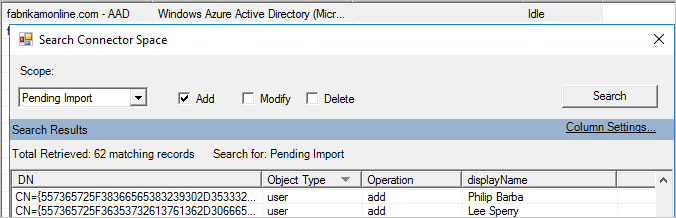
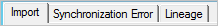
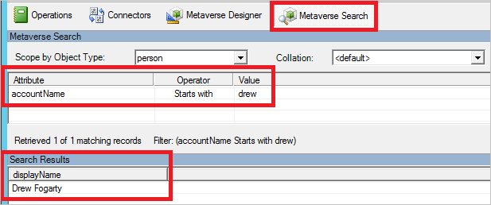
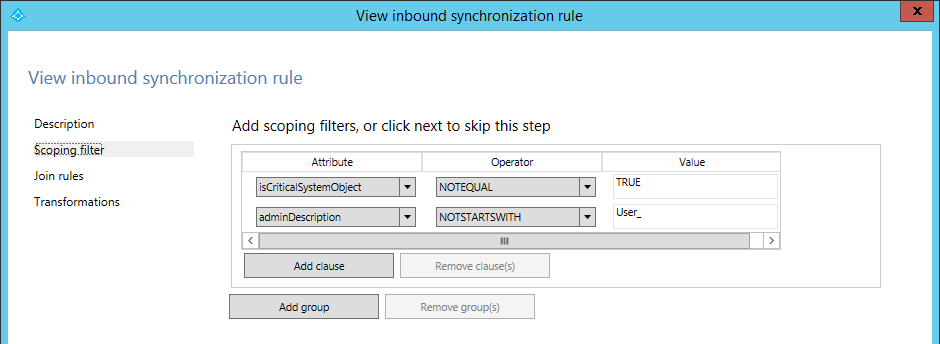
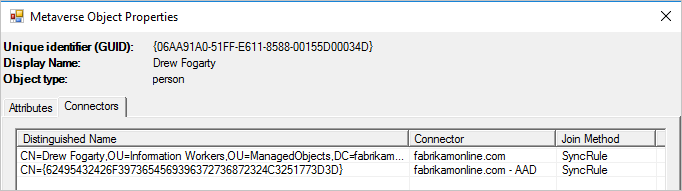

# Troubleshoot an object that is not synchronizing with Azure Active Directory

If an object is not syncing as expected with Microsoft Azure Active Directory (Azure AD), it can be because of several reasons. If you have received an error email from Azure AD or you see the error in Azure AD Connect Health, read [Troubleshooting errors during synchronization](tshoot-connect-sync-errors.md) instead. But if you are troubleshooting a problem where the object is not in Azure AD, this article is for you. It describes how to find errors in the on-premises component Azure AD Connect synchronization.

>[!IMPORTANT]
>For Azure AD Connect deployment with version 1.1.749.0 or higher, use the [troubleshooting task](tshoot-connect-objectsync.md) in the wizard to troubleshoot object syncing issues. 

## Synchronization process

Before we investigate syncing issues, let’s understand the Azure AD Connect syncing process:

  

### **Terminology**

* **CS:** Connector space, a table in a database
* **MV:** Metaverse, a table in a database

### **Synchronization steps**
The syncing process involves following steps:

1. **Import from AD:** Active Directory objects are brought into the Active Directory CS.

2. **Import from Azure AD:** Azure AD objects are brought into the Azure AD CS.

3. **Synchronization:** Inbound synchronization rules and outbound synchronization rules are run in the order of precedence number, from lower to higher. To view the synchronization rules, go to the Synchronization Rules Editor from the desktop applications. The inbound synchronization rules bring in data from CS to MV. The outbound synchronization rules move data from MV to CS.

4. **Export to AD:** After syncing, objects are exported from the Active Directory CS to Active Directory.

5. **Export to Azure AD:** After syncing, objects are exported from the Azure AD CS to Azure AD.

## Troubleshooting

To find the errors, look at a few different places, in the following order:

1. The [operation logs](#operations) to find errors identified by the synchronization engine during import and synchronization.
2. The [connector space](#connector-space-object-properties) to find missing objects and synchronization errors.
3. The [metaverse](#metaverse-object-properties) to find data-related problems.

Start [Synchronization Service Manager](how-to-connect-sync-service-manager-ui.md) before you begin these steps.

## Operations
The **Operations** tab in Synchronization Service Manager is where you should start your troubleshooting. This tab shows the results from the most recent operations. 

  

The top half of the **Operations** tab shows all runs in chronological order. By default, the operations log keeps information about the last seven days, but this setting can be changed with the [scheduler](how-to-connect-sync-feature-scheduler.md). Look for any run that does not show a **success** status. You can change the sorting by clicking the headers.

The **Status** column contains the most important information and shows the most severe problem for a run. Here's a quick summary of the most common statuses in order of investigation priority (where * indicates several possible error strings).

| Status | Comment |
| --- | --- |
| stopped-* |The run could not finish. This might happen, for example, if the remote system is down and cannot be contacted. |
| stopped-error-limit |There are more than 5,000 errors. The run was automatically stopped due to the large number of errors. |
| completed-\*-errors |The run finished, but there are errors (fewer than 5,000) that should be investigated. |
| completed-\*-warnings |The run finished, but some data is not in the expected state. If you have errors, this message is usually only a symptom. Don't investigate warnings until you have addressed errors. |
| success |No issues. |

When you select a row, the bottom of the **Operations** tab is updated to show the details of that run. On the far-left side of this area, you might have a list titled **Step #**. This list appears only if you have multiple domains in your forest and each domain is represented by a step. The domain name can be found under the heading **Partition**. Under the **Synchronization Statistics** heading, you can find more information about the number of changes that were processed. Select the links to get a list of the changed objects. If you have objects with errors, those errors show up under the **Synchronization Errors** heading.

### Errors on the Operations tab
When you have errors, Synchronization Service Manager shows both the object in error and the error itself as links that provide more information.

  
Start by selecting the error string. (In the preceding figure, the error string is **sync-rule-error-function-triggered**.) You are first presented with an overview of the object. To see the actual error, select **Stack Trace**. This trace provides debug-level information for the error.

Right-click the **Call Stack Information** box, click **Select All**, and then select **Copy**. Then copy the stack and look at the error in your favorite editor, such as Notepad.

If the error is from **SyncRulesEngine**, the call stack information first lists all attributes on the object. Scroll down until you see the heading **InnerException =>**.  

  
  
The line after the heading shows the error. In the preceding figure, the error is from a custom synchronization rule that Fabrikam created.

If the error does not give enough information, it's time to look at the data itself. Select the link with the object identifier and continue troubleshooting the [connector space imported object](#cs-import).

## Connector space object properties
If the [**Operations**](#operations) tab shows no errors, follow the connector space object from Active Directory to the metaverse to Azure AD. In this path, you should find where the problem is.

### Searching for an object in the CS

In Synchronization Service Manager, select **Connectors**, select the Active Directory Connector, and select **Search Connector Space**.

In the **Scope** box, select **RDN** when you want to search on the CN attribute, or select **DN or anchor** when you want to search on the **distinguishedName** attribute. Enter a value and select **Search**. 
 
  

If you don't find the object you're looking for, it might have been filtered with [domain-based filtering](how-to-connect-sync-configure-filtering.md#domain-based-filtering) or [OU-based filtering](how-to-connect-sync-configure-filtering.md#organizational-unitbased-filtering). To verify that the filtering is configured as expected, read [Azure AD Connect sync: Configure filtering](how-to-connect-sync-configure-filtering.md).

You can perform another useful search by selecting the Azure AD Connector. In the **Scope** box, select **Pending Import**, and then select the **Add** check box. This search gives you all synced objects in Azure AD that cannot be associated with an on-premises object.  

 
 
Those objects were created by another synchronization engine or a synchronization engine with a different filtering configuration. These orphan objects are no longer managed. Review this list and consider removing these objects by using the [Azure AD PowerShell](https://aka.ms/aadposh) cmdlets.

### CS import
When you open a CS object, there are several tabs at the top. The **Import** tab shows the data that is staged after an import.  

    

The **Old Value** column shows what currently is stored in Connect, and the **New Value** column shows what has been received from the source system and has not been applied yet. If there is an error on the object, changes are not processed.

The **Synchronization Error** tab is visible in the **Connector Space Object Properties** window only if there is a problem with the object. For more information, review how to [troubleshoot sync errors on the **Operations** tab](#errors-on-the-operations-tab).

  

### CS lineage
The **Lineage** tab in the **Connector Space Object Properties** window shows how the connector space object is related to the metaverse object. You can see when the connector last imported a change from the connected system and which rules applied to populate data in the metaverse.  

  

In the preceding figure, the **Action** column shows an inbound synchronization rule with the action **Provision**. That indicates that as long as this connector space object is present, the metaverse object remains. If the list of synchronization rules instead shows an outbound synchronization rule with a **Provision** action, this object is deleted when the metaverse object is deleted.  

  

In the preceding figure, you can also see in the **PasswordSync** column that the inbound connector space can contribute changes to the password since one synchronization rule has the value **True**. This password is sent to Azure AD through the outbound rule.

From the **Lineage** tab, you can get to the metaverse by selecting [**Metaverse Object Properties**](#mv-attributes).

### Preview
In the lower-left corner of the **Connector Space Object Properties** window is the **Preview** button. Select this button to open the **Preview** page, where you can sync a single object. This page is useful if you are troubleshooting some custom synchronization rules and want to see the effect of a change on a single object. You can select a **Full sync** or a **Delta sync**. You can also select **Generate Preview**, which only keeps the change in memory. Or select **Commit Preview**, which updates the metaverse and stages all changes to target connector spaces.  

  

In the preview you can inspect the object and see which rule applied for a particular attribute flow.  

### Log
Next to the **Preview** button, select the **Log** button to open the **Log** page. Here you can see the password sync status and history. For more information, see [Troubleshoot password hash synchronization with Azure AD Connect sync](tshoot-connect-password-hash-synchronization.md).

## Metaverse object properties
It's usually better to start searching from the source Active Directory connector space. But you can also start searching from the metaverse.

### Searching for an object in the MV
In Synchronization Service Manager, select **Metaverse Search**, as in the following figure. Create a query that you know finds the user. Search for common attributes, such as **accountName** (**sAMAccountName**) and **userPrincipalName**. For more information, see [Sync Service Manager Metaverse search](how-to-connect-sync-service-manager-ui-mvsearch.md).

  

In the **Search Results** window, click the object.

If you did not find the object, it has not yet reached the metaverse. Continue to search for the object in the Active Directory [connector space](#connector-space-object-properties). If you find the object in the Active Directory connector space, there could be a sync error that is blocking the object from coming to the metaverse, or a synchronization rule scoping filter might be applied.

### Object not found in the MV
If the object is in the Active Directory CS but not present in the MV, a scoping filter is applied. To look at the scoping filter, go to the desktop application menu and select **Synchronization Rules Editor**. Filter the rules applicable to the object by adjusting the filter below.

  

View each rule in the list from above and check the **Scoping filter**. In the following scoping filter, if the **isCriticalSystemObject** value is null or FALSE or empty, it's in scope.

  

Go to the [CS Import](#cs-import) attribute list and check which filter is blocking the object from moving to the MV. The **Connector Space** attribute list will show only non-null and non-empty attributes. For example, if **isCriticalSystemObject** doesn't show up in the list, the value of this attribute is null or empty.

### Object not found in the Azure AD CS
If the object is not present in the connector space of Azure AD but is present in the MV, look at the scoping filter of the outbound rules of the corresponding connector space, and find out if the object is filtered out because the [MV attributes](#mv-attributes) don't meet the criteria.

To look at the outbound scoping filter, select the applicable rules for the object by adjusting the filter below. View each rule and look at the corresponding [MV attribute](#mv-attributes) value.

  

### MV Attributes
On the **Attributes** tab, you can see the values and which connectors contributed them.  

  

If an object is not syncing, ask the following questions about attribute states in the metaverse:
- Is the attribute **cloudFiltered** present and set to **True**? If it is, it has been filtered according to the steps in [attribute-based filtering](how-to-connect-sync-configure-filtering.md#attribute-based-filtering).
- Is the attribute **sourceAnchor** present? If not, do you have an account-resource forest topology? If an object is identified as a linked mailbox (the attribute **msExchRecipientTypeDetails** has the value **2**), the **sourceAnchor** is contributed by the forest with an enabled Active Directory account. Make sure the master account has been imported and synced correctly. The master account must be listed among the [connectors](#mv-connectors) for the object.

### MV connectors
The **Connectors** tab shows all connector spaces that have a representation of the object. 
 
  

You should have a connector to:

- Each Active Directory forest the user is represented in. This representation can include **foreignSecurityPrincipals** and **Contact** objects.
- A connector in Azure AD.

If you're missing the connector to Azure AD, review the section on [MV attributes](#mv-attributes) to verify the criteria for provisioning to Azure AD.

From the **Connectors** tab you can also go to the [connector space object](#connector-space-object-properties). Select a row and click **Properties**.

## Next steps
- Learn more about [Azure AD Connect sync](how-to-connect-sync-whatis.md).
- Learn more about [hybrid identity](whatis-hybrid-identity.md).
