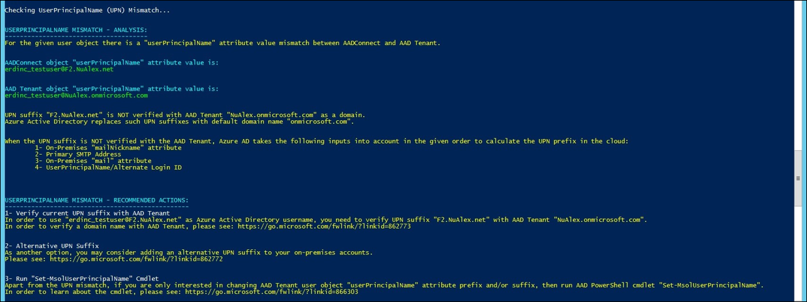
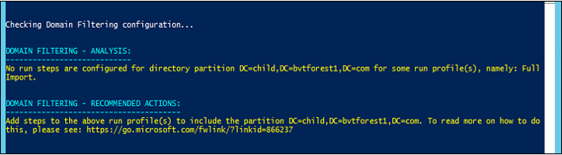

# Troubleshoot object synchronization with Azure AD Connect sync
This article provides steps for troubleshooting issues with object synchronization by using the troubleshooting task. To see how troubleshooting works in Azure Active Directory (Azure AD) Connect, watch [this short video](https://aka.ms/AADCTSVideo).

## Troubleshooting task
For Azure AD Connect deployment with version 1.1.749.0 or higher, use the troubleshooting task in the wizard to troubleshoot object synchronization issues. For earlier versions, please troubleshoot manually as described [here](tshoot-connect-object-not-syncing.md).

### Run the troubleshooting task in the wizard
To run the troubleshooting task in the wizard, perform the following steps:

1.	Open a new Windows PowerShell session on your Azure AD Connect server with the Run as Administrator option.
2.	Run `Set-ExecutionPolicy RemoteSigned` or `Set-ExecutionPolicy Unrestricted`.
3.	Start the Azure AD Connect wizard.
4.	Navigate to the Additional Tasks page, select Troubleshoot, and click Next.
5.	On the Troubleshooting page, click Launch to start the troubleshooting menu in PowerShell.
6.	In the main menu, select Troubleshoot Object Synchronization.

### Troubleshooting Input Parameters
The following input parameters are needed by the troubleshooting task:
1.	**Object Distinguished Name** – This is the distinguished name of the object that needs troubleshooting
2.	**AD Connector Name** – This is the name of the AD forest where the above object resides.
3.	Azure AD tenant global administrator credentials

### Understand the results of the troubleshooting task
The troubleshooting task performs the following checks:

1.	Detect UPN mismatch if the object is synced to Azure Active Directory
2.	Check if object is filtered due to domain filtering
3.	Check if object is filtered due to OU filtering
4.  Check if object synchronization is blocked due to a linked mailbox
5. Check if object is dynamic distribution group which is not supposed to be synchronized

The rest of this section describes specific results that are returned by the task. In each case, the task provides an analysis followed by recommended actions to resolve the issue.

## Detect UPN mismatch if object is synced to Azure Active Directory
### UPN Suffix is NOT verified with Azure AD Tenant
When UserPrincipalName (UPN)/Alternate Login ID suffix is not verified with the Azure AD Tenant, then Azure Active Directory replaces the UPN suffixes with the default domain name "onmicrosoft.com".

### Azure AD Tenant DirSync Feature ‘SynchronizeUpnForManagedUsers’ is disabled
When the Azure AD Tenant DirSync Feature ‘SynchronizeUpnForManagedUsers’ is disabled, Azure Active Directory does not allow synchronization updates to UserPrincipalName/Alternate Login ID for licensed user accounts with managed authentication.

## Object is filtered due to domain filtering
### Domain is not configured to sync
Object is out of scope due to domain not being configured. In the example below, the object is out of sync scope as the domain that it belongs to is filtered from synchronization.

### Domain is configured to sync but is missing run profiles/run steps
Object is out of scope as the domain is missing run profiles/run steps. In the example below, the object is out of sync scope as the domain that it belongs to is missing run steps for the Full Import run profile.

## Object is filtered due to OU filtering
The object is out of sync scope due to OU filtering configuration. In the example below, the object belongs to OU=NoSync,DC=bvtadwbackdc,DC=com.  This OU is not included in sync scope. 

## Linked Mailbox issue
A linked mailbox is supposed to be associated with an external master account located in another trusted account forest. If there is no such external master account, then Azure AD Connect will not synchronize the user account corresponds to the linked mailbox in the Exchange forest to the Azure AD tenant. 

## Dynamic Distribution Group issue
Due to various differences between on-premises Active Directory and Azure Active Directory, Azure AD Connect does not synchronize dynamic distribution groups to the Azure AD tenant.

## HTML Report
In addition to analyzing the object, the troubleshooting task also generates an HTML report that has everything known about the object. This HTML report can be shared with support team to do further troubleshooting, if needed.

## Next steps
Learn more about [Integrating your on-premises identities with Azure Active Directory](whatis-hybrid-identity.md).
