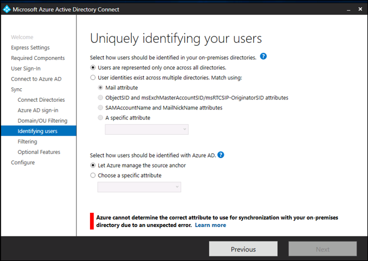
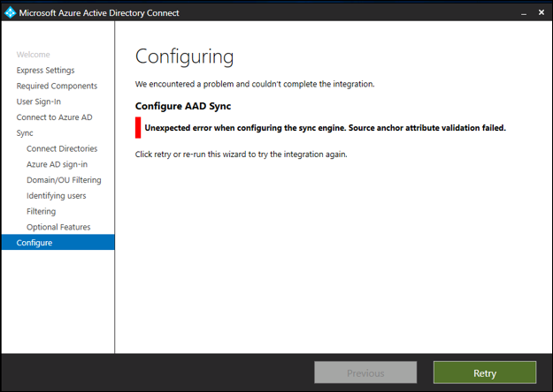

# Troubleshooting Source Anchor Issues during Installation
This article explains the different source anchor related issues that may occur during installation and offers ways to resolve these issues.

## Invalid Source Anchor in Azure Active Directory

### Custom Installation

During custom installation, Azure AD Connect reads the source anchor policy from Azure Active Directory. If the policy exists in Azure Active Directory, Azure AD Connect applies the same policy unless it is overridden by the customer. The wizard informs you which attribute has been read. Additionally, the wizard warns if you try to override the source anchor policy.

During this read operation, it is possible that the source anchor policy in Azure Active Directory is unexpected. In this case, Azure AD Connect does not know what the source anchor to use and needs manual override. 

To resolve this issue, you can manually override the source anchor by selecting a specific attribute. Proceed with this option if and only if you are certain of which attribute to select. If you are not certain, contact [Microsoft support](https://support.microsoft.com/contactus/) for guidance. If you change the source anchor policy, it can break the association between your on-premises users and their associated Azure resources. 

### Express Installation
During express installation, Azure AD Connect reads the source anchor policy from Azure Active Directory. If the policy exists in Azure Active Directory, Azure AD Connect applies the same policy. There is no option to do manual override.

During this read operation, it is possible that the source anchor policy in Azure Active Directory is unexpected. In this case, Azure AD Connect does not know what the source anchor should be. 

To resolve this issue, you need to re-install using the custom mode and manually override the source anchor by selecting a specific attribute. Proceed with this option if and only if you are certain of which attribute to select. If you are not certain, contact [Microsoft support](https://support.microsoft.com/contactus/) for guidance. If you change the source anchor policy, it can break the association between your on-premises users and their associated Azure resources.

### Invalid Source Anchor in Sync Engine
During installation, it is possible Azure AD Connect attempts to configure the sync engine using an invalid source anchor. This operation is most likely a product issue and the installation of Azure AD Connect will fail. Contact [Microsoft support](https://support.microsoft.com/contactus/) if you run in to this issue. 

## Next steps
Learn more about [Integrating your on-premises identities with Azure Active Directory](whatis-hybrid-identity.md).
