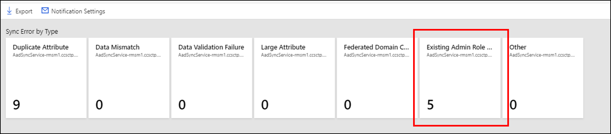

# Troubleshooting Errors during synchronization
Errors could occur when identity data is synchronized from Windows Server Active Directory (AD DS) to Azure Active Directory (Azure AD). This article provides an overview of different types of sync errors, some of the possible scenarios that cause those errors and potential ways to fix the errors. This article includes the common error types and may not cover all the possible errors.

 This article assumes the reader is familiar with the underlying [design concepts of Azure AD and Azure AD Connect](plan-connect-design-concepts.md).

With the latest version of Azure AD Connect \(August 2016 or higher\), a report of Synchronization Errors is available in the [Azure portal](https://aka.ms/aadconnecthealth) as part of Azure AD Connect Health for sync.

Starting September 1, 2016 [Azure Active Directory Duplicate Attribute Resiliency](how-to-connect-syncservice-duplicate-attribute-resiliency.md) feature will be enabled by default for all the *new* Azure Active Directory Tenants. This feature will be automatically enabled for existing tenants in the upcoming months.

Azure AD Connect performs three types of operations from the directories it keeps in sync: Import, Synchronization, and Export. Errors can take place in all the operations. This article mainly focuses on errors during Export to Azure AD.

## Errors during Export to Azure AD
Following section describes different types of synchronization errors that can occur during the export operation to Azure AD using the Azure AD connector. This connector can be identified by the name format being "contoso.*onmicrosoft.com*".
Errors during Export to Azure AD indicate that the operation \(add, update, delete etc.\) attempted by Azure AD Connect \(Sync Engine\) on Azure Active Directory failed.

## Data Mismatch Errors
### InvalidSoftMatch
#### Description
* When Azure AD Connect \(sync engine\) instructs Azure Active Directory to add or update objects, Azure AD matches the incoming object using the **sourceAnchor** attribute to the **immutableId** attribute of objects in Azure AD. This match is called a **Hard Match**.
* When Azure AD **does not find** any object that matches the **immutableId** attribute with the **sourceAnchor** attribute of the incoming object, before provisioning a new object, it falls back to use the ProxyAddresses and UserPrincipalName attributes to find a match. This match is called a **Soft Match**. The Soft Match is designed to match objects already present in Azure AD (that are sourced in Azure AD) with the new objects being added/updated during synchronization that represent the same entity (users, groups) on premises.
* **InvalidSoftMatch** error occurs when the hard match does not find any matching object **AND** soft match finds a matching object but that object has a different value of *immutableId* than the incoming object's *SourceAnchor*, suggesting that the matching object was synchronized with another object from on premises Active Directory.

In other words, in order for the soft match to work, the object to be soft-matched with should not have any value for the *immutableId*. If any object with *immutableId* set with a value is failing the hard-match but satisfying the soft-match criteria, the operation would result in an InvalidSoftMatch synchronization error.

Azure Active Directory schema does not allow two or more objects to have the same value of the following attributes. \(This is not an exhaustive list.\)

* ProxyAddresses
* UserPrincipalName
* onPremisesSecurityIdentifier
* ObjectId

> [!NOTE]
> [Azure AD Attribute Duplicate Attribute Resiliency](how-to-connect-syncservice-duplicate-attribute-resiliency.md) feature is also being rolled out as the default behavior of Azure Active Directory.  This will reduce the number of synchronization errors seen by Azure AD Connect (as well as other sync clients) by making Azure AD more resilient in the way it handles duplicated ProxyAddresses and UserPrincipalName attributes present in on premises AD environments. This feature does not fix the duplication errors. So the data still needs to be fixed. But it allows provisioning of new objects which are otherwise blocked from being provisioned due to duplicated values in Azure AD. This will also reduce the number of synchronization errors returned to the synchronization client.
> If this feature is enabled for your Tenant, you will not see the InvalidSoftMatch synchronization errors seen during provisioning of new objects.
>
>

#### Example Scenarios for InvalidSoftMatch
1. Two or more objects with the same value for the ProxyAddresses attribute exist in on-premises Active Directory. Only one is getting provisioned in Azure AD.
2. Two or more objects with the same value for the userPrincipalName attribute exists in on-premises Active Directory. Only one is getting provisioned in Azure AD.
3. An object was added in the on premises Active Directory with the same value of ProxyAddresses attribute as that of an existing object in Azure Active Directory. The object added on premises is not getting provisioned in Azure Active Directory.
4. An object was added in on premises Active Directory with the same value of userPrincipalName attribute as that of an account in Azure Active Directory. The object is not getting provisioned in Azure Active Directory.
5. A synced account was moved from Forest A to Forest B. Azure AD Connect (sync engine) was using ObjectGUID attribute to compute the SourceAnchor. After the forest move, the value of the SourceAnchor is different. The new object (from Forest B) is failing to sync with the existing object in Azure AD.
6. A synced object got accidentally deleted from on premises Active Directory and a new object was created in Active Directory for the same entity (such as user) without deleting the account in Azure Active Directory. The new account fails to sync with the existing Azure AD object.
7. Azure AD Connect was uninstalled and reinstalled. During the reinstallation, a different attribute was chosen as the SourceAnchor. All the objects that had previously synced stopped syncing with InvalidSoftMatch error.

#### Example case:
1. **Bob Smith** is a synced user in Azure Active Directory from on premises Active Directory of *contoso.com*
2. Bob Smith's **UserPrincipalName** is set as **bobs\@contoso.com**.
3. **"abcdefghijklmnopqrstuv=="** is the **SourceAnchor** calculated by Azure AD Connect using Bob Smith's **objectGUID** from on premises Active Directory, which is the **immutableId** for Bob Smith in Azure Active Directory.
4. Bob also has following values for the **proxyAddresses** attribute:
   * smtp: bobs@contoso.com
   * smtp: bob.smith@contoso.com
   * **smtp: bob\@contoso.com**
5. A new user, **Bob Taylor**, is added to the on premises Active Directory.
6. Bob Taylor's **UserPrincipalName** is set as **bobt\@contoso.com**.
7. **"abcdefghijkl0123456789==""** is the **sourceAnchor** calculated by Azure AD Connect using Bob Taylor's **objectGUID** from on premises Active Directory. Bob Taylor's object has NOT synced to Azure Active Directory yet.
8. Bob Taylor has the following values for the proxyAddresses attribute
   * smtp: bobt@contoso.com
   * smtp: bob.taylor@contoso.com
   * **smtp: bob\@contoso.com**
9. During sync, Azure AD Connect will recognize the addition of Bob Taylor in on premises Active Directory and ask Azure AD to make the same change.
10. Azure AD will first perform hard match. That is, it will search if there is any object with the immutableId equal to "abcdefghijkl0123456789==". Hard Match will fail as no other object in Azure AD will have that immutableId.
11. Azure AD will then attempt to soft-match Bob Taylor. That is, it will search if there is any object with proxyAddresses equal to the three values, including smtp: bob@contoso.com
12. Azure AD will find Bob Smith's object to match the soft-match criteria. But this object has the value of immutableId = "abcdefghijklmnopqrstuv==". which indicates this object was synced from another object from on premises Active Directory. Thus, Azure AD cannot soft-match these objects and results in an **InvalidSoftMatch** sync error.

#### How to fix InvalidSoftMatch error
The most common reason for the InvalidSoftMatch error is two objects with different SourceAnchor \(immutableId\) have the same value for the ProxyAddresses and/or UserPrincipalName attributes, which are used during the soft-match process on Azure AD. In order to fix the Invalid Soft Match

1. Identify the duplicated proxyAddresses, userPrincipalName, or other attribute value that's causing the error. Also identify which two \(or more\) objects are involved in the conflict. The report generated by [Azure AD Connect Health for sync](https://aka.ms/aadchsyncerrors) can help you identify the two objects.
2. Identify which object should continue to have the duplicated value and which object should not.
3. Remove the duplicated value from the object that should NOT have that value. You should make the change in the directory where the object is sourced from. In some cases, you may need to delete one of the objects in conflict.
4. If you made the change in the on premises AD, let Azure AD Connect sync the change.

Sync error reports within Azure AD Connect Health for sync are updated every 30 minutes and include the errors from the latest synchronization attempt.

> [!NOTE]
> ImmutableId, by definition, should not change in the lifetime of the object. If Azure AD Connect was not configured with some of the scenarios in mind from the above list, you could end up in a situation where Azure AD Connect calculates a different value of the SourceAnchor for the AD object that represents the same entity (same user/group/contact etc) that has an existing Azure AD Object that you wish to continue using.
>
>

#### Related Articles
* [Duplicate or invalid attributes prevent directory synchronization in Office 365](https://support.microsoft.com/kb/2647098)

### ObjectTypeMismatch
#### Description
When Azure AD attempts to soft match two objects, it is possible that two objects of different "object type" (such as User, Group, Contact etc.) have the same values for the attributes used to perform the soft match. As duplication of these attributes is not permitted in Azure AD, the operation can result in "ObjectTypeMismatch" synchronization error.

#### Example Scenarios for ObjectTypeMismatch error
* A mail enabled security group is created in Office 365. Admin adds a new user or contact in on premises AD (that's not synchronized to Azure AD yet) with the same value for the ProxyAddresses attribute as that of the Office 365 group.

#### Example case
1. Admin creates a new mail enabled security group in Office 365 for the Tax department and provides an email address as tax@contoso.com. This group  is assigned the ProxyAddresses attribute value of **smtp: tax\@contoso.com**
2. A new user joins Contoso.com and an account is created for the user on premises with the proxyAddress as **smtp: tax\@contoso.com**
3. When Azure AD Connect will sync the new user account, it will get the "ObjectTypeMismatch" error.

#### How to fix ObjectTypeMismatch error
The most common reason for the ObjectTypeMismatch error is two objects of different type (User, Group, Contact etc.) have the same value for the ProxyAddresses attribute. In order to fix the ObjectTypeMismatch:

1. Identify the duplicated proxyAddresses (or other attribute) value that's causing the error. Also identify which two \(or more\) objects are involved in the conflict. The report generated by [Azure AD Connect Health for sync](https://aka.ms/aadchsyncerrors) can help you identify the two objects.
2. Identify which object should continue to have the duplicated value and which object should not.
3. Remove the duplicated value from the object that should NOT have that value. Note that you should make the change in the directory where the object is sourced from. In some cases, you may need to delete one of the objects in conflict.
4. If you made the change in the on premises AD, let Azure AD Connect sync the change. Sync error report within Azure AD Connect Health for sync gets updated every 30 minutes and includes the errors from the latest synchronization attempt.

## Duplicate Attributes
### AttributeValueMustBeUnique
#### Description
Azure Active Directory schema does not allow two or more objects to have the same value of the following attributes. That is each object in Azure AD is forced to have a unique value of these attributes at a given instance.

* ProxyAddresses
* UserPrincipalName

If Azure AD Connect attempts to add a new object or update an existing object with a value for the above attributes that is already assigned to another object in Azure Active Directory, the operation results in the "AttributeValueMustBeUnique" sync error.

#### Possible Scenarios:
1. Duplicate value is assigned to an already synced object, which conflicts with another synced object.

#### Example case:
1. **Bob Smith** is a synced user in Azure Active Directory from on premises Active Directory of contoso.com
2. Bob Smith's **UserPrincipalName** on premises is set as **bobs\@contoso.com**.
3. Bob also has following values for the **proxyAddresses** attribute:
   * smtp: bobs@contoso.com
   * smtp: bob.smith@contoso.com
   * **smtp: bob\@contoso.com**
4. A new user, **Bob Taylor**, is added to the on premises Active Directory.
5. Bob Taylor's **UserPrincipalName** is set as **bobt\@contoso.com**.
6. **Bob Taylor** has the following values for the **ProxyAddresses** attribute
    i. smtp: bobt@contoso.com
    ii. smtp: bob.taylor@contoso.com
7. Bob Taylor's object is synchronized with Azure AD successfully.
8. Admin decided to update Bob Taylor's **ProxyAddresses** attribute with the following value:
    i. **smtp: bob\@contoso.com**
9. Azure AD will attempt to update Bob Taylor's object in Azure AD with the above value, but that operation will fail as that ProxyAddresses value is already assigned to Bob Smith, resulting in "AttributeValueMustBeUnique" error.

#### How to fix AttributeValueMustBeUnique error
The most common reason for the AttributeValueMustBeUnique error is two objects with different SourceAnchor \(immutableId\) have the same value for the ProxyAddresses and/or UserPrincipalName attributes. In order to fix AttributeValueMustBeUnique error

1. Identify the duplicated proxyAddresses, userPrincipalName or other attribute value that's causing the error. Also identify which two \(or more\) objects are involved in the conflict. The report generated by [Azure AD Connect Health for sync](https://aka.ms/aadchsyncerrors) can help you identify the two objects.
2. Identify which object should continue to have the duplicated value and which object should not.
3. Remove the duplicated value from the object that should NOT have that value. Note that you should make the change in the directory where the object is sourced from. In some cases, you may need to delete one of the objects in conflict.
4. If you made the change in the on premises AD, let Azure AD Connect sync the change for the error to get fixed.

#### Related Articles
-[Duplicate or invalid attributes prevent directory synchronization in Office 365](https://support.microsoft.com/kb/2647098)

## Data Validation Failures
### IdentityDataValidationFailed
#### Description
Azure Active Directory enforces various restrictions on the data itself before allowing that data to be written into the directory. These restrictions are to ensure that end users get the best possible experiences while using the applications that depend on this data.

#### Scenarios
a. The UserPrincipalName attribute value has invalid/unsupported characters.
b. The UserPrincipalName attribute does not follow the required format.

#### How to fix IdentityDataValidationFailed error
a. Ensure that the userPrincipalName attribute has supported characters and required format.

#### Related Articles
* [Prepare to provision users through directory synchronization to Office 365](https://support.office.com/article/Prepare-to-provision-users-through-directory-synchronization-to-Office-365-01920974-9e6f-4331-a370-13aea4e82b3e)

### FederatedDomainChangeError
#### Description
This case results in a **"FederatedDomainChangeError"** sync error when the suffix of a user's UserPrincipalName is changed from one federated domain to another federated domain.

#### Scenarios
For a synchronized user, the UserPrincipalName suffix was changed from one federated domain to another federated domain on premises. For example, *UserPrincipalName = bob\@contoso.com* was changed to *UserPrincipalName = bob\@fabrikam.com*.

#### Example
1. Bob Smith, an account for Contoso.com, gets added as a new user in Active Directory with the UserPrincipalName bob@contoso.com
2. Bob moves to a different division of Contoso.com called Fabrikam.com and their UserPrincipalName is changed to bob@fabrikam.com
3. Both contoso.com and fabrikam.com domains are federated domains with Azure Active Directory.
4. Bob's userPrincipalName does not get updated and results in a "FederatedDomainChangeError" sync error.

#### How to fix
If a user's UserPrincipalName suffix was updated from bob@**contoso.com** to bob\@**fabrikam.com**, where both **contoso.com** and **fabrikam.com** are **federated domains**, then follow these steps to fix the sync error

1. Update the user's UserPrincipalName in Azure AD from bob@contoso.com to bob@contoso.onmicrosoft.com. You can use the following PowerShell command with the Azure AD PowerShell Module:
   `Set-MsolUserPrincipalName -UserPrincipalName bob@contoso.com -NewUserPrincipalName bob@contoso.onmicrosoft.com`
2. Allow the next sync cycle to attempt synchronization. This time synchronization will be successful and it will update the UserPrincipalName of Bob to bob@fabrikam.com as expected.

#### Related Articles
* [Changes aren't synced by the Azure Active Directory Sync tool after you change the UPN of a user account to use a different federated domain](https://support.microsoft.com/help/2669550/changes-aren-t-synced-by-the-azure-active-directory-sync-tool-after-you-change-the-upn-of-a-user-account-to-use-a-different-federated-domain)

## LargeObject
### Description
When an attribute exceeds the allowed size limit, length limit or count limit set by Azure Active Directory schema, the synchronization operation results in the **LargeObject** or **ExceededAllowedLength** sync error. Typically this error occurs for the following attributes

* userCertificate
* userSMIMECertificate
* thumbnailPhoto
* proxyAddresses

### Possible Scenarios
1. Bob's userCertificate attribute is storing too many certificates assigned to Bob. These may include older, expired certificates. The hard limit is 15 certificates. For more information on how to handle LargeObject errors with userCertificate attribute, please refer to article [Handling LargeObject errors caused by userCertificate attribute](tshoot-connect-largeobjecterror-usercertificate.md).
2. Bob's userSMIMECertificate attribute is storing too many certificates assigned to Bob. These may include older, expired certificates. The hard limit is 15 certificates.
3. Bob's thumbnailPhoto set in Active Directory is too large to be synced in Azure AD.
4. During automatic population of the ProxyAddresses attribute in Active Directory, an object has too many ProxyAddresses assigned.

### How to fix
1. Ensure that the attribute causing the error is within the allowed limitation.

## Existing Admin Role Conflict

### Description
An **Existing Admin Role Conflict** will occur on a user object during synchronization when that user object has:

- administrative permissions and
- the same UserPrincipalName as an existing Azure AD object

Azure AD Connect is not allowed to soft match a user object from on-premises AD with a user object in Azure AD that has an administrative role assigned to it.  For more information see [Azure AD UserPrincipalName population](plan-connect-userprincipalname.md)

### How to fix
To resolve this issue do the following:

1. Remove the Azure AD account (owner) from all admin roles. 
2. **Hard Delete** the Quarantined object in the cloud. 
3. The next sync cycle will take care of soft-matching the on-premises user to the cloud account (since the cloud user is now no longer a global GA). 
4. Restore the role memberships for the owner. 

>[!NOTE]
>You can assign the administrative role to the existing user object again after the soft match between the on-premises user object and the Azure AD user object has completed.

## Related links
* [Locate Active Directory Objects in Active Directory Administrative Center](https://technet.microsoft.com/library/dd560661.aspx)
* [How to query Azure Active Directory for an object using Azure Active Directory PowerShell](https://msdn.microsoft.com/library/azure/jj151815.aspx)
