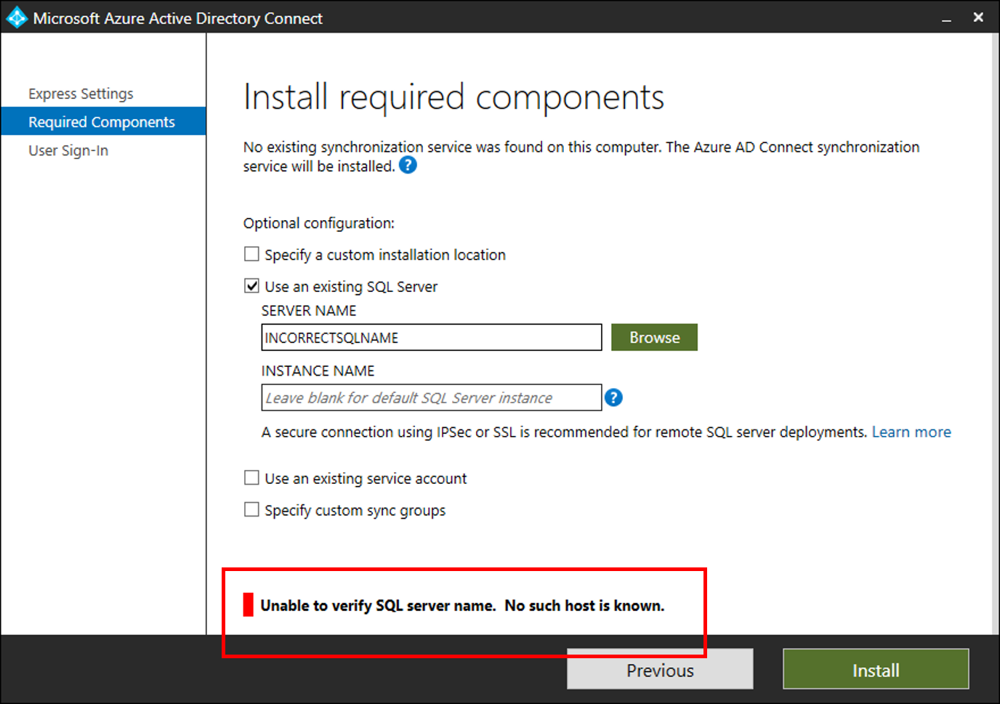

# Troubleshoot SQL connectivity issues with Azure AD Connect
This article explains how to troubleshoot connectivity issues between Azure AD Connect and SQL Server. 

The following screenshot shows a typical error, if the SQL Server cannot be found.



## Troubleshooting steps
Open a powershell window and Import the ADSyncTools Powershell module

``` powershell
Import-Module "C:\Program Files\Microsoft Azure Active Directory Connect\Tools\AdSyncTools.psm1" 
```

>[!NOTE]
>Install-Module requires updating to [PowerShell 5.0 (WMF 5.0)](https://www.microsoft.com/download/details.aspx?id=50395) or later;  
Or install [PackageManagement PowerShell Modules Preview - March 2016 for PowerShell 3.0/4.0](https://www.microsoft.com/download/details.aspx?id=51451) 

- **Show all commands**: `Get-Command -Module AdSyncTools` 
- **Execute the powershell function**: `Connect-ADSyncDatabase` with the following parameters
    - Server. The SQL Server name.
    - Instance. (Optional) The SQL Server Instance name and optionally Port number, that you would like to use. Do not specify this parameter to use the default instance.
    - UserName. (Optional) The user account to connect with. If left blank the currently logged in user will be used. If you are connecting to a remote SQL Server this should be the custom service account you have created for Azure ADConnect SQL Connectivity. Azure AD Connect uses the Azure AD Connect sync service account as to authenticate to a remote SQL server.
    - Password. (Optional) Password for the UserName provided.

This powershell function will attempt to bind to the specified SQL Server and Instance using the credentials passed in OR use the credentials of the current user. If the SQL Server cannot be found the script will attempt to connect to the SQL Browser service to determine enabled protocols and ports.

Example using just a Server name:
```
PS C:\Program Files\Microsoft Azure Active Directory Connect\Tools> import-module .\AdSyncTools.psm1

PS C:\Program Files\Microsoft Azure Active Directory Connect\Tools> Connect-AdSyncDatabase -Server SQL1
Resolving server address : SQL1
    InterNetworkV6 : fe80::6c90:a995:3e70:ef74%17
    InterNetworkV6 : 2001:4898:e0:66:6c90:a995:3e70:ef74
    InterNetwork : 10.91.26.143

Attempting to connect to SQL1 using a TCP binding for the default instance.
   Data Source=tcp:SQL1\;Integrated Security=True.ConnectionString
   Successfully connected.


StatisticsEnabled                : False
AccessToken                      : 
ConnectionString                 : Data Source=tcp:SQL1\;Integrated Security=True
ConnectionTimeout                : 15
Database                         : master
DataSource                       : tcp:SQL1\
PacketSize                       : 8000
ClientConnectionId               : 23e06ef2-0a38-4f5f-9291-da931de40375
ServerVersion                    : 13.00.4474
State                            : Open
WorkstationId                    : SQL1
Credential                       : 
FireInfoMessageEventOnUserErrors : False
Site                             : 
Container                        : 


PS C:\Program Files\Microsoft Azure Active Directory Connect\Tools> 
```

Example using an Instance and Port number that don’t exist:

```
PS C:\Program Files\Microsoft Azure Active Directory Connect\tools> Connect-AdSyncDatabase -Server SQL1 -Instance "INSTANCE1"
Resolving server address : SQL1
    InterNetworkV6 : fe80::6c90:a995:3e70:ef74%17
    InterNetworkV6 : 2001:4898:e0:66:6c90:a995:3e70:ef74
    InterNetwork : 10.91.26.143

Attempting to connect to SQL1\INSTANCE1 using a TCP binding.
   Data Source=tcp:SQL1\INSTANCE1;Integrated Security=True.ConnectionString
Connect-AdSyncDatabase : Unable to connect using a TCP binding.  A network-related or instance-specific error occurred while establishing a connection 
to SQL Server. The server was not found or was not accessible. Verify that the instance name is correct and that SQL Server is configured to allow 
remote connections. (provider: SQL Network Interfaces, error: 26 - Error Locating Server/Instance Specified)
At line:1 char:1
+ Connect-AdSyncDatabase -Server SQL1 -Instance "INSTANCE1"
+ ~~~~~~~~~~~~~~~~~~~~~~~~~~~~~~~~~~~~~~~~~~~~~~~~~~~~~~~~~~~~
    + CategoryInfo          : ConnectionError: (:) [Write-Error], WriteErrorException
    + FullyQualifiedErrorId : Microsoft.PowerShell.Commands.WriteErrorException,Connect-AdSyncDatabase
 

TROUBLESHOOTING: Attempting to query the SQL Server Browser service configuration on SQL1.
Get-ADSyncSQLBrowserInstances : Unable to read the SQL Server Browser configuration. An existing connection was forcibly closed by the remote host. 
Ensure port 1434 (UDP) is open on SQL1 and the SQL Server Browser service is running. 
At C:\Program Files\Microsoft Azure Active Directory Connect\tools\AdSyncTools.psm1:1717 char:18
+     $instances = Get-ADSyncSQLBrowserInstances $Server
+                  ~~~~~~~~~~~~~~~~~~~~~~~~~~~~~~~~~~~~~
    + CategoryInfo          : ConnectionError: (:) [Write-Error], WriteErrorException
    + FullyQualifiedErrorId : Microsoft.PowerShell.Commands.WriteErrorException,Get-ADSyncSQLBrowserInstances
 


WHAT TO TRY NEXT:

Each SQL instance must be bound to an explicit static TCP port and paired with an inbound firewall rule on SQL1 to allow connection. Enable the SQL Se
rver Browser service temporarily on the SQL server and run this cmdLet again to further troubleshoot the issue. Alternatively use the SQL Server Configur
ation Manager on SQL1 to verify the instance name and TCP/IP port assignment manually. 

You must specify both the instance name and the port to connect when the SQL Server Browser service is not running. An inbound firewall rule on SQL1 is required for the associated port.
	Example: 'MySQLInstance,1234' where 1234 has a matching firewall rule.

PS C:\Program Files\Microsoft Azure Active Directory Connect\tools> 
PS C:\Program Files\Microsoft Azure Active Directory Connect\tools> Connect-AdSyncDatabase -Server SQL1 -Instance "INSTANCE1,99"
Resolving server address : SQL1
    InterNetworkV6 : fe80::6c90:a995:3e70:ef74%17
    InterNetworkV6 : 2001:4898:e0:66:6c90:a995:3e70:ef74
    InterNetwork : 10.91.26.143

Attempting to connect to SQL1\INSTANCE1,99 using a TCP binding.
   Data Source=tcp:SQL1\INSTANCE1,99;Integrated Security=True.ConnectionString
Connect-AdSyncDatabase : Unable to connect using a TCP binding.  A network-related or instance-specific error occurred while establishing a connection 
to SQL Server. The server was not found or was not accessible. Verify that the instance name is correct and that SQL Server is configured to allow remote connections. (provider: TCP Provider, error: 0 - The remote computer refused the network connection.)
At line:1 char:1
+ Connect-AdSyncDatabase -Server SQL1 -Instance "INSTANCE1,99"
+ ~~~~~~~~~~~~~~~~~~~~~~~~~~~~~~~~~~~~~~~~~~~~~~~~~~~~~~~~~~~~~~~
    + CategoryInfo          : ConnectionError: (:) [Write-Error], WriteErrorException
    + FullyQualifiedErrorId : Microsoft.PowerShell.Commands.WriteErrorException,Connect-AdSyncDatabase
 

TROUBLESHOOTING: Attempting to query the SQL Server Browser service configuration on SQL1.
SQL browser response contained 2 instances.
Verifying protocol bindings and port connectivity.
MSSQLSERVER     : Enabled - port 1433 is assigned and reachable through the firewall
INSTANCE1       : Blocked - the inbound firewall rule for port 58379 is missing or disabled


WHAT TO TRY NEXT:

Each SQL instance must be bound to an explicit static TCP port and paired with an
inbound firewall rule on SQL1 to allow connection. Review the TcpStatus field
for each instance and take corrective action.


InstanceName : MSSQLSERVER
tcp          : 1433
TcpStatus    : Enabled - port 1433 is assigned and reachable through the firewall

InstanceName : INSTANCE1
tcp          : 58379
TcpStatus    : Blocked - the inbound firewall rule for port 58379 is missing or disabled


PS C:\Program Files\Microsoft Azure Active Directory Connect\tools>  
```

## Next Steps
- [Integrating your on-premises identities with Azure Active Directory](whatis-hybrid-identity.md)
-  [Azure AD connectivity with Azure AD Connect](tshoot-connect-connectivity.md)
