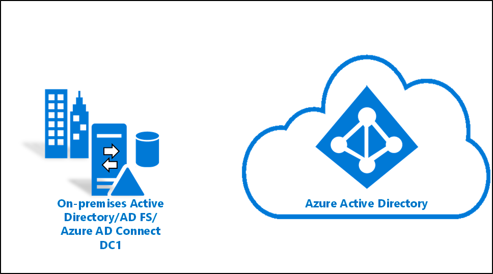
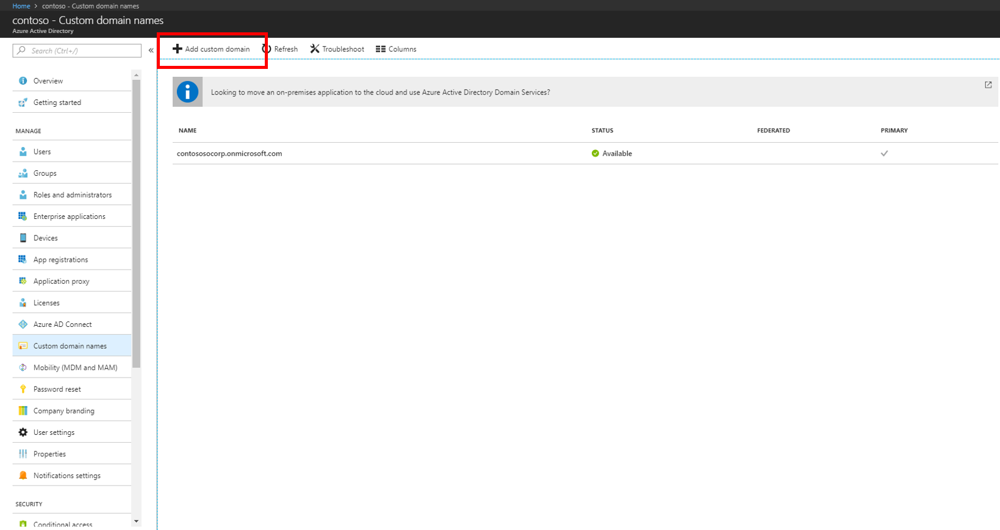
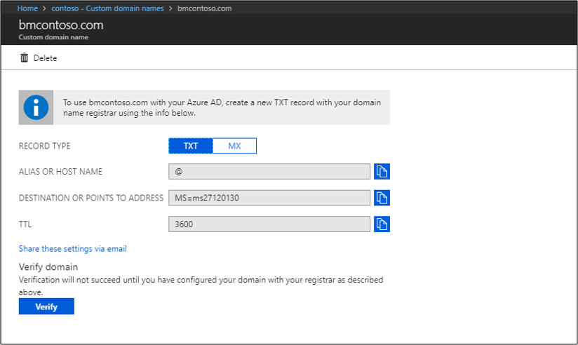
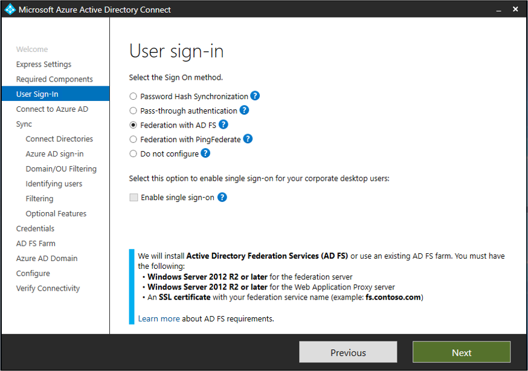
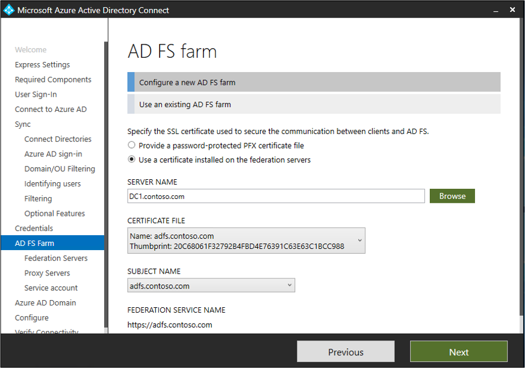
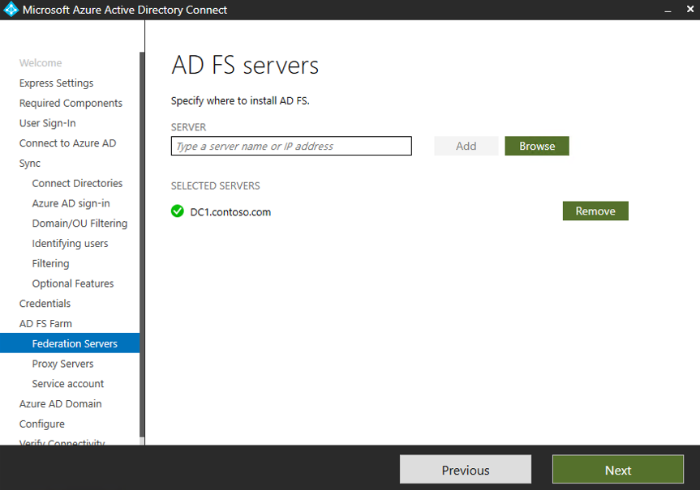

# Tutorial: Federate a single AD forest environment to Azure



This tutorial shows you how to create a hybrid identity environment in Azure by using federation. You can use the environment for testing or to get more familiar with how a hybrid identity works.

In this tutorial, you learn how to:

> [!div class="checklist"]
>
> - Create a virtual machine.
> - Create a Windows Server AD environment.
> - Create a Windows Server AD user.
> - 

## Prerequisites

To complete the tutorial, you need these items:

- A computer with [Hyper-V](/windows-server/virtualization/hyper-v/hyper-v-technology-overview) installed. We suggest that you install Hyper-V on a [Windows 10](/virtualization/hyper-v-on-windows/about/supported-guest-os) or [Windows Server 2016](/windows-server/virtualization/hyper-v/supported-windows-guest-operating-systems-for-hyper-v-on-windows) computer.
- An Azure subscription. If you don't have an Azure subscription, create a [free account](https://azure.microsoft.com/free/?WT.mc_id=A261C142F) before you begin.
- An [external network adapter](/virtualization/hyper-v-on-windows/quick-start/connect-to-network), so the virtual machine can connect to the internet.
- A copy of Windows Server 2016.
- A [custom domain](../../active-directory/fundamentals/add-custom-domain.md) that can be verified.

> [!NOTE]
> This tutorial uses PowerShell scripts to quickly create the tutorial environment. Each script uses variables that are declared at the beginning of the script. Be sure to change the variables to reflect your environment.
>
> The scripts in the tutorial create a general Windows Server Active Directory (Windows Server AD) environment before they install Azure Active Directory Connect. The scripts are used in related tutorials.
>
> The PowerShell scripts that are used in this tutorial are available on [GitHub](https://github.com/billmath/tutorial-phs).

## Create a virtual machine

To create a hybrid identity environment, the first task is to create a virtual machine to use as an on-premises Windows Server AD server.

> [!NOTE]
> If you've never run a script in PowerShell on your host machine, before you run any scripts, open Windows PowerShell ISE as an administrator and run `Set-ExecutionPolicy remotesigned`. At the prompt, enter **yes**.

To create the virtual machine:

1. Open Windows PowerShell ISE as administrator.
1. Run the following script:

    ```powershell
    #Declare variables
    $VMName = 'DC1'
    $Switch = 'External'
    $InstallMedia = 'D:\ISO\en_windows_server_2016_updated_feb_2018_x64_dvd_11636692.iso'
    $Path = 'D:\VM'
    $VHDPath = 'D:\VM\DC1\DC1.vhdx'
    $VHDSize = '64424509440'
    
    #Create a new virtual machine
    New-VM -Name $VMName -MemoryStartupBytes 16GB -BootDevice VHD -Path $Path -NewVHDPath $VHDPath -NewVHDSizeBytes $VHDSize  -Generation 2 -Switch $Switch  
    
    #Set the memory to be non-dynamic
    Set-VMMemory $VMName -DynamicMemoryEnabled $false
    
    #Add a DVD drive to the virtual machine
    Add-VMDvdDrive -VMName $VMName -ControllerNumber 0 -ControllerLocation 1 -Path $InstallMedia
    
    #Mount installation media
    $DVDDrive = Get-VMDvdDrive -VMName $VMName
    
    #Configure the virtual machine to boot from the DVD
    Set-VMFirmware -VMName $VMName -FirstBootDevice $DVDDrive 
    ```

## Finish the operating system deployment

To finish creating the virtual machine, finish installing the operating system:

1. In Hyper-V Manager, double-click the virtual machine.
1. Select **Start**.
1. At the prompt, press any key to boot from CD or DVD.
1. In the Windows Server start window, select your language, and then select **Next**.
1. Select **Install Now**.
1. Enter your license key and select **Next**.
1. Select the **I accept the license terms** checkbox and select **Next**.
1. Select **Custom: Install Windows Only (Advanced)**.
1. Select **Next**.
1. When the installation is finished, restart the virtual machine. Sign in, and then check Windows Update. Install any updates to ensure that the VM is fully updated.

## Install Windows Server AD prerequisites

Before you install Windows Server AD, run a script that installs prerequisites:

1. Open Windows PowerShell ISE as administrator.
1. Run `Set-ExecutionPolicy remotesigned` and enter **yes** to all [A]. Select Enter.
1. Run the following script:

    ```powershell
    #Declare variables
    $ipaddress = "10.0.1.117" 
    $ipprefix = "24" 
    $ipgw = "10.0.1.1" 
    $ipdns = "10.0.1.117"
    $ipdns2 = "8.8.8.8" 
    $ipif = (Get-NetAdapter).ifIndex 
    $featureLogPath = "c:\poshlog\featurelog.txt" 
    $newname = "DC1"
    $addsTools = "RSAT-AD-Tools" 
    
    #Set a static IP address
    New-NetIPAddress -IPAddress $ipaddress -PrefixLength $ipprefix -InterfaceIndex $ipif -DefaultGateway $ipgw 
    
    # Set the DNS servers
    Set-DnsClientServerAddress -InterfaceIndex $ipif -ServerAddresses ($ipdns, $ipdns2)
    
    #Rename the computer 
    Rename-Computer -NewName $newname -force 
    
    #Install features 
    New-Item $featureLogPath -ItemType file -Force 
    Add-WindowsFeature $addsTools 
    Get-WindowsFeature | Where installed >>$featureLogPath 
    
    #Restart the computer 
    Restart-Computer
    ```

## Create a Windows Server AD environment

Now, install and configure Active Directory Domain Services:

1. Open Windows PowerShell ISE as administrator.
1. Run the following script:

    ```powershell
    #Declare variables
    $DatabasePath = "c:\windows\NTDS"
    $DomainMode = "WinThreshold"
    $DomainName = "contoso.com"
    $DomainNetBIOSName = "CONTOSO"
    $ForestMode = "WinThreshold"
    $LogPath = "c:\windows\NTDS"
    $SysVolPath = "c:\windows\SYSVOL"
    $featureLogPath = "c:\poshlog\featurelog.txt" 
    $Password = ConvertTo-SecureString "Passw0rd" -AsPlainText -Force
    
    #Install Active Directory Domain Services, DNS, and Group Policy Management Console 
    start-job -Name addFeature -ScriptBlock { 
    Add-WindowsFeature -Name "ad-domain-services" -IncludeAllSubFeature -IncludeManagementTools 
    Add-WindowsFeature -Name "dns" -IncludeAllSubFeature -IncludeManagementTools 
    Add-WindowsFeature -Name "gpmc" -IncludeAllSubFeature -IncludeManagementTools } 
    Wait-Job -Name addFeature 
    Get-WindowsFeature | Where installed >>$featureLogPath
    
    #Create a new Windows Server AD forest
    Install-ADDSForest -CreateDnsDelegation:$false -DatabasePath $DatabasePath -DomainMode $DomainMode -DomainName $DomainName -SafeModeAdministratorPassword $Password -DomainNetbiosName $DomainNetBIOSName -ForestMode $ForestMode -InstallDns:$true -LogPath $LogPath -NoRebootOnCompletion:$false -SysvolPath $SysVolPath -Force:$true
    ```

## Create a Windows Server AD user

Next, create a test account. You create this account in your on-premises Active Directory environment. The account is then synced to Azure Active Directory.

1. Open Windows PowerShell ISE as administrator.
1. Run the following script:

    ```powershell
    #Declare variables
    $Givenname = "Allie"
    $Surname = "McCray"
    $Displayname = "Allie McCray"
    $Name = "amccray"
    $Password = "Pass1w0rd"
    $Identity = "CN=ammccray,CN=Users,DC=contoso,DC=com"
    $SecureString = ConvertTo-SecureString $Password -AsPlainText -Force
    
    #Create the user
    New-ADUser -Name $Name -GivenName $Givenname -Surname $Surname -DisplayName $Displayname -AccountPassword $SecureString
    
    #Set the password to never expire
    Set-ADUser -Identity $Identity -PasswordNeverExpires $true -ChangePasswordAtLogon $false -Enabled $true
    ```

## Create a certificate for Active Directory Federation Services

You need a TLS/SSL certificate that AD FS will use. This is a self-signed certificate, and you create it to use only for testing. We don't recommend that using a self-signed certificate in a production environment.

To create a certificate:

1. Open Windows PowerShell ISE as administrator.
1. Run the following script:

    ```powershell
    #Declare variables
    $DNSname = "adfs.contoso.com"
    $Location = "cert:\LocalMachine\My"
    
    #Create a certificate
    New-SelfSignedCertificate -DnsName $DNSname -CertStoreLocation $Location
    ```

## Create an Azure AD tenant

Now, create an Azure AD tenant so you can sync your users in the cloud.

To create a new Azure AD tenant:

1. In the [Azure portal](https://portal.azure.com), sign in with the account that's associated with your Azure subscription.
1. Search for and then select **Azure Active Directory**.
1. Select **Create**.

   

1. Enter a name for the organization and an initial domain name. Then select **Create** to create your directory.
1. To manage the directory, select the **here** link.

## Create a Hybrid Identity Administrator in Azure AD

The next task is to create a Hybrid Identity Administrator account. This account is used to create the Azure AD Connector account during Azure AD Connect installation. The Azure AD Connector account is used to write information to Azure AD.

To create the Hybrid Identity Administrator account:

1. In the left menu under **Manage**, select **Users**.

   

1. Select **All users**, and then select **New user**.

1. In the **User** pane:

   1. Enter a name and a username for the user. This is your Hybrid Identity Administrator account for the tenant.
   1. You can show and copy the temporary password.

   In the **Directory role** pane, select **Hybrid Identity Administrator**. Then select **Create**.

   

1. Open a new web browser and sign in to myapps.microsoft.com by using the new global administrator account and the temporary password.

1. Choose a new password for the Hybrid Identity Administrator account and change the password.

## Add the custom domain name to your directory

Now that we have a tenant and a Hybrid Identity Administrator, we need to add our custom domain so that Azure can verify it. Do the following:

1. In the [Azure portal](https://aad.portal.azure.com/#blade/Microsoft_AAD_IAM/ActiveDirectoryMenuBlade/Overview), be sure to close the **All users** pane.
1. In the left menu, select **Custom domain names**.
1. Select **Add custom domain**.

   

1. In **Custom domain names**, enter the name of your custom domain, and then select **Add domain**.
1. On the custom domain name screen you'll be supplied with either TXT or MX information. This information must be added to the DNS information of the domain registrar under your domain. So you need to go to your domain registrar, enter either the TXT or MX information in the DNS settings for your domain. This will allow Azure to verify your domain. This may take up to 24 hours for Azure to verify it. For more information, see the [add a custom domain](../../active-directory/fundamentals/add-custom-domain.md) documentation.

   

1. To ensure that it's verified, select **Verify**.

   

## Download and install Azure AD Connect

Now it's time to download and install Azure AD Connect. Once it has been installed we'll run through the express installation. Do the following:

1. Download [Azure AD Connect](https://www.microsoft.com/download/details.aspx?id=47594).
1. Go to *AzureADConnect.msi* and double-click to open the installation file.
1. On the Welcome screen, select the box agreeing to the licensing terms and select **Continue**. 
1. On the Express settings screen, select **Customize**. 
1. On the Install required components screen, select **Install**. 
1. On the User Sign-in screen, select **Federation with AD FS**, and then select **Next**.

   

1. On the Connect to Azure AD screen, enter the username and password of the global admin we created above and select **Next**.
1. On the Connect your directories screen, select **Add Directory**. Then select **Create new AD account** and enter the contoso\Administrator username and password and select **OK**.
1. Select **Next**.
1. On the Azure AD sign-in configuration pane, select **Continue without matching all UPN suffixes to verified domains**. Select **Next.**
1. On the Domain and OU filtering screen, select **Next**.
1. On the Uniquely identifying your users screen, select **Next**.
1. On the Filter users and devices screen, select **Next**.
1. On the Optional features screen, select **Next**.
1. On the Domain Administrator credentials page, enter the contoso\Administrator username and password and select **Next.**
1. On the AD FS farm screen, make sure **Configure a new AD FS farm** is selected.
1. Select **Use a certificate installed on the federation servers** and select **Browse**.
1. In the search box, enter and then select **DC1**. Select **OK**.
1. For **Certificate File**, select **adfs.contoso.com**, the certificate you created. Select **Next**.

   

1. On the AD FS server screen, select **Browse** and enter DC1 in the search box and select it when it's found. Select **Ok**. Select **Next**.

   

1. On the Web application Proxy servers screen, select **Next**.
1. On the AD FS service account screen, enter the contoso\Administrator username and password and select **Next.**
1. On the Azure AD Domain screen, select your verified custom domain from the drop-down and select **Next**.
1. On the Ready to configure screen, select **Install**.
1. When the installation completes, select **Exit**.
1. After the installation has completed, sign out and sign in again before you use the Synchronization Service Manager or Synchronization Rule Editor.

## Verify users are created and synchronization is occurring

We'll now verify that the users that we had in our on-premises directory have been synchronized and now exist in out Azure AD tenant. This section might take a few hours to complete.

To verify that users are synced:

1. Go to the [Azure portal](https://portal.azure.com) and sign in with an account that has an Azure subscription.
1. In the left menu, select **Azure Active Directory**.
1. Under **Manage**, select **Users**.
1. Verify that you see the new users in your tenant.

   

## Test signing in with one of our users

1. Go to [https://myapps.microsoft.com](https://myapps.microsoft.com).
1. Sign in with a user account that was created in your new tenant. Use the same password that the user uses to sign in on-premises in the following format: `user@domain.onmicrosoft.com`.

   

You have now successfully set up a hybrid identity environment that you can use to test and to get familiar with what Azure has to offer.

## Next steps

- [Hardware and prerequisites](how-to-connect-install-prerequisites.md) 
- [Customized settings](how-to-connect-install-custom.md)
- [Azure AD Connect and federation](how-to-connect-fed-whatis.md)
