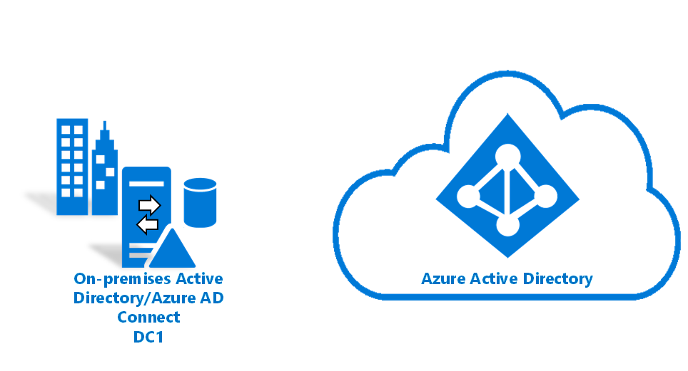
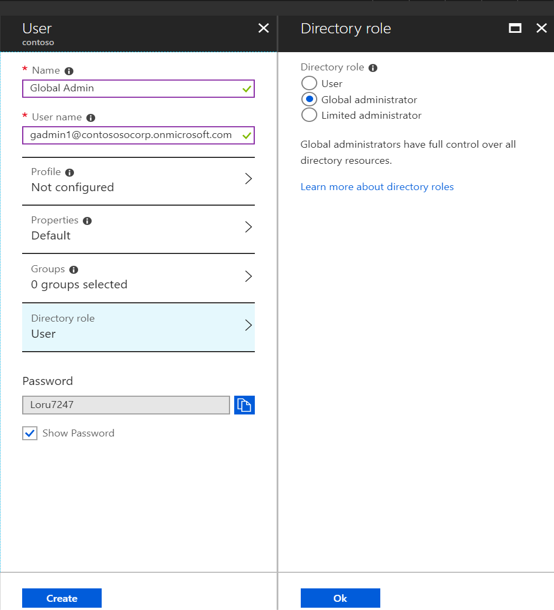
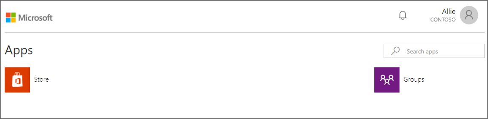

# Tutorial:  Integrate a single AD forest using password hash sync (PHS)



The following tutorial will walk you through creating a hybrid identity environment using password hash sync.  This environment can then be used for testing or for getting more familiar with how a hybrid identity works.

## Prerequisites
The following are prerequisites required for completing this tutorial
- A computer with [Hyper-V](https://docs.microsoft.com/windows-server/virtualization/hyper-v/hyper-v-technology-overview) installed.  It is suggested to do this on either a [Windows 10](https://docs.microsoft.com/virtualization/hyper-v-on-windows/about/supported-guest-os) or a [Windows Server 2016](https://docs.microsoft.com/windows-server/virtualization/hyper-v/supported-windows-guest-operating-systems-for-hyper-v-on-windows) computer.
- An [external network adapter](https://docs.microsoft.com/virtualization/hyper-v-on-windows/quick-start/connect-to-network) to allow the virtual machine to communicate with the internet.
- An [Azure subscription](https://azure.microsoft.com/free)
- A copy of Windows Server 2016

> [!NOTE]
> This tutorial uses PowerShell scripts so that you can create the tutorial environment in the quickest amount of time.  Each of the scripts uses variables that are declared at the beginning of the scripts.  You can and should change the variables to reflect your environment.
>
>The scripts used create a general Active Directory environment prior to installing Azure AD Connect.  They are relevant for all of the tutorials.
>
> Copies of the PowerShell scripts that are used in this tutorial are available on Github [here](https://github.com/billmath/tutorial-phs).

## Create a virtual machine
The first thing that we need to do, in order to get our hybrid identity environment up and running is to create a virtual machine that will be used as our on-premises Active Directory server.  Do the following:

1. Open up the PowerShell ISE as Administrator.
2. Run the following script.

```powershell
#Declare variables
$VMName = 'DC1'
$Switch = 'External'
$InstallMedia = 'D:\ISO\en_windows_server_2016_updated_feb_2018_x64_dvd_11636692.iso'
$Path = 'D:\VM'
$VHDPath = 'D:\VM\DC1\DC1.vhdx'
$VHDSize = '64424509440'

#Create New Virtual Machine
New-VM -Name $VMName -MemoryStartupBytes 16GB -BootDevice VHD -Path $Path -NewVHDPath $VHDPath -NewVHDSizeBytes $VHDSize  -Generation 2 -Switch $Switch  

#Set the memory to be non-dynamic
Set-VMMemory $VMName -DynamicMemoryEnabled $false

#Add DVD Drive to Virtual Machine
Add-VMDvdDrive -VMName $VMName -ControllerNumber 0 -ControllerLocation 1 -Path $InstallMedia

#Mount Installation Media
$DVDDrive = Get-VMDvdDrive -VMName $VMName

#Configure Virtual Machine to Boot from DVD
Set-VMFirmware -VMName $VMName -FirstBootDevice $DVDDrive 
```

## Complete the operating system deployment
In order to finish building the virtual machine, you need to finish the operating system installation.

1. Hyper-V Manager, double-click on the virtual machine
2. Click on the Start button.
3.  You will be prompted to ‘Press any key to boot from CD or DVD’. Go ahead and do so.
4. On the Windows Server start up screen select your language and click **Next**.
5. Click **Install Now**.
6. Enter your license key and click **Next**.
7. Check **I accept the license terms and click **Next**.
8. Select **Custom:  Install Windows Only (Advanced)**
9. Click **Next**
10. Once the installation has completed, restart the virtual machine, sign-in and run Windows updates to ensure the VM is the most up-to-date.  Install the latest updates.

## Install Active Directory prerequisites
Now that we have a virtual machine up, we need to do a few things prior to installing Active Directory.  That is, we need to rename the virtual machine, set a static IP address and DNS information, and install the Remote Server Administration tools.   Do the following:

1. Open up the PowerShell ISE as Administrator.
2. Run the following script.

```powershell
#Declare variables
$ipaddress = "10.0.1.117" 
$ipprefix = "24" 
$ipgw = "10.0.1.1" 
$ipdns = "10.0.1.117"
$ipdns2 = "8.8.8.8" 
$ipif = (Get-NetAdapter).ifIndex 
$featureLogPath = "c:\poshlog\featurelog.txt" 
$newname = "DC1"
$addsTools = "RSAT-AD-Tools" 

#Set static IP address
New-NetIPAddress -IPAddress $ipaddress -PrefixLength $ipprefix -InterfaceIndex $ipif -DefaultGateway $ipgw 

# Set the DNS servers
Set-DnsClientServerAddress -InterfaceIndex $ipif -ServerAddresses ($ipdns, $ipdns2)

#Rename the computer 
Rename-Computer -NewName $newname -force 

#Install features 
New-Item $featureLogPath -ItemType file -Force 
Add-WindowsFeature $addsTools 
Get-WindowsFeature | Where installed >>$featureLogPath 

#Restart the computer 
Restart-Computer
```

## Create a Windows Server AD environment
Now that we have the VM created and it has been renamed and has a static IP address, we can go ahead and install and configure Active Directory Domain Services.  Do the following:

1. Open up the PowerShell ISE as Administrator.
2. Run the following script.

```powershell 
#Declare variables
$DatabasePath = "c:\windows\NTDS"
$DomainMode = "WinThreshold"
$DomainName = "contoso.com"
$DomaninNetBIOSName = "CONTOSO"
$ForestMode = "WinThreshold"
$LogPath = "c:\windows\NTDS"
$SysVolPath = "c:\windows\SYSVOL"
$featureLogPath = "c:\poshlog\featurelog.txt" 
$Password = "Pass1w0rd"

#Install AD DS, DNS and GPMC 
start-job -Name addFeature -ScriptBlock { 
Add-WindowsFeature -Name "ad-domain-services" -IncludeAllSubFeature -IncludeManagementTools 
Add-WindowsFeature -Name "dns" -IncludeAllSubFeature -IncludeManagementTools 
Add-WindowsFeature -Name "gpmc" -IncludeAllSubFeature -IncludeManagementTools } 
Wait-Job -Name addFeature 
Get-WindowsFeature | Where installed >>$featureLogPath

#Create New AD Forest
Install-ADDSForest -CreateDnsDelegation:$false -DatabasePath $DatabasePath -DomainMode $DomainMode -DomainName $DomainName -SafeModeAdministratorPassword $Password -DomainNetbiosName $DomainNetBIOSName -ForestMode $ForestMode -InstallDns:$true -LogPath $LogPath -NoRebootOnCompletion:$false -SysvolPath $SysVolPath -Force:$true
```

## Create a Windows Server AD user
Now that we have our Active Directory environment, we need to a test account.  This account will be created in our on-premises AD environment and then synchronized to Azure AD.  Do the following:

1. Open up the PowerShell ISE as Administrator.
2. Run the following script.

```powershell 
#Declare variables
$Givenname = "Allie"
$Surname = "McCray"
$Displayname = "Allie McCray"
$Name = "amccray"
$Password = "Pass1w0rd"
$Identity = "CN=ammccray,CN=Users,DC=contoso,DC=com"
$SecureString = ConvertTo-SecureString $Password -AsPlainText -Force


#Create the user
New-ADUser -Name $Name -GivenName $Givenname -Surname $Surname -DisplayName $Displayname -AccountPassword $SecureString

#Set the password to never expire
Set-ADUser -Identity $Identity -PasswordNeverExpires $true -ChangePasswordAtLogon $false -Enabled $true
```

## Create an Azure AD tenant
Now we need to create an Azure AD tenant so that we can synchronize our users to the cloud.  To create a new Azure AD tenant, do the following.

1. Browse to the [Azure portal](https://portal.azure.com) and sign in with an account that has an Azure subscription.
2. Select the **plus icon (+)** and search for **Azure Active Directory**.
3. Select **Azure Active Directory** in the search results.
4. Select **Create**.</br>
</br>
5. Provide a **name for the organization** along with the **initial domain name**. Then select **Create**. This will create your directory.
6. Once this has completed, click the **here** link, to manage the directory.

## Create a global administrator in Azure AD
Now that we have an Azure AD tenant, we will create a global administrator account.  This account is used to create the Azure AD Connector account during Azure AD Connect installation.  The Azure AD Connector account is used to write information to Azure AD.   To create the global administrator account do the following.

1.  Under **Manage**, select **Users**.</br>
</br>
2.  Select **All users** and then select **+ New user**.
3.  Provide a name and username for this user. This will be your Global Admin for the tenant. You will also want to change the **Directory role** to **Global administrator.** You can also show the temporary password. When you are done, select **Create**.</br>
</br>
4. Once this has completed, open a new web browser and sign-in to myapps.microsoft.com using the new global administrator account and the temporary password.
5. Change the password for the global administrator to something that you will remember.

## Download and install Azure AD Connect
Now it is time to download and install Azure AD Connect.  Once it has been installed we will run through the express installation.  Do the following:

1. Download [Azure AD Connect](https://www.microsoft.com/download/details.aspx?id=47594)
2. Navigate to and double-click **AzureADConnect.msi**.
3. On the Welcome screen, select the box agreeing to the licensing terms and click **Continue**.  
4. On the Express settings screen, click **Use express settings**.</br>  
</br>
5. On the Connect to Azure AD screen, enter the username and password the global administrator for Azure AD. Click **Next**.  
6. On the Connect to AD DS screen, enter the username and password for an enterprise admin account. Click **Next**.  
7. On the Ready to configure screen, click **Install**.
8. When the installation completes, click **Exit**.
9. After the installation has completed, sign out and sign in again before you use the Synchronization Service Manager or Synchronization Rule Editor.


## Verify users are created and synchronization is occurring
We will now verify that the users that we had in our on-premises directory have been synchronized and now exist in out Azure AD tenant.  Be aware that this may take a few hours to complete.  To verify users are synchronized do the following.


1. Browse to the [Azure portal](https://portal.azure.com) and sign in with an account that has an Azure subscription.
2. On the left, select **Azure Active Directory**
3. Under **Manage**, select **Users**.
4. Verify that you see the new users in our tenant</br>
</br>

## Test signing in with one of our users

1.  Browse to [http://myapps.microsoft.com](http://myapps.microsoft.com)
2. Sign-in with a user account that was created in our new tenant.  You will need to sign-in using the following format: (user@domain.onmicrosoft.com). Use the same password that the user uses to sign-in on-premises.</br>
</br>

You have now successfully setup a hybrid identity environment that you can use to test and familiarize yourself with what Azure has to offer.

## Next Steps


- [Hardware and prerequisites](how-to-connect-install-prerequisites.md) 
- [Express settings](how-to-connect-install-express.md)
- [Password hash synchronization](how-to-connect-password-hash-synchronization.md)|
