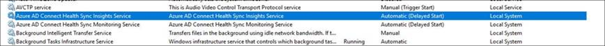
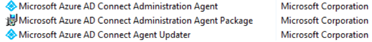
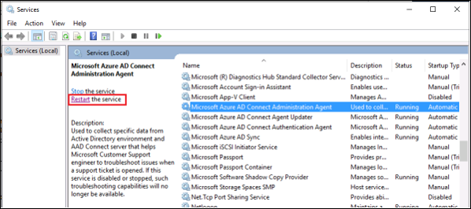

# What is the Azure AD Connect Admin Agent? 
The Azure AD Connect Administration Agent is a new component of Azure Active Directory Connect that can be installed on an Azure Active Directory Connect server. It is used to collect specific data from your Active Directory environment that helps a Microsoft support engineer to troubleshoot issues when you open a support case. 

>[!NOTE]
>The admin agent is not installed and enabled by default.  You must install the agent in order to collect data to assist with support cases.

When installed, the Azure AD Connect Administration Agent waits for specific requests for data from Azure Active Directory, gets the requested data from the sync environment and sends it to Azure Active Directory, where it is presented to the Microsoft support engineer. 

The information that the Azure AD Connect Administration Agent retrieves from your environment is not stored in any way - it is only displayed to the Microsoft support engineer to assist them in investigating and troubleshooting the Azure Active Directory Connect related support case that you opened 
The Azure AD Connect Administration Agent is not installed on the Azure AD Connect Server by default. 

## Install the Azure AD Connect Administration Agent on the Azure AD Connect server 

Prerequisites:
1.    Azure AD Connect is installed on the server
2.    Azure AD Connect Health is installed on the server



The Azure AD Connect Administration Agent binaries are placed in the AAD Connect server. To install the agent, do the following:

1.    Open powershell in admin mode
2.    Navigate to the directory where the application is located cd "C:\Program Files\Microsoft Azure Active Directory Connect\Tools"
3.    Run ConfigureAdminAgent.ps1

When prompted, please enter your Azure AD global admin credentials. This should be the same credentials entered during Azure AD Connect installation.

After the agent is installed, you'll see the following two new programs in the "Add/Remove Programs" list in the Control Panel of your server: 



## What data in my Sync service is shown to the Microsoft service engineer? 
When you open a support case  the Microsoft Support Engineer can see, for a given user, the relevant data in Active Directory, the Active Directory connector space in the Azure Active Directory Connect server, the Azure Active Directory connector space in the Azure Active Directory Connect server and the Metaverse in the Azure Active Directory Connect server. 

The Microsoft Support Engineer cannot change any data in your system and cannot see any passwords. 

## What if I don't want the Microsoft support engineer to access my data? 
Once the agent is installed, If you do not want the Microsoft service engineer to access your data for a support call, you can disable the functionality by modifying the service config file as described below: 

1.    Open **C:\Program Files\Microsoft Azure AD Connect Administration Agent\AzureADConnectAdministrationAgentService.exe.config** in notepad.
2.    Disable **UserDataEnabled** setting as shown below. If **UserDataEnabled** setting exists and is set to true, then set it to false. If the setting does not exist, then add the setting as shown below.    

    ```xml
    <appSettings>
      <add key="TraceFilename" value="ADAdministrationAgent.log" />
      <add key="UserDataEnabled" value="false" />
    </appSettings>
    ```

3.    Save the config file.
4.    Restart Azure AD Connect Administration Agent service as shown below



## Next steps
Learn more about [Integrating your on-premises identities with Azure Active Directory](whatis-hybrid-identity.md).
