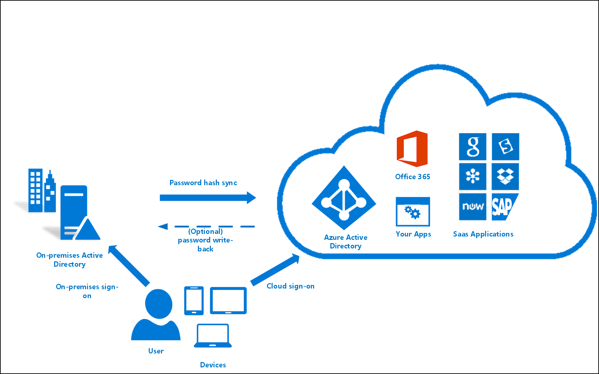
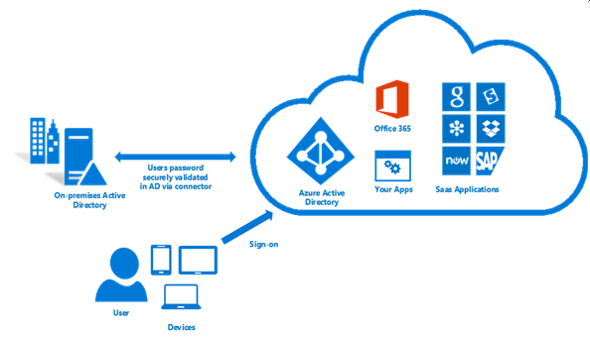
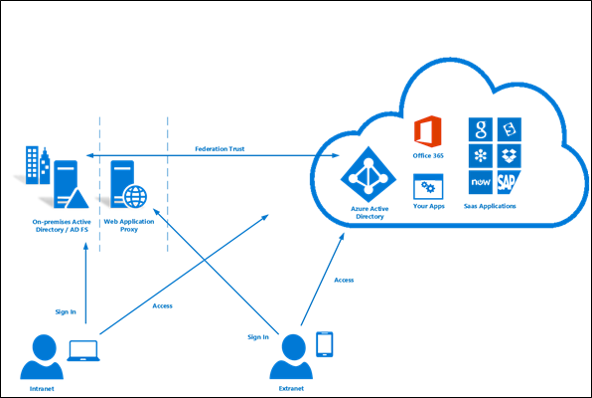

# Hybrid identity and Microsoft identity solutions
[Microsoft Azure Active Directory (Azure AD)](../../active-directory/fundamentals/active-directory-whatis.md) hybrid identity solutions enable you to synchronize on-premises directory objects with Azure AD while still managing your users on-premises. The first decision to make when planning to synchronize your on-premises Windows Server Active Directory with Azure AD is whether you want to use managed identities or federated identity. 

- **Managed identities** - User accounts and groups are synchronized from an on-premises Active Directory and the user authentication is managed by Azure.   
- **Federated identities** allow for more control over users by separating user authentication from Azure, and delegating authentication to a trusted, on-premises, identity provider. 

There are several options available for configuring hybrid identity. As you consider which identity model best fits your organization’s needs, you also need to think about time, existing infrastructure, complexity, and cost. These factors are different for every organization, and might change over time. However, if your requirements do change, you also have the flexibility to switch to a different identity model.

## Managed identity 

Managed identity is the simplest way to synchronize on-premises directory objects (users and groups) with Azure AD. 

While managed identity is the easiest and quickest method, your users still need to maintain a separate password for cloud-based resources. To avoid this, you can also (optionally) [synchronize a hash of user passwords](how-to-connect-password-hash-synchronization.md) to your Azure AD directory. Synchronizing password hashes enables users to log in to cloud-based organizational resources with the same user name and password that they use on-premises. Azure AD Connect periodically checks your on-premises directory for changes and keeps your Azure AD directory synchronized. When a user attribute or password is changed on-premises Active Directory, it is automatically updated in Azure AD. 

For most organizations who only need to enable their users to sign in to Office 365, SaaS applications, and other Azure AD-based resources, the default password hash synchronization option is recommended. If that doesn’t work for you, you'll need to decide between pass-through authentication and AD FS.

> [!TIP]
> User passwords are stored in on-premises Windows Server Active Directory in the form of a hash value that represents the actual user password. A hash value is a result of a one-way mathematical function (the hashing algorithm). There is no method to revert the result of a one-way function to the plain text version of a password. You cannot use a password hash to sign in to your on-premises network. When you opt to synchronize password hashes, Azure AD Connect extracts password hashes from the on-premises Active Directory and applies extra security processing to the password hash before it is synchronized to Azure AD. Password hash synchronization can also be used together with password write-back to enable self-service password reset in Azure AD. In addition, you can enable single sign-on (SSO) for users on domain-joined computers that are connected to the corporate network. With single sign-on, enabled users only need to enter a username to securely access cloud resources. 
>

## Pass-through authentication

[Azure AD pass-through authentication](how-to-connect-pta.md) provides a simple password validation solution for Azure AD-based services using your on-premises Active Directory. If security and compliance policies for your organization do not permit sending users' passwords, even in a hashed form, and you only need to support desktop SSO for domain joined devices, it is recommended that you evaluate using pass-through authentication. Pass-through authentication does not require any deployment in the DMZ, which simplifies the deployment infrastructure when compared with AD FS. When users sign in using Azure AD, this authentication method validates users' passwords directly against your on-premises Active Directory.

With pass-through authentication, there's no need for a complex network infrastructure, and you don't need to store on-premises passwords in the cloud. Combined with single sign-on, pass-through authentication provides a truly integrated experience when signing in to Azure AD or other cloud services.

Pass-through authentication is configured with Azure AD Connect, which uses a simple on-premises agent that listens for password validation requests. The agent can be easily deployed to multiple machines to provide high availability and load balancing. Since all communications are outbound only, there is no requirement for the connector to be installed in a DMZ. The server computer requirements for the connector are as follows:

- Windows Server 2012 R2 or higher
- Joined to a domain in the forest through which users are validated

## Federated identity (AD FS)

For more control over how users access Office 365 and other cloud services, you can set up directory synchronization with single sign-on (SSO) using [Active Directory Federation Services (AD FS)](how-to-connect-fed-whatis.md). Federating your user's sign-ins with AD FS delegates authentication to an on-premises server that validates user credentials. In this model, on-premises Active Directory credentials are never passed to Azure AD.

Also called identity federation, this sign-in method ensures that all user authentication is controlled on-premises and allows administrators to implement more rigorous levels of access control. Identity federation with AD FS is the most complicated option and requires deploying additional servers in your on-premises environment. Identity federation also commits you to providing 24x7 support for your Active Directory and AD FS infrastructure. This high level of support is necessary because if your on-premises Internet access, domain controller, or AD FS servers are unavailable, users can't sign in to cloud services.

> [!TIP]
> If you decide to use Federation with Active Directory Federation Services (AD FS), you can optionally set up password hash synchronization as a backup in case your AD FS infrastructure fails.
>

## Common scenarios and recommendations

Here are some common hybrid identity and access management scenarios with recommendations as to which hybrid identity option (or options) might be appropriate for each.

|I need to:|PHS and SSO1| PTA and SSO2 | AD FS3|
|-----|-----|-----|-----|
|Sync new user, contact, and group accounts created in my on-premises Active Directory to the cloud automatically.||  ||
|Set up my tenant for Office 365 hybrid scenarios||  ||
|Enable my users to sign in and access cloud services using their on-premises password||  ||
|Implement single sign-on using corporate credentials||  ||
|Ensure no password hashes are stored in the cloud| |||
|Enable cloud multi-factor authentication solutions| |||
|Enable on-premises multi-factor authentication solutions| | ||
|Support smartcard authentication for my users4| | ||
|Display password expiry notifications in the Office Portal and on the Windows 10 desktop| | ||

> 1 Password hash synchronization with single sign-on.
>
> 2 Pass-through authentication and single sign-on. 
>
> 3 Federated single sign-on with AD FS.
>
> 4 AD FS can be integrated with your enterprise PKI to allow sign-in using certificates. These certificates can be soft-certificates deployed via trusted provisioning channels such as MDM or GPO or smartcard certificates (including PIV/CAC cards) or Hello for Business (cert-trust). For more information about smartcard authentication support, see [this blog](https://blogs.msdn.microsoft.com/samueld/2016/07/19/adfs-certauth-aad-o365/).
>

## What is Azure AD Connect?

Azure AD Connect is the Microsoft tool designed to meet and accomplish your hybrid identity goals.  This allows you to provide a common identity for your users for Office 365, Azure, and SaaS applications integrated with Azure AD.  It provides the following features:
 	
- [Synchronization](how-to-connect-sync-whatis.md) - This component is responsible for creating users, groups, and other objects. It is also responsible for making sure identity information for your on-premises users and groups is matching the cloud.  It is responsible for synchronizing password hashes with Azure AD.
- [Password hash synchronization](how-to-connect-password-hash-synchronization.md) - An optional component that allows users to use the same password on-premises and in the cloud by synchronizing a hash of the users password with Azure AD.
-  	[AD FS and federation integration](how-to-connect-fed-whatis.md) - Federation is an optional part of Azure AD Connect and can be used to configure a hybrid environment using an on-premises AD FS infrastructure. It also provides AD FS management capabilities such as certificate renew and additional AD FS server deployments.
-  	[Pass-through Authentication](how-to-connect-pta.md) - Another optional component that allows users to use the same password on-premises and in the cloud, but doesn't require the additional infrastructure of a federated environment
-  	[PingFederate and federation integration](how-to-connect-install-custom.md#configuring-federation-with-pingfederate) - Another federation option that allows you to use PingFederate as your identity provider.
-  	[Health Monitoring](whatis-hybrid-identity-health.md) - Azure AD Connect Health can provide robust monitoring and provide a central location in the Azure portal to view this activity. 

## What is Azure AD Connect Health?

Azure Active Directory (Azure AD) Connect Health helps you monitor and gain insights into your on-premises identity infrastructure and the synchronization services. It enables you to maintain a reliable connection to Office 365 and Microsoft Online Services by providing monitoring capabilities for your key identity components such as Active Directory Federation Services (AD FS) servers, Azure AD Connect servers (also known as Sync Engine), Active Directory domain controllers, etc. It also makes the key data points about these components easily accessible so that you can get usage and other important insights to make informed decisions.

The information is presented in the [Azure AD Connect Health portal](https://aka.ms/aadconnecthealth). In the Azure AD Connect Health portal, you can view alerts, performance monitoring, usage analytics, and other information. Azure AD Connect Health enables the single lens of health for your key identity components in one place.

As the features in Azure AD Connect Health increase, the portal provides a single dashboard through the lens of identity. You get an even more robust, healthy, and integrated environment for your users to increase their ability to get things done.

## Why use Azure AD Connect?
Integrating your on-premises directories with Azure AD makes your users more productive by providing a common identity for accessing both cloud and on-premises resources. Users and organizations can take advantage of the following:

* Users can use a single identity to access on-premises applications and cloud services such as Office 365.
* Single tool to provide an easy deployment experience for synchronization and sign-in.
* Provides the newest capabilities for your scenarios. Azure AD Connect replaces older versions of identity integration tools such as DirSync and Azure AD Sync. For more information, see [Hybrid Identity directory integration tools comparison](plan-hybrid-identity-design-considerations-tools-comparison.md).

## Why use Azure AD Connect Health?
When you integrate your on-premises directories with Azure AD, your users are more productive because there's a common identity to access both cloud and on-premises resources. However, this integration creates the challenge of ensuring that this environment is healthy so that users can reliably access resources both on premises and in the cloud from any device. Azure AD Connect Health helps you monitor and gain insights into your on-premises identity infrastructure that is used to access Office 365 or other Azure AD applications. It is as simple as installing an agent on each of your on-premises identity servers.

### [Azure AD Connect Health for AD FS](how-to-connect-health-adfs.md)
Azure AD Connect Health for AD FS supports AD FS 2.0 on Windows Server 2008 R2, Windows Server 2012, Windows Server 2012 R2 and Windows Server 2016. It also supports monitoring the AD FS proxy or web application proxy servers that provide authentication support for extranet access. With an easy and quick installation of the Health Agent, Azure AD Connect Health for AD FS provides you a set of key capabilities.

#### Key benefits and best practices

- *Enhanced security*
  -	[Extranet lockout trends](how-to-connect-health-adfs.md#usage-analytics-for-ad-fs)
  -	[Failed sign-ins report](how-to-connect-health-adfs.md#risky-ip-report-public-preview) 
  -	In [privacy compliant](reference-connect-health-user-privacy.md)    
- *Get alerted on all [critical ADFS system issues](how-to-connect-health-alert-catalog.md#alerts-for-active-directory-federation-services)*
 	- Server configuration and availability 
 	- [Performance and connectivity](how-to-connect-health-adfs.md#performance-monitoring-for-ad-fs) 
  - Regular maintenance    
- *Easy to deploy and manage*
  -	Quick [agent installation](how-to-connect-health-agent-install.md#installing-the-azure-ad-connect-health-agent-for-ad-fs) 
  -	Agent auto upgrade to the latest 
  -	Data available in portal within minutes    
- *Rich [usage metrics](how-to-connect-health-adfs.md#usage-analytics-for-ad-fs)* 
  -	Top applications usage
  -	Network locations and TCP connection
  -	Token requests per server    
- *Great user experience* 
  -	Dashboard fashion from Azure portal
  -	[Alerts through emails](how-to-connect-health-adfs.md#alerts-for-ad-fs)    

#### Feature highlight

*	Monitoring with alerts to know when AD FS and AD FS proxy servers are not healthy
*	Email notifications for critical alerts
*	Trends in performance data, which are useful for capacity planning of AD FS
*	Usage analytics for AD FS sign-ins with pivots (apps, users, network location etc.)
*	Reports for AD FS such as top 50 users who have bad username/password attempts and their last IP address
*	Risky IP report for failed AD FS sign-ins

Read more here about [Using Azure AD Connect Health with AD FS](how-to-connect-health-adfs.md)

### [Azure AD Connect Health for sync](how-to-connect-health-sync.md)
Azure AD Connect Health for sync monitors and provides information about the syncs that occur between your on-premises Active Directory and Azure AD. Azure AD Connect Health for sync provides the following set of key capabilities:

* Monitoring with alerts to know when an Azure AD Connect server, also known as the Sync Engine, is not healthy
* Email notifications for critical alerts
* Sync operational insights, which include latency charts for sync operations and trends in different operations such as adds, updates, deletes
* Quick glance information about sync properties and last successful export to Azure AD
* Reports about object-level sync errors \(does not require Azure AD Premium\)

Read more here about [Using Azure AD Connect Health for sync](how-to-connect-health-sync.md)

### [Azure AD Connect Health for AD DS](how-to-connect-health-adds.md)
Azure AD Connect Health for Active Directory Domain Services (AD DS) provides monitoring for domain controllers that are installed on Windows Server 2008 R2, Windows Server 2012, Windows Server 2012 R2, and Windows Server 2016. The Health Agent installation enables you to monitor your on-premises AD DS environment from the cloud. Azure AD Connect Health for AD DS provides the following set of key capabilities:

* Monitoring alerts to detect when domain controllers are unhealthy and email notifications for critical alerts
* The Domain Controllers dashboard, which provides a quick view of the health and operational status of your domain controllers
* The Replication Status dashboard that has the latest replication information and links to troubleshooting guides when errors are detected
* Quick anywhere access to performance data graphs of popular performance counters, which are necessary for troubleshooting and monitoring purposes

Read more here about [Using Azure AD Connect Health with AD DS](how-to-connect-health-adds.md)

## Next steps

- [Hardware and prerequisites](how-to-connect-install-prerequisites.md) 
- [Express settings](how-to-connect-install-express.md)
- [Customized settings](how-to-connect-install-custom.md)
- [Password hash synchronization](how-to-connect-password-hash-synchronization.md)|
- [Pass-through authentication](how-to-connect-pta.md)
- [Azure AD Connect and federation](how-to-connect-fed-whatis.md)
- [Install Azure AD Connect Health agents](how-to-connect-health-agent-install.md) 
- [Azure AD Connect sync](how-to-connect-sync-whatis.md)
- [Version history](reference-connect-version-history.md)
- [Directory integration tools comparison](plan-hybrid-identity-design-considerations-tools-comparison.md)
- [Azure AD Connect FAQ](reference-connect-faq.md)

