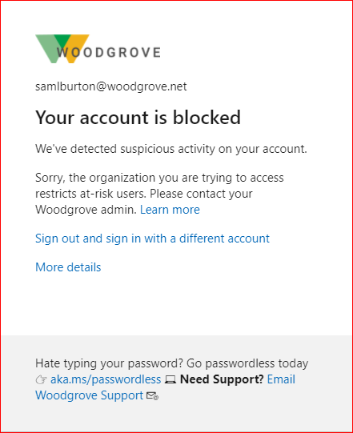

# Identity Protection and B2B users

Identity Protection detects compromised credentials for Microsoft Entra users. If your credential is detected as compromised, it means that someone else may have your password and be using it illegitimately. To prevent further risk to your account, it's important to securely reset your password so that the bad actor can no longer use your compromised password. Identity Protection marks accounts that may be compromised as "at risk."

You can use your organizational credentials to sign-in to another organization as a guest. This process is referred to [business-to-business or B2B collaboration](../external-identities/what-is-b2b.md). Organizations can configure policies to block users from signing-in if their credentials are considered [at risk](concept-identity-protection-risks.md). If your account is at risk and you're blocked from signing-in to another organization as a guest, you may be able to self-remediate your account using the following steps. If your organization hasn't enabled self-service password reset, your administrator will need to manually remediate your account.

## How to unblock your account 

If you're attempting to sign-in to another organization as a guest and are blocked due to risk, you'll see the following block message: "Your account is blocked. We've detected suspicious activity on your account." 

If your organization enables it, you can use self-service password reset unblock your account and get your credentials back to a safe state.
1. Go to the [Password reset portal](https://passwordreset.microsoftonline.com/) and initiate the password reset. If self-service password reset isn't enabled for your account and you can't proceed, reach out to your IT administrator with the information [below](#how-to-remediate-a-users-risk-as-an-administrator).
2. If self-service password reset is enabled for your account, you'll be prompted to verify your identity using security methods prior to changing your password. For assistance, see the [Reset your work or school password](https://support.microsoft.com/account-billing/reset-your-work-or-school-password-using-security-info-23dde81f-08bb-4776-ba72-e6b72b9dda9e) article.
3. Once you have successfully and securely reset your password, your user risk will be remediated. You can now try again to sign-in as a guest user.

If after resetting your password you're still blocked as a guest due to risk, reach out to your organization's IT administrator.

## How to remediate a user's risk as an administrator

Identity Protection automatically detects risky users for Microsoft Entra tenants. If you haven't previously checked the Identity Protection reports, there may be a large number of users with risk. Since resource tenants can apply user risk policies to guest users, your users can be blocked due to risk even if they were previously unaware of their risky state. If your user reports they've been blocked as a guest user in another tenant due to risk, it's important to remediate the user to protect their account and enable collaboration. 

### Reset the user's password

From the [Risky users report](https://portal.azure.com/#blade/Microsoft_AAD_IAM/SecurityMenuBlade/RiskyUsers) in the Microsoft Entra Security menu, search for the impacted user using the 'User' filter. Select the impacted user in the report and select "Reset password" in the top toolbar. The user will be assigned a temporary password that must be changed on the next sign-in. This process will remediate their user risk and bring their credentials back to a safe state.

### Manually dismiss user's risk

If password reset isn't an option for you, you can choose to manually dismiss user risk. Dismissing user risk doesn't have any impact on the user's existing password, but this process will change the user's Risk State from At Risk to Dismissed. It's important that you change the user's password using whatever means are available to you in order to bring the identity back to a safe state. 

To dismiss user risk, go to the [Risky users report](https://portal.azure.com/#blade/Microsoft_AAD_IAM/SecurityMenuBlade/RiskyUsers) in the Microsoft Entra Security menu. Search for the impacted user using the 'User' filter and select the user. Select the "dismiss user risk" option from the top toolbar. This action may take a few minutes to complete and update the user risk state in the report.

To learn more about Identity Protection, see [What is Identity Protection](overview-identity-protection.md).

## How does Identity Protection work for B2B users?

The user risk for B2B collaboration users is evaluated at their home directory. The real-time sign-in risk for these users is evaluated at the resource directory when they try to access the resource. With Microsoft Entra B2B collaboration, organizations can enforce risk-based policies for B2B users using Identity Protection. These policies be configured in two ways:

- Administrators can configure the built-in Identity Protection risk-based policies, that apply to all apps, and include guest users.
- Administrators can configure their Conditional Access policies, using sign-in risk as a condition, and includes guest users.

## Limitations of Identity Protection for B2B collaboration users

There are limitations in the implementation of Identity Protection for B2B collaboration users in a resource directory, due to their identity existing in their home directory. The main limitations are as follows:

- If a guest user triggers the Identity Protection user risk policy to force password reset, **they will be blocked**. This block is due to the inability to reset passwords in the resource directory.
- **Guest users do not appear in the risky users report**. This limitation is due to the risk evaluation occurring in the B2B user's home directory.
- Administrators **cannot dismiss or remediate a risky B2B collaboration user** in their resource directory. This limitation is due to administrators in the resource directory not having access to the B2B user's home directory.

### Why can't I remediate risky B2B collaboration users in my directory?

The risk evaluation and remediation for B2B users occurs in their home directory. Due to this fact, the guest users don't appear in the risky users report in the resource directory and admins in the resource directory can't force a secure password reset for these users.

### What do I do if a B2B collaboration user was blocked due to a risk-based policy in my organization?

If a risky B2B user in your directory is blocked by your risk-based policy, the user will need to remediate that risk in their home directory. Users can remediate their risk by performing a secure password reset in their home directory [as outlined above](#how-to-unblock-your-account). If they don't have self-service password reset enabled in their home directory, they'll need to contact their own organization's IT Staff to have an administrator manually dismiss their risk or reset their password.

### How do I prevent B2B collaboration users from being impacted by risk-based policies?

Excluding B2B users from your organization's risk-based Conditional Access policies will prevent B2B users from being impacted or blocked by their risk evaluation. To exclude these B2B users, create a group in Microsoft Entra ID that contains all of your organization's guest users. Then, add this group as an exclusion for your built-in Identity Protection user risk and sign-in risk policies, and any Conditional Access policies that use sign-in risk as a condition.

## Next steps

See the following articles on Microsoft Entra B2B collaboration:

- [What is Microsoft Entra B2B collaboration?](../external-identities/what-is-b2b.md)
