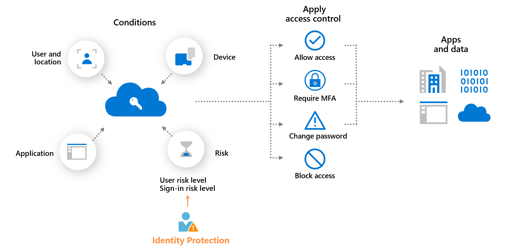
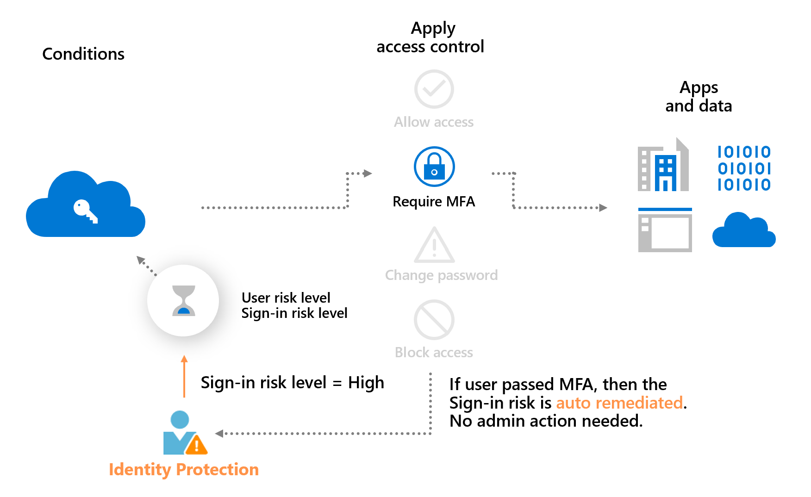
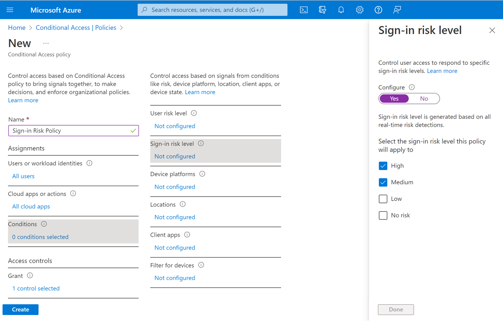

# Risk-based access policies

Access control policies can be applied to protect organizations when a sign-in or user is detected to be at risk. Such policies are called **risk-based policies**. 

Microsoft Entra Conditional Access offers two risk conditions: **Sign-in risk** and **User risk**. Organizations can create risk-based Conditional Access policies by configuring these two risk conditions and choosing an access control method. During each sign-in, Identity Protection sends the detected risk levels to Conditional Access, and the risk-based policies will apply if the policy conditions are satisfied.

For example, as shown in the diagram below, if organizations have a sign-in risk policy that requires multifactor authentication when the sign-in risk level is medium or high, their users must complete multifactor authentication when their sign-in risk is medium or high.

The example above also demonstrates a main benefit of a risk-based policy: **automatic risk remediation**. When a user successfully completes the required access control, like a secure password change, their risk is remediated. That sign-in session and user account won't be at risk, and no action is needed from the administrator. 

Allowing users to self-remediate using this process will significantly reduce the risk investigation and remediation burden on the administrators while protecting your organizations from security compromises. More information about risk remediation can be found in the article, [Remediate risks and unblock users](howto-identity-protection-remediate-unblock.md).

## Sign-in risk-based Conditional Access policy

During each sign-in, Identity Protection analyzes hundreds of signals in real-time and calculates a sign-in risk level that represents the probability that the given authentication request isn't authorized. This risk level then gets sent to Conditional Access, where the organization's configured policies are evaluated. Administrators can configure sign-in risk-based Conditional Access policies to enforce access controls based on sign-in risk, including requirements such as:

- Block access
- Allow access
- Require multifactor authentication

If risks are detected on a sign-in, users can perform the required access control such as multifactor authentication to self-remediate and close the risky sign-in event to prevent unnecessary noise for administrators.

> [!NOTE] 
> Users must have previously registered for Microsoft Entra multifactor authentication before triggering the sign-in risk policy.

## User risk-based Conditional Access policy

Identity Protection analyzes signals about user accounts and calculates a risk score based on the probability that the user has been compromised. If a user has risky sign-in behavior, or their credentials have been leaked, Identity Protection will use these signals to calculate the user risk level. Administrators can configure user risk-based Conditional Access policies to enforce access controls based on user risk, including requirements such as: 

- Block access
- Allow access but require a secure password change.

A secure password change will remediate the user risk and close the risky user event to prevent unnecessary noise for administrators.

## Identity Protection policies

While Identity Protection also offers a user interface for creating user risk policy and sign-in risk policy, we highly recommend that you [use Microsoft Entra Conditional Access to create risk-based policies](howto-identity-protection-configure-risk-policies.md) for the following benefits:

- Rich set of conditions to control access: Conditional Access offers a rich set of conditions such as applications and locations for configuration. The risk conditions can be used in combination with other conditions to create policies that best enforce your organizational requirements.
- Multiple risk-based policies can be put in place to target different user groups or apply different access control for different risk levels.
- Conditional Access policies can be created through Microsoft Graph API and can be tested first in report-only mode.
- Manage all access policies in one place in Conditional Access.

If you already have Identity Protection risk policies set up, we encourage you to [migrate them to Conditional Access](howto-identity-protection-configure-risk-policies.md#migrate-risk-policies-from-identity-protection-to-conditional-access).

## Microsoft Entra multifactor authentication registration policy

Identity Protection can help organizations roll out Microsoft Entra multifactor authentication using a policy requiring registration at sign-in. Enabling this policy is a great way to ensure new users in your organization have registered for MFA on their first day. Multifactor authentication is one of the self-remediation methods for risk events within Identity Protection. Self-remediation allows your users to take action on their own to reduce helpdesk call volume.

More information about Microsoft Entra multifactor authentication can be found in the article, [How it works: Microsoft Entra multifactor authentication](../authentication/concept-mfa-howitworks.md).

## Next steps

- [Enable Microsoft Entra multifactor authentication registration policy](howto-identity-protection-configure-mfa-policy.md)
- [Enable sign-in and user risk policies](howto-identity-protection-configure-risk-policies.md)
