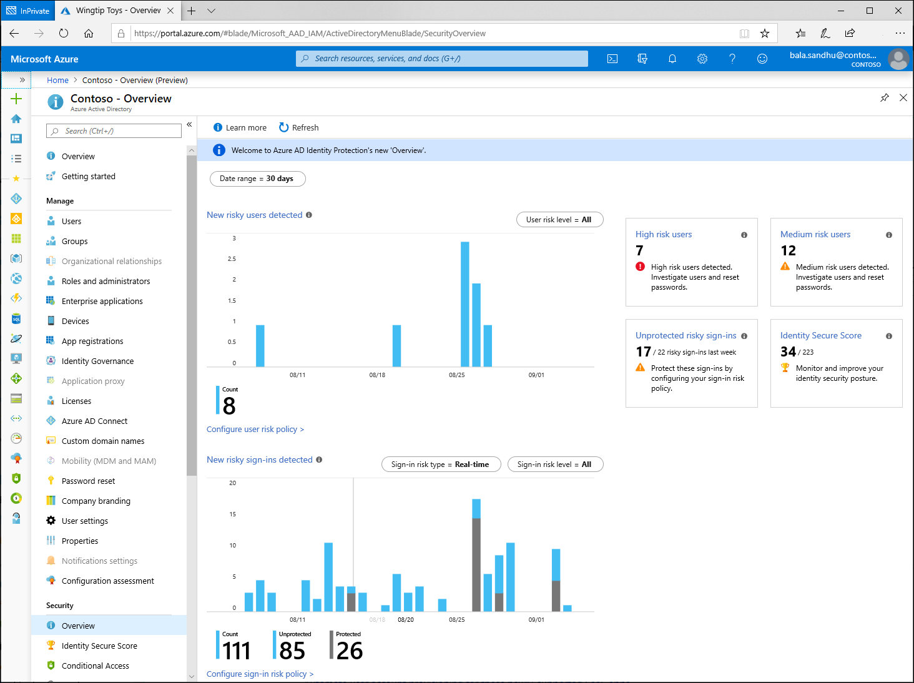

# What are risk detections?

Risk detections in Microsoft Entra ID Protection include any identified suspicious actions related to user accounts in the directory. Risk detections (both user and sign-in linked) contribute to the overall user risk score that is found in the Risky Users report.

Identity Protection provides organizations access to powerful resources to see and respond quickly to these suspicious actions. 

> [!NOTE]
> Identity Protection generates risk detections only when the correct credentials are used. If incorrect credentials are used on a sign-in, it does not represent risk of credential compromise.

## Risk types and detection

Risk can be detected at the **User** and **Sign-in** level and two types of detection or calculation **Real-time** and **Offline**. Some risks are considered premium available to Microsoft Entra ID P2 customers only, while others are available to Free and Microsoft Entra ID P1 customers.

A sign-in risk represents the probability that a given authentication request isn't the authorized identity owner. Risky activity can be detected for a user that isn't linked to a specific malicious sign-in but to the user itself. 

Real-time detections may not show up in reporting for 5 to 10 minutes. Offline detections may not show up in reporting for 48 hours.

> [!NOTE] 
> Our system may detect that the risk event that contributed to the risk user risk score was either:
>
> - A false positive
> - The [user risk was remediated](howto-identity-protection-remediate-unblock.md) by policy by either:
>    - Completing multifactor authentication 
>    - Secure password change. 
>
> Our system will dismiss the risk state and a risk detail of “AI confirmed sign-in safe” will show and no longer contribute to the user’s overall risk. 

### Sign-in risk detections

| Risk detection | Detection type | Type |
| --- | --- | --- |
| [Atypical travel](#atypical-travel) | Offline | Premium |
| [Anomalous Token](#anomalous-token) | Offline | Premium |
| [Token Issuer Anomaly](#token-issuer-anomaly) | Offline | Premium |
| [Malware linked IP address](#malware-linked-ip-address-deprecated) | Offline | Premium **This detection has been deprecated.** |
| [Suspicious browser](#suspicious-browser) | Offline | Premium |
| [Unfamiliar sign-in properties](#unfamiliar-sign-in-properties) | Real-time | Premium |
| [Malicious IP address](#malicious-ip-address) | Offline | Premium |
| [Suspicious inbox manipulation rules](#suspicious-inbox-manipulation-rules) | Offline | Premium |
| [Password spray](#password-spray) | Offline | Premium |
| [Impossible travel](#impossible-travel) | Offline | Premium |
| [New country](#new-country) | Offline | Premium |
| [Activity from anonymous IP address](#activity-from-anonymous-ip-address) | Offline | Premium |
| [Suspicious inbox forwarding](#suspicious-inbox-forwarding) | Offline | Premium |
| [Mass Access to Sensitive Files](#mass-access-to-sensitive-files) | Offline | Premium |
| [Verified threat actor IP](#verified-threat-actor-ip) | Real-time | Premium |
| [Additional risk detected](#additional-risk-detected-sign-in) | Real-time or Offline | Nonpremium |
| [Anonymous IP address](#anonymous-ip-address) | Real-time | Nonpremium |
| [Admin confirmed user compromised](#admin-confirmed-user-compromised) | Offline | Nonpremium |
| [Microsoft Entra threat intelligence](#azure-ad-threat-intelligence-sign-in) | Real-time or Offline | Nonpremium |

### User risk detections

| Risk detection |  Detection type | Type |
| --- | --- | --- |
| [Possible attempt to access Primary Refresh Token (PRT)](#possible-attempt-to-access-primary-refresh-token-prt) | Offline | Premium |
| [Anomalous user activity](#anomalous-user-activity) | Offline | Premium |
| [User reported suspicious activity](#user-reported-suspicious-activity) | Offline | Premium | 
| [Additional risk detected](#additional-risk-detected-user) | Real-time or Offline | Nonpremium |
| [Leaked credentials](#leaked-credentials) | Offline | Nonpremium |
| [Microsoft Entra threat intelligence](#azure-ad-threat-intelligence-user) | Offline | Nonpremium |

## Premium detections

The following premium detections are visible only to Microsoft Entra ID P2 customers.

### Premium sign-in risk detections

#### Atypical travel 

**Calculated offline**. This risk detection type identifies two sign-ins originating from geographically distant locations, where at least one of the locations may also be atypical for the user, given past behavior. The algorithm takes into account multiple factors including the time between the two sign-ins and the time it would have taken for the user to travel from the first location to the second. This risk may indicate that a different user is using the same credentials. 

The algorithm ignores obvious "false positives" contributing to the impossible travel conditions, such as VPNs and locations regularly used by other users in the organization. The system has an initial learning period of the earliest of 14 days or 10 logins, during which it learns a new user's sign-in behavior.

#### Anomalous token 

**Calculated offline**. This detection indicates that there are abnormal characteristics in the token such as an unusual token lifetime or a token that is played from an unfamiliar location. This detection covers Session Tokens and Refresh Tokens. 

> [!NOTE] 
> Anomalous token is tuned to incur more noise than other detections at the same risk level. This tradeoff is chosen to increase the likelihood of detecting replayed tokens that may otherwise go unnoticed. Because this is a high noise detection, there's a higher than normal chance that some of the sessions flagged by this detection are false positives. We recommend investigating the sessions flagged by this detection in the context of other sign-ins from the user. If the location, application, IP address, User Agent, or other characteristics are unexpected for the user, the tenant admin should consider this risk as an indicator of potential token replay.

#### Token issuer anomaly 

**Calculated offline**. This risk detection indicates the SAML token issuer for the associated SAML token is potentially compromised. The claims included in the token are unusual or match known attacker patterns. 

#### Malware linked IP address (deprecated)

**Calculated offline**. This risk detection type indicates sign-ins from IP addresses infected with malware that is known to actively communicate with a bot server. This detection matches the IP addresses of the user's device against IP addresses that were in contact with a bot server while the bot server was active. **This detection has been deprecated**. Identity Protection no longer generates new "Malware linked IP address" detections. Customers who currently have "Malware linked IP address" detections in their tenant will still be able to view, remediate, or dismiss them until the 90-day detection retention time is reached.

#### Suspicious browser

**Calculated offline**. Suspicious browser detection indicates anomalous behavior based on suspicious sign-in activity across multiple tenants from different countries in the same browser. 

#### Unfamiliar sign-in properties

**Calculated in real-time**. This risk detection type considers past sign-in history to look for anomalous sign-ins. The system stores information about previous sign-ins, and triggers a risk detection when a sign-in occurs with properties that are unfamiliar to the user. These properties can include IP, ASN, location, device, browser, and tenant IP subnet. Newly created users are in "learning mode" period where the unfamiliar sign-in properties risk detection is turned off while our algorithms learn the user's behavior. The learning mode duration is dynamic and depends on how much time it takes the algorithm to gather enough information about the user's sign-in patterns. The minimum duration is five days. A user can go back into learning mode after a long period of inactivity. 

We also run this detection for basic authentication (or legacy protocols). Because these protocols don't have modern properties such as client ID, there's limited telemetry to reduce false positives. We recommend our customers to move to modern authentication. 

Unfamiliar sign-in properties can be detected on both interactive and non-interactive sign-ins. When this detection is detected on non-interactive sign-ins, it deserves increased scrutiny due to the risk of token replay attacks. 

Selecting an unfamiliar sign-in properties risk allows you to see **Additional Info** showing you more detail about why this risk triggered. The following screenshot shows an example of these details.

:::image type="content" source="media/concept-identity-protection-risks/unfamiliar-sign-in-properties-example.png" alt-text="Screenshot showing an example of unfamiliar sign-in properties risk detection." lightbox="media/concept-identity-protection-risks/unfamiliar-sign-in-properties-example.png":::

#### Malicious IP address 

**Calculated offline**. This detection indicates sign-in from a malicious IP address. An IP address is considered malicious based on high failure rates because of invalid credentials received from the IP address or other IP reputation sources. 

#### Suspicious inbox manipulation rules

**Calculated offline**. This detection is discovered using information provided by [Microsoft Defender for Cloud Apps](/cloud-app-security/anomaly-detection-policy#suspicious-inbox-manipulation-rules). This detection looks at your environment and triggers alerts when suspicious rules that delete or move messages or folders are set on a user's inbox. This detection may indicate: a user's account is compromised, messages are being intentionally hidden, and the mailbox is being used to distribute spam or malware in your organization. 

#### Password spray

**Calculated offline**. A password spray attack is where multiple usernames are attacked using common passwords in a unified brute force manner to gain unauthorized access. This risk detection is triggered when a password spray attack has been successfully performed. For example, the attacker is successfully authenticated, in the detected instance. 

#### Impossible travel

**Calculated offline**. This detection is discovered using information provided by [Microsoft Defender for Cloud Apps](/cloud-app-security/anomaly-detection-policy#impossible-travel). This detection identifies user activities (is a single or multiple sessions) originating from geographically distant locations within a time period shorter than the time it takes to travel from the first location to the second. This risk may indicate that a different user is using the same credentials. 

#### New country

**Calculated offline**. This detection is discovered using information provided by [Microsoft Defender for Cloud Apps](/cloud-app-security/anomaly-detection-policy#activity-from-infrequent-country). This detection considers past activity locations to determine new and infrequent locations. The anomaly detection engine stores information about previous locations used by users in the organization.

#### Activity from anonymous IP address

**Calculated offline**. This detection is discovered using information provided by [Microsoft Defender for Cloud Apps](/cloud-app-security/anomaly-detection-policy#activity-from-anonymous-ip-addresses). This detection identifies that users were active from an IP address that has been identified as an anonymous proxy IP address.

#### Suspicious inbox forwarding

**Calculated offline**. This detection is discovered using information provided by [Microsoft Defender for Cloud Apps](/cloud-app-security/anomaly-detection-policy#suspicious-inbox-forwarding). This detection looks for suspicious email forwarding rules, for example, if a user created an inbox rule that forwards a copy of all emails to an external address.

#### Mass access to sensitive files 

**Calculated offline**. This detection is discovered using information provided by [Microsoft Defender for Cloud Apps](/defender-cloud-apps/investigate-anomaly-alerts#unusual-file-access-by-user). This detection looks at your environment and triggers alerts when users access multiple files from Microsoft SharePoint or Microsoft OneDrive. An alert is triggered only if the number of accessed files is uncommon for the user and the files might contain sensitive information

#### Verified threat actor IP

**Calculated in real-time**. This risk detection type indicates sign-in activity that is consistent with known IP addresses associated with nation state actors or cyber crime groups, based on Microsoft Threat Intelligence Center (MSTIC).

### Premium user risk detections

#### Possible attempt to access Primary Refresh Token (PRT)

**Calculated offline**. This risk detection type is discovered using information provided by Microsoft Defender for Endpoint (MDE). A Primary Refresh Token (PRT) is a key artifact of Microsoft Entra authentication on Windows 10, Windows Server 2016, and later versions, iOS, and Android devices. A PRT is a JSON Web Token (JWT) that's specially issued to Microsoft first-party token brokers to enable single sign-on (SSO) across the applications used on those devices. Attackers can attempt to access this resource to move laterally into an organization or perform credential theft. This detection moves users to high risk and only fires in organizations that have deployed MDE. This detection is low-volume and is seen infrequently in most organizations. When this detection appears it's high risk, and users should be remediated.

#### Anomalous user activity

**Calculated offline**. This risk detection baselines normal administrative user behavior in Microsoft Entra ID, and spots anomalous patterns of behavior like suspicious changes to the directory. The detection is triggered against the administrator making the change or the object that was changed. 

#### User reported suspicious activity

**Calculated offline**. This risk detection is reported when a user denies a multifactor authentication (MFA) prompt and [reports it as suspicious activity](../authentication/howto-mfa-mfasettings.md#report-suspicious-activity). An MFA prompt not initiated by a user may mean their credentials are compromised. 

## Nonpremium detections

Customers without Microsoft Entra ID P2 licenses receive detections titled "additional risk detected" without the detailed information regarding the detection that customers with P2 licenses do.

### Nonpremium sign-in risk detections

#### Additional risk detected (sign-in)

**Calculated in real-time or offline**. This detection indicates that one of the premium detections was detected. Since the premium detections are visible only to Microsoft Entra ID P2 customers, they're titled "additional risk detected" for customers without Microsoft Entra ID P2 licenses. 

#### Anonymous IP address

**Calculated in real-time**. This risk detection type indicates sign-ins from an anonymous IP address (for example, Tor browser or anonymous VPN). These IP addresses are typically used by actors who want to hide their sign-in information (IP address, location, device, and so on) for potentially malicious intent.

#### Admin confirmed user compromised

**Calculated offline**. This detection indicates an admin has selected 'Confirm user compromised' in the Risky users UI or using riskyUsers API. To see which admin has confirmed this user compromised, check the user's risk history (via UI or API).

#### Microsoft Entra threat intelligence (sign-in)

**Calculated in real-time or offline**. This risk detection type indicates user activity that is unusual for the user or consistent with known attack patterns. This detection is based on Microsoft's internal and external threat intelligence sources.

### Nonpremium user risk detections

#### Additional risk detected (user)

**Calculated in real-time or offline**. This detection indicates that one of the premium detections was detected. Since the premium detections are visible only to Microsoft Entra ID P2 customers, they're titled "additional risk detected" for customers without Microsoft Entra ID P2 licenses. 

#### Leaked credentials

**Calculated offline**. This risk detection type indicates that the user's valid credentials have been leaked. When cybercriminals compromise valid passwords of legitimate users, they often share these gathered credentials. This sharing is typically done by posting publicly on the dark web, paste sites, or by trading and selling the credentials on the black market. When the Microsoft leaked credentials service acquires user credentials from the dark web, paste sites, or other sources, they're checked against Microsoft Entra users' current valid credentials to find valid matches. For more information about leaked credentials, see [Common questions](#common-questions).

#### Microsoft Entra threat intelligence (user)

**Calculated offline**. This risk detection type indicates user activity that is unusual for the user or consistent with known attack patterns. This detection is based on Microsoft's internal and external threat intelligence sources. 

## Common questions

### Risk levels

Identity Protection categorizes risk into three tiers: low, medium, and high. When configuring [Identity protection policies](./concept-identity-protection-policies.md), you can also configure it to trigger upon **No risk** level. No Risk means there's no active indication that the user's identity has been compromised.

Microsoft doesn't provide specific details about how risk is calculated. Each level of risk brings higher confidence that the user or sign-in is compromised. For example, something like one instance of unfamiliar sign-in properties for a user might not be as threatening as leaked credentials for another user.

### Password hash synchronization

Risk detections like leaked credentials require the presence of password hashes for detection to occur. For more information about password hash synchronization, see the article, [Implement password hash synchronization with Microsoft Entra Connect Sync](../hybrid/connect/how-to-connect-password-hash-synchronization.md).

### Why are there risk detections generated for disabled user accounts?
          
Disabled user accounts can be re-enabled. If the credentials of a disabled account are compromised, and the account gets re-enabled, bad actors might use those credentials to gain access. Identity Protection generates risk detections for suspicious activities against disabled user accounts to alert customers about potential account compromise. If an account is no longer in use and wont be re-enabled, customers should consider deleting it to prevent compromise. No risk detections are generated for deleted accounts.

### Where does Microsoft find leaked credentials?

Microsoft finds leaked credentials in various places, including:

- Public paste sites such as pastebin.com and paste.ca where bad actors typically post such material. This location is most bad actors' first stop on their hunt to find stolen credentials.
- Law enforcement agencies.
- Other groups at Microsoft doing dark web research.

### Why am I not seeing any leaked credentials?

Leaked credentials are processed anytime Microsoft finds a new, publicly available batch. Because of the sensitive nature, the leaked credentials are deleted shortly after processing. Only new leaked credentials found after you enable password hash synchronization (PHS) are processed against your tenant. Verifying against previously found credential pairs isn't done. 

### I haven't seen any leaked credential risk events for quite some time

If you haven't seen any leaked credential risk events, it is because of the following reasons:

- You don't have PHS enabled for your tenant.
- Microsoft has not found any leaked credential pairs that match your users.

### How often does Microsoft process new credentials?

Credentials are processed immediately after they have been found, normally in multiple batches per day.

### Locations

Location in risk detections is determined using IP address lookup.

## Next steps

- [Policies available to mitigate risks](concept-identity-protection-policies.md)
- [Investigate risk](howto-identity-protection-investigate-risk.md)
- [Remediate and unblock users](howto-identity-protection-remediate-unblock.md)
- [Security overview](concept-identity-protection-security-overview.md)
