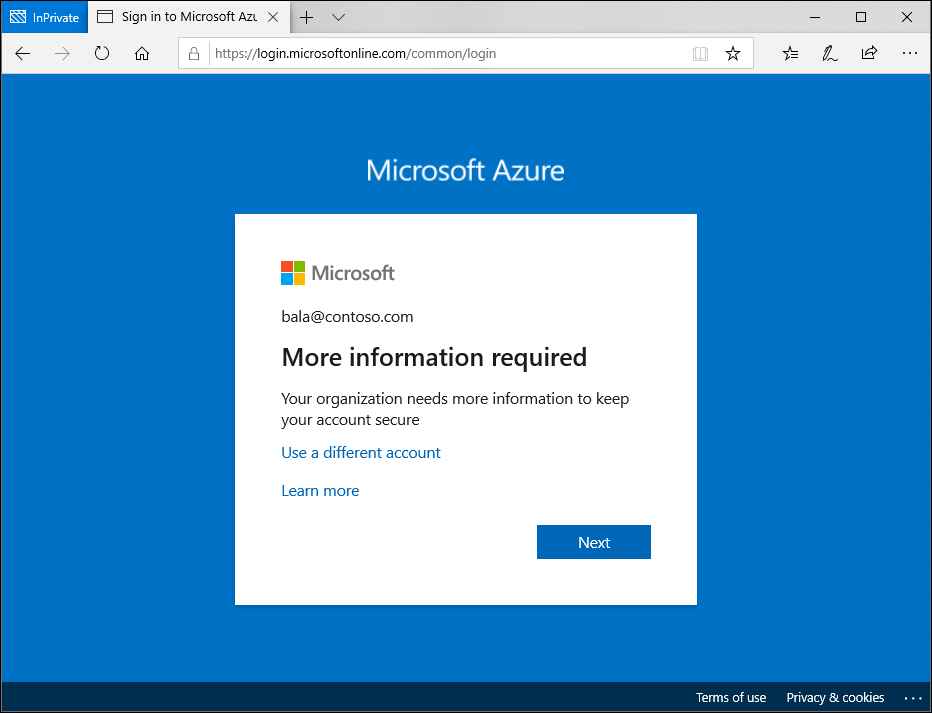

# User experiences with Microsoft Entra ID Protection

With Microsoft Entra ID Protection, you can:

* Require users to register for Microsoft Entra multifactor authentication
* Automate remediation of risky sign-ins and compromised users

All of the Identity Protection policies have an impact on the sign in experience for users. Allowing users to register for and use tools like Microsoft Entra multifactor authentication and self-service password reset can lessen the impact. These tools along with the appropriate policy choices gives users a self-remediation option when they need it.

## Multifactor authentication registration

Enabling the Identity Protection policy requiring Microsoft Entra multifactor authentication registration and targeting all of your users, will make sure that they can use Microsoft Entra multifactor authentication to self-remediate in the future. Configuring this policy gives your users a 14-day period where they can choose to register and at the end are forced to register.

### Registration interrupt

1. At sign-in to any Microsoft Entra integrated application, the user gets a notification about the requirement to set up the account for multifactor authentication. This policy is also triggered in the Windows 10 Out of Box Experience for new users with a new device.
   
    

1. Complete the guided steps to register for Microsoft Entra multifactor authentication and complete your sign-in.

## Risky sign-in remediation

When an administrator has configured a policy for sign-in risks, affected users are interrupted when they hit the configured risk level. 

### Risky sign-in self-remediation

1. The user is informed that something unusual was detected about their sign-in. This behavior could be something like, such as signing in from a new location, device, or app.
   
    

1. The user is required to prove their identity by completing Microsoft Entra multifactor authentication with one of their previously registered methods. 

### Risky sign-in administrator unblock

Administrators can choose to block users upon sign-in depending on their risk level. To get unblocked, end users must contact their IT staff, or they can try signing in from a familiar location or device. Self-remediation by performing multifactor authentication isn't an option in this case.

IT staff can follow the instructions in the section [Unblocking users](howto-identity-protection-remediate-unblock.md#unblocking-based-on-sign-in-risk) to allow users to sign back in.

## Risky user remediation

When a user risk policy has been configured, users who meet the user risk level probability of compromise must go through the user compromise recovery flow before they can sign in. 

### Risky user self-remediation

1. The user is informed that their account security is at risk because of suspicious activity or leaked credentials.
   
    

1. The user is required to prove their identity by completing Microsoft Entra multifactor authentication with one of their previously registered methods. 
1. Finally, the user is forced to change their password using self-service password reset since someone else may have had access to their account.

## Risky sign-in administrator unblock

Administrators can choose to block users upon sign-in depending on their risk level. To get unblocked, end users must contact their IT staff. Self-remediation by performing multifactor authentication and self-service password reset isn't an option in this case.

IT staff can follow the instructions in the section [Unblocking users](howto-identity-protection-remediate-unblock.md#unblocking-based-on-user-risk) to allow users to sign back in.

## High risk technician

If your organization has users who are delegated access to another tenant and they trigger high risk they may be blocked from signing into those other tenants. For example: 

1. An organization has a managed service provider (MSP) or cloud solution provider (CSP) who takes care of configuring their cloud environment. 
1. One of the MSPs technicians credentials are leaked and triggers high risk. That technician is blocked from signing in to other tenants. 
1. The technician can self-remediate and sign in if the home tenant has enabled the appropriate policies [requiring password change for high risk users](../conditional-access/howto-conditional-access-policy-risk-user.md) or [MFA for risky users](../conditional-access/howto-conditional-access-policy-risk.md). 
   1. If the home tenant hasn't enabled self-remediation policies, an administrator in the technician's home tenant will have to [remediate the risk](howto-identity-protection-remediate-unblock.md#risk-remediation).

## See also

- [Remediate risks and unblock users](howto-identity-protection-remediate-unblock.md)

- [Microsoft Entra ID Protection](./overview-identity-protection.md)
