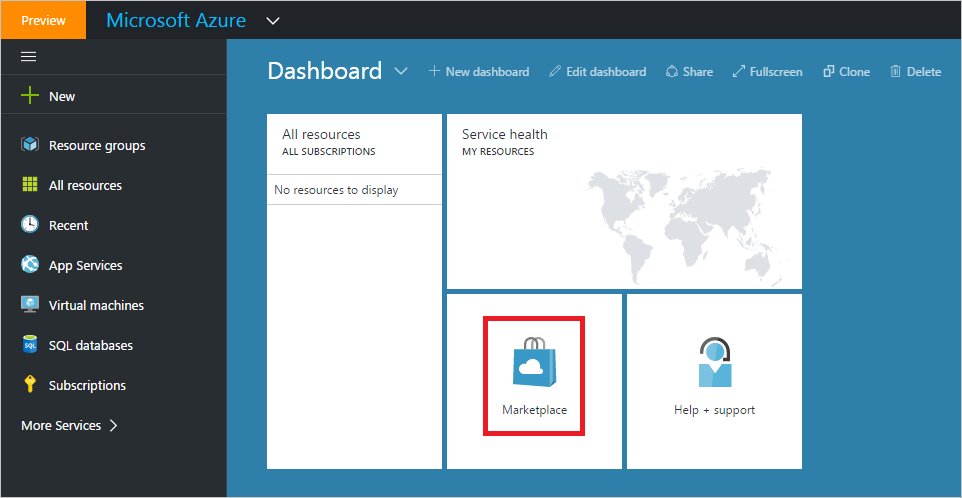
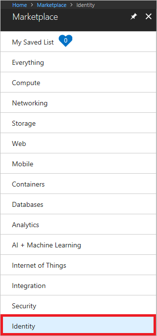
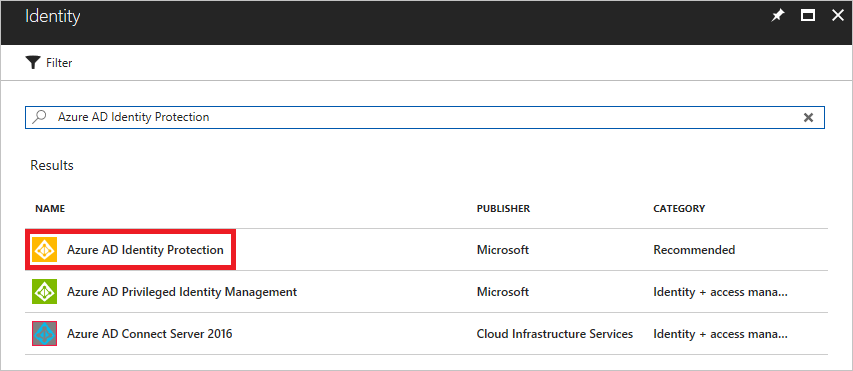
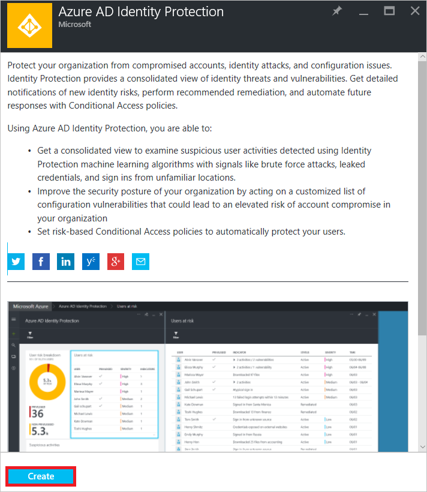

# Enabling Azure Active Directory Identity Protection

Azure Active Directory Identity Protection is a capability of Azure Active Directory (Azure AD). With Azure AD Identity Protection, you are able to:

- Get a consolidated view of flagged users and risk events detected using machine learning algorithms
- Set risk-based Conditional Access policies to automatically protect your users
- Improve security posture by acting on vulnerabilities 

For more information, see [Azure Active Directory Identity Protection](../active-directory-identityprotection.md).

This article shows how to enable Azure Active Directory Identity Protection.

## Steps to enable Azure Active Directory Identity Protection

1. Sign-on to your [Azure portal](https://ms.portal.azure.com/) as global administrator. 

2. In the Azure portal, click **Marketplace**.
   
    

3. In the applications list, click **Identity**.
   
    

4. Click **Azure AD Identity Protection**.
   
    

5. On the **Azure AD Identity Protection** blade, click **Create**.
   
    

## Next Steps
* [Azure Active Directory Identity Protection](../active-directory-identityprotection.md)
