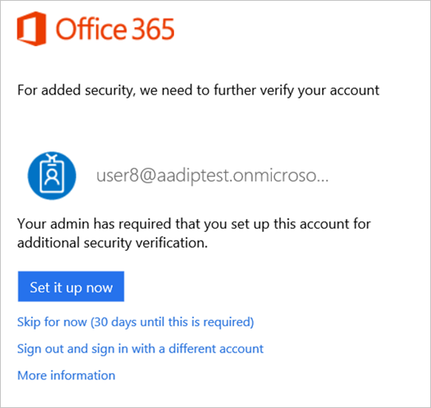
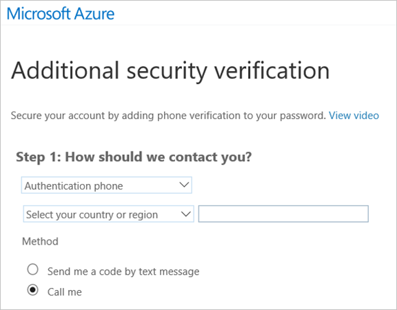
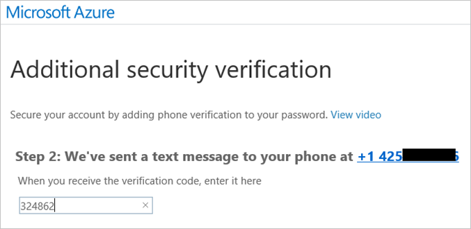
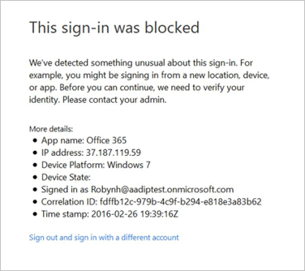
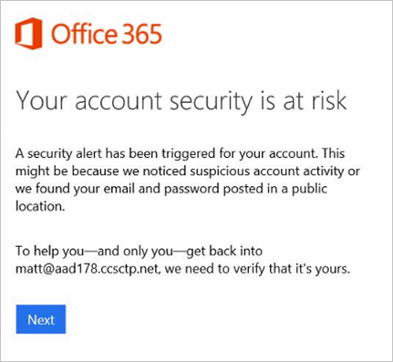
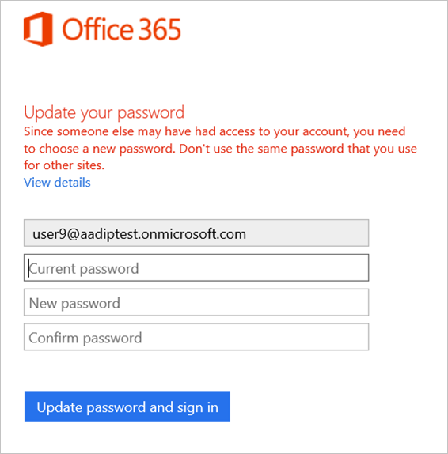
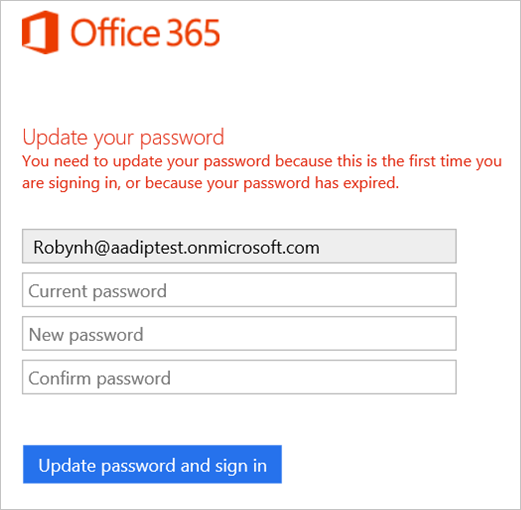

# Sign-in experiences with Azure AD Identity Protection
With Azure Active Directory Identity Protection, you can:

* require users to register for multi-factor authentication
* handle risky sign-ins and compromised users

The response of the system to these issues has an impact on a user's sign-in experience because directly signing-in by providing a user name and a password won't be possible anymore. Additional steps are required to get a user safely back into business.

This article gives you an overview of a user's sign-in experience for all cases that can occur.

**Multi-factor authentication**

* Multi-factor authentication registration

**Sign-in at risk**

* Risky sign-in recovery
* Risky sign-in blocked
* Multi-factor authentication registration during a risky sign-in

**User at risk**

* Compromised account recovery
* Compromised account blocked

## Multi-factor authentication registration
The best user experience for both, the compromised account recovery flow and the risky sign-in flow, is when the user can self-recover. If users are registered for multi-factor authentication, they already have a phone number associated with their account that can be used to pass security challenges. No help desk or administrator involvement is needed to recover from account compromise. Thus, it’s highly recommended to get your users registered for multi-factor authentication. 

Administrators can set a policy that requires users to set up their accounts for additional security verification. This policy allows users to skip multi-factor authentication registration for up to 14 days. The 14-day grace period is not configurable.

**The multi-factor authentication registration has three steps:**

1. In the first step, the user gets a notification about the requirement to set the account up for multi-factor authentication. 
   
    
2. To set up multi-factor authentication, you need to let the system know how you want to be contacted.
   
    
3. The system submits a challenge to you and you need to respond.
   
    

## Risky sign-in recovery
When an administrator has configured a policy for sign-in risks, the affected users are notified when they try to sign in. 

**The risky sign-in flow has two steps:** 

1. The user is informed that something unusual was detected about their sign-in, such as signing in from a new location, device, or app. 
   
    
2. The user is required to prove their identity by solving a security challenge. If the user is registered for multi-factor authentication they need to round trip a security code to their phone number. Since this is just a risky sign in and not a compromised account, the user won’t have to change the password in this flow. 
   
    

## Risky sign-in blocked
Administrators can also choose to set a Sign-In Risk policy to block users upon sign-in depending on the risk level. To get unblocked, end users must contact an administrator or help desk, or they can try signing in from a familiar location or device. Self-recovering by solving multi-factor authentication is not an option in this case.

## Compromised account recovery
When a user risk security policy has been configured, users who meet the user risk level specified in the policy (and are therefore assumed compromised) must go through the user compromise recovery flow before they can sign in. 

**The user compromise recovery flow has three steps:**

1. The user is informed that their account security is at risk because of suspicious activity or leaked credentials.
   
    
2. The user is required to prove their identity by solving a security challenge. If the user is registered for multi-factor authentication they can self-recover from being compromised. They will need to round trip a security code to their phone number. 
   
   
3. Finally, the user is forced to change their password since someone else may have had access to their account. 
   Screenshots of this experience are below.
   
   

## Compromised account blocked
To get a user that was blocked by a user risk security policy unblocked, the user must contact an administrator or help desk. Self-recovering by solving multi-factor authentication is not an option in this case.

## Reset password
If compromised users are blocked from signing in, an administrator can generate a temporary password for them. The users will have to change their password during a next sign-in.

## See also
* [Azure Active Directory Identity Protection](../active-directory-identityprotection.md) 

