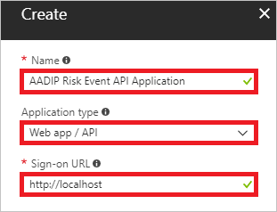
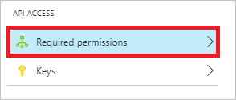
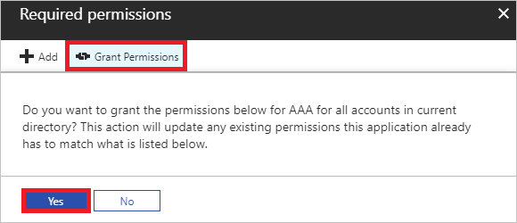
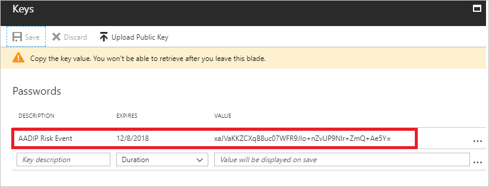

# Get started with Azure Active Directory Identity Protection and Microsoft Graph
Microsoft Graph is the Microsoft unified API endpoint and the home of [Azure Active Directory Identity Protection](../active-directory-identityprotection.md) APIs. The first API, **identityRiskEvents**, allows you to query Microsoft Graph for a list of [risk events](../reports-monitoring/concept-risk-events.md) and associated information. This article gets you started querying this API. For an in-depth introduction, full documentation, and access to the Graph Explorer, see the [Microsoft Graph site](https://graph.microsoft.io/).

There are four steps to accessing Identity Protection data through Microsoft Graph:

1. Retrieve your domain name.
2. Create a new app registration. 
2. Use this secret and a few other pieces of information to authenticate to Microsoft Graph, where you receive an authentication token. 
3. Use this token to make requests to the API endpoint and get Identity Protection data back.

Before you get started, you’ll need:

* Administrator privileges to create the application in Azure AD
* The name of your tenant's domain (for example, contoso.onmicrosoft.com)

## Retrieve your domain name 

1. [Sign in](https://portal.azure.com) to your Azure portal as an administrator. 

2. On the left navigation pane, click **Active Directory**. 
   
    

3. In the **Manage** section, click **Properties**.

    

4. Copy your domain name.

## Create a new app registration

1. On the **Active Directory** page, in the **Manage** section, click **App registrations**.

    

2. In the menu on the top, click **New application registration**.
   
    

3. On the **Create** page,  perform the following steps:
   
    

    a. In the **Name** textbox, type a name for your application (e.g.: AADIP Risk Event API Application).
   
    b. As **Type**, select **Web Application And / Or Web API**.
   
    c. In the **Sign-on URL** textbox, type `http://localhost`.

    d. Click **Create**.

4. To open the **Settings** page, in the applications list, click your newly created app registration. 

5. Copy the **Application ID**.

## Grant your application permission to use the API

1. On the **Settings** page, click **Required permissions**.
   
    

2. On the **Required permissions** page, in the toolbar on the top, click **Add**.
   
    
   
3. On the **Add API access** page, click **Select an API**.
   
    

4. On the **Select an API** page, select **Microsoft Graph**, and then click **Select**.
   
    

5. On the **Add API access** page, click **Select permissions**.
   
    

6. On the **Enable Access** page, click **Read all identity risk information**, and then click **Select**.
   
    

7. On the **Add API access** page, click **Done**.
   
    

8. On the **Required Permissions** page, click **Grant Permissions**, and then click **Yes**.
   
    

## Get an access key

1. On the **Settings** page, click **Keys**.
   
    

2. On the **Keys** page, perform the following steps:
   
    

    a. In the **Key description** textbox, type a description (for example, *AADIP Risk Event*).
    
    b. As **Duration**, select **In 1 year**.

    c. Click **Save**.
   
    d. Copy the key value, and then paste it into a safe location.   
   
   > [!NOTE]
   > If you lose this key, you will have to return to this section and create a new key. Keep this key a secret: anyone who has it can access your data.
   > 
   > 

## Authenticate to Microsoft Graph and query the Identity Risk Events API
At this point, you should have:

- The name of your tenant's domain

- The client ID 

- The key 

To authenticate, send a post request to `https://login.microsoft.com` with the following parameters in the body:

- grant_type: “**client_credentials**”

-  resource: “**https://graph.microsoft.com**”

- client_id: \<your client ID\>

- client_secret: \<your key\>

If successful, this returns an authentication token.  
To call the API, create a header with the following parameter:

    `Authorization`=”<token_type> <access_token>"

When authenticating, you can find the token type and access token in the returned token.

Send this header as a request to the following API URL: `https://graph.microsoft.com/beta/identityRiskEvents`

The response, if successful, is a collection of identity risk events and associated data in the OData JSON format, which can be parsed and handled as you see fit.

Here’s sample code for authenticating and calling the API using PowerShell.  
Just add your client ID, the secret key, and the tenant domain.

    $ClientID       = "<your client ID here>"        # Should be a ~36 hex character string; insert your info here
    $ClientSecret   = "<your client secret here>"    # Should be a ~44 character string; insert your info here
    $tenantdomain   = "<your tenant domain here>"    # For example, contoso.onmicrosoft.com

    $loginURL       = "https://login.microsoft.com"
    $resource       = "https://graph.microsoft.com"

    $body       = @{grant_type="client_credentials";resource=$resource;client_id=$ClientID;client_secret=$ClientSecret}
    $oauth      = Invoke-RestMethod -Method Post -Uri $loginURL/$tenantdomain/oauth2/token?api-version=1.0 -Body $body

    Write-Output $oauth

    if ($oauth.access_token -ne $null) {
        $headerParams = @{'Authorization'="$($oauth.token_type) $($oauth.access_token)"}

        $url = "https://graph.microsoft.com/beta/identityRiskEvents"
        Write-Output $url

        $myReport = (Invoke-WebRequest -UseBasicParsing -Headers $headerParams -Uri $url)

        foreach ($event in ($myReport.Content | ConvertFrom-Json).value) {
            Write-Output $event
        }

    } else {
        Write-Host "ERROR: No Access Token"
    } 

## Next steps

Congratulations, you just made your first call to Microsoft Graph!  
Now you can query identity risk events and use the data however you see fit.

To learn more about Microsoft Graph and how to build applications using the Graph API, check out the [documentation](https://graph.microsoft.io/docs) and much more on the [Microsoft Graph site](https://graph.microsoft.io/). Also, make sure to bookmark the [Azure AD Identity Protection API](https://graph.microsoft.io/docs/api-reference/beta/resources/identityprotection_root) page that lists all of the Identity Protection APIs available in Graph. As we add new ways to work with Identity Protection via API, you’ll see them on that page.

For related information, see:

-  [Azure Active Directory Identity Protection](../active-directory-identityprotection.md)

-  [Types of risk events detected by Azure Active Directory Identity Protection](../reports-monitoring/concept-risk-events.md)

- [Microsoft Graph](https://graph.microsoft.io/)

- [Overview of Microsoft Graph](https://graph.microsoft.io/docs)

- [Azure AD Identity Protection Service Root](https://graph.microsoft.io/docs/api-reference/beta/resources/identityprotection_root)

