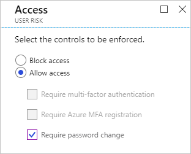
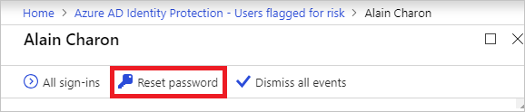
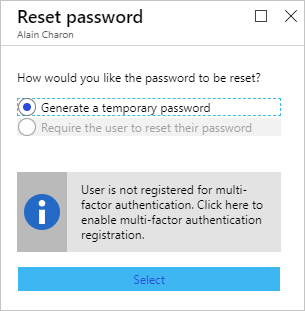
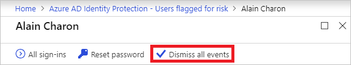
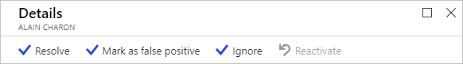

# How To: Close active risk detections

With [risk detections](../reports-monitoring/concept-risk-events.md), Azure Active Directory detects indicators for potentially compromised user accounts. As an administrator, you want to get all risk detections closed, so that the affected users are no longer at risk.

This article gives you an overview of the additional options you have to close active risk detections.

## Options to close risk detections 

The status of a risk detection is either **active** or **closed**. All active risk detections contribute to the calculation of a value called user risk level. The user risk level is an indicator (low, medium, high) for the probability that an account has been compromised. 

To close active risk detections, you have the following options:

- Require password reset with a user risk policy
- Manual password reset
- Dismiss all risk detections 
- Close individual risk detections manually

## Require password reset with a user risk policy

By configuring the [user risk Conditional Access policy](howto-user-risk-policy.md), you can require a password change if a specified user risk level has been automatically detected. 

A password reset closes all active risks events of the related user and brings the identity back into a safe state. Using a user risk policy is the preferred method to close active risk detections because this method is automated. There is no interaction required between the affected user and help desk or an administrator.

However, using a user risk policy is not always applicable. This applies, for example, to:

- Users that have not been registered for multi-factor authentication (MFA).
- Users with active risk detections that have been deleted.
- An investigation that reveals that a reported risk detection has been performed by the legitimate user.

## Manual password reset

If requiring a password reset using a user risk policy is not an option, you can get all risk detections for a user closed with a manual password reset.

The related dialog provides two different methods to reset a password:

**Generate a temporary password** - By generating a temporary password, you can immediately bring an identity back into a safe state. This method requires interacting with the affected users because they need to know what the temporary password is. You can, for example, send the new temporary password to an alternate email address for the user or to the user's manager. Because the password is temporary, the user is prompted to change the password during the next sign-in.

**Require the user to reset password** - Requiring the users to reset passwords enables self-recovery without contacting help desk or an administrator. Like in the case of a user risk policy, this method only applies to users that are registered for MFA. For users that have not been registered for MFA yet, this option isn't available.

## Dismiss all risk detections

If a password reset is not an option for you, you can also dismiss all risk detections. 

When you click **Dismiss all events**, all events are closed and the affected user is no longer at risk. However, because this method doesn't have an impact on the existing password, it doesn't bring the related identity back into a safe state. The preferred use case for this method is a deleted user with active risk detections. 

## Close individual risk detections manually

You can close individual risk detections manually. By closing risk detections manually, you can lower the user risk level. Typically, risk detections are closed manually in response to a related investigation. For example, when talking to a user reveals that an active risk detection is not required anymore. 
 
When closing risk detections manually, you can choose to take any of the following actions to change the status of a risk detection:

- **Resolve** - If after investigating a risk detection, you took an appropriate remediation action outside Identity Protection, and you believe that the risk detection should be considered closed, mark the event as Resolved. Resolved events will set the risk detection’s status to Closed and the risk detection will no longer contribute to user risk.
- **Mark as false-positive** - In some cases, you may investigate a risk detection and discover that it was incorrectly flagged as a risky. You can help reduce the number of such occurrences by marking the risk detection as False-positive. This will help the machine learning algorithms to improve the classification of similar events in the future. The status of false-positive events is to Closed and they will no longer contribute to user risk.
- **Ignore** - If you have not taken any remediation action, but want the risk detection to be removed from the active list, you can mark a risk detection Ignore and the event status will be Closed. Ignored events do not contribute to user risk. This option should only be used under unusual circumstances.
- **Reactivate** - Risk detections that were manually closed (by choosing Resolve, False positive, or Ignore) can be reactivated, setting the event status back to Active. Reactivated risk detections contribute to the user risk level calculation. Risk detections closed through remediation (such as a secure password reset) cannot be reactivated.

## Next steps

To get an overview of Azure AD Identity Protection, see the [Azure AD Identity Protection overview](overview.md).
