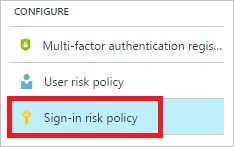
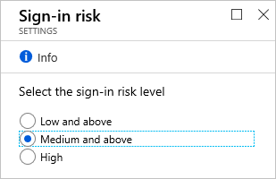
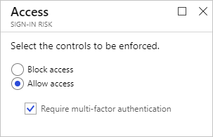
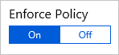
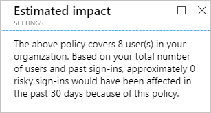
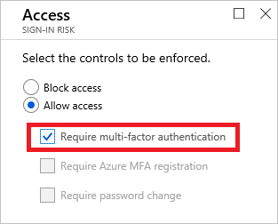
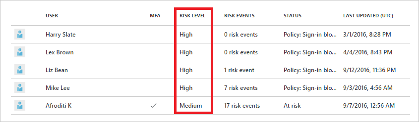
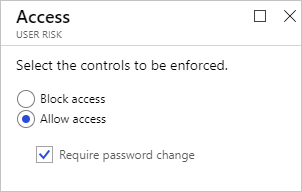
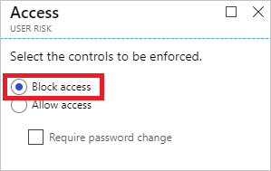

# How To: Configure risk policies in Azure Active Directory identity protection (refreshed)

Azure AD detects risk events that are indicators for potentially compromised identities. By configuring risk policies, you can define automated responses to the detection results:

- With the sign-in risk policy, you can configure a response to real-time risk events that were detected during a user's sign-in. 
- With the user risk policy, you can configure a response to all active user risks that have been detected for a user over time.  

> [!VIDEO https://www.youtube.com/embed/zEsbbik-BTE]

## What is the sign-in risk policy?

Azure AD analyzes each sign-in of a user. The objective of the analysis is to detect suspicious actions that come along with the sign-in. For example, is the sign-in done using an anonymous IP address, or is the sign-in initiated from an unfamiliar location? In Azure AD, the suspicious actions the system can detect are also known as risk events. Based on the risk events that have been detected during a sign-in, Azure AD calculates a value. The value represents the probability (low, medium, high) that the sign-in is not performed by the legitimate user. The probability is called **sign-in risk level**.

The sign-in risk policy is an automated response you can configure for a specific sign-in risk level. In your response, you can block access to your resources or require passing a multi-factor authentication (MFA) challenge to gain access.

When a user successfully completes an MFA prompt triggered by the sign-in risk policy, it gives feedback to Identity Protection that the sign-in originated from the legitimate user. Thus, the sign-in risk event that triggered the MFA prompt will automatically be closed and Identity Protection will prevent this event from contributing to the elevation of user risk. Enabling the sign-in risk policy can reduce noisiness in the risky sign-ins view by allowing users to self-remediate when prompted for MFA and subsequently automatically closing the associated risky sign-in.

## How do I access the sign-in risk policy?
   
The sign-in risk policy is in the **Configure** section on the [Azure AD Identity Protection page](https://portal.azure.com/#blade/Microsoft_AAD_ProtectionCenter/IdentitySecurityDashboardMenuBlade/SignInPolicy).
   

## Sign-in risk policy settings

When you configure the sign-in risk policy, you need to set:

- The users and groups the policy applies to:

    

- The sign-in risk level that triggers the policy:

    

- The type of access you want to be enforced when your sign-in risk level has been met:  

    

- The state of your policy:

    

The policy configuration dialog provides you with an option to estimate the impact of reconfiguration.

## What you should know about sign-in risk policies

You can configure a sign-in risk security policy to require MFA:

However, for security reasons, this setting only works for users that have already been registered for MFA. Identity protection blocks users with an MFA requirement if they are not registered for MFA yet.

If you want to require MFA for risky sign-ins, you should:

1. Enable the multi-factor authentication registration policy for the affected users.

2. Require the affected users to login in a non-risky session to perform an MFA registration.

Completing these steps ensures that multi-factor authentication is required for a risky sign-in.

The sign-in risk policy is:

- Applied to all browser traffic and sign-ins using modern authentication.

- Not applied to applications using older security protocols by disabling the WS-Trust endpoint at the federated IDP, such as ADFS.

For an overview of the related user experience, see:

* [Risky sign-in recovery](flows.md#risky-sign-in-recovery)
* [Risky sign-in blocked](flows.md#risky-sign-in-blocked)  
* [Sign-in experiences with Azure AD Identity Protection](flows.md)  

## What is a user risk policy?

Azure AD analyzes each sign-in of a user. The objective of the analysis is to detect suspicious actions that come along with the sign-in. In Azure AD, the suspicious actions the system can detect are also known as risk events. While some risk events can be detected in real-time, there are also risk events requiring more time. For example, to detect an impossible travel to atypical locations, the system requires an initial learning period of 14 days to learn about a user's regular behavior. There are several options to resolve detected risk events. For example, you can resolve individual risk events manually, or you can get them resolved using a sign-in risk or a user risk Conditional Access policy.

All risk events that have been detected for a user and didn't get resolved are known as active risk events. The active risk events that are associated with a user are known as user risk. Based on the user risk, Azure AD calculates a probability (low, medium, high) that a user has been compromised. The probability is called user  risk level.

The user risk policy is an automated response you can configure for a specific user risk level. With a user risk policy, you can block access to your resources or require a password change to get a user account back into a clean state.

## How do I access the user risk policy?
   
The user risk policy is in the **Configure** section on the [Azure AD Identity Protection page](https://portal.azure.com/#blade/Microsoft_AAD_ProtectionCenter/IdentitySecurityDashboardMenuBlade/SignInPolicy).
   

## User risk policy settings

When you configure the user risk policy, you need to set:

- The users and groups the policy applies to:

    

- The sign-in risk level that triggers the policy:

    

- The type of access you want to be enforced when your sign-in risk level has been met:  

    

- The state of your policy:

    

The policy configuration dialog provides you with an option to estimate the impact of your configuration.

## What you should know about user risk polices

You can set a user risk security policy to block users upon sign-in depending on the risk level.

Blocking a sign-in:

* Prevents the generation of new user risk events for the affected user
* Enables administrators to manually remediate the risk events affecting the user's identity and restore it to a secure state

## Best practices

Choosing a **High** threshold reduces the number of times a policy is triggered and minimizes the impact to users.  

However, it excludes **Low** and **Medium** sign-ins flagged for risk from the policy, which may not block an attacker from exploiting a compromised identity.

When setting the policy,

- Exclude users who do not/cannot have multi-factor authentication

- Exclude users in locales where enabling the policy is not practical (for example no access to helpdesk)

- Exclude users who are likely to generate many false-positives (developers, security analysts)

- Use a **High** threshold during initial policy roll-out, or if you must minimize challenges seen by end users.

- Use a **Low**  threshold if your organization requires greater security. Selecting a **Low** threshold introduces additional user sign-in challenges, but increased security.

The recommended default for most organizations is to configure a rule for a **Medium** threshold to strike a balance between usability and security.

## Next steps

 [Channel 9: Azure AD and Identity Show: Identity Protection Preview](https://channel9.msdn.com/Series/Azure-AD-Identity/Azure-AD-and-Identity-Show-Identity-Protection-Preview)

