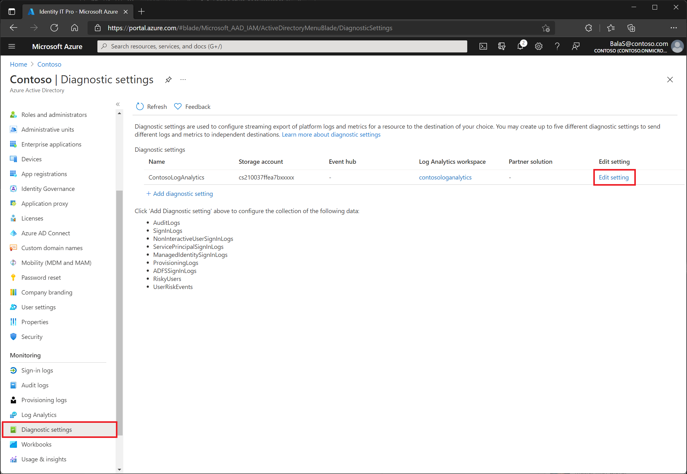
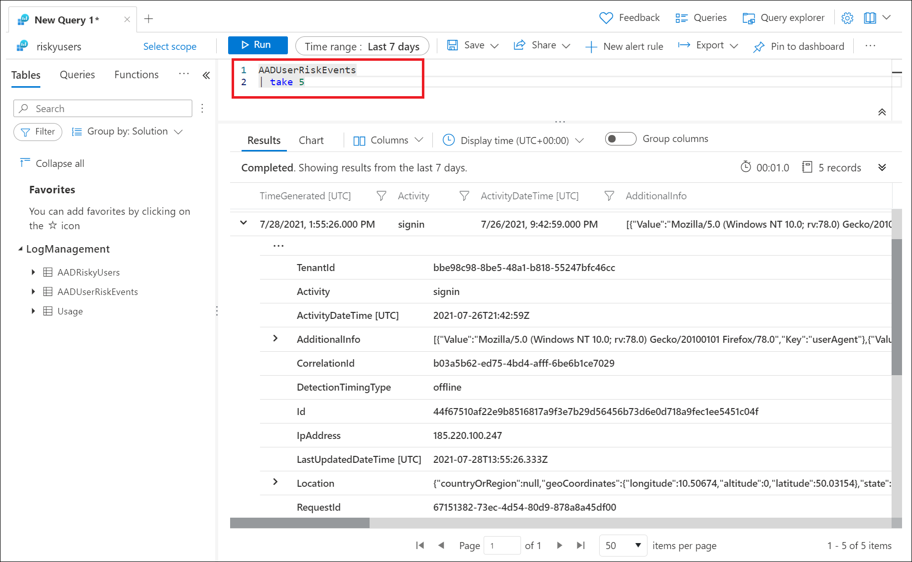

# How To: Export risk data

Azure AD stores reports and security signals for a defined period of time. When it comes to risk information, that may not be long enough.

| Report / Signal | Azure AD Free | Azure AD Premium P1 | Azure AD Premium P2 |
| --- | --- | --- | --- |
| Audit logs | 7 days | 30 days | 30 days |
| Sign-ins | 7 days | 30 days | 30 days |
| Azure AD MFA usage | 30 days | 30 days | 30 days |
| Risky sign-ins | 7 days | 30 days | 30 days |

Organizations can choose to store data for longer periods by changing diagnostic settings in Azure AD to send **RiskyUsers** and **UserRiskEvents** data to a Log Analytics workspace, archive data to a storage account, stream data to an Event Hub, or send data to a partner solution. Find these options in the **Azure portal** > **Azure Active Directory**, **Diagnostic settings** > **Edit setting**. If you don't have a diagnostic setting, follow the instructions in the article [Create diagnostic settings to send platform logs and metrics to different destinations](../../azure-monitor/essentials/diagnostic-settings.md) to create one.

>[!NOTE]
>The diagnostic settings for RiskyUsers and UserRiskEvents are currently in public preview.

[  ](./media/howto-export-risk-data/change-diagnostic-setting-in-portal.png#lightbox)

## Log Analytics

Log Analytics allows organizations to query data using built in queries or custom created Kusto queries, for more information, see [Get started with log queries in Azure Monitor](../../azure-monitor/logs/get-started-queries.md).

Once enabled you will find access to Log Analytics in the **Azure portal** > **Azure AD** > **Log Analytics**. The tables of most interest to Identity Protection administrators are **AADRiskyUsers** and **AADUserRiskEvents**.

- AADRiskyUsers - Provides data like the **Risky users** report in Identity Protection.
- AADUserRiskEvents - Provides data like the **Risk detections** report in Identity Protection.

[  ](./media/howto-export-risk-data/log-analytics-view-query-user-risk-events.png#lightbox)

In the image above, the following query was run to show the most recent five risk detections triggered. 

```kusto
AADUserRiskEvents
| take 5
```

Another option is to query the AADRiskyUsers table to see all risky users.

```kusto
AADRiskyUsers
```

> [!NOTE]
> Log Analytics only has visibility into data as it is streamed. Events prior to enabling the sending of events from Azure AD do not appear.

## Storage account

By routing logs to an Azure storage account, you can keep it for longer than the default retention period. For more information, see the article [Tutorial: Archive Azure AD logs to an Azure storage account](../reports-monitoring/quickstart-azure-monitor-route-logs-to-storage-account.md).

## Azure Event Hubs

Azure Event Hubs can look at incoming data from sources like Azure AD Identity Protection and provide real-time analysis and correlation. For more information, see the article [Tutorial: Stream Azure Active Directory logs to an Azure event hub](../reports-monitoring/tutorial-azure-monitor-stream-logs-to-event-hub.md)

## Other options

Organizations can choose to [connect Azure AD data to Azure Sentinel](../../sentinel/connect-azure-ad-identity-protection.md) as well for further processing.

Organizations can use the [Microsoft Graph API to programatically interact with risk events](howto-identity-protection-graph-api.md).

## Next steps

- [What is Azure Active Directory monitoring?](../reports-monitoring/overview-monitoring.md)
- [Install and use the log analytics views for Azure Active Directory](../reports-monitoring/howto-install-use-log-analytics-views.md)
- [Connect data from Azure Active Directory (Azure AD) Identity Protection](../../sentinel/connect-azure-ad-identity-protection.md)
- [Azure Active Directory Identity Protection and the Microsoft Graph PowerShell SDK](howto-identity-protection-graph-api.md)
- [Tutorial: Stream Azure Active Directory logs to an Azure event hub](../reports-monitoring/tutorial-azure-monitor-stream-logs-to-event-hub.md)
