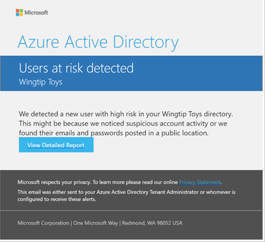
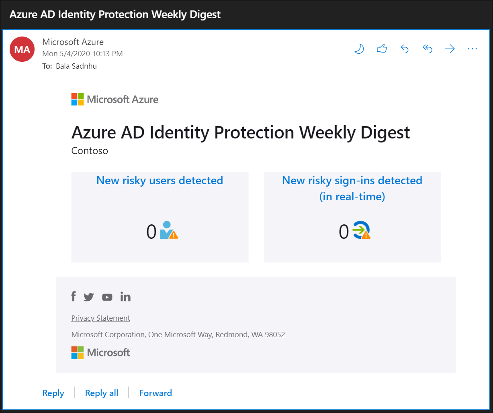

# Microsoft Entra ID Protection notifications

Microsoft Entra ID Protection sends two types of automated notification emails to help you manage user risk and risk detections:

- Users at risk detected email
- Weekly digest email

This article provides you with an overview of both notification emails.

   > [!Note]
   > **We don't support sending emails to users in group-assigned roles.**

## Users at risk detected email

In response to a detected account at risk, Microsoft Entra ID Protection generates an email alert with **Users at risk detected** as subject. The email includes a link to the **[Users flagged for risk](./overview-identity-protection.md)** report. As a best practice, you should immediately investigate the users at risk.

The configuration for this alert allows you to specify at what user risk level you want the alert to be generated. The email will be generated when the user's risk level reaches what you have specified. For example, if you set the policy to alert on medium user risk and your user John's user risk score moves to medium risk because of a real-time sign-in risk, you'll receive the users at risk detected email. If the user has subsequent risk detections that cause the user risk level calculation to be the specified risk level (or higher), you'll receive more user at risk detected emails when the user risk score is recalculated. For example, if a user moves to medium risk on January 1, you'll receive an email notification if your settings are set to alert on medium risk. If that same user then has another risk detection on January 5 that's also medium risk, and the user risk score is recalculated and is still medium, you'll receive another email notification. 

However, an extra email notification will only be sent if the time the risk detection occurred (that caused the change in user risk level) is more recent than when the last email was sent. For example, a user signs in on January 1 at 5 AM and there's no real-time risk (meaning no email would be generated because of that sign-in). 10 minutes later, at 5:10 AM, the same user signs-in again and has high real-time risk, causing the user risk level to move to high and an email to be sent. Then, at 5:15 AM, the offline risk score for the original sign-in at 5 AM changes to high risk because of offline risk processing. Another user flagged for risk e-mail wouldn't be sent, since the time of the first sign-in was before the second sign-in that already triggered an email notification.

To prevent an overload of e-mails, you'll only receive one email within a 5-second time period. This delay means that if multiple users move to the specified risk level during the same 5-second time period, we'll aggregate and send one e-mail to represent the change in risk level for all of them.

If your organization has enabled self-remediation as described in the article, [User experiences with Microsoft Entra ID Protection](concept-identity-protection-user-experience.md) there's a chance that the user may remediate their risk before you have the opportunity to investigate. You can see risky users and risky sign-ins that have been remediated by adding "Remediated" to the **Risk state** filter in either the **Risky users** or **Risky sign-ins** reports.

### Configure users at risk detected alerts

As an administrator, you can set:

- **The user risk level that triggers the generation of this email** - By default, the risk level is set to “High” risk.
- **The recipients of this email** - Users in the Global Administrator, Security Administrator, or Security Reader roles are automatically added to this list. We attempt to send emails to the first 20 members of each role. If a user is enrolled in PIM to elevate to one of these roles on demand, then **they will only receive emails if they are elevated at the time the email is sent**.
   - Optionally you can **Add custom email here** users defined must have the appropriate permissions to view the linked reports.

Configure the users at risk email in the [Microsoft Entra admin center](https://entra.microsoft.com) under **Protection** > **Identity Protection** > **Users at risk detected alerts**.

## Weekly digest email

The weekly digest email contains a summary of new risk detections.  
It includes:

- New risky users detected
- New risky sign-ins detected (in real time)
- Links to the related reports in Identity Protection

Users in the Global Administrator, Security Administrator, or Security Reader roles are automatically added to this list. We attempt to send emails to the first 20 members of each role. If a user is enrolled in PIM to elevate to one of these roles on demand, then **they will only receive emails if they are elevated at the time the email is sent**

### Configure weekly digest email

As an administrator, you can switch sending a weekly digest email on or off and choose the users assigned to receive the email.

Configure the weekly digest email in the [Microsoft Entra admin center](https://entra.microsoft.com) > **Protection** > **Identity Protection** > **Weekly digest**.

## See also

- [Microsoft Entra ID Protection](./overview-identity-protection.md)
