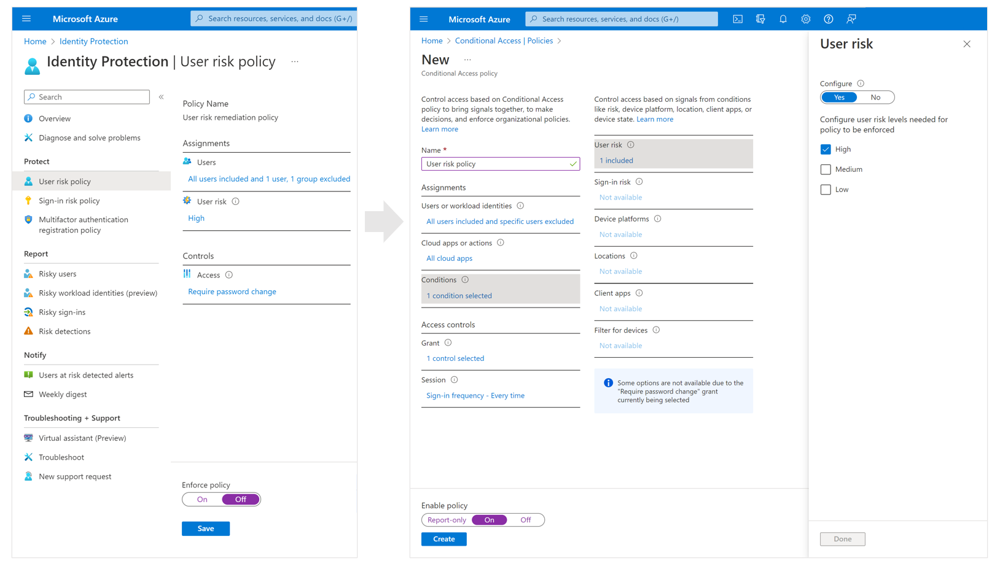
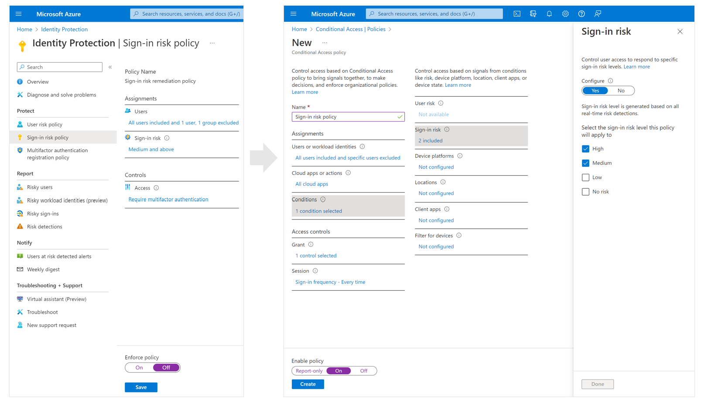

# Configure and enable risk policies

As we learned in the previous article, [Identity Protection policies](concept-identity-protection-policies.md), there're two types of risk policies in Azure AD Conditional Access you can set up to automate the response to risks and allow users to self-remediate when risk is detected:

- Sign-in risk policy
- User risk policy

## Choosing acceptable risk levels

Organizations must decide the level of risk they want to require access control on balancing user experience and security posture. 

Choosing to apply access control on a **High** risk level reduces the number of times a policy is triggered and minimizes the impact to users. However, it excludes **Low** and **Medium** risks from the policy, which may not block an attacker from exploiting a compromised identity. Selecting a **Low** risk level to require access control introduces more user interrupts.

Configured trusted [network locations](../conditional-access/location-condition.md) are used by Identity Protection in some risk detections to reduce false positives.

## Risk remediation

Organizations can choose to block access when risk is detected. Blocking sometimes stops legitimate users from doing what they need to. A better solution is to allow self-remediation using Azure AD Multi-Factor Authentication (MFA) and secure self-service password reset (SSPR).

## Microsoft's recommendation

Microsoft recommends the below risk policy configurations to protect your organization:

- User risk policy
   - Require a secure password reset when user risk level is **High**. Azure AD MFA is required before the user can create a new password with SSPR to remediate their risk. 
- Sign-in risk policy
   - Require Azure AD MF when sign-in risk level is **Medium** or **High**, allowing users to prove it's them by using one of their registered authentication methods, remediating the sign-in risk. 

Requiring access control when risk level is low will introduce more user interupts. Choosing to block access rather than allowing self-remediation options, like secure password reset and multi-factor authentication, will impact your users and administrators. Weigh these choices when configuring your policies.

> [!WARNING]
> Users must register for Azure AD MFA and SSPR before they face a situation requiring remediation. Users not registered are blocked and require administrator intervention.
> 
> Password change (I know my password and want to change it to something new) outside of the risky user policy remediation flow does not meet the requirement for secure password reset.

## Exclusions

Policies allow for excluding users such as your [emergency access or break-glass administrator accounts](../roles/security-emergency-access.md). Organizations may need to exclude other accounts from specific policies based on the way the accounts are used. Exclusions should be reviewed regularly to see if they're still applicable.

## Enable policies

Organizations can choose to deploy risk-based policies in Conditional Access using the steps outlined below or using the [Conditional Access templates (Preview)](../conditional-access/concept-conditional-access-policy-common.md#conditional-access-templates-preview).

Before organizations enable remediation policies, they may want to [investigate](howto-identity-protection-investigate-risk.md) and [remediate](howto-identity-protection-remediate-unblock.md) any active risks.

### User risk policy in Conditional Access

1. Sign in to the **Azure portal** as a Global Administrator, Security Administrator, or Conditional Access Administrator.
1. Browse to **Azure Active Directory** > **Security** > **Conditional Access**.
1. Select **New policy**.
1. Give your policy a name. We recommend that organizations create a meaningful standard for the names of their policies.
1. Under **Assignments**, select **Users or workload identities**.
   1. Under **Include**, select **All users**.
   1. Under **Exclude**, select **Users and groups** and choose your organization's emergency access or break-glass accounts. 
   1. Select **Done**.
1. Under **Cloud apps or actions** > **Include**, select **All cloud apps**.
1. Under **Conditions** > **User risk**, set **Configure** to **Yes**. 
   1. Under **Configure user risk levels needed for policy to be enforced**, select **High**.
   1. Select **Done**.
1. Under **Access controls** > **Grant**.
   1. Select **Grant access**, **Require password change**.
   1. Select **Select**.
1. Under **Session**.
   1. Select **Sign-in frequency**.
   1. Ensure **Every time** is selected.
   1. Select **Select**.
1. Confirm your settings, and set **Enable policy** to **On**.
1. Select **Create** to create to enable your policy.

### Sign-in risk policy in Conditional Access

1. Sign in to the **Azure portal** as a Global Administrator, Security Administrator, or Conditional Access Administrator.
1. Browse to **Azure Active Directory** > **Security** > **Conditional Access**.
1. Select **New policy**.
1. Give your policy a name. We recommend that organizations create a meaningful standard for the names of their policies.
1. Under **Assignments**, select **Users or workload identities**.
   1. Under **Include**, select **All users**.
   1. Under **Exclude**, select **Users and groups** and choose your organization's emergency access or break-glass accounts. 
   1. Select **Done**.
1. Under **Cloud apps or actions** > **Include**, select **All cloud apps**.
1. Under **Conditions** > **Sign-in risk**, set **Configure** to **Yes**. Under **Select the sign-in risk level this policy will apply to**. 
   1. Select **High** and **Medium**.
   1. Select **Done**.
1. Under **Access controls** > **Grant**.
   1. Select **Grant access**, **Require multi-factor authentication**.
   1. Select **Select**.
1. Under **Session**.
   1. Select **Sign-in frequency**.
   1. Ensure **Every time** is selected.
   1. Select **Select**.
1. Confirm your settings and set **Enable policy** to **On**.
1. Select **Create** to create to enable your policy.

## Migrate risk policies from Identity Protection to Conditional Access

While Identity Protection also provides two risk policies with limited conditions, we highly recommend setting up risk-based policies in Conditional Access for the following benefits:

   - Enhanced diagnostic data
   - Report-only mode integration
   - Graph API support
   - Use more Conditional Access attributes like sign-in frequency in the policy

If you already have risk policies enabled in Identity Protection, we highly recommend that you migrate them to Conditional Access:
1.	Create an equivalent risk policy in Conditional Access in report-only mode.
2.	Ensure that the new Conditional Access risk policy works as expected by testing it in report-only mode.
3.	Enable the new Conditional Access risk policy. You can choose to have it running for a period of time to ensure that it is working as expected before turning the Identity Protection risk policies off. 
4.	Disable the old risk policies in Identity Protection.
5.	Create additional risk policies if needed in Conditional Access.

Specific steps for the migration are listed below.

### Migrate User risk policy to Conditional Access

Example

#### Step 1 Create an equivalent user risk policy in Report-only mode Conditional Access
1. Sign in to the **Azure portal** as a Global Administrator, Security Administrator, or Conditional Access Administrator.
2. Browse to **Azure Active Directory** > **Security** > **Conditional Access**.
3. Select **New policy**.
4. Give your policy a name. We recommend that organizations create a meaningful standard for the names of their policies.
5. Under **Assignments**, select **Users or workload identities**.
   1. Under **What does this policy apply to?**, select **Users and groups**
   2. Under **Include**, select users and groups that are included in your current user risk policy in Identity Protection
   3.  Under **Exclude**, select select users and groups that are excluded from your current user risk policy
   4. Select **Done**.
6. Under **Cloud apps or actions** > **Include**, select **All cloud apps**.
7. Under **Conditions** > **User risk**, set **Configure** to **Yes**. 
   1. Under **Configure user risk levels needed for policy to be enforced**, select the risk levels that match the configuration in your current user risk policy
   1. Select **Done**.
8. Under **Access controls** > **Grant**.
   1. Select **Grant access**, select the access control that matches the configuration in your current user risk policy
   1. Select **Select**.
9. Under **Session**.
   1. Select **Sign-in frequency**.
   1. Ensure **Every time** is selected.
   1. Select **Select**.
10. Confirm your settings, and set **Enable policy** to **Report-only**.
11. Select **Create** to create to enable your policy in Report-only mode.
12. Test your new Conditional Access policy in Report-only mode to ensure that it is working as expected

#### Step 2 Enable the new Conditional Access user risk policy
13. Browse back to **Azure Active Directory** > **Security** > **Conditional Access**. 
14. Select this new policy to edit it.
15. Set **Enable policy** to **On** to turn the policy on

#### Step 3 Turn off your old user risk policy in Identity Protection
16. Browse to **Azure Active Directory** > **Identity Protection** > **User risk policy**  
17. Set **Enforce policy** to **Off**

### Migrate Sign-in risk policy to Conditional Access

Example

1. Sign in to the **Azure portal** as a Global Administrator, Security Administrator, or Conditional Access Administrator.
2. Browse to **Azure Active Directory** > **Security** > **Conditional Access**.
3. Select **New policy**.
4. Give your policy a name. We recommend that organizations create a meaningful standard for the names of their policies.
5. Under **Assignments**, select **Users or workload identities**.
   1. Under **What does this policy apply to?**, select **Users and groups**
   2. Under **Include**, select users and groups that are included in your current sign-in risk policy in Identity Protection
   3. Under **Exclude**, select users and groups that are excluded from your current sign-in risk policy
   4. Select **Done**.
6. Under **Cloud apps or actions** > **Include**, select **All cloud apps**.
7. Under **Conditions** > **Sign-in risk**, set **Configure** to **Yes**. 
   1. Under **Select the sign-in risk level this policy will apply to**. Select the risk levels that match the configuration in your current sign-in risk policy
   1. Select **Done**.
8. Under **Access controls** > **Grant**.
   1. Select **Grant access**, select the access control that matches the configuration in your current sign-in risk policy
   1. Select **Select**.
9. Under **Session**.
   1. Select **Sign-in frequency**.
   1. Ensure **Every time** is selected.
   1. Select **Select**.
10. Confirm your settings and set **Enable policy** to **Report-only**.
11. Select **Create** to create to enable your policy.

#### Step 2 Enable the new Conditional Access sign-in risk policy
13. Browse back to **Azure Active Directory** > **Security** > **Conditional Access**. 
14. Select this new policy to edit it.
15. Set **Enable policy** to **On** to turn the policy on

#### Step 3 Turn off your old sign-in risk policy in Identity Protection
16. Browse to **Azure Active Directory** > **Identity Protection** > **Sign-in risk policy**  
17. Set **Enforce policy** to **Off**

## Next steps

- [Enable Azure AD Multi-Factor Authentication registration policy](howto-identity-protection-configure-mfa-policy.md)
- [What is risk](concept-identity-protection-risks.md)
- [Investigate risk detections](howto-identity-protection-investigate-risk.md)
- [Simulate risk detections](howto-identity-protection-simulate-risk.md)
- [Require reauthentication every time](../conditional-access/howto-conditional-access-session-lifetime.md#require-reauthentication-every-time)
