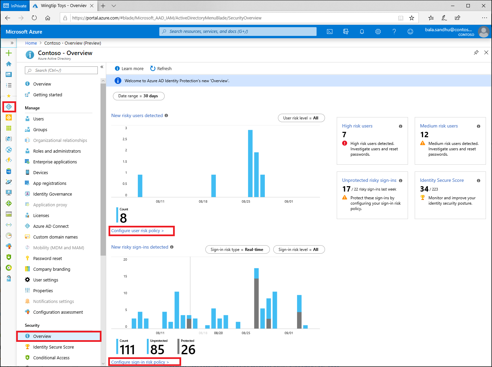

# How To: Configure and enable risk policies

As we learned in the previous article, [Identity Protection policies](concept-identity-protection-policies.md) we have two risk policies that we can enable in our directory. 

- Sign-in risk policy
- User risk policy

Both policies work to automate the response to risk detections in your environment and allow users to self-remediate when risk is detected. 

> [!VIDEO https://www.youtube.com/embed/zEsbbik-BTE]

## Prerequisites 

If your organization wants to allow users to self-remediate when risks are detected, users must be registered for both self-service password reset and Azure Multi-Factor Authentication. We recommend [enabling the combined security information registration experience](../authentication/howto-registration-mfa-sspr-combined.md) for the best experience. Allowing users to self-remediate gets them back to a productive state more quickly without requiring administrator intervention. Administrators can still see these events and investigate them after the fact. 

## Choosing acceptable risk levels

Organizations must decide the level of risk they are willing to accept balancing user experience and security posture. 

Microsoft's recommendation is to set the user risk policy threshold to **High** and the sign-in risk policy to **Medium and above**.

Choosing a **High** threshold reduces the number of times a policy is triggered and minimizes the impact to users. However, it excludes **Low** and **Medium** risk detections from the policy, which may not block an attacker from exploiting a compromised identity. Selecting a **Low** threshold introduces additional user interrupts, but increased security posture.

## Exclusions

All of the policies allow for excluding users such as your [emergency access or break-glass administrator accounts](../users-groups-roles/directory-emergency-access.md). Organizations may determine they need to exclude other accounts from specific policies based on the way the accounts are used. All exclusions should be reviewed regularly to see if they are still applicable.

Configured trusted [network locations](../conditional-access/location-condition.md) are used by Identity Protection in some risk detections to reduce false positives.

## Enable policies

To enable the user risk and sign-in risk policies complete the following steps.

1. Navigate to the [Azure portal](https://portal.azure.com).
1. Browse to **Azure Active Directory** > **Security** > **Identity Protection** > **Overview**.
1. Select **Configure user risk policy**.
   1. Under **Assignments**
      1. **Users** - Choose **All users** or **Select individuals and groups** if limiting your rollout.
         1. Optionally you can choose to exclude users from the policy.
      1. **Conditions** - **User risk** Microsoft's recommendation is to set this option to **High**.
   1. Under **Controls**
      1. **Access** - Microsoft's recommendation is to **Allow access** and **Require password change**.
   1. **Enforce Policy** - **On**
   1. **Save** - This action will return you to the **Overview** page.
1. Select **Configure sign-in risk policy**.
   1. Under **Assignments**
      1. **Users** - Choose **All users** or **Select individuals and groups** if limiting your rollout.
         1. Optionally you can choose to exclude users from the policy.
      1. **Conditions** - **Sign-in risk** Microsoft's recommendation is to set this option to **Medium and above**.
   1. Under **Controls**
      1. **Access** - Microsoft's recommendation is to **Allow access** and **Require multi-factor authentication**.
   1. **Enforce Policy** - **On**
   1. **Save**

## Next steps

- [Enable Azure Multi-Factor Authentication registration policy](howto-identity-protection-configure-mfa-policy.md)

- [What is risk](concept-identity-protection-risks.md)

- [Investigate risk detections](howto-identity-protection-investigate-risk.md)

- [Simulate risk detections](howto-identity-protection-simulate-risk.md)
