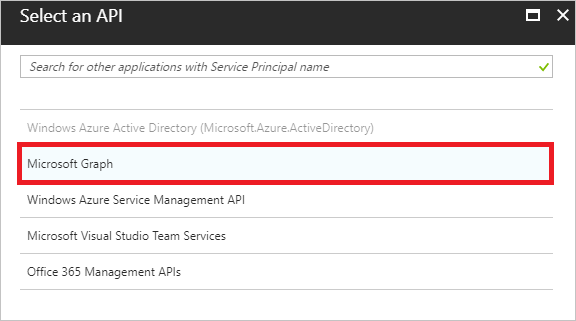
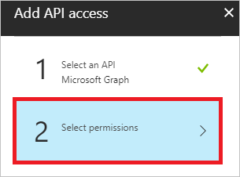
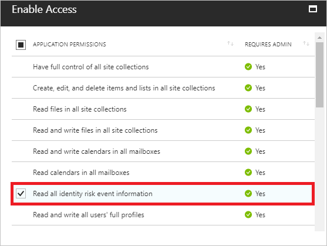
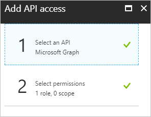
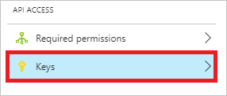

# Get started with Azure Active Directory Identity Protection and Microsoft Graph

Microsoft Graph is the Microsoft unified API endpoint and the home of [Azure Active Directory Identity Protection](../active-directory-identityprotection.md) APIs. There are four APIs that expose information about risky users and sign-ins. The first API, **riskDetection**, allows you to query Microsoft Graph for a list of both user and sign-in linked risk detections and associated information about the detection. The second API, **riskyUsers**, allows you to query Microsoft Graph for information about users Identity Protection detected as risk. The third API, **signIn**, allows you to query Microsoft Graph for information on Azure AD sign-ins with specific properties related to risk state, detail, and level. The fourth API, **identityRiskEvents**, allows you to query Microsoft Graph for a list of [risk detections](../reports-monitoring/concept-risk-events.md) and associated information. The identityRiskEvents API will be deprecated on January 10, 2020; we suggest you use the **riskDetections** API instead. This article gets you started with connecting to the Microsoft Graph and querying these APIs. For an in-depth introduction, full documentation, and access to the Graph Explorer, see the [Microsoft Graph site](https://graph.microsoft.io/) or the specific reference documentation for these APIs:

* [riskDetection API](/graph/api/resources/riskdetection?view=graph-rest-v1.0)
* [riskyUsers API](/graph/api/resources/riskyuser?view=graph-rest-v1.0)
* [signIn API](/graph/api/resources/signin?view=graph-rest-v1.0)

## Connect to Microsoft graph

There are four steps to accessing Identity Protection data through Microsoft Graph:

1. Retrieve your domain name.
2. Create a new app registration. 
3. Use this secret and a few other pieces of information to authenticate to Microsoft Graph, where you receive an authentication token. 
4. Use this token to make requests to the API endpoint and get Identity Protection data back.

Before you get started, you’ll need:

* Administrator privileges to create the application in Azure AD
* The name of your tenant's domain (for example, contoso.onmicrosoft.com)

## Retrieve your domain name 

1. [Sign in](https://portal.azure.com) to your Azure portal as an administrator. 
1. On the left navigation pane, click **Active Directory**. 

   

1. In the **Manage** section, click **Properties**.

   

1. Copy your domain name.

## Create a new app registration

1. On the **Active Directory** page, in the **Manage** section, click **App registrations**.

   

1. In the menu on the top, click **New application registration**.

   

1. On the **Create** page,  perform the following steps:

   

   1. In the **Name** textbox, type a name for your application (for example: Azure AD Risk Detection API Application).

   1. As **Type**, select **Web Application And / Or Web API**.

   1. In the **Sign-on URL** textbox, type `http://localhost`.

   1. Click **Create**.
1. To open the **Settings** page, in the applications list, click your newly created app registration. 
1. Copy the **Application ID**.

## Grant your application permission to use the API

1. On the **Settings** page, click **Required permissions**.

   

1. On the **Required permissions** page, in the toolbar on the top, click **Add**.

   

1. On the **Add API access** page, click **Select an API**.

   

1. On the **Select an API** page, select **Microsoft Graph**, and then click **Select**.

   

1. On the **Add API access** page, click **Select permissions**.

   

1. On the **Enable Access** page, click **Read all identity risk information**, and then click **Select**.

   

1. On the **Add API access** page, click **Done**.

   

1. On the **Required Permissions** page, click **Grant Permissions**, and then click **Yes**.

   

## Get an access key

1. On the **Settings** page, click **Keys**.

   

1. On the **Keys** page, perform the following steps:

   

   1. In the **Key description** textbox, type a description (for example, *Azure AD Risk Detection*).
   1. As **Duration**, select **In 1 year**.
   1. Click **Save**.
   1. Copy the key value, and then paste it into a safe location.   
   
   > [!NOTE]
   > If you lose this key, you will have to return to this section and create a new key. Keep this key a secret: anyone who has it can access your data.
   > 

## Authenticate to Microsoft Graph and query the Identity Risk Detections API

At this point, you should have:

- The name of your tenant's domain
- The client ID 
- The key 

To authenticate, send a post request to `https://login.microsoft.com` with the following parameters in the body:

- grant_type: “**client_credentials**”
- resource: `https://graph.microsoft.com`
- client_id: \<your client ID\>
- client_secret: \<your key\>

If successful, this returns an authentication token.  
To call the API, create a header with the following parameter:

```
`Authorization`="<token_type> <access_token>"
```

When authenticating, you can find the token type and access token in the returned token.

Send this header as a request to the following API URL: `https://graph.microsoft.com/beta/identityRiskEvents`

The response, if successful, is a collection of identity risk detections and associated data in the OData JSON format, which can be parsed and handled as you see fit.

Here’s sample code for authenticating and calling the API using PowerShell.  
Just add your client ID, the secret key, and the tenant domain.

```PowerShell
    $ClientID       = "<your client ID here>"        # Should be a ~36 hex character string; insert your info here
    $ClientSecret   = "<your client secret here>"    # Should be a ~44 character string; insert your info here
    $tenantdomain   = "<your tenant domain here>"    # For example, contoso.onmicrosoft.com

    $loginURL       = "https://login.microsoft.com"
    $resource       = "https://graph.microsoft.com"

    $body       = @{grant_type="client_credentials";resource=$resource;client_id=$ClientID;client_secret=$ClientSecret}
    $oauth      = Invoke-RestMethod -Method Post -Uri $loginURL/$tenantdomain/oauth2/token?api-version=1.0 -Body $body

    Write-Output $oauth

    if ($oauth.access_token -ne $null) {
        $headerParams = @{'Authorization'="$($oauth.token_type) $($oauth.access_token)"}

        $url = "https://graph.microsoft.com/beta/identityRiskEvents"
        Write-Output $url

        $myReport = (Invoke-WebRequest -UseBasicParsing -Headers $headerParams -Uri $url)

        foreach ($event in ($myReport.Content | ConvertFrom-Json).value) {
            Write-Output $event
        }

    } else {
        Write-Host "ERROR: No Access Token"
    } 
```

## Query the APIs

These three APIs provide a multitude of opportunities to retrieve information about risky users and sign-ins in your organization. Below are some common use cases for these APIs and the associated sample requests. You can run these queries using the sample code above or by using [Graph Explorer](https://developer.microsoft.com/graph/graph-explorer).

### Get all of the offline risk detections (riskDetection API)

With Identity Protection sign-in risk policies, you can apply conditions when risk is detected in real time. But what about detections that are discovered offline? To understand what detections occurred offline, and thus would not have triggered the sign-in risk policy, you can query the riskDetection API.

```
GET https://graph.microsoft.com/v1.0/identityProtection/riskDetections?$filter=detectionTimingType eq 'offline'
```

### Get all of the users who successfully passed an MFA challenge triggered by risky sign-ins policy (riskyUsers API)

To understand the impact Identity Protection risk-based policies have on your organization, you can query all of the users who successfully passed an MFA challenge triggered by a risky sign-ins policy. This information can help you understand which users Identity Protection may have falsely detected at as risk and which of your legitimate users may be performing actions that the AI deems risky.

```
GET https://graph.microsoft.com/v1.0/identityProtection/riskyUsers?$filter=riskDetail eq 'userPassedMFADrivenByRiskBasedPolicy'
```

## Next steps

Congratulations, you just made your first call to Microsoft Graph!  
Now you can query identity risk detections and use the data however you see fit.

To learn more about Microsoft Graph and how to build applications using the Graph API, check out the [documentation](/graph/overview) and much more on the [Microsoft Graph site](https://developer.microsoft.com/graph). 

For related information, see:

- [Azure Active Directory Identity Protection](../active-directory-identityprotection.md)
- [Types of risk detections detected by Azure Active Directory Identity Protection](../reports-monitoring/concept-risk-events.md)
- [Microsoft Graph](https://developer.microsoft.com/graph/)
- [Overview of Microsoft Graph](https://developer.microsoft.com/graph/docs)
- [Azure AD Identity Protection Service Root](https://docs.microsoft.com/graph/api/resources/identityprotectionroot?view=graph-rest-1.0)
