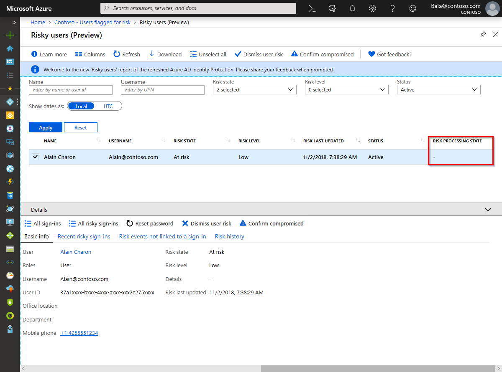

# How To: Give risk feedback in Microsoft Entra ID Protection

Microsoft Entra ID Protection allows you to give feedback on its risk assessment. The following document lists the scenarios where you would like to give feedback on Microsoft Entra ID Protection’s risk assessment and how we incorporate it.

## What is a detection?

An Identity Protection detection is an indicator of suspicious activity from an identity risk perspective. These suspicious activities are called risk detections. These identity-based detections can be based on heuristics, machine learning or can come from partner products. These detections are used to determine sign-in risk and user risk,

* User risk represents the probability an identity is compromised.
* Sign-in risk represents the probability a sign-in is compromised (for example, the identity owner didn't authorize the sign-in).

## Why should I give risk feedback to Microsoft Entra ID’s risk assessments? 

There are several reasons why you should give Microsoft Entra risk feedback:

- **You found Microsoft Entra ID’s user or sign-in risk assessment incorrect**. For example, a sign-in shown in ‘Risky sign-ins’ report was benign and all the detections on that sign-in were false positives.
- **You validated that Microsoft Entra ID’s user or sign-in risk assessment was correct**. For example, a sign-in shown in ‘Risky sign-ins’ report was indeed malicious and you want Microsoft Entra ID to know that all the detections on that sign-in were true positives.
- **You remediated the risk on that user outside of Microsoft Entra ID Protection** and you want the user’s risk level to be updated.

## How does Microsoft Entra ID use my risk feedback?

Microsoft Entra ID uses your feedback to update the risk of the underlying user and/or sign-in and the accuracy of these events. This feedback helps secure the end user. For example, once you confirm a sign-in is compromised, Microsoft Entra ID immediately increases the user’s risk and sign-in’s aggregate risk (not real-time risk) to High. If this user is included in your user risk policy to force High risk users to securely reset their passwords, the user will automatically remediate itself the next time they sign-in.

## How should I give risk feedback and what happens under the hood?

Here are the scenarios and mechanisms to give risk feedback to Microsoft Entra ID.

| Scenario | How to give feedback? | What happens under the hood? | Notes |
| --- | --- | --- | --- |
| **Sign-in not compromised (False positive)**   ‘Risky sign-ins’ report shows an at-risk sign-in [Risk state = At risk] but that sign-in wasn't compromised. | Select the sign-in and then ‘Confirm sign-in safe’. | We move the sign-in’s aggregate risk to none [Risk state = Confirmed safe; Risk level (Aggregate) = -] and reverse its impact on the user risk. | Currently, the ‘Confirm sign-in safe’ option is only available in ‘Risky sign-ins’ report. |
| **Sign-in compromised (True positive)**   ‘Risky sign-ins’ report shows an at-risk sign-in [Risk state = At risk] with low risk [Risk level (Aggregate) = Low] and that sign-in was indeed compromised. | Select the sign-in and then ‘Confirm sign-in compromised’. | We move the sign-in’s aggregate risk and the user risk to High [Risk state = Confirmed compromised; Risk level = High]. | Currently, the ‘Confirm sign-in compromised’ option is only available in ‘Risky sign-ins’ report. |
| **User compromised (True positive)**   ‘Risky users’ report shows an at-risk user [Risk state = At risk] with low risk [Risk level = Low] and that user was indeed compromised. | Select the user and then ‘Confirm user compromised’. | We move the user risk to High [Risk state = Confirmed compromised; Risk level = High] and add a new detection ‘Admin confirmed user compromised’. | Currently, the ‘Confirm user compromised’ option is only available in ‘Risky users’ report.   The detection ‘Admin confirmed user compromised’ is shown in the tab ‘Risk detections not linked to a sign-in’ in the ‘Risky users’ report. |
| **User remediated outside of Microsoft Entra ID Protection (True positive + Remediated)**   ‘Risky users’ report shows an at-risk user and I've then remediated the user outside of Microsoft Entra ID Protection. | 1. Select the user and then ‘Confirm user compromised’. (This process confirms to Microsoft Entra ID that the user was indeed compromised.)   2. Wait for the user’s ‘Risk level’ to go to High. (This time gives Microsoft Entra ID the needed time to take the above feedback to the risk engine.)   3. Select the user and then ‘Dismiss user risk’. (This process confirms to Microsoft Entra ID that the user is no longer compromised.) |  Microsoft Entra ID moves the user risk to none [Risk state = Dismissed; Risk level = -] and closes the risk on all existing sign-ins having active risk. | Clicking ‘Dismiss user risk’ closes all risk on the user and past sign-ins. This action can't be undone. |
| **User not compromised (False positive)**   ‘Risky users’ report shows at at-risk user but the user isn't compromised. | Select the user and then ‘Dismiss user risk’. (This process confirms to Microsoft Entra ID that the user isn't compromised.) | Microsoft Entra ID moves the user risk to none [Risk state = Dismissed; Risk level = -]. | Clicking ‘Dismiss user risk’ closes all risk on the user and past sign-ins. This action can't be undone. |
| I want to close the user risk but I'm not sure whether the user is compromised / safe. | Select the user and then ‘Dismiss user risk’. (This process confirms to Microsoft Entra ID that the user is no longer compromised.) | We move the user risk to none [Risk state = Dismissed; Risk level = -]. | Clicking ‘Dismiss user risk’ closes all risk on the user and past sign-ins. This action can't be undone. We recommend you remediate the user by clicking on ‘Reset password’ or request the user to securely reset/change their credentials. |

Feedback on user risk detections in Identity Protection is processed offline and may take some time to update. The risk processing state column provides the current state of feedback processing.

## Next steps

- [Microsoft Entra ID Protection risk detections reference](./concept-identity-protection-risks.md)
