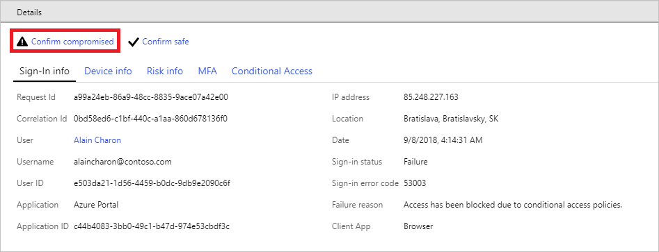
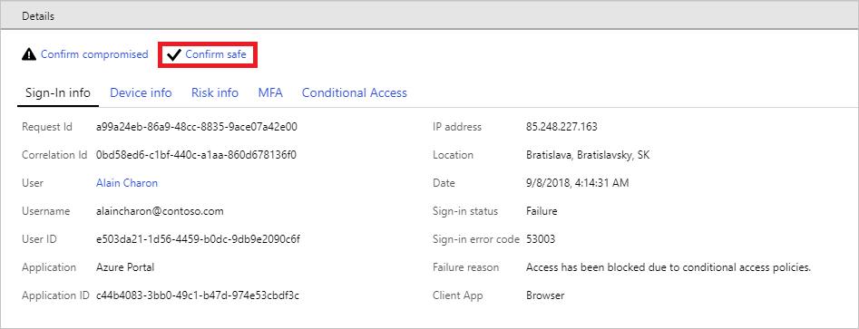
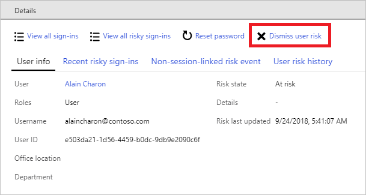

# How To: Improve the detection accuracy 

Identity Protection provides mechanisms to give feedback to Azure AD on the risk detections in your environment. To provide feedback, you can confirm the status of detected risky user or sign-in event. Microsoft users this feedback to take action on current risk detections and improve the accuracy of future detections. 

## What is detection?

Detection is the process of identifying suspicious activities in conjunction with your user accounts. The suspicious activities Azure AD can detect are called [risk event](../reports-monitoring/concept-risk-events.md). 
The detection process is based on adaptive machine learning algorithms and heuristics to detect risk events for users.

The detection results are used to determine whether users and sign-ins are at risk. 

## How can I improve the detection accuracy?

Because detection is an automated process it is possible that Azure AD reports false positives. 
You can improve the detection accuracy by providing feedback to Azure AD regarding the detection results.

There are three ways to improve detection accuracy: confirm compromised sign-in, comfirm safe sign-in, and dismiss user risk. You can do so from the following reports:

- **Risky sign-ins report -** In the risky sign-ins report, you can confirm that sign-ins are safe or compromised

- **Risky users report -** In the risky users report, you can dismiss user risk 

Your feedback is processed by Azure AD to improve the accuracy of the detection results. Typically, you provide feedback as part of a user risk or sign-in risk investigation. For more information, see [How to investigate risky users and sign-ins](howto-investigate-risky-users-signins.md).

## Confirm compromised

Confirming a sign-in event as compromised signals to Azure AD that the sign-in wasn't authorized by the identity owner. When you select "confirm compromised", Azure AD will

- Increase the user risk of the affected user to high.

- Help to optimize the machine learning that detects risk events
 
- Perform additional measures to further protect your organization

To confirm a compromised sign-in:

- **The risky sign-ins report** - This option enables you to confirm a compromised sign-in for one or more sign-in events.

    

- **The Details view of the risky sign-ins report** - This option enables you to confirm a compromised account for the selected sign-in event in the risky sign-ins report. 

    

 
## Confirm safe

Confirming a sign-in event as safe signals to Azure AD that the sign-in **was** authorized by the respective identity owner. When you select "confirm safe", Azure AD will:

- Revert the user risk contribution of the selected sign-ins

- Close the underlying risk events

- Help to optimize the machine learning that detects risk events

- Perform additional measures to further protect your organization
 

To confirm a safe sign-in in:

- **The risky sign-ins report** - This option enables you to confirm a safe sign-in for one or more sign-in events.

    

- **The Details view of the risky sign-ins report** - This option enables you to confirm a safe sign-in for the selected sign-in event in the risky sign-ins report. 

    

## Dismiss user risk

If you have already taken remediation actions for a risk user, or believe they were falsely marked as risky, you can dismiss a user's risk. Dismissing a user's risk restores the user to a non-risky state. All past risky sign-ins and risk events for the selected user will be dismissed.

You can dismiss the reported user risk in:

- **The risky users report** - This option enables you to dismiss the user risk for one or more selected users.

    

- **The Details view** - This option enables you to dismiss the user risk for the selected user in the user risk report. 

    

**What you should know:**

- You can't revert this action.

- It can take a few minutes for this action to be completed, which is why you should not re-submit your request.

- You can only perform this action if AD manages the credentials of the user. 

## Best practices

Dismissing a user's risk is one way to unblock them if they have been blocked by the User risk policy and cannot self remediate due to not having password reset and/or MFA enabled. In this situation, it is best to ensure the user then registers for password reset and MFA so they are able to self-remediate any future risk events.

## Next steps

To get an overview of Azure AD Identity Protection, see the [Azure AD Identity Protection overview](overview-v2.md).

