# How To: Investigate risky users and sign-ins 

Using the Risky Sign-Ins and Risky Users reports you can investigate and gain insight into risk in your environment. With the ability to filter and sort the risky sign-ins and users, you can better understand potential intrusion in your organization. 

## Risky users report

With the information provided by the risky users report, you can find answers to questions such as:

- Which users are high risk?
- Which users have a risk state of remediated?

Your first entry point to this report is the **Investigate** section on the security page.

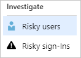

The risky users report has a default view that shows:

- Name

- Risk state

- Risk level

- Risk detail

- Risk last updated

- Type

- Status
 

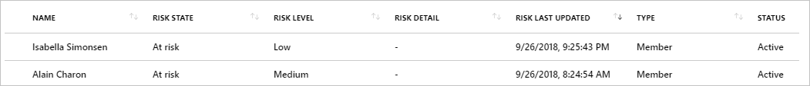

You can customize the list view by clicking **Columns** in the toolbar.

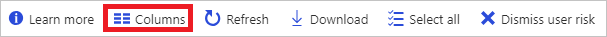

The columns dialog enables you to display additional fields or remove fields that are already displayed.

By clicking an item in the list view, you get all available details about it in a horizontal view.

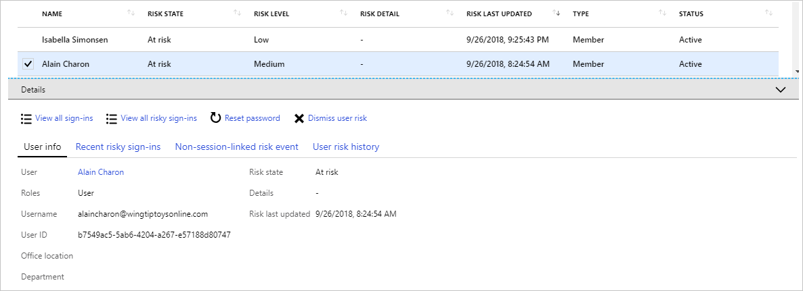

The details view shows:

- Basic info

- Recent risky sign-ins

- Risk events not linked to a sign-in

- Risk history

Additionally, you can:

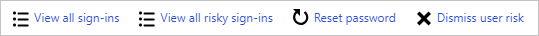

- View all sign-ins shortcut to view the sign-ins report for that user.

- View all risky sign-ins to view all the sign-ins for that user that were flagged as risky.

- Reset a user’s password if you believe that the user's identity has been compromised.

- Dismiss user risk if you think that the active risk events of a user are false positives. For more information, see [how to improve the detection accuracy](howto-improve-detection-accuracy.md).

### Filter risky users

To narrow down the reported data to a level that works for you, you can filter the risky user data using the following default fields:

- Name

- Username

- Risk state

- Risk level

- Type

- Status

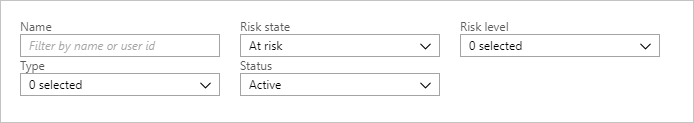

The **Name** filter enables you to specify the name or the user principal name (UPN) of the user you care about.

The **Risk state** filter enables you to select:

- At risk
- Remediated
- Dismissed

The **Risk level** filter enables you to select:

- High
- Medium
- Low

The **Type** filter enables you to select:

- Guest
- Member

The **Status** filter enables you to select:

- Deleted
- Active

### Download risky users data

You can download the risky users data if you want to work with it outside the Azure portal. Clicking Download creates a CSV file of the most recent 2,500 records. 

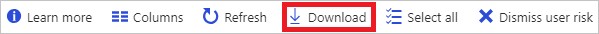

You can customize the list view by clicking Columns in the toolbar.
 
This enables you to display additional fields or remove fields that are already displayed.
 
To learn more about a risky user, click on the Details drawer to expand it

 

## Risky sign-ins report

With the information provided by the risky sign-ins report, you can find answers to questions such as:

- How many successful sign-ins were there that had anonymous IP address risk events in the last week?

- Which users were confirmed compromised in the last month?

- Which users had risky sign-ins to the Office 365 portal?

Your first entry point to this report is the **Investigate** section on the security page.

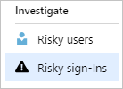

The risky sign-ins report has a default view that shows:

- Date

- User

- Application

- Sign-in status

- Risk state

- Risk level (aggregate)

- Risk level (real-time)

- Conditional Access

- MFA required  
 

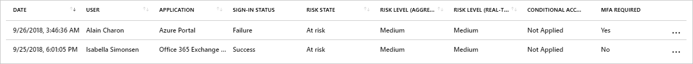

You can customize the list view by clicking **Columns** in the toolbar.

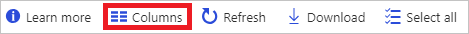

The columns dialog enables you to display additional fields or remove fields that are already displayed.

By clicking an item in the list view, you get all available details about it in a horizontal view.

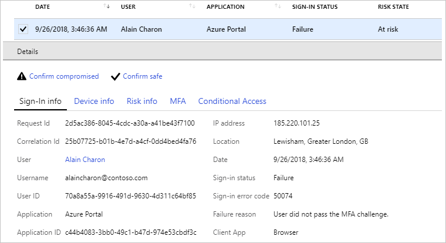

The details view shows:

- Basic info

- Device info

- Risk info

- MFA info

- Conditional Access

Additionally, you can:

- Confirm compromised 

- Confirm safe

For more information, see [how to improve the detection accuracy](howto-improve-detection-accuracy.md).

### Filter risky sign-ins

To narrow down the reported data to a level that works for you, you can filter the risky user data using the following default fields:

- User
- Application
- Sign-in status
- Risk state
- Risk level (aggregate)
- Risk level (real-time)
- Conditional Access
- Date
- Risk level type

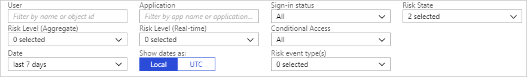

The **Name** filter enables you to specify the name or the user principal name (UPN) of the user you care about.

The **Application** filter enables you to specify the cloud app the user tried to access.

The **Sign-in status** filter enables you to select:

- All
- Success
- Failure

The **Risk state** filter enables you to select:

- At risk
- Confirmed compromised
- Confirmed safe
- Dismissed
- Remediated

The **Risk level (aggregate)** filter enables you to select:

- High
- Medium
- Low

The **Risk level (real-time)** filter enables you to select:

- High
- Medium
- Low

The **Conditional Access** filter enables you to select:

- All
- Not applied
- Success
- Failure

The **Date** filter enables to you to define a timeframe for the returned data.
Possible values are:

- Last 1 month
- Last 7 days
- Last 24 hours
- Custom time interval

### Download risky sign-ins data

You can download the risky sign-ins data if you want to work with it outside the Azure portal. Clicking Download creates a CSV file of the most recent 2,500 records. 

## Next steps

To get an overview of Azure AD Identity Protection, see the [Azure AD Identity Protection overview](overview-v2.md).
