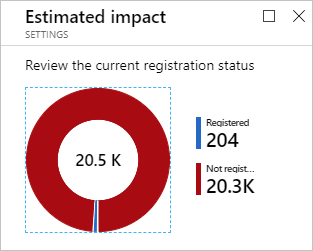

# How To: Configure the multi-factor authentication registration policy

Azure AD Identity Protection helps you manage the roll-out of multi-factor authentication (MFA) registration by configuring a policy. This article explains what the policy can be used for an how to configure it.

## What is the multi-factor authentication registration policy?

Azure multi-factor authentication is a method of verifying who you are that requires the use of more than just a username and password. It provides a second layer of security to user sign-ins and transactions.  

We recommend that you require Azure multi-factor authentication for user sign-ins because it:

- Delivers strong authentication with a range of easy verification options

- Plays a key role in preparing your organization to protect and recover from account compromises

For more details, see [What is Azure Multi-Factor Authentication?](../authentication/multi-factor-authentication.md)

## How do I access the MFA registration policy?
   
The MFA registration policy is in the **Configure** section on the [Azure AD Identity Protection page](https://portal.azure.com/#blade/Microsoft_AAD_ProtectionCenter/IdentitySecurityDashboardMenuBlade/SignInPolicy).
   

## Policy settings

When you configure the sign-in risk policy, you need to set:

- The users and groups the policy applies to:

    

- The type of access you want to be enforced:  

    

- The state of your policy:

    

The policy configuration dialog provides you with an option to estimate the impact of your configuration.

## User experience

For an overview of the related user experience, see:

* [Multi-factor authentication registration flow](flows.md#multi-factor-authentication-registration).  
* [Sign-in experiences with Azure AD Identity Protection](flows.md).  

## Next steps

To get an overview of Azure AD Identity Protection, see the [Azure AD Identity Protection overview](overview.md).
