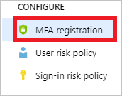
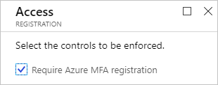

# How To: Configure the Azure Multi-Factor Authentication registration policy

Azure AD Identity Protection helps you manage the roll-out of multi-factor authentication (MFA) registration by configuring a Conditional Access policy to require MFA registration no matter what app you are signing in to. This article explains what the policy can be used for and how to configure it.

## What is the Azure Multi-Factor Authentication registration policy?

Azure Multi-Factor Authentication provides a means to verify who you are using more than just a username and password. It provides a second layer of security to user sign-ins. In order for users to be able to respond to MFA prompts, they must first register for Azure Multi-Factor Authentication.

We recommend that you require Azure Multi-Factor Authentication for user sign-ins because it:

- Delivers strong authentication with a range of easy verification options
- Plays a key role in preparing your organization to protect and recover from risk events in Identity Protection

For more details on MFA, see [What is Azure Multi-Factor Authentication?](../authentication/howto-mfa-getstarted.md)

## How do I access the registration policy?

The MFA registration policy is in the **Configure** section on the [Azure AD Identity Protection page](https://portal.azure.com/#blade/Microsoft_AAD_ProtectionCenter/IdentitySecurityDashboardMenuBlade/SignInPolicy).

## Policy settings

When you configure the MFA registration policy, you need to make the following configuration changes:

- The users and groups the policy applies to. Remember to exclude your organization's [emergency access accounts](../users-groups-roles/directory-emergency-access.md).

    

- The control you want to enforce - **Require Azure MFA registration**

    

- Enforce Policy should be set to **On**.

    

- **Save** your policy

## User experience

For an overview of the related user experience, see:

- [Multi-factor authentication registration flow](flows.md#multi-factor-authentication-registration).  
- [Sign-in experiences with Azure AD Identity Protection](flows.md).  

## Next steps

To get an overview of Azure AD Identity Protection, see the [Azure AD Identity Protection overview](overview.md).
