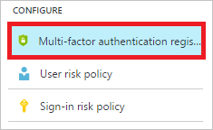
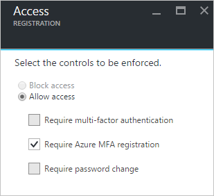
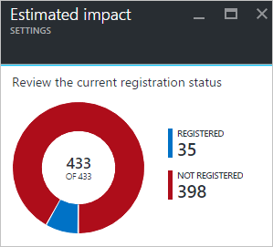

# How To: Configure the multi-factor authentication registration policy

Azure AD Identity Protection helps you manage the roll-out of multi-factor authentication (MFA) registration by configuring a policy. This article explains what the policy can be used for an how to configure it.

## What is the multi-factor authentication registration policy?

Azure multi-factor authentication is a method of verifying who you are that requires the use of more than just a username and password. It provides a second layer of security to user sign-ins and transactions.  
We recommend that you require Azure multi-factor authentication for user sign-ins because it:

* Delivers strong authentication with a range of easy verification options
* Plays a key role in preparing your organization to protect and recover from account compromises

For more details, see [What is Azure Multi-Factor Authentication?](../authentication/multi-factor-authentication.md)

## Configuration

**To open the related configuration dialog**:

- On the **Azure AD Identity Protection** blade, in the **Configure** section, click **Multi-factor authentication registration**.

    

### Settings

* Set the users and groups the policy applies to:

    
* Set the controls to be enforced when the policy triggers::  

    
* Switch the state of your policy:

    
* View the current registration status:

    

For an overview of the related user experience, see:

* [Multi-factor authentication registration flow](flows.md#multi-factor-authentication-registration).  
* [Sign-in experiences with Azure AD Identity Protection](flows.md).  

## Next steps

To get an overview of Azure AD Identity Protection, see the [Azure AD Identity Protection overview](overview).
