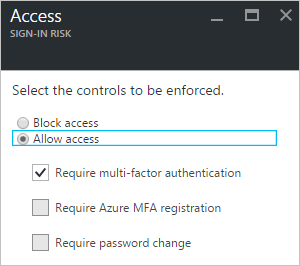
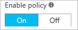
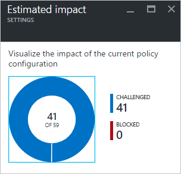

# How To: Configure the sign-in risk policy

Azure Active Directory detects [risk event types](../reports-monitoring/concept-risk-events.md#risk-event-types) in real-time and offline. Each risk event that has been detected for a sign-in of a user contributes to a logical concept called risky sign-in. A risky sign-in is an indicator for a sign-in attempt that might not have been performed by the legitimate owner of a user account.

### Sign-in risk level

A sign-in risk level is an indication (High, Medium, or Low) of the likelihood that a sign-in attempt was not performed by the legitimate owner of a user account.

### Mitigating sign-in risk events

A mitigation is an action to limit the ability of an attacker to exploit a compromised identity or device without restoring the identity or device to a safe state. A mitigation does not resolve previous sign-in risk events associated with the identity or device.

To mitigate risky sign-ins automatically, you can configure sign-in risk security policies. Using these policies, you consider the risk level of the user or the sign-in to block risky sign-ins or require the user to perform multi-factor authentication. These actions may prevent an attacker from exploiting a stolen identity to cause damage, and may give you some time to secure the identity.

### Sign-in risk security policy
A sign-in risk policy is a conditional access policy that evaluates the risk to a specific sign-in and applies mitigations based on predefined conditions and rules.

Azure AD Identity Protection helps you manage the mitigation of risky sign-ins by enabling you to:

* Set the users and groups the policy applies to:

    
* Set the sign-in risk level threshold (low, medium, or high) that triggers the policy:

    
* Set the controls to be enforced when the policy triggers:  

    
* Switch the state of your policy:

    
* Review and evaluate the impact of a change before activating it:

    

#### What you need to know
You can configure a sign-in risk security policy to require multi-factor authentication:

However, for security reasons, this setting only works for users that have already been registered for multi-factor authentication. If the condition to require multi-factor authentication is satisfied for a user who is not yet registered for multi-factor authentication, the user is blocked.

As a best practice, if you want to require multi-factor authentication for risky sign-ins, you should:

1. Enable the [multi-factor authentication registration policy](#multi-factor-authentication-registration-policy) for the affected users.
2. Require the affected users to login in a non-risky session to perform a MFA registration

Completing these steps ensures that multi-factor authentication is required for a risky sign-in.

#### Best practices
Choosing a **High** threshold reduces the number of times a policy is triggered and minimizes the impact to users.  

However, it excludes **Low** and **Medium** sign-ins flagged for risk from the policy, which may not block an attacker from exploiting a compromised identity.

When setting the policy,

* Exclude users who do not/cannot have multi-factor authentication
* Exclude users in locales where enabling the policy is not practical (for example no access to helpdesk)
* Exclude users who are likely to generate a lot of false-positives (developers, security analysts)
* Use a **High** threshold during initial policy roll out, or if you must minimize challenges seen by end users.
* Use a **Low**  threshold if your organization requires greater security. Selecting a **Low** threshold introduces additional user sign-in challenges, but increased security.

The recommended default for most organizations is to configure a rule for a **Medium** threshold to strike a balance between usability and security.

The sign-in risk policy is:

* Applied to all browser traffic and sign-ins using modern authentication.
* Not applied to applications using older security protocols by disabling the WS-Trust endpoint at the federated IDP, such as ADFS.

The **Risk Events** page in the Identity Protection console lists all events:

* This policy was applied to
* You can review the activity and determine whether the action was appropriate or not

For an overview of the related user experience, see:

* [Risky sign-in recovery](flows.md#risky-sign-in-recovery)
* [Risky sign-in blocked](flows.md#risky-sign-in-blocked)  
* [Sign-in experiences with Azure AD Identity Protection](flows.md)  

**To open the related configuration dialog**:

- On the **Azure AD Identity Protection** blade, in the **Configure** section, click **Sign-in risk policy**.

    

## Next steps

To get an overview of Azure AD Identity Protection, see the [Azure AD Identity Protection overview](overview).
