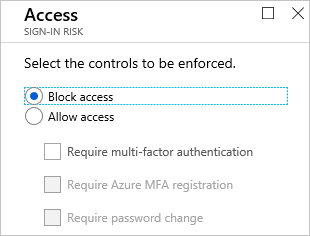
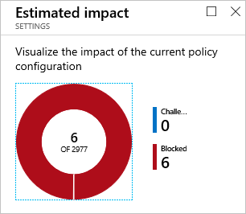
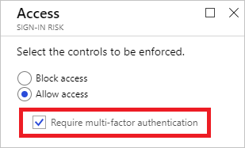

# How To: Configure the sign-in risk policy

Azure Active Directory detects [risk event types](../reports-monitoring/concept-risk-events.md#risk-event-types) in real-time and offline. Each risk event that has been detected for a sign-in of a user contributes to a logical concept called risky sign-in. A risky sign-in is an indicator for a sign-in attempt that might not have been performed by the legitimate owner of a user account.

## What is the sign-in risk policy?

Azure AD analyzes each sign-in of a user. The objective of the analysis is to detect suspicious actions that come along with the sign-in. For example, is the sign-in done using an anonymous IP address, or is the sign-in initiated from an unfamiliar location? In Azure AD, the suspicious actions the system can detect are also known as risk events. Based on the risk events that have been detected during a sign-in, Azure AD calculates a value. The value represents the probability (low, medium, high) that the sign-in is not performed by the legitimate user. The probability is called **sign-in risk level**.

The sign-in risk policy is an automated response you can configure for a specific sign-in risk level. In your response, you can block access to your resources or require passing a multi-factor authentication (MFA) challenge to gain access.

   
## How do I access the sign-in risk policy?
   
The sign-in risk policy is in the **Configure** section on the [Azure AD Identity Protection page](https://portal.azure.com/#blade/Microsoft_AAD_ProtectionCenter/IdentitySecurityDashboardMenuBlade/SignInPolicy).
   

## Policy settings

When you configure the sign-in risk policy, you need to set:

- The users and groups the policy applies to:

    

- The sign-in risk level that triggers the policy:

    

- The type of access you want to be enforced when your sign-in risk level has been met:  

    

- The state of your policy:

    

The policy configuration dialog provides you with an option to estimate the impact of reconfiguration.

## What you should know

You can configure a sign-in risk security policy to require MFA:

However, for security reasons, this setting only works for users that have already been registered for MFA. Identity protection blocks users with an MFA requirement if they are not registered for MFA yet.

If you want to require MFA for risky sign-ins, you should:

1. Enable the [multi-factor authentication registration policy](howto-mfa-policy.md) for the affected users.

2. Require the affected users to sign in to a non-risky session to perform an MFA registration.

Completing these steps ensures that multi-factor authentication is required for a risky sign-in.

The sign-in risk policy is:

- Applied to all browser traffic and sign-ins using modern authentication.

- Not applied to applications using older security protocols by disabling the WS-Trust endpoint at the federated IDP, such as ADFS.

For an overview of the related user experience, see:

* [Risky sign-in recovery](flows.md#risky-sign-in-recovery)
* [Risky sign-in blocked](flows.md#risky-sign-in-blocked)  
* [Sign-in experiences with Azure AD Identity Protection](flows.md)  

## Best practices

Choosing a **High** threshold reduces the number of times a policy is triggered and minimizes the impact to users.  

However, it excludes **Low** and **Medium** sign-ins flagged for risk from the policy, which may not block an attacker from exploiting a compromised identity.

When setting the policy,

- Exclude users who do not/cannot have multi-factor authentication

- Exclude users in locales where enabling the policy is not practical (for example no access to helpdesk)

- Exclude users who are likely to generate many false-positives (developers, security analysts)

- Use a **High** threshold during initial policy roll-out, or if you must minimize challenges seen by end users.

- Use a **Low**  threshold if your organization requires greater security. Selecting a **Low** threshold introduces additional user sign-in challenges, but increased security.

The recommended default for most organizations is to configure a rule for a **Medium** threshold to strike a balance between usability and security.

## Next steps

To get an overview of Azure AD Identity Protection, see the [Azure AD Identity Protection overview](overview.md).
