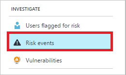
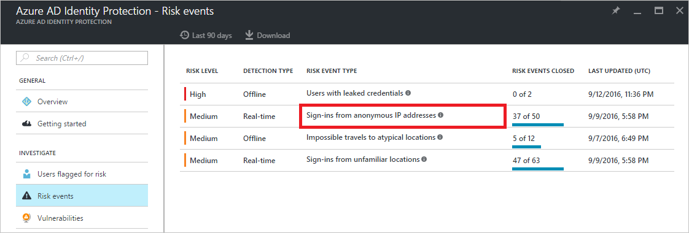
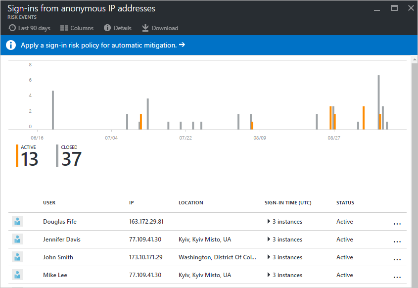
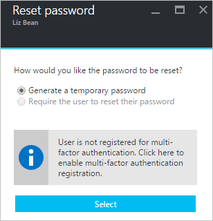
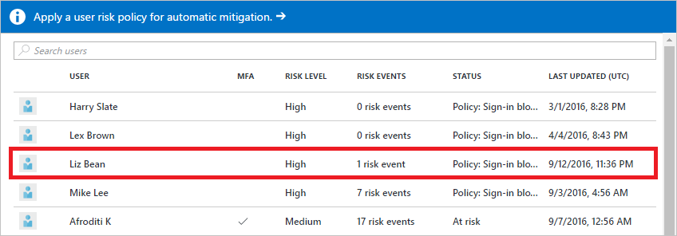
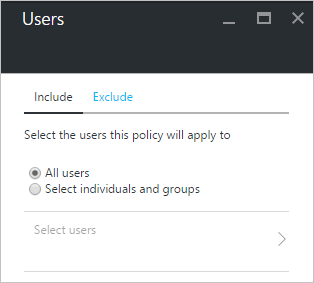
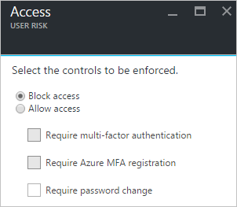
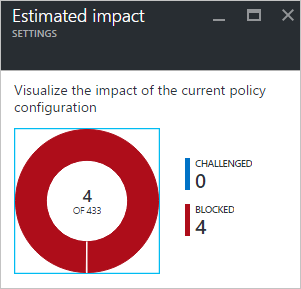

# How To: Configure the user risk policy

All active [risk events](../reports-monitoring/concept-risk-events.md) that were detected by Azure Active Directory for a user contribute to a logical concept called user risk. A user flagged for risk is an indicator for a user account that might have been compromised.

## User risk level

A user risk level is an indication (High, Medium, or Low) of the likelihood that the user’s identity has been compromised. It is calculated based on the user risk events that are associated with a user's identity.

The status of a risk event is either **Active** or **Closed**. Only risk events that are **Active** contribute to the user risk level calculation.

The user risk level is calculated using the following inputs:

* Active risk events impacting the user
* Risk level of these events
* Whether any remediation actions have been taken

You can use the user risk levels to create conditional access policies that block risky users from signing in, or force them to securely change their password.

## Closing risk events manually

In most cases, you will take remediation actions such as a secure password reset to automatically close risk events. However, this might not always be possible.  
This is, for example, the case, when:

* A user with Active risk events has been deleted
* An investigation reveals that a reported risk event has been perform by the legitimate user

Because risk events that are **Active** contribute to the user risk calculation, you may have to manually lower a risk level by closing risk events manually.  
During the course of investigation, you can choose to take any of these actions to change the status of a risk event:

* **Resolve** - If after investigating a risk event, you took an appropriate remediation action outside Identity Protection, and you believe that the risk event should be considered closed, mark the event as Resolved. Resolved events will set the risk event’s status to Closed and the risk event will no longer contribute to user risk.
* **Mark as false-positive** - In some cases, you may investigate a risk event and discover that it was incorrectly flagged as a risky. You can help reduce the number of such occurrences by marking the risk event as False-positive. This will help the machine learning algorithms to improve the classification of similar events in the future. The status of false-positive events is to **Closed** and they will no longer contribute to user risk.
* **Ignore** - If you have not taken any remediation action, but want the risk event to be removed from the active list, you can mark a risk event Ignore and the event status will be Closed. Ignored events do not contribute to user risk. This option should only be used under unusual circumstances.
* **Reactivate** - Risk events that were manually closed (by choosing **Resolve**, **False positive**, or **Ignore**) can be reactivated, setting the event status back to **Active**. Reactivated risk events contribute to the user risk level calculation. Risk events closed through remediation (such as a secure password reset) cannot be reactivated.

**To open the related configuration dialog**:

1. On the **Azure AD Identity Protection** blade, under **Investigate**, click **Risk events**.

    
2. In the **Risk events** list, click a risk.

    
3. On the risk blade, right-click a user.

    

## Closing all risk events for a user manually
Instead of manually closing risk events for a user individually, Azure Active Directory Identity Protection also provides you with a method to close all events for a user with one click.

When you click **Dismiss all events**, all events are closed and the affected user is no longer at risk.

## Remediating user risk events

A remediation is an action to secure an identity or a device that was previously suspected or known to be compromised. A remediation action restores the identity or device to a safe state, and resolves previous risk events associated with the identity or device.

To remediate user risk events, you can:

* Perform a secure password reset to remediate user risk events manually
* Configure a user risk security policy to mitigate or remediate user risk events automatically
* Re-image the infected device  

### Manual secure password reset
A secure password reset is an effective remediation for many risk events, and when performed, automatically closes these risk events and recalculates the user risk level. You can use the Identity Protection dashboard to initiate a password reset for a risky user.

The related dialog provides two different methods to reset a password:

**Reset password** - Select **Require the user to reset their password** to allow the user to self-recover if the user has registered for multi-factor authentication. During the user's next sign-in, the user will be required to solve a multi-factor authentication challenge successfully and then, forced to change the password. This option isn't available if the user account is not already registered multi-factor authentication.

**Temporary password** - Select **Generate a temporary password** to immediately invalidate the existing password, and create a new temporary password for the user. Send the new temporary password to an alternate email address for the user or to the user's manager. Because the password is temporary, the user will be prompted to change the password upon sign-in.

**To open the related configuration dialog**:

1. On the **Azure AD Identity Protection** blade, click **Users flagged for risk**.

    
2. From the list of users, select a user with at least one risk events.

    
3. On the user blade, click **Reset password**.

    

## User risk security policy
A user risk security policy is a conditional access policy that evaluates the risk level to a specific user and applies remediation and mitigation actions based on predefined conditions and rules.

Azure AD Identity Protection helps you manage the mitigation and remediation of users flagged for risk by enabling you to:

* Set the users and groups the policy applies to:

    
* Set the user risk level threshold (low, medium, or high) that triggers the policy:

    
* Set the controls to be enforced when the policy triggers:

    
* Switch the state of your policy:

    
* Review and evaluate the impact of a change before activating it:

    

Choosing a **High** threshold reduces the number of times a policy is triggered and minimizes the impact to users.
However, it excludes **Low** and **Medium** users flagged for risk from the policy, which may not secure identities or devices that were previously suspected or known to be compromised.

When setting the policy,

* Exclude users who are likely to generate a lot of false-positives (developers, security analysts)
* Exclude users in locales where enabling the policy is not practical (for example no access to helpdesk)
* Use a **High** threshold during initial policy roll out, or if you must minimize challenges seen by end users.
* Use a **Low** threshold if your organization requires greater security. Selecting a **Low** threshold introduces additional user sign-in challenges, but increased security.

The recommended default for most organizations is to configure a rule for a **Medium** threshold to strike a balance between usability and security.

For an overview of the related user experience, see:

* [Compromised account recovery flow](flows.md#compromised-account-recovery).  
* [Compromised account blocked flow](flows.md#compromised-account-blocked).  

**To open the related configuration dialog**:

- On the **Azure AD Identity Protection** blade, in the **Configure** section, click **User risk policy**.

    

## Mitigating user risk events
Administrators can set a user risk security policy to block users upon sign-in depending on the risk level.

Blocking a sign-in:

* Prevents the generation of new user risk events for the affected user
* Enables administrators to manually remediate the risk events affecting the user's identity and restore it to a secure state

## Next steps

To get an overview of Azure AD Identity Protection, see the [Azure AD Identity Protection overview](overview).
