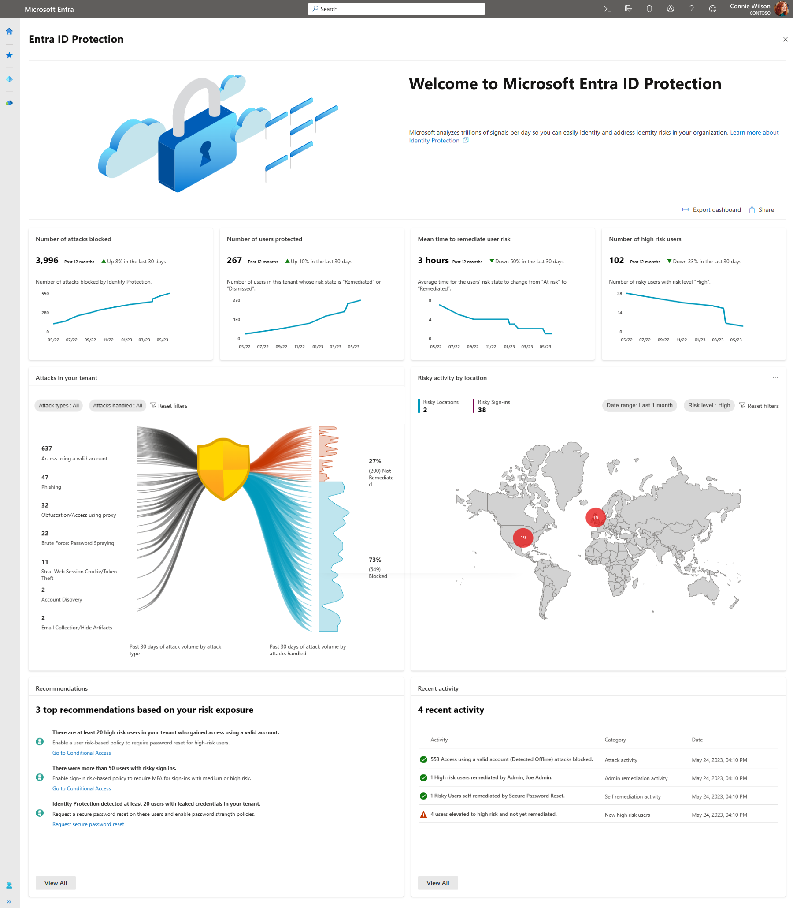
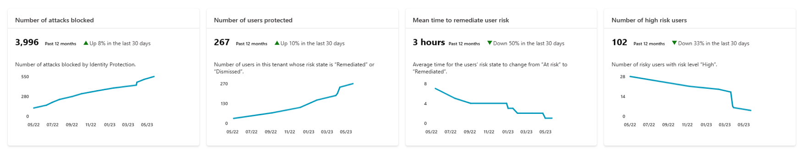
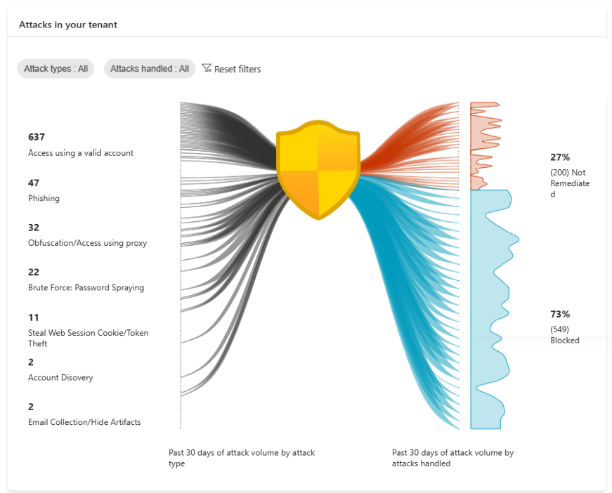
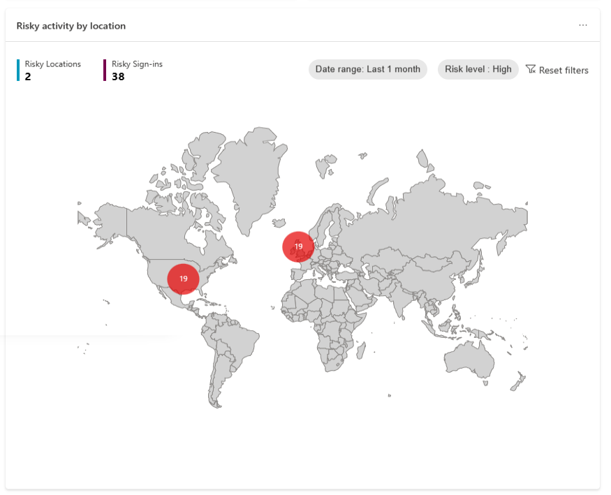
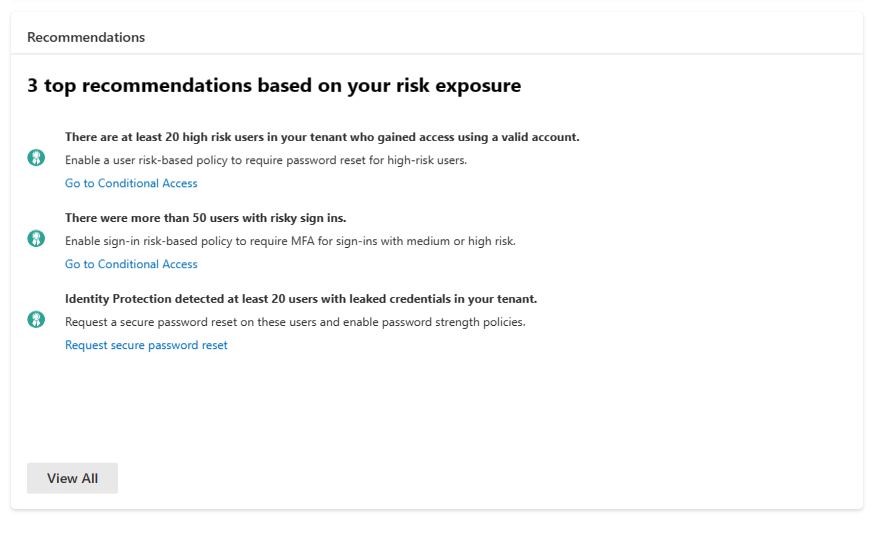
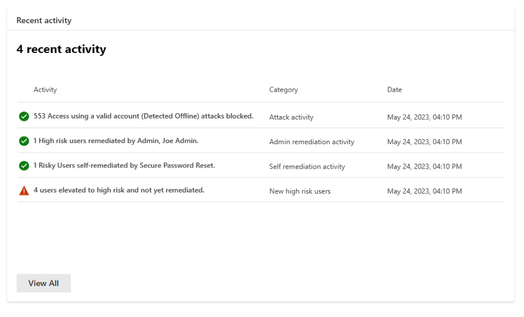

# Microsoft Entra ID Protection dashboard (preview)

Microsoft Entra ID Protection prevents identity compromises by detecting identity attacks and reporting risks. It enables customers to protect their organizations by monitoring risks, investigating them, and configuring risk-based access policies to guard sensitive access and auto remediate risks. 

Our new dashboard helps customers better analyze their security posture, understand how well they're protected, identify vulnerabilities, and perform recommended actions. 

This dashboard is designed to empower organizations with rich insights and actionable recommendations tailored to your tenant. This information provides a better view into your organization’s security posture and allows you to enable effective protections accordingly. You have access to key metrics, attack graphics, a map highlighting risky locations, top recommendations to enhance security posture, and recent activities.

## Prerequisites

To access this new dashboard, you need: 

- Azure Active Directory Free, or Azure AD Premium P1, or Azure AD Premium P2 licenses for your users.
- Users must have at least the [Security Reader](../roles/permissions-reference.md#security-reader) role assigned.
- To view a comprehensive list of recommendations and select the recommended action links, you need Azure AD Premium P2 licenses.

## Access the dashboard

Organizations can access the new dashboard by:

1. Sign in to the **[Microsoft Entra admin center](https://entra.microsoft.com)**.
1. Browse to **Identity** > **Protection** > **Identity Protection** > **Dashboard (Preview)**.

### Metric cards
 
As you implement more security measures such as risk-based policies, your tenant protection strengthens. So, we're now providing four key metrics to help you understand the effectiveness of the security measures you have in place. 

| Metric | Metric definition | Refresh frequency | Where to view detail |
| --- | --- | --- | --- |
| Number of attacks blocked | Number of attacks blocked for this tenant on each day.    An attack is considered blocked if the risky sign-in was interrupted by any access policy. The access control required by the policy should block the attacker from signing in, therefore blocking the attack. | Every 24 hours. | View the risk detections that determined the attacks in the **Risk detections report**, filter “Risk state” by:   - **Remediated**  - **Dismissed**  -** Confirmed safe** |
| Number of users protected | Number of users in this tenant whose risk state changed from **At risk** to **Remediated** or **Dismissed** on each day.    A **Remediated** risk state indicates that the user has self-remediated their user risk by completing MFA or secure password change, and their account is therefore protected.    A **Dismissed** risk state indicates that an admin has dismissed the user’s risk because they identified the user’s account to be safe. | Every 24 hours. | View users protected in the **Risky users report**, filter “Risk state” by:   - **Remediated**  - **Dismissed** |
| Mean time your users take to self-remediate their risks | Average time for the Risk state of risky users in your tenant to change from **At risk** to **Remediated**.    A user’s risk state changes to **Remediated** when they self-remediated their user risk through MFA or secure password change.    To reduce the self-remediation time in your tenant, deploy risk-based Conditional Access policies. | Every 24 hours. | View remediated users in the Risky users report, filter “Risk state” by:   - Remediated |
| Number of new high-risk users detected | Number of new risky users with risk level **High** detected on each day. | Every 24 hours. | View high-risk users in the Risky users report, filter risk level by   - “High” |

Data aggregation for the following three metrics started on June 22, 2023, so these metrics are available from that date. We're working on updating the graph to reflect that.

- Number of attacks blocked
- Number of users protected
- Mean time to remediate user risk

The graphs provide a rolling 12 month window of data.

### Attack graphic

To help you better understand your risk exposure, we're introducing an innovative Attack Graphic that displays common identity-based attack patterns detected for your tenant. The attack patterns are represented by MITRE ATT&CK techniques and are determined by our advanced risk detections. For more information, see the section [Risk detection type to MITRE attack type mapping](#risk-detection-type-to-mitre-attack-type-mapping).

#### What is considered an attack in Microsoft Entra ID Protection?

Each type of [risk detection](concept-identity-protection-risks.md#what-are-risk-detections) corresponds to a MITRE ATT&CK technique. When risks are detected during a sign-in, risk detections are generated, and the sign-in becomes a risky sign-in. Attacks are then identified based on the risk detections. Refer to the below table for the mapping between Microsoft Entra ID Protection’s risk detections and attacks as categorized by MITRE ATT&CK techniques.

#### How to interpret the attack graphic?

The graphic presents attack types impacted your tenant over the past 30 days, and whether they were blocked during sign-in. On the left side, you see the volume of each attack type. On the right, the numbers of blocked and yet-to-be-remediated attacks are displayed. The graph updates every 24 hours, so the displayed volumes may not exactly mirror your latest detections volume in the Risk detections report.

- Blocked: An attack is classified as blocked if the associated risky sign-in was interrupted by an access policy, like requiring multifactor authentication. This action prevents the attacker's sign-in and blocks the attack. 
- Not remediated: Successful risky sign-ins that weren't interrupted need remediation. Therefore, risk detections associated with these risky sign-ins also require remediation. You can view these sign-ins and associated risk detections in the Risky sign-ins report by filtering with the "At risk" risk state.

#### Where can I view the attacks?

To view the risk detections that identified the attacks, 

1. Refer to the table in the section [Risk detection type to MITRE attack type mapping](#risk-detection-type-to-mitre-attack-type-mapping). Look for the detection types correspond to the attack type you're interested in.
1. Go to the Risk detections report
1. Use the **Detection type** filter and select the risk detection types identified in step 1. Apply the filter to view detections for the attack type only.

We're enhancing our Risk detections report to include an 'Attack type' filter and display the associated attack type for each detection type. This feature makes it easier for you to view detections corresponding to specific attack types.

#### Apply filters

Two filters can be applied to the graph:

- **Attack Types**: This filter allows you to view selected attack patterns only.
- **Attacks Handled**: Use this filter to view either blocked or non-remediated attacks separately.

### Risk detection type to MITRE attack type mapping

| Microsoft Entra ID Protection risk detection type | MITRE ATT&CK technique mapping | Attack display name |
| --- | --- | --- |
| Unfamiliar Sign-in Properties | T1078.004 | Access using a valid account (Detected at Sign-In) |
| Impossible Travel | T1078 | Access using a valid account (Detected Offline) |
| Suspicious Sign-ins | T1078 | Access using a valid account (Detected Offline) |
| MCAS New Country | T1078 | Access using a valid account (Detected Offline) |
| MCAS Anonymous IP | T1078 | Access using a valid account (Detected Offline) |
| Verified Threat Actor IP | T1078 | Access using a valid account (Detected Offline) |
| Suspicious browser | T1078 | Access using a valid account (Detected Offline) |
| Azure AD threat intelligence (user) | T1078 | Access using a valid account (Detected Offline) |
| Azure AD threat intelligence (sign-in) | T1078 | Access using a valid account (Detected Offline) |
| Anomalous User activity | T1098 | Account Manipulation |
| Password spray | T1110.003 | Brute Force: Password Spraying |
| Mass access to sensitive files | TA0009 | Collection |
| Mass access to sensitive files | TA0009 | Collection |
| MCAS Manipulation | T1114.003 | Email Collection/Hide Artifacts |
| MCAS Suspicious inbox forwarding | T1114.003 | Email Collection/Hide Artifacts |
| Token Issuer Anomaly  | T1606.002 | Forge Web Credentials: SAML Tokens |
| Leaked Credentials | T1589.001 | Gather Victim Identity Info |
| Anonymous IP address | T1090 | Obfuscation/Access using proxy |
| Malicious IP | T1090 | Obfuscation/Access using proxy |
| Possible attempt to access Primary Refresh Token (PRT) | T1528 | Steal Application Token |
| Anomalous Token | T1539 | Steal Web Session Cookie/Token Theft |

### Map

A map is provided to display the country location of the risky sign-ins in your tenant. The size of the bubble reflects the volume of the risk sign-ins in at that location. Hovering over the bubble shows a call-out box, providing the country name and number of risky sign-ins from that place.

It contains the following elements:

- Date range: choose the date range and view risky sign-ins from within that time range on the map. Values available are: last 24 hours, last seven days, and last one month.
- Risk level: choose the risk level of the risky sign-ins to view. Values available are: High, Medium, Low.
- **Risky Locations** count: 
   - Definition: The number of locations from where your tenant's risky sign-ins were from.
   - The date range and risk level filter apply to this count. 
   - Selecting this count takes you to the Risky sign-ins report filtered by the selected date range and risk level.
- **Risky Sign-ins** count: 
   - Definition: The number of total risky sign-ins with the selected risk level in the selected date range. 
   - The date range and risk level filter apply to this count. 
   - Selecting this count takes you to the Risky sign-ins report filtered by the selected date range and risk level.

### Recommendations

We’ve also introduced new Microsoft Entra ID Protection recommendations for customers to configure their environment to increase their security posture. These Recommendations are based on the attacks detected in your tenant over the past 30 days. The recommendations are provided to guide your security staff with recommended actions to take. 

Common attacks that are seen, like password spray, leaked credentials in your tenant, and mass access to sensitive files can inform you that there was a potential breach. In the previous screenshot, the example **Identity Protection detected at least 20 users with leaked credentials in your tenant** the recommended action in this case would be to create a Conditional Access policy requiring secure password reset on risky users.

In the recommendations component on our new dashboard, customers see:

- Up to three recommendations if specific attacks occur in their tenant.
- Insight into the impact of the attack.
- Direct links to take appropriate actions for remediation.

Customers with P2 licenses can view a comprehensive list of recommendations that provide insights with actions. When ‘View All’ is selected, it opens a panel showing more recommendations that were triggered based on the attacks in their environment.

### Recent activities

Recent Activity provides a summary of recent risk-related activities in your tenant. Possible activity types are:

1. Attack Activity 
1. Admin Remediation Activity 
1. Self-Remediation Activity 
1. New High-Risk Users 

## Known issues

Depending on the configuration of your tenant, there may or may not be recommendations or recent activities on your dashboard. We're working on a better **no new recommendations or recent activities** view to enhance the experience.

## Next steps

- [Plan a deployment](how-to-deploy-identity-protection.md)
- [What are risks?](concept-identity-protection-risks.md)
- [How can users self-remediate their risks through risk-based access policies?](howto-identity-protection-remediate-unblock.md#self-remediation-with-risk-based-policy)
