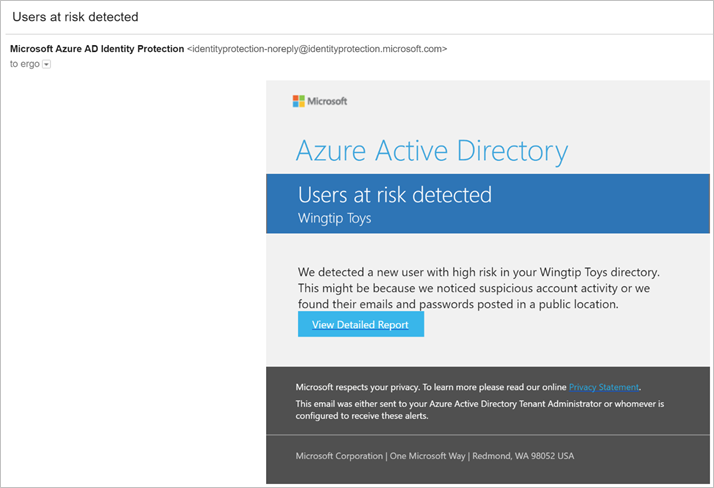
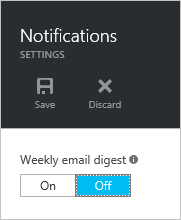
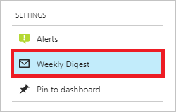

# Azure Active Directory Identity Protection notifications

Azure AD Identity Protection sends two types of automated notification emails to help you manage user risk and risk events:

- Users at risk detected email
- Weekly digest email

This article provides you with an overview of both notification emails.

## Users at risk detected email

In response to a detected account at risk, Azure AD Identity Protection generates an email alert with **Users at risk detected** as subject. The email includes a link to the **[Users flagged for risk](../reports-monitoring/concept-user-at-risk.md)** report. As a best practice, you should immediately investigate the users at risk.

### Configuration

As an administrator, you can set:

- **The risk level that triggers the generation of this email** - By default, the risk level is set to “High” risk.
- **The recipients of this email** - By default, recipients include all Global Admins. Global Admins can also add other Global Admins, Security Admins, Security Readers as recipients.  

To open the related dialog, click **Alerts** in the **Settings** section of the **Identity Protection** page.

## Weekly digest email

The weekly digest email contains a summary of new risk events.  
It includes:

- Users at risk

- Suspicious activities

- Detected vulnerabilities

- Links to the related reports in Identity Protection

    

### Configuration

As an administrator, you can switch sending a weekly digest email off.

To open the related dialog, click **Weekly Digest** in the **Settings** section of the **Identity Protection** page.

## See also

- [Azure Active Directory Identity Protection](../active-directory-identityprotection.md)
