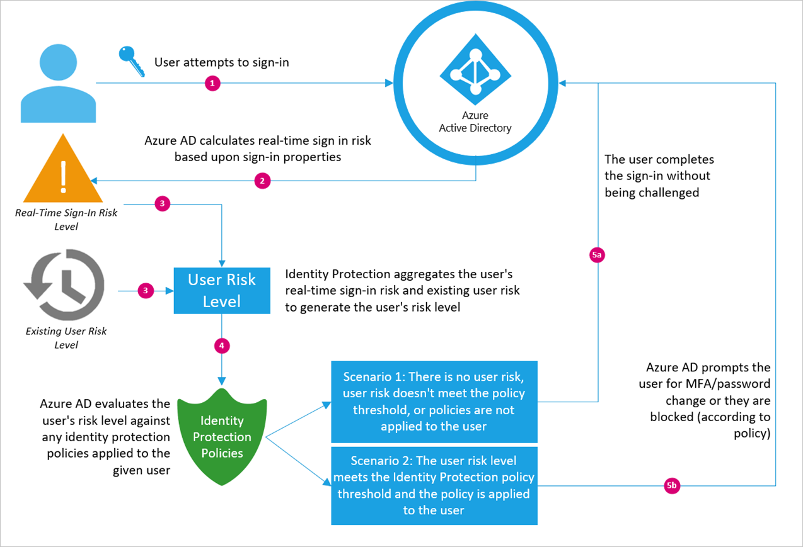

# What is Azure Active Directory Identity Protection (refreshed)?

The Identity Protection experience has been refreshed to better protect your organization’s identities. This refreshed experience provides:

- Redesigned admin experience that revolves around the risk most relevant to you¬- user risk and sign-in risk

- Powerful investigations experience with support for filtering, sorting, and smart downloads

- Improved user risk calculation to help you prioritize your efforts towards the users that are most likely to be compromised

- New API support to enable programmatic access to risk data

- Simplified admin feedback process that enables you to immediately protect your users

- New supervised machine learning to improve the accuracy of risk assessments

Security is a top concern for organizations today. The majority of security breaches take place when attackers gain access to an environment by stealing a user’s identity. Over the years, attackers have become increasingly effective in leveraging third-party breaches and using sophisticated phishing attacks. As soon as attackers gain access to even low privileged user accounts, it is relatively easy for them to gain access to important company resources through lateral movement. 

To respond to these threats, Azure AD Identity Protection empowers you to: 

- Proactively prevent compromised identities from being abused 

- Automatically mitigate risk when suspicious activity is detected 

- Investigate risky users and sign-ins to address potential vulnerabilities  

- Be alerted when a user’s risk reaches a specified threshold 

 

Azure AD Identity Protection is a feature of Azure Active Directory Premium P2 that enables you to configure policies to automatically respond when a user’s identity is compromised or when someone other than the account owner is attempting to sign in using their identity. These policies, in addition to other Conditional Access controls provided by Azure AD, can either automatically block access or initiate mitigation actions, such as password reset or multi-factor authentication enforcement. Additionally, Identity Protection provides monitoring and reporting capabilities to gain deeper insight into risk and potential compromises in your organization. 

>[!VIDEO https://www.microsoft.com/en-us/videoplayer/embed/RWsS6Q]

## Risk events

Azure AD Identity Protection detects the following risk events: 

 

| Risk event type | Description | Detection type |
| ---             | ---         | ---            |
| Atypical travel | Sign in from an atypical location based on the user’s recent sign-ins. | Offline |
| Anonymous IP address | Sign in from an anonymous IP address (for example: Tor browser, anonymizer VPNs). | Real-time |
| Unfamiliar sign-in properties | Sign in with properties we‘ve not seen recently for the given user. | Real-time |
| Malware linked IP address | Sign in from a malware linked IP address | Offline |
| Leaked Credentials | This risk event indicates that the user's valid credentials have been leaked | Offline |

## Types of risk 

Identity Protection is based on two types of risk:

- Sign-in risk

- User risk

### Sign-in risk

A sign-in risk represents the probability that a given authentication request isn’t authorized by the identity owner.

There are two evaluations of sign-in risk: 

- **Sign-in risk (Real-time)** - The sign-in risk (Real-time) is based on all the real-time detections that trigger during the processing of the sign-in.  

- **Sign-in risk (Aggregate)** - The sign-in risk (Aggregate) is the total risk of a sign-in. It is calculated by a machine learning model that considers:

    - Real-time detections (described above)
    
    - Offline detections (that fire after the sign-in has taken place) 
    
    - All other features of the sign-in

### User risk

A user risk represents the probability that a given identity is compromised. 

The user risk is calculated by considering all the risks associated with the user:

- All risky sign-ins
- All risk events not linked to a sign-in
- The current user risk
- Any risk remediation or dismissal actions performed on the user till date

## How Identity Protection detects risk  

Azure AD uses machine learning to detect anomalies and suspicious activity, using both signals detected in real-time during sign-ins as well as non-real time signals related to users and their sign-in activities. Using this data, Identity Protection calculates a real-time sign-in risk each time a user authenticates, as well as determining an overall user risk level for each user. Identity Protection allows you to automatically take action on these risk detections by configuring Identity Protection user risk and Sign-In Risk policies.  

 

To understand how Identity Protection detects risk, there are two important concepts: user risk and sign-in risk. Sign-in risk reflects the probability that a given authentication request isn’t authorized by the identity owner. There are two types of sign-in risks: real-time and total. Real-time sign-in risk is detected at the time of the given sign-in attempt (such as sign-ins from anonymous IP addresses). Total sign-in risk is the aggregate of detected real-time sign-in risks as well as any subsequent non-real-time risk events associated with the user’s sign ins (such as impossible travel). User risk reflects the overall likelihood that a bad actor has compromised a given identity. User risk contains all the risk activities for a given user, including:

- Real-time sign-in risk
- Subsequent sign-in risk
- Risky user detections.   

 

 
 
 

 

The baseline flow for Identity Protection risk detection and response for any given sign-in is summarized in the above graphic.  

 

 

 

## Common scenarios 

Let’s look at the example of an employee of Contoso. 

1. An employee attempts to sign in to Exchange Online from the Tor browser. At the time of sign-in, Azure AD detects real-time risk events. 

2. Azure AD detects that the employee is signing in from an anonymous IP address, triggering a medium sign-in risk level. 

3. The employee is challenged by an MFA prompt, because Contoso’s IT Admin configured the Identity Protection sign-in risk Conditional Access policy. The policy requires MFA for a sign-in risk of medium or higher. 

4. The employee passes the MFA prompt and accesses Exchange Online, and their user risk level is not changed. 

What happened behind the scenes? The sign-in attempt from the Tor browser triggered a real-time sign-in risk in Azure AD for anonymous IP address. As Azure AD processed the request, it applied the sign-in risk policy configured in Identity Protection because the employee’s sign-in risk level met the threshold (Medium). Since the employee had previously registered for MFA, they were able to respond to and pass the MFA challenge. Their ability to successfully pass the MFA challenge signaled to Azure AD that they were likely the legitimate identity owner, and their user risk level does not increase. 

But what if the employee wasn’t the one trying to sign in? 

1. A malicious actor with the employee’s credentials attempts to sign in to their Exchange Online account from the Tor browser, since they are trying to hide their IP address. 

2. Azure AD detects that the sign-in attempt is from an anonymous IP address, triggering a real-time sign-in risk. 

3. The malicious actor is challenged by an MFA prompt, because Contoso’s IT Admin configured the Identity Protection Sign-In Risk Conditional Access policy to require MFA when sign-in risk is medium or higher. 

4. The malicious actor fails the MFA challenge and cannot access the employee’s Exchange Online account. 

5. The failed MFA prompt triggered a risk event to be recorded, raising their user risk for future sign-ins. 

Now that a malicious actor tried to access Sarah’s account, let’s see what happens the next time the employee tries to sign in. 

1. The employee attempts to sign in to Exchange Online from Outlook. At the time of sign-in, Azure AD detects real-time risk events as well as any prior user risk. 

2. Azure AD doesn’t detect any real-time sign-in risk, but detects high user risk due to the past risky activity in the previous scenarios.  

3. The employee is challenged by a password reset prompt, because Contoso’s IT admin configured the Identity Protection user risk policy to require password change when a user with high risk logs in. 

4. Since the employee is registered for SSPR and MFA, they successfully resets their password. 

5. By resetting their password, the employee’s credentials are no longer compromised and their identity returns to a safe state. 

6. The employee’s previous risk events are resolved and her user risk level is automatically reset as a response to mitigating the credentials compromise. 

## How do I configure Identity Protection? 

To get started with Identity Protection, first configure a user risk policy and a sign-in risk policy. Once these policies are configured and applied to a test group, you can simulate risk events to understand how Identity Protection will respond in your environment. The below quickstart guides provide a walkthrough on how to set up the aforementioned policies and test in your environment. 

 

Identity Protection supports 3 roles in Azure AD to balance the management activities around your deployment: 

| Role | Can do | Cannot do |
| --- | --- | --- |
| Global administrator | Full access to Identity Protection, Onboard Identity Protection | |
| Security administrator | Full access to Identity Protection | Onboard Identity Protection, reset passwords for a user |
| Security reader | Read-only access to Identity Protection | Onboard Identity Protection, remediate users, configure policies, reset passwords| 

For more details, see [Assigning administrator roles in Azure Active Directory](../users-groups-roles/directory-assign-admin-roles.md)

 
## Licensing

>[!NOTE]
> During public preview of Identity Protection (refreshed), only Azure AD Premium P2 customers will have access to the risky users report and risky sign-ins report.

| Capability | Azure AD Premium P2 | Azure AD Premium P1 | Azure AD Basic/Free |
| --- | --- | --- | --- |
| User risk policy | Yes | No | No |
| Sign-in risk policy | Yes | No | No |
| Risky users report | Full access | Limited Information | Limited Information |
| Risky sign-ins report | Full Access | Limited Information | Limited Information |
| MFA registration policy | Yes | No | No |

## Next steps 

To get started with Identity Protection, see [Configure sign-in risk policy](quickstart-sign-in-risk-policy.md). 

