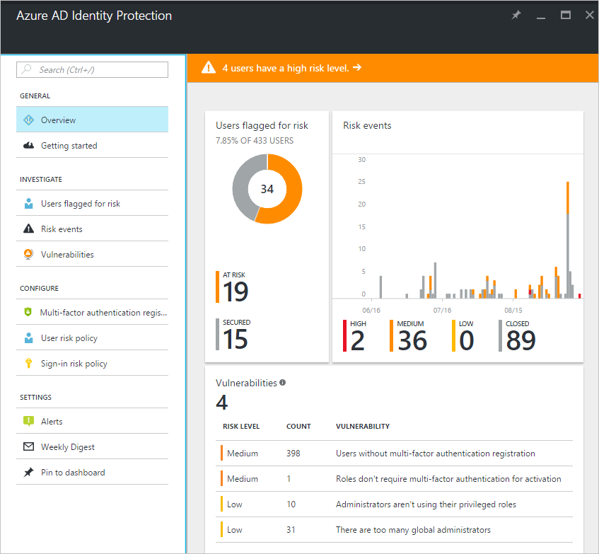

# What is Azure Active Directory Identity Protection?

Azure Active Directory Identity Protection is a feature of the Azure AD Premium P2 edition that enables you to:

- Detect potential vulnerabilities affecting your organization’s identities

- Configure automated responses to detected suspicious actions that are related to your organization’s identities  

- Investigate suspicious incidents and take appropriate action to resolve them   

## Get started

Microsoft has secured cloud-based identities for more than a decade. With Azure Active Directory Identity Protection, in your environment, you can use the same protection systems Microsoft uses to secure identities.

The vast majority of security breaches take place when attackers gain access to an environment by stealing a user’s identity. Over the years, attackers have become increasingly effective in leveraging third-party breaches and using sophisticated phishing attacks. As soon as an attacker gains access to even low privileged user accounts, it is relatively easy for them to gain access to important company resources through lateral movement.

As a consequence of this, you need to:

- Protect all identities regardless of their privilege level

- Proactively prevent compromised identities from being abused

Discovering compromised identities is no easy task. Azure Active Directory uses adaptive machine learning algorithms and heuristics to detect anomalies and suspicious incidents that indicate potentially compromised identities. Using this data, Identity Protection generates reports and alerts that enable you to evaluate the detected issues and take appropriate mitigation or remediation actions.

Azure Active Directory Identity Protection is more than a monitoring and reporting tool. To protect your organization's identities, you can configure risk-based policies that automatically respond to detected issues when a specified risk level has been reached. These policies, in addition to other conditional access controls provided by Azure Active Directory and EMS, can either automatically block or initiate adaptive remediation actions including password resets and multi-factor authentication enforcement.

#### Identity Protection capabilities

**Detecting vulnerabilities and risky accounts:**  

* Providing custom recommendations to improve overall security posture by highlighting vulnerabilities
* Calculating sign-in risk levels
* Calculating user risk levels

**Investigating risk events:**

* Sending notifications for risk events
* Investigating risk events using relevant and contextual information
* Providing basic workflows to track investigations
* Providing easy access to remediation actions such as password reset

**Risk-based conditional access policies:**

* Policy to mitigate risky sign-ins by blocking sign-ins or requiring multi-factor authentication challenges
* Policy to block or secure risky user accounts
* Policy to require users to register for multi-factor authentication

## Identity Protection roles

To load balance the management activities around your Identity Protection implementation, you can assign several roles. Azure AD Identity Protection supports 3 directory roles:

| Role                         | Can do                          | Cannot do
| :--                          | ---                                |  ---   |
| Global administrator         | Full access to Identity Protection, Onboard Identity Protection| |
| Security administrator       | Full access to Identity Protection | Onboard Identity Protection,  reset passwords for a user |
| Security reader              | Read-only access to Identity Protection | Onboard Identity Protection, remediate users, configure policies,  reset passwords |

For more details, see [Assigning administrator roles in Azure Active Directory](../users-groups-roles/directory-assign-admin-roles.md)

## Detection

### Vulnerabilities

Azure Active Directory Identity Protection analyses your configuration and detects vulnerabilities that can have an impact on your user's identities. For more details, see [Vulnerabilities detected by Azure Active Directory Identity Protection](vulnerabilities.md).

### Risk events

Azure Active Directory uses adaptive machine learning algorithms and heuristics to detect suspicious actions that are related to your user's identities. The system creates a record for each detected suspicious action. These records are also known as risk events.  
For more details, see [Azure Active Directory risk events](../active-directory-identity-protection-risk-events.md).

## Investigation

Your journey through Identity Protection typically starts with the Identity Protection dashboard.

The dashboard gives you access to:

* Reports such as **Users flagged for risk**, **Risk events** and **Vulnerabilities**
* Settings such as the configuration of your **Security Policies**, **Notifications** and **multi-factor authentication registration**

It is typically your starting point for investigation, which is the process of reviewing the activities, logs, and other relevant information related to a risk event to decide whether remediation or mitigation steps are necessary,  and how the identity was compromised, and understand how the compromised identity was used.

You can tie your investigation activities to the [notifications](notifications.md) Azure Active Directory Protection sends per email.

## Policies

To implement automated responses, Azure Active Directory Identity Protection provides you with three policies:

- [Multi-factor authentication registration policy](howto-mfa-policy.md)

- [User risk policy](howto-user-risk-policy.md)

- [Sign-in risk policy](howto-sign-in-risk-policy.md)

## Next steps

- [Channel 9: Azure AD and Identity Show: Identity Protection Preview](https://channel9.msdn.com/Series/Azure-AD-Identity/Azure-AD-and-Identity-Show-Identity-Protection-Preview)

- [Enabling Azure Active Directory Identity Protection](enable.md)

