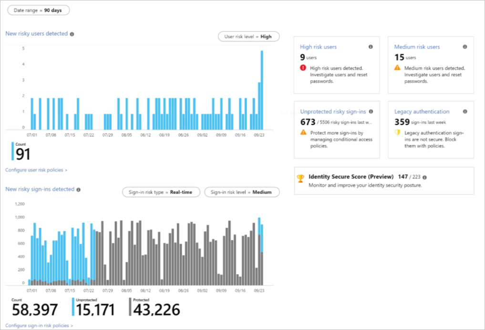

# Azure Active Directory Identity Protection - Security overview

The [Security overview](https://aka.ms/IdentityProtectionRefresh) gives you an insight into your organization’s security posture. It helps identify potential attacks and understand the effectiveness of your policies.

The ‘Security overview’ is broadly divided into two sections:

- Trends, on the left, provide a timeline of risk in your organization.

- Tiles, on the right, highlight the key ongoing issues in your organization and suggest how to quickly take action.

  
## Trends

### New risky users detected

This chart shows the number of new risky users that were detected over the chosen time period. You can filter the view of this chart by user risk level (low, medium, high). Hover over the UTC date increments to see the number of risky users detected for that day. A click on this chart will bring you to the ‘Risky users’ report. To remediate users that are at risk, consider changing their password.

### New risky sign-ins detected

This chart shows the number of risky sign-ins detected over the chosen time period. You can filter the view of this chart by the sign-in risk type (real-time or aggregate) and the sign-in risk level (low, medium, high). Unprotected sign-ins are successful real-time risk sign-ins that were not MFA challenged. (Note: Sign-ins that are risky because of offline detections cannot be protected in real-time by sign-in risk policies). Hover over the UTC date increments to see the number of sign-ins detected at risk for that day. A click on this chart will bring you to the ‘Risky sign-ins’ report.

## Tiles
 
###	High risk users

The ‘High risk users’ tile shows the latest count of users with high probability of identity compromise. These should be a top priority for investigation. A click on the ‘High risk users’ tile will redirect to a filtered view of the ‘Risky users’ report showing only users with a risk level of high. Using this report, you can learn more and remediate these users with a password reset.

###	Medium risk users
The ‘Medium risk users’ tile shows the latest count of users with medium probability of identity compromise. A click on ‘Medium risk users’ tile will redirect to a filtered view of the ‘Risky users’ report showing only users with a risk level of medium. Using this report, you can further investigate and remediate these users.

### Unprotected risky sign-ins

The ‘Unprotected risky sign-ins' tile shows the last week’s count of successful, real-time risky sign-ins that were neither blocked nor MFA challenged by a Conditional Access policy, Identity Protection risk policy, or per-user MFA. These are potentially compromised logins that were successful and not MFA challenged. To protect such sign-ins in future, apply a sign-in risk policy. A click on ‘Unprotected risky sign-ins' tile will redirect to the sign-in risk policy configuration blade where you can configure the sign-in risk policy to require MFA on a sign-in with a specified risk level.

### Legacy authentication

The ‘Legacy authentication’ tile shows the last week’s count of legacy authentications in your organization. Legacy authentication protocols do not support modern security methods such as an MFA. To prevent legacy authentication, you can apply a Conditional Access policy. A click on ‘Legacy authentication’ tile will redirect you to the ‘Identity Secure Score’.

### Identity Secure Score

The Identity Secure Score measures and compares your security posture to industry patterns. If you click on ‘Identity Secure Score (Preview)’ tile, it will redirect to the ‘Identity Secure Score (Preview)’ blade where you can learn more about improving your security posture.

## Next steps

- [Channel 9: Azure AD and Identity Show: Identity Protection Preview](https://channel9.msdn.com/Series/Azure-AD-Identity/Azure-AD-and-Identity-Show-Identity-Protection-Preview)

- [Enabling Azure Active Directory Identity Protection](enable.md)

