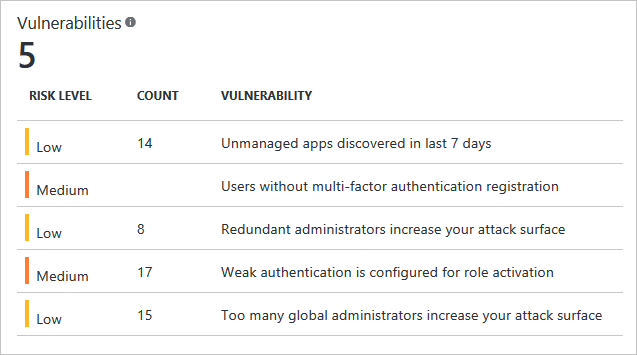

# Vulnerabilities detected by Azure Active Directory Identity Protection

Vulnerabilities are weaknesses in an environment that can be exploited by an attacker. We recommend administrators address these vulnerabilities to improve the security posture of their organization.

The following sections provide you with an overview of the vulnerabilities reported by Identity Protection.

## Multi-Factor Authentication registration not configured

This vulnerability helps assess the deployment of Azure Multi-Factor Authentication in your organization.

Azure Multi-Factor Authentication provides a second layer of security to user authentication. It helps safeguard access to data and applications while meeting user demand for a simple sign-in process. Azure Multi-Factor Authentication provides easy to use verification options like:

* Phone call
* Text message
* Mobile app notification
* OTP Verification code

We recommend that you require Azure Multi-Factor Authentication for user sign-ins. Multi-factor authentication plays a key role in risk-based Conditional Access policies available through Identity Protection.

For more information, see [What is Azure Multi-Factor Authentication?](../authentication/multi-factor-authentication.md)

## Unmanaged cloud apps

This vulnerability helps you identify unmanaged cloud apps in your organization.

IT staff are often unaware of all the cloud applications in their organization. It is easy to see why administrators would have concerns about unauthorized access to corporate data, possible data leakage, and other security risks.

We recommend deploying Cloud Discovery to discover unmanaged cloud applications, and to manage these applications using Azure Active Directory.

For more information, see [Cloud Discovery](/cloud-app-security/set-up-cloud-discovery).

## Security Alerts from Privileged Identity Management

This vulnerability helps you discover and resolve alerts about privileged identities in your organization.  

To enable users to carry out privileged operations, organizations need to grant users temporary or permanent privileged access in Azure AD, Azure or Office 365 resources, or other SaaS apps. Each of these privileged users increases the attack surface of your organization. This vulnerability helps you identify users with unnecessary privileged access, and take appropriate action to reduce or eliminate the risk they pose.

We recommend organizations use Azure AD Privileged Identity Management to manage, control, and monitor privileged identities in Azure AD as well as other Microsoft online services like Office 365 or Microsoft Intune.

For more information, see [Azure AD Privileged Identity Management](../privileged-identity-management/pim-configure.md).

## See also

[Azure Active Directory Identity Protection](../active-directory-identityprotection.md)
