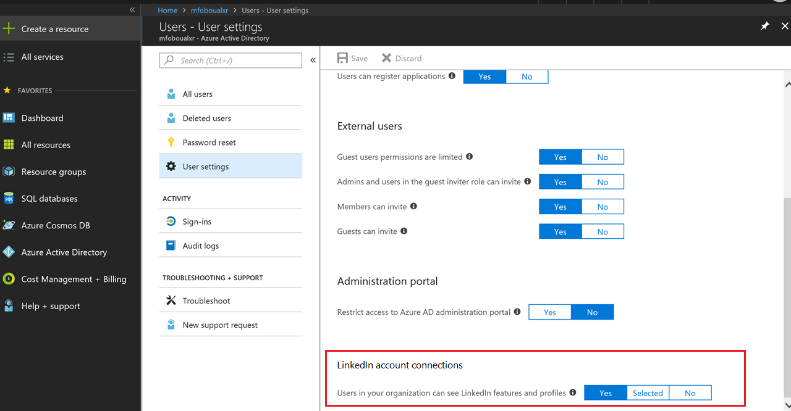

# LinkedIn integration for Microsoft apps and services
In this article, you can learn how to enable LinkedIn integration with other Microsodt apps and services in Azure Active Directory (Azure AD). LinkedIn integration allows users to access public LinkedIn data within some of their Microsoft apps. LinkedIn integration is enabled by default when it is added to your tenant. Each user can independently choose to connect their work or school account to their LinkedIn account.

> [!IMPORTANT]
> LinkedIn integration is currently being rolled out to Azure AD tenants. When it is rolled out to your tenant, the LinkedIn integration is enabled by default. The LinkedIn integration is not available for go-local, sovereign, and government tenants. For an up-to-date view of rollout information, see the [Office 365 Roadmap](https://products.office.com/business/office-365-roadmap?filters=%26freeformsearch=linkedin#abc) page.

## How LinkedIn integration appears to the user
The LinkedIn integration allows users to see public LinkedIn profile information within some of their Microsoft apps. Users in your tenant can choose to connect their LinkedIn and Microsoft work or school accounts to see additional LinkedIn profile information. For more information, see [LinkedIn information and features in Microsoft apps and services](https://go.microsoft.com/fwlink/?linkid=850740).

When users in your organization connect their LinkedIn account to their work or school account, they have two options: 
* Give permission to share data between both accounts. This means that they give permission for their LinkedIn account to share data with their Microsoft work or school account, as well as their Microsoft work or school account to share data with their LinkedIn account. 
* Give permission to share data only from their LinkedIn account to their Microsoft work and school account

For more information about data that is shared between users’ LinkedIn and Microsoft work or school accounts, see [LinkedIn in Microsoft applications at your work or school](https://www.linkedin.com/help/linkedin/answer/84077). 
* [Users can disconnect accounts](https://www.linkedin.com/help/linkedin/answer/85097) and remove data sharing permissions at any time. 
* [Users can control how their own LinkedIn profile is viewed](https://www.linkedin.com/help/linkedin/answer/83), including whether their profile can be viewed in Microsoft apps.

## Privacy considerations
Enabling LinkedIn integration enables Microsoft apps and services to access some of your users' LinkedIn information. Read the [Microsoft Privacy Statement](https://privacy.microsoft.com/privacystatement/) to learn more about the privacy considerations when enabling LinkedIn integration in Azure AD. 

## Manage LinkedIn integration
LinkedIn integration is enabled by default for your entire tenant. You can choose to disable the LinkedIn integration for your entire tenant, or enable the LinkedIn integration for selected users in your tenant. 

### Enable or disable LinkedIn integration for your tenant in the Azure portal

1. Sign in to the [Azure Active Directory admin center](https://aad.portal.azure.com/) with an account that's a global admin for the Azure AD tenant.
2. Select **Users**.
3. On the **Users** blade, select **User settings**.
4. Under **LinkedIn Integration**:
  * Select **Yes** to enable LinkedIn integration for all users in your tenant
  * Select **Selected** to enable LinkedIn integration for only selected tenant users
  * Select **None** to disable LinkedIn integration for all users
5. Save your settings when you're done by selecting **Save**.
   

### Enable or disable LinkedIn integration for your organization's Office 2016 apps using Group Policy

1. Download the [Office 2016 Administrative Template files (ADMX/ADML)](https://www.microsoft.com/download/details.aspx?id=49030)
2. Extract the **ADMX** files and copy them to your **central repository**.
3. Open Group Policy Management.
4. Create a Group Policy Object with the following setting: **User Configuration** > **Administrative Templates** > **Microsoft Office 2016** > **Miscellaneous** > **Allow LinkedIn Integration**.
5. Select **Enabled** or **Disabled**.
  * When the policy is **Enabled**, the **Show LinkedIn features in Office applications** setting found in the Office 2016 Options dialog is enabled. This also means that users in your organization can use LinkedIn features in their Office applications.
  * When the policy is **Disabled**, the **Show LinkedIn features in Office applications** setting found in the Office 2016 Options dialog is set to the disabled state, and end users can't change this setting. Users in your organization can't use LinkedIn features in their Office 2016 applications. 

This group policy affects only Office 2016 apps for a local computer. Users can see LinkedIn features in profile cards throughout Office 365 even if they disable LinkedIn in their Office 2016 apps. 

### Learn more 
* [LinkedIn information and features in your Microsoft apps](https://go.microsoft.com/fwlink/?linkid=850740)

* [LinkedIn help center](https://www.linkedin.com/help/linkedin/answer/84077)

## Next steps
Use the following link to see your current LinkedIn integration setting in the Azure portal:

[Configure LinkedIn integration](https://aad.portal.azure.com/#blade/Microsoft_AAD_IAM/UserManagementMenuBlade/UserSettings) 